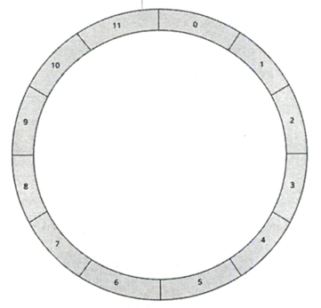
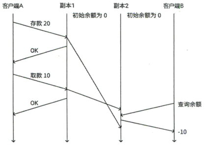

# 1 - 认识分布式系统

## 1.1 - 什么是分布式系统
分布式系统是一个其组件分布在不同的、联网的计算机上，组件之间通过传递信息进行通信和协调，共同完成一个任务的系统。

分布式系统的设计关键是如何协调这些计算机来共同完成任务。虽然分布式系统的计算机是离散的，但在客户看来，它们可以视作同一台计算机。

因此，分布式系统通常有如下特点：
- 多进程，分布式系统中总是有多个进程并发运行
- 不共享操作系统，机器之间通过网络交换信息来协作
- 不共享时钟，因此多个机器对时间的认知可能有偏差，很难通过时间来定义两个事件的先后

## 1.2 - 为什么需要分布式系统
相比于单机，分布式系统有一些显著的优点：
- 高性能：由于硬件工艺的限制，单 CPU 的性能很早就达到了瓶颈。后面衍生出多核 CPU 的方案，但通过物理总线等方式来连接多个 CPU，随着 CPU 数量的增加成本也迅速提高。从而互联网企业按照多核 CPU 架构的思想，通过网络把多台廉价计算机连接起来，形成了分布式系统。
- 可扩展性：很多需求都是数据密集型的，随着数据的增长，单机的扩展能力非常有限。通过构建数据分布在多台计算机上的分布式存储系统，集群规模可以扩展到非常庞大的规模。
- 高可用性：如今很多服务要求 7x24 小时不间断提供服务，比如可能要求 99.999% 的可用性，从而一年之内平均只能停机 5 分钟。在单机上，由于硬件故障、人为因素或其他原因，这几乎是不可能实现的。而分布式系统通过冗余数据保证数据可用性，通过冗余计算保证故障时服务切换，都是非常常见的。
- 必要性：有些时候，业务在地理上分布在多个位置，分布式系统几乎是不可避免的。

## 1.3 - 分布式系统的示例
有非常多分布式系统的应用，如电子银行、多人在线游戏、视频会议、社交网络和点对点网络等。不同的应用可能需要不同的架构，从而分布式系统有非常多种架构。以下列举两个具有代表性的案例。

### 1.3.1 - 搜索引擎
搜索引擎是把多种分布式系统有机结合到一起的典型软件工程。

考虑当在 Google 搜索一个关键词时，有哪些分布式系统参与处理。

首先，DNS 把域名解析为 IP 地址。DNS 就是一个存储域名到 IP 地址映射的分布式数据库，主要特点是去中心化、可扩展性和健壮性，它能很好处理负载和故障。

除此之外，Google 在支持搜索和其他应用的分布式基础设施上做了巨大的努力，它们包括：
- 全球化、巨大的多数据中心，分布的单个数据中心就可以有数万台服务器。
- 分布式文件系统 GFS（Google File System），目前已经升级到 2 代
- 高性能、可扩展、存储大规模结构化数据的存储系统 Bigtable，它是非关系性数据库，更像 NoSQL 数据库，优势在于扩展性和查询性能
- 分布式锁服务 Chubby
- 并行和分布式计算的编程模式 MapReduce
- 分布式数据库 Spanner

可以看到，搜索一个关键词就牵动了许多的分布式系统。Google 借助它们构建了一套相当复杂的，全球高可用、高可扩展、高性能的基础架构，如下图所示：

### 1.3.2 - 加密货币
以比特币为例，从分布式系统的角度来看，它首次实现和验证了一种实用的、去中心化和拜占庭容错的共识算法，打开了通过区块链新时代的大门。

## 1.4 - 分布式系统的挑战
分布式系统同时也带来不少设计上的挑战。Leslie Lamport 指出：“分布式系统是指一台你根本不知道其存在的计算机发生了故障，会导致你自己的计算机无法使用。” 因此，分布式系统常常会面临许多棘手的问题。

上世纪 90 年代，L.Peter Deutsch 等人根据 Sun 公司内部出现的问题总结了分布式计算的常见认知谬误：
- 网络是可靠的
- 延迟为 0
- 带宽是无限的
- 网络是安全的
- 拓扑结构不会改变
- 只有一个管理员
- 传输成本为 0
- 网络是同构的

以上任何一个错误的假设都可能带来严重的问题。我们重点关注前两条，它们可以归结为网络延迟问题。实际上，还有两个常见的问题，即部分失效问题和时钟问题。

### 1.4.1 - 网络延迟问题
分布式系统的多个节点通过网络通信，但网络传输是不可靠的，因此可能遇到：
- 信息丢失
- 以为信息丢失，实际上只是延迟到达
- 重传信息使得对方收到重复信息
- 以为某个服务已经故障，实际上是消息延迟
- 消息没有按序到达，或者不同机器接收到的消息顺序不同

### 1.4.2 - 部分失效问题
单机上的程序要么正常工作，要么出现问题。

分布式系统中，可能出现一部分机器正常工作，一部分机器出现问题的情况（或者由于网络问题无法和它们交互）。这就称为部分失效。

难点在于不确定性。系统有时候可能正常工作，有时候可能出现问题。甚至有时都很难确定系统是否出现问题。

因此这样的问题是很难调试的。并且当有些服务要求原子性，如果某个节点不成功，所有节点都不能成功，部分失效会给设计带来很大的挑战。

### 1.4.3 - 时钟问题
单机中只有一个时钟，时间的先后就表示事件发生的先后。分布式系统中，每个机器有自己的时钟，时钟的偏差使得时间的参考性下降，从而很难确定各个事件的先后顺序。

一种常见的解决方式是，通过一个时间服务器同步时间。然而由于网络延迟的可变性，同一时间发出的信息可能在不同机器上到达的时间不同，从而导致同步后的时间也可能偏差。另一种解决方法，像 Google 构建的 TrueTime API，让应用能生成单调递增的时间戳，但这通常需要使用昂贵的原子钟和精心设计的系统。最普遍的方式是 Leslie Lamport 提出的逻辑时钟方案。

## 1.5 - 每个程序员都应该知道的数字
Jeff Dean 在 2009 年对计算机的各类操作的耗时做了大致估计，如下表给出：

| 操作 | 延迟 |
| --- | --- |
| 执行一个指令 | 1 ns |
| L1 缓存查询 | 0.5 ns |
| 分支预测错误 | 5 ns |
| L2 缓存查询 | 7 ns |
| 互斥锁/解锁 | 25 ns |
| 主存访问 | 100 ns |
| 使用 Zippy 算法压缩 1KB 的数据 | 3,000 ns |
| 在 1Gbps 的网络上发送 2KB 的数据 | 20,000 ns |
| 从内存顺序读取 1MB 的数据 | 250,000 ns |
| 同一个数据中心往返 | 500,000 ns |
| 磁盘寻址 | 10,000,000 ns |
| 从磁盘顺序读取 1MB 的数据 | 20,000,000 ns |
| 数据包往返美国到欧洲 | 150,000,000 ns |

不过随着计算机发展，这些数据有些过时，下表给出了 2020 年的版本：

| 操作 | 延迟 |
| --- | --- |
| 执行一个指令 | 1 ns |
| L1 缓存查询 | 0.5 ns |
| 分支预测错误 | 3 ns |
| L2 缓存查询 | 4 ns |
| 互斥锁/解锁 | 17 ns |
| 主存访问 | 100 ns |
| 使用 Zippy 算法压缩 1KB 的数据 | 2,000 ns |
| 从内存顺序读取 1MB 的数据 | 3,000 ns |
| SSD 随机读 | 39,000 ns |
| 从 SSD 顺序读取 1MB 的数据 | 49,000 ns |
| 同一个数据中心往返 | 500,000 ns |
| 从磁盘顺序读取 1MB 的数据 | 718,000 ns |
| 磁盘寻址 | 2,000,000 ns |
| 数据包往返美国到欧洲 | 150,000,000 ns |

可以看到，提升显著的是 SSD 和磁盘的顺序读取速度。

  

# 2 - 分布式系统模型
分布式系统有上百种架构，为了分析它们，需要抽象出一些通用模型，它们可以用于解决一些常见问题。先看两个经典的思想实验。

## 2.1 - 两将军问题
两支由不同将军领导的军队，准备协作进攻一座坚固的城市，要想成功占领它两个军队必须同时发起进攻。现在两支军队在城市附近两个山丘扎营，被一座山谷隔开，它们交流的唯一办法是派信使穿越山谷，但是山谷由敌军占领，信使可能会被俘虏。它们需要某种方法来达成共识，从而同时发起进攻，然而这是困难的。

问题如下：
1. A 如果希望进攻，它要通知 B，但信使可能被俘，它无法知道 B 是否收到消息
1. 为了解决这个问题，B 可以用信使传递确认信息，但这个信使也可能被俘，从而 B 需要考虑 A 是否收到确认信息，它无法确认自己是否应该进攻
1. 进一步地，可以让 A 对 B 的确认再次确认
1. ...

这样下去问题永远无法解决，事实上它已被证明是无解的。然而实际工程中，足够小的问题出现概率可以被接受，从而有像 TCP 三次握手这样的工程解。

这个实验表明，分布式系统中，一个节点是无法确认另一个节点的状态的，它们只能互相传递信息尽可能了解对方可能的状态。

## 2.2 - 拜占庭将军问题
类似于两将军问题，但问题升级为多个拜占庭将军共同攻占一座城市，他们仍旧只能通过信使传递信息。每支军队可以选择进攻或者撤离，部分军队进攻、部分军队撤离会导致灾难性后果，从而它们需要通过投票达成共识，选择进攻或者撤离。

这里的问题在于，可能有将军是叛徒，他们故意传递错误的信息来误导其他的将军。比如，C 可能从 A 和 B 处收到了两个不同的信息，它一般无法判断谁是判读，因为有两种可能的情况：
- A 告诉 B 和 C 进攻，B 却告诉 C 撤退，此时 B 是叛徒
- A 告诉 B 撤退，又告诉 C 进攻，此时 A 是叛徒

更坏的情况是，可能出现多个叛徒协同起来发送错误的信息，破坏整个行动。从而拜占庭将军问题就是要确保所有忠实将军能够达成共识，尽可能做到最好（我们显然没办法决定叛徒的行为）。

在实际的分布式系统中，将军就是计算机，信使就是通信系统。拜占庭故障模型描述的是，当某些节点发生故障和出现错误，甚至它们恶意篡改、破坏和控制系统的情况。

## 2.3 - 系统模型
根据上述实验，在分布式系统中，节点和网络都可能出现各种问题。系统模型根据不同类型的故障抽象出来，为了解决故障通常有不同的算法和架构。

### 2.3.1 - 网络链路模型
总是认为网络是不可靠的，可能出现各种各样的问题。在分布式系统中，网络出错导致常见问题称为网络分区，即网络设备故障使得网络分裂成多个独立的组，它们无法相互通信。

对于网络进行抽象，忽略造成问题的具体原因。同时，姑且假定网络是点对点的单播通信（虽然实际上有广播组播等）。假定有一个发送者和一个接收者，通过一个双向链路通信，链路上有两个基本事件：发送事件，把一条信息发送到链路上；接收事件，从链路上收到一条信息。

在这样的假设下，可以把链路分为以下 3 种，它们可以互相转换（如 TCP 所做的工作）：

#### 可靠链路
又称完美链路，不会丢失损坏信息，但可能出现信息的重排。它的特点是：
- 可靠传递：发送的每条信息都能被正确传递
- 没有重复：每条信息最多被传递一次
- 不会无中生有：链路不会自己产生一条信息

TCP 提供的服务模型可以看做一条可靠链路，不过它还提供了更多保证，如它保证消息有序交付。

#### 公平损失链路
信息可能丢失、重复、重新排序，但它最终总会到达，它的特点是：
- 公平损失：如果发送方和接收方正常运行，并且发送方持续重传信息，那么信息最终会送达
- 有限重复：消息只需重复发送有限次数
- 不会无中生有：链路不会自己产生一条信息

这意味着，网络分区的时间是有限的，一段时间以后它会恢复。

#### 任意链路
任意的问题都可能出现，包括丢失、重复、重新排序，还可能有恶意软件监听、篡改、伪造信息。这是最接近真实网络的模型。

### 2.3.2 - 节点故障模型
在消息丢失的时候，发送方可以持续重传消息来保证消息最终送达，但如果此时发送方出现故障，消息就可能永久丢失。这就引入了节点故障模型。节点的故障主要有 3 种类型：
- 崩溃-停止：节点停止工作以后，永远不会恢复。算法不能期望节点恢复来解决问题。
- 崩溃-恢复：节点停止工作以后，可能重新启动，并继续执行之前的工作。一般通过存储状态信息来实现。
- 拜占庭故障：故障的节点可能遍历算法的正常执行方式，从而可能恶意破坏系统

一般来说，公司内部的分布式系统处于私有的安全环境中，只需要处理前两种问题。而正确性非常关键的航空航天、区块链等系统，必须能够处理拜占庭故障。

### 2.3.3 - 按时间划分系统模型
基于时间是否同步，分布式系统可以分为 2 种模型：
- 同步系统：一个消息的响应时间在一个有限且确定的时间范围内
- 异步系统：一个消息的响应时间可能是无限的，无法知道消息何时到达

在同步系统中很多问题是好解决的，可惜现实情况是异步系统更接近于真正的网络环境。我们无法保证所有组件正常工作，因此无法提供消息到达的一个最大时间保证，即使在同一个数据中心也有过数据包超过 1 分钟才到达的案例。即使这些情况很少发生，但它们确实可能发生，这会使得按同步系统方式设计的系统出现问题。

为异步系统设计的算法不受网络中断或延迟的影响，通常非常健壮。然而，一些问题在异步系统中被证明是无法解决的，如 ELP 不可能定理证明了异步系统中找不到一个足够好的共识算法。

因此，产生了第三种模型，部分同步模型。它认为大多数情况下系统是同步的，偶尔因为故障转换成异步系统，它很贴近真实情况，也更好处理。

## 2.4 - 消息传递语义
因为消息可能消失，会使用重传来处理，但是这也引入了重复消息的问题。必须仔细设计消息传递协议来保证语义正确。比如，传递的消息如果表示支出 500 元，重复的消息就会带来错误的结果，而且很严重。

常见的解决方案是令消息具有幂等的语义，重复的消息和单个消息的效果是一样的。但这对系统有严格的约束，在知道消息是否传递到对面之前，可能必须等待接收对方的确认。更好的方案是给每个消息一个唯一的标识符，这样接收方可以识别重复的消息。

根据消息传递和处理次数，有几种消息传递语义：
- 最多一次：消息最多传递一次，可能丢失，但不会重复
- 至少一次：消息至少传递一次，不会丢失，但在故障时可能重复
- 精确一次：消息只传递一次，不会丢失，也不会重复。人们希望得到这样的语义

实际上很多时候更关键的消息仅被处理一次。毕竟链路大多是不可靠的，精确传递一次几乎是不可能的，但如果重复消息只会被处理一次，那效果是一样的。

  

# 3 - 分布式数据基础
最初可能只需单台数据库就可以处理需求，随着逐步的扩容，单个数据库达到了物理上限，而且存在单点故障问题。这时可能会扩展成主从数据库，主数据库处理写请求，从数据库处理读请求，主数据库定期同步数据到从数据库，从而在不修改业务逻辑的情况下提高性能和可用性。

现今还经常使用一些非关系型数据库，按键值对的方式存储数据，它们为了改善可扩展性通常把数据集分布在多个存储节点上，很多 NoSQL 数据库天生就是分布式的。

从单台机器转换成分布式数据库以后，如何分散存储数据集、如何同步数据等，这些都是需要考虑的问题。

## 3.1 - 分区
分布式系统带来的好处之一是可扩展性，从而可能存储和处理大量数据。实现可扩展性的主要方式之一是对数据分区，即把一个数据集拆分成多个较小的数据集，把存储和处理它们的责任分配到不同的节点上。然后通过增加节点数量就可以扩展系统。因此分区增加了数据的可管理性、可用性和可扩展性。

分区分为垂直分区和水平分区，它们起源于关系数据库：
- 垂直分区：按列对数据库进行划分，把一些属性存储在一个表中，另一些属性存储在另一个表中。这减少了表的宽度，有时把不经常使用的属性或者包含了长文本的属性分离出去，可以显著提高查询性能。这又称为“行拆分”，因为每行数据都发生了拆分。
- 水平分区：按行对数据库进行划分，把一些行存储在一个表中，另一些行存储在另一个表中，每一行的属性得到保持。

一个表中的列数量是有限的，因此垂直分区有一定的限度，而水平分区则可以无限划分。另外，数据一般很少扩展列，而常常是按行增加数据，因此水平分区更常见。

水平分区又称分片，有些数据认为只有当数据分布在多个节点上时才称为分片，在本书中分区、分片和水平分区都表达同一个意思。

### 3.1.1 - 水平分区算法
水平分区算法用来计算某个数据应该划分到哪个分区上，不同的算法有不同的特性。姑且假设数据都是键值对储存方式，从而可以通过键快速找到值。

#### 范围分区
选择特定的关键字，称为分区键，根据它特定的取值范围来划分数据。比如使用年份划分数据，2010 年到 2020 年的数据一个分区，2021 年到 2030 年的数据一个分区。划分范围的依据可以由管理员设定，也可以让存储系统自动划分。

通常使用一个额外的负载均衡节点来处理客户端请求，它根据分区算法把请求转发到正确的分区上。

范围分区的主要优点是：
- 实现简单
- 能够对分区的关键字进行范围查询
- 如果范围查询的范围小且在一个分区内，性能很好
- 调整分区范围比较容易

主要的缺点是：
- 无法支持对其他关键字的范围查询
- 查询范围大，跨越多个分区时，性能较差
- 分区键选择不恰当时，可能导致部分节点请求频繁，负载很高，一般要对热点范围进一步分区

使用范围分区的实例有 Google Bigtable、Apache HBase、PingCAP TiKV 等。

#### 哈希分区
把指定关键字的值传入哈希函数，计算出分区。

优点是，良好的哈希函数可以把数据均匀分布，从而避免热点问题。

缺点是：
- 无法支持范围查询，除非构造其他数据结构
- 添加新节点需要修改哈希函数能够映射的范围，这可能导致所有的数据都需要重新哈希，在这个过程中系统可能无法提供服务

#### 一致性哈希
这是一种特殊的哈希分区算法，旨在缓解上述的数据大规模重哈希问题。

一致性算法把哈希结果值组织成一个圆环，称为哈希环。哈希函数输出的值一般在 0 到 INT_MAX 之间，可以均匀地分到整个环上。比如，如果哈希函数输出的值范围是 0-12，那么哈希环如图：

假如有 3 个存储节点，把它们也平均分布到哈希环上，如图：

现在考虑插入 3 个数据，分别是 a、b、c，它们计算得到的哈希值分别是 1、5、9，如图：

这些数据实际上会被存储到顺时针方向的第一个节点上，如图：

现在考虑向系统中加入一个新的存储节点，把它加入到图中的位置，根据一致性哈希算法，只有 a 的存储位置需要改变：

通过这样的方式，添加新节点时只有小部分的数据需要迁移，并且它不需要更改哈希函数。

虽然，它仍有明显的缺点：
- 当系统节点太少，数据很可能分布不均
- 当一个节点故障下线，它所有的负载被转移至下一个节点，可能导致负载过高

一个解决方案是虚拟节点，哈希环上的节点不再是物理节点，而是映射到物理节点上，就像虚拟地址空间那样。下图中的哈希环把负载映射到 3 个物理节点上：

除此之外，虚拟节点还可以用于协调多台性能不同的机器，让性能好的机器映射更多的虚拟节点。

它仍旧没有解决的是范围查询的问题。

一致性哈希算法的实例有 Dynamo、Apache Cassandra 等。

### 3.1.2 - 分区的挑战
分区的问题在于，不同表连接起来查询会非常低效，一个请求很可能需要访问多个节点的数据。在水平查询中情况好一些，因为每行所有的数据都在一起存储，但如果查询的范围很大，也无法避免访问多个节点。

另一个问题是实现事务会很困难。

## 3.2 - 复制
上面的分区方案提供了可扩展性。为了提高可用性，还需要使用复制，即把同一份数据冗余存储在多个节点上，节点间通过网络同步数据来保持一致。一个存储了复制数据的节点称为副本。复制可以和分区结合使用。

复制的好处是：
- 增强数据的可用性和安全性：即使一个节点永久损坏而数据丢失，也可以通过其他冗余提供服务，同时恢复数据
- 减少往返时间：类似于 CDN 技术，把请求定向到距离更近的节点来降低往返时延
- 增加吞吐量：单机的处理器性能有上限，把数据冗余到多台机器上可以提高吞吐量

然而，复制使得分布式系统的设计更加复杂，副本间必须同时更新数据或相互同步数据。理想情况下，客户应该感知不到复制技术的使用，然而由于网络延迟等问题，使用复制的系统始终还是与单机系统有所不同。为了保证系统的性能，有时可能需要牺牲一些一致性。

### 3.2.1 - 单主复制
又称主从复制或主从同步，某一个副本作为主节点，其他都是从节点。只有主节点处理写请求，从节点只处理读请求，从节点从主节点同步最新数据。

当主节点收到写请求，它把数据写入本地存储，然后把数据变更同步给从节点，这可以通过同步操作日志或是转发写请求来实现，具体取决于实现。

有三种不同的同步方式：
- 同步复制：主节点把数据写入存储后，通知从节点写入数据，并且它等待所有从节点写入完成才向客户端返回成功。这种方案数据一致性最好，但是性能最差。特别是当一个从节点负载很高，它会影响整个系统的写入性能。
- 异步复制：主节点写入数据以后马上向客户端返回成功，同时它通知从节点写入数据，但不等待从节点写入完成。从节点的异常不会影响写入性能，但会有数据一致性问题，比如写入完数据后从节点可能仍读出旧数据等。更严重的是，主节点写入数据后还没来得及把数据同步到从节点，主节点就宕机了，这时通常把一个从节点提升为主节点，从而丢失了之前的写请求。
- 半同步复制：折中的方案，主节点写入数据后，等待至少一个从节点完成同步，然后向客户端返回成功。这样可以保证至少一个从节点有最新数据，从而提高数据一致性。

总结来说，单主复制的优点是：
- 简单易懂，实现方便
- 只在主节点写，不会有多节点的竞争问题，从而支持事务更容易
- 如果读请求比例高，扩展性好

缺点是：
- 写请求比例高时，难以扩展，主节点容易成为瓶颈
- 主节点故障时，把一个从节点提升为主节点需要一定的时间，这段时间内系统可能无法提供服务

展开说说第 2 点。一般来说，故障切换有两种方法：
- 手动切换：运维人员根据数据完整性选择新的主节点，这是最安全的方案，但时间比较长
- 自动切换：从节点定时向主节点发送心跳，当它检测到主节点下线就尝试提升为主节点。这个方案不需要人工干预而且更快，但是非常危险。比如可能有两个从节点同时提升为主节点，或者由于一些故障导致从节点错误地认为主节点下线而提升为主节点，这被称为“脑裂”，两个主节点同时处理写请求，导致数据不一致。

关键在于如何在主节点故障时选出新的主节点，这被称为领导者选举问题，将在下一章讨论。

从节点发生故障就好办很多，如果它故障了一段时间，恢复以后只需阅读日志恢复数据即可。如果它永久故障，可以把它替换为新的从节点，然后直接从主节点拷贝数据。

数据库 PostgreSQL、MySQL 都支持单主复制，它们也支持同步、异步、半同步的复制方式。单主复制应用非常广泛。

### 3.2.2 - 多主复制
单主复制的弱点在于大量写请求的情景，一个自然的考量是多增加一些主节点来共同处理写请求。主节点除了通知从节点写入数据，还要通知其他主节点写入数据。

遇到的问题是数据冲突，类似于多线程并发写入的问题。最好的解决方案是避免数据冲突的产生，比如注册账号的任务总是交给特定的主节点处理，或者通过哈希总是把一个用户的请求发送到同一个主节点上。然而冲突有时难以避免，常见的解决冲突的方案是：
- **由客户端解决冲突**：当客户下次读取有冲突的数据时，存储系统把冲突的数据都返回给客户端，客户端选择一个合理的结果并发回存储系统，存储系统覆盖掉其他的数据。比如客户端发现购物车里有已经删除的物品，它告诉存储系统物品确实已经删除。
- **最终写入胜利（LWW）**：每个节点为每个写入请求标记一个时间戳或自增 ID，冲突发生时系统选择最新时间戳或 ID 的数据，由于时钟同步问题，这样的方案行为不总是正确的。
- **因果关系追踪**：使用一种算法跟踪不同请求之间的因果关系来判断请求的先后顺序。比如，写请求 A 是一个发帖操作，写请求 B 是一个回帖操作，它们都对帖子状态做出更新，但显然 A 必须先于 B 执行。这个方案的缺陷在于有些并发写请求并没有明确的因果关系。

还有一种名为无冲突复制数据类型（CRDT）的数据结构，能根据一定的规则自行解决冲突而不需要副本间进程协调。Riak 和 Cosmos DB 中都实现了 CRDT。这个方案常用于在线聊天系统和协作式文本编辑系统。苹果自带的备忘录就使用了 CRDT 来协调多个设备间编辑的文本。

没有一种方案可以覆盖所有的场景，有时需要多种方案结合使用。

多主复制的优点是：
- 增加主节点容错性。当一个主节点故障，其他主节点可以继续提供服务
- 可以在多个节点上执行写请求，平摊负载
- 把写请求路由到较近的主节点可以降低延迟

缺点是复杂性，经常需要解决数据冲突，随着节点的增加可能还需要人工干预，极端情况下造成数据损坏。

实际上多主复制引入的复杂性远超带来的好处，单数据中心几乎不会使用多主复制方案。大型的全球多数据中心系统可能会使用多主复制，从而使得写请求不用跨越数据中心处理。

### 3.2.3 - 无主复制
单主复制和多主复制都是客户端向一个或多个主节点发送写请求，然后主节点负责把写请求传播到其他副本，主节点决定多个写请求的顺序，从节点以主节点为准。

还有一种完全没有主节点的方案，称为无主复制。这个技术在几十年前出现，但直到亚马逊发布了 Dynamo 架构的论文并使用了无主复制技术，它才开始流行。很多 NoSQL 受到它的启发，如 Apache Cassandra、Project Voldemort、Riak 等。由此，无主复制技术也被称为 Dynamo 架构。

无主复制的基本思想是，客户端把写请求发送到多个节点，某些情况下甚至发送到所有的节点。它一旦从一定数量的节点得到了响应，就认为写请求成功，然后可能继续发送下一个请求。（也可能客户端把写请求发给一个协调节点，它把请求转发给多个节点，并等待多个确认，然后再向客户端返回成功）

无主复制的优势是，由于没有领导者，节点故障的影响很小。只要剩余的主机仍能够处理当下的负载，就可以认为系统仍在正常工作。

它带来的问题是，数据冲突更多了。因为请求被发往多个节点，有的节点可能更新了值，有的节点可能没有，从而用户可能看到不同的结果。为了解决这个问题，客户端的读请求也被发送到多个节点，获取数据和其版本号，它根据版本号选择使用哪个数据。

当然，对于旧的数据，需要修补它，Dynamo 架构同时使用两种方法：
- 读修复：客户端选择数据以后，通知存储旧数据的节点更新数据
- 反熵过程：有一个专门的后台进程负责修复数据，把最新的数据复制到存储错误数据的节点上。它不保证写操作的顺序正确，只保证数据一致。

反熵过程并不一个个比较数据，否则需要进行大量的数据传输。Dynamo 使用 Merkle 树来验证数据是否不一致，它也叫哈希树，把数据按关键字分为几个范围，每个范围计算出一个哈希值并作为输的叶子结点，然后自底向上构成一颗树。树的每个分支都可以独立对比，从而不用传输整棵树。

如果根节点相同就认为数据一致，不再检查；如果不同就到子树中重复这个过程，直到找到数据不一致的位置。

并非所有的无主复制都实现读修复和反熵过程，如 Voldemort 就没有实现反熵过程，从而很少被访问的数据不会得到修复。

#### 基于 Quorum 的数据冗余机制
Quorum（法定人数）机制是分布式系统中用来保持数据冗余和最终一致性的一种算法。在无主复制中它用于多副本数据的一致性维护，比如确定客户端需要向多少个节点发送写请求。

在一个 3 节点分布式系统中，客户端只需要得到一个节点的成功响应就可以认为写请求成功，读请求也如此。如果实际只有一个节点完成了写入，那么它从其他两个节点读取数据，读到的总是旧的数据。因此只得到一个节点的响应看起来是不太足够的。

而如果它把这个数目提升为 2，那么至少有 2 个节点完成了写入。当它读取时会得到两个节点的数据，如果都是新数据自然没有问题；如果得到的分别是新旧数据，它可以通过版本号等方式选择新数据。此时客户端总能得到最新的数据。

扩展到 N 个节点的情况，要求 W 个节点完成写入，R 个节点返回要读取的数据，需要满足 W + R > N 同时 2 * W > N 。前一个要求保证一定会得到最新的数据。

后一个要求保证数据的串行化修改，即不会同时有两个写请求同时修改同一个数据。比如 N=5 且 W=2，目前待修改数据在所有节点是一致的（包括版本号），此时请求 1 修改了节点 1 和 2 中的数据，请求 2 修改了节点 3 和 4 中的数据。后面读取时如果得到的是节点 1 和 3 的数据，两个数据是不同的，并且具有同样的版本号，这时就无法判断哪个数据是最新的。

W 和 R 可以作为系统的可调节参数，管理员根据系统负载来调整，W 越大 R 越小，系统的读性能就越好，反之写性能就越好。

## 3.3 - CAP 定理
前面给出了多种架构，它们均是为了在分布式系统中实现某种特性而出现，如：可用性、可靠性、可扩展性、容错性、高吞吐量。这些特性是否可以同时实现呢？

CAP 定理是分布式系统特性的高度抽象，总结了各个特性之间的冲突。它也称为布鲁尔定理，指出在一个异步网络环境中，一个分布式读写存储系统来说只能满足如下三项中的两项：
- 一致性：访问所有节点得到一样的、最新的数据。指的是线性一致性，3.7 中会做详细解释，简单来说就是读操作总是返回最近一次写操作的结果。
- 可用性：每次请求都正常得到响应，返回的数据不一定正确
- 分区容错性：当发生网络分区时，系统仍然能够工作

有了这个定理，设计系统架构时就不必再去寻找完美的解决方案，因为这样的解决方案是不存在的，工程师需要根据需求做出适当的取舍来得到一个足够好的解决方案。

一般来说，由于网络的中信息的延迟和丢失，网络分区几乎是不可避免的，从而总是需要保证分区容错性。因此，在设计分布式系统时通常分为两类，即 CP 或 AP 系统，要求在一致性和可用性之间做出选择。

虽然，后来 CAP 定理经受了许多的批评。比如有人指出，网络分区其实很少发生，没有理由因此而舍弃一致性或是可用性，只有当网络分区发生时才在二者中做出选择。另外，经典 CAP 定理的解释只考虑了网络分区，但网络延迟也是重要的因素，当网络延迟很大时，如果放弃处理一个请求就降低了可用性；如果等待处理请求就降低了一致性。

### 3.3.1 - PACELC 定理
这是 CAP 的一个扩展定理，认为 CAP 定理忽略网络延迟是一个重大的疏忽，因为网络分区出现的次数很少，但网络延迟则总是存在的。定理指出，在分布式系统存在网络分区（P）的情况下，必须在可用性（A）和一致性（C）之间做出选择；否则（E），即没有网络分区的情况下，必须在延迟（L）和一致性（C）之间做出选择。

因此整个定理分为两部分，在网络分区时需要选择 PA 或 PC，而在没有网络分区时需要选择 EL 或 EC。常见的分布式存储系统做出的选择如下表：
| DDBS | PA | PC | EL | EC |
| ---- | -- | -- | -- | -- |
| MySQL Cluster | | √ | | √ | 
| BigTable/HBase | | √ | | √ |
| DynamoDB | √ | | √ | |
| Cassandra | √ | | √ | |
| MongoDB | √ | | | √ |
| MegaStore | | √ | | √ |
| VoltDB/H-Store | | √ | | √ |
| Riak | √ | | √ | |

### 3.3.2 - BASE
这也是对 CAP 的一个扩展。BASE 即基本可用、软状态、最终一致性的缩写。其中的软状态和最终一致性指的是，在网络分区的时候，为了高可用性而舍弃强一致性，采用最终一致性。而最终一致性指的是，一个写请求完成后，可能由于网络分区或延迟不能及时同步到所有节点，但系统仍允许继续处理读写请求，一段时间后系统会把该写请求同步到所有节点。

鉴于网络分区出现的频率较低，并且通常持续时间较短，所以这样的方案也是可接受的。

## 3.4 - 一致性模型
提到一致性，常常让人想到 3 个概念，一个是 CAP 定理中的一致性，一个是 ACID 中的一致性，还有 Paxos 或 Raft 可能被称为分布式一致性算法。

作者认为，Paxos 和 Raft 被称为一致性算法纯粹是翻译错误，它们应该被称为共识算法。

而 ACID 中的一致性是数据库领域的概念，强调数据的一致性，包括数据库完整性约束还有用户自定义的完整性约束。

因此本书主要考虑最后一种一致性，这个问题主要由复制带来。从传统冯诺依曼架构来看，一旦写入一个数据，下次读取就应该得到最近写入的这个数据。然而分布式系统中对于“最近”的定义就比较模糊了，究竟何时、什么情况下才能读到最新的数据？这就需要一个模型帮助开发者预测系统中读写的结果。

一致性模型是指，并发编程中系统和开发者之间的一个约定，如果开发者遵循某种规则，执行的读写操作结果就是可以预测的。这样的模型并不只适用于分布式系统，最早在多处理器和并行计算的研究中就已经提出多种一致性模型，但很多在分布式系统中已经不再适用了。

一致性模型的种类非常多，这里依据分布式一致性验证框架 Jepsen 的分类方式来介绍，如图：

其中有三种图形，分别是白底矩形（不可用）、灰底矩形（基本可用）、椭圆（高可用）。具体的含义为：
- 不可用：这种一致性模型的系统，在网络分区时，为了保证数据一致性，系统不可用。从 CAP 的角度来看是 CP 系统
- 基本可用：这种一致性模型的系统，可以容忍一部分节点故障，其他节点仍然可用，但要求客户端不能把请求发到故障节点上
- 高可用：这种一致性模型的系统，即使发生严重的网络分区，没有故障的节点仍然可以提供服务

箭头表示一种包含关系，从下到上一致性逐渐减弱，满足线性一致性的系统一定满足顺序一致性。

### 3.4.1 - 线性一致性
这是最强的一种一致性模型，也被称为强一致性、严格一致性、原子一致性、立即一致性、外部一致性等。CAP 定理中的一致性指的就是线性一致性。

作者对于线性一致性给出两种定义，一种是非严格定义，主要描述线性一致性下分布式系统的行为；另一种是严格定义，主要描述普遍并发现象下的模型。

非严格定义下，可以认为分布式系统只有单机，同时所有操作串行执行。

然后考虑严格定义，先给出一些术语的定义。把系统上发生的所有事件建模成一个并发程序的执行历史，称为历史，用 H 表示。假设系统只有读和写两种操作，一个操作有调用和响应两个事件。比如：

如果一系列写操作是串行的，那么各个时间点的变量取值都很好预测。如下图中读到的值一定是 3：

但如果出现了并发写，就不好判断最终变量被设置成了什么值：

然后可以给出线性一致性的严格定义：**给定一个执行历史，执行历史根据并发操作可以扩展为多个顺序历史，只要从中找到一个合法的顺序历史，那么该执行历史就是线性一致性的**。

考虑如何把并发历史转换成线性历史，一般来说并发历史中，操作间有三种关系：
- 两个操作先后执行，此时它们是串行的
- 两个操作有重叠部分
- 一个操作的执行区间是另一个操作的子区间

对于第一种情况，保持它们的先后关系即可；后两种情况可以任意选择它们的前后关系。比如对于上图中的并发写历史，可以转换成两种线性历史 S1 和 S2：

观察 S1，发现读操作返回了 1，但上一次写入的是 3，显然是不合法的。但 S2 是合法的历史，从而上面的并发历史是线性一致性的。

总的来说，线性一致性满足两个约束条件：
- 顺序历史中最后一次读操作读到最近一次写入的数据
- 顺序历史要和全局时钟下的顺序一致（不懂）

看一个不满足线性一致性的例子，如下图：

最后读到 1 是不合法的：
- 由于第一个 Read(1)，Write(1) 的赋值操作需要在 Read(1) 之前完成
- 第一个 Read(1) 和第二个 Write(0) 之间是串行的，所以第二个 Write(0) 必须在第一个 Read(1) 之后
- 第二个 Read(1) 又串行地排在第二个 Write(0) 之后，从而它只能读到 0

#### 实现线性一致性
在传统并发编程中，最常见的方案是通过 CAS 实现锁，从而保证操作的原子性，达成线性一致性。在分布式系统中，可以通过共识算法实现线性一致性（但并不是所有共识算法都能实现线性一致性）。

#### 线性一致性的评价
它的一致性非常好，但是系统开销非常大，在并发编程中大量同步原语的使用显著降低了系统的并行性。而在分布式系统，更大的困难是需要一个全局时钟来帮助判断事件发生的事件和全局顺序，然而全局时钟实现是非常困难的。

现代 CPU 在访问内存时已经不保证线性一致性，因为同步指令开销大，并且涉及跨节点 CPU 缓存失效的问题。

### 3.4.2 - 顺序一致性
顺序一致性比线性一致性稍弱一些。在重排成顺序历史的时候，顺序一致性只要求同一个客户端的操作在排序以后仍然保持原来的顺序，不同客户端之间的操作可以任意排序。

考虑如下并发历史：

按照线性一致性的要求，这个历史只能重排出一种合法的顺序历史，但在顺序一致性中下面的历史也是合法的：

这意味着顺序一致性没有全局时间的考虑，它只关注单个主体内部的顺序性。有时候它更实用，比如像朋友圈，一般人们并不在意不同朋友的动态的先后顺序，但是同一个朋友的动态应该按照时间顺序排列。

现代 CPU 在默认情况下也不保证顺序一致性，因为它需要支持乱序执行，从而导致单个程序流的指令顺序也会被破坏。

### 3.4.3 - 因果一致性
因果一致性则还要更弱一些，它只要求有因果关系的操作保持原来的顺序，其他操作可以任意排序。

根据微信技术团队分享的资料，微信朋友圈评论就使用了因果一致性。微信的数据分布在上海、深圳、香港和加拿大数据中心。如果一个用户发布一条朋友圈，上海和香港的朋友发表评论，怎么保证一致性呢？策略如下：
- 每个评论有一个单调递增的全局唯一 ID，通过微信的序列号生成器架构产生
- 每条新评论的 ID 都需要超过本地已经见到的最大 ID，保证因果关系
- 广播本地看到的评论和新评论到其他数据中心，相同 ID 的评论合并去重

比如香港一个朋友发表评论，ID 为 2。后面上海几个朋友发表评论，ID 为 1、4、7，并广播到了香港数据中心。香港另一个朋友再发表评论，该评论的 ID 就为 8。这里实际上使用了逻辑时钟。

### 3.4.4 - 最终一致性
对于没有明显因果关系的应用场景，可以使用更宽松的一致性模型，如最终一致性。系统可以重排操作的顺序，读操作也不需要返回最新的数据。当没有新的写操作时，系统最终会达到一致状态，读操作返回相同的、最新的数据。

因此，最终一致性模型并没有规定系统达到最终稳定状态的时间，看起来不太可靠。但实际中它工作得很好，如 Dynamo 的很多追求高性能的分布式存储系统就使用最终一致性。

### 3.4.5 - 以客户端为中心的一致性模型
前面的四种模型可以归结为一类，即以数据为中心的一致性模型，它们旨在为数据存储系统提供一个系统级别的全局一致性视图。它们考虑当并发客户端对数据进行读写时，数据的一致性问题。

还有另一类一致性模型，站在客户端的角度来观察分布式系统，它们看不到其他的客户端，而是从自己读写操作的结果来判断系统的一致性。

有以下几种以客户端为中心的一致性模型：
- **单调读**：如果客户端读到了一个值，后面再读到的值要么还是它，要么是更新后的值，而不会读到比这更旧的值
- **单调写**：同一个客户端的一系列写入操作，在任何副本上都是按照顺序执行的
- **读你所写**：也称为读己之写，当一个客户端写入数据后，它在任何副本上都能读到这个值
- **PRAM**：流水线 RAM 一致性，也称为 FIFO 一致性，它类似于上面三个模型的结合。一个客户端可能发出多个写操作，所有的副本按照同样的顺序执行这些写操作，但不同客户端之间的写操作顺序可能不同。
- **读后写**：如果一个客户端读到了一个值，那么当它修改这个数据时，修改要么基于之前读到的版本，要么基于更新的版本。它本质上束缚了多个写操作执行的顺序，类似于因果一致性，但是从客户端的角度来看，因此它也叫会话因果一致性。

一个违反 PRAM 的例子是：

可以看到，客户端 A 发出了两个操作，在副本 2 上执行的顺序被颠倒了，这就违反了 PRAM。因此客户端 B 查询到了负的余额，这显然是不合常理的。

## 3.5 - 隔离级别
事务是由多个操作组成的，多个事务之间的操作可能互相影响而导致出乎意料的结果。隔离级别定义了并行系统中，一个事务的结果何时、如何能被其他事务看到。通常隔离级别不定义什么是可行的，而是定义了什么是不可行的。

这里讨论常见的五种隔离级别：

类似于之前的一致性模型图，其中矩形表示不可用，椭圆表示高可用，箭头表示包含关系。

先考虑并发事务中可能遇到的异常情况：
- **脏写**：一个事务写入的数据，覆盖了另一个未提交的事务写入的数据。它会破坏数据的完整性约束，是系统无法正确回滚事务。
- **脏读**：一个事务读到另一个事务还未提交的修改。事务可能根据读到的值决定下一步操作，但这个值可能随事务被回滚，带来错误的结果。
- **不可重复读**：一个事务中两次查询一个值返回的结果不一样，也叫模糊读，跟脏读的区别在于这可能是其他事务的提交导致的。问题在于事务可能需要根据一个值来判断下一步操作，后续又使用这个值来更新别的数据，这样就会导致不一致的行为。
- **幻读**：一个事务按某个条件查询数据两回，中间另一个事务插入或删除了一些符合条件的数据，从而导致事务发现数据变多或是变少了。
- **更新丢失**：两个事务同时尝试把一个值更新为不同的值，最终只有一个可以生效，但事务提交时它们都认为自己的更新生效了。比如，统计购物车物品数量，同时有两个事务向购物车加入物品，可能导致统计到的物品总数少于实际物品总数。
- **读偏斜**：指读到违反了数据完整性约束的数据。比如，约束是 $X+Y=100$，开始时 $X=50$、$Y=50$，事务 A 分两次读取两个值，先读到了 $X=50$。此时事务 B 更新了两个值为 $X=60$、$Y=40$，它们仍然是满足约束的。但 A 后面再读到 $Y=40$，它发现约束不满足并感到困惑。
- **写偏斜**：对于收到约束的一组属性，两个事务分别按照不违反完整性约束的方式更新了属性，但是合并起来违反了约束。如 $X+Y<100$，起初 $X=20$、$Y=30$，事务 A 和 B 都读到了这两个值并知道它们满足约束。后来 A 更新了 $X=60$，B 更新了 $Y=60$，在它们看来依然是满足约束的，但实际上违反了约束。

然后考虑不同的隔离级别分别能解决哪些问题。最严格的隔离级别是串行化，在读操作时加读锁，写操作时加写锁，直到事务提交才释放锁。避免上述所有的问题，但这样的加锁模式使得并发性能大幅下降。从而我们又需要在一致性和性能之间做出取舍。

所有的隔离级别会遇到的问题如下：
| 隔离级别 | 脏写 | 脏读 | 不可重复读 | 幻读 | 更新丢失 | 读偏斜 | 写偏斜 |
| -------- | ---- | ---- | ---------- | ---- | -------- | ------ | ------ |
| 读未提交 | | √ | √ | √ | √ | √ | √ |
| 读已提交 | | | √ | √ | √ | √ | √ |
| 快照隔离 | | | | √ | | | √ |
| 可重复读 | | | | √ | | | |
| 串行化 | | | | | | | |

## 3.6 - 一致性和隔离级别的对比
一致性和隔离级别对任何数据系统都是非常重要的两个概念。

它们的相同点是，都描述系统可以容忍和不能容忍哪些行为，同时更严格的一致性和隔离级别需要以其他的特性降低为代价。

它们的不同点是，一致性模型适用于单个数据对象，隔离级别通常设计多个数据对象。另外，线性一致性提供了实时保证，即操作实际发生的顺序和实时顺序一致；而串行化则只是保证事务结果和串行执行的结果一致，但具体串行顺序没有保证。实际上一个系统可以同时是线性一致性和串行化的，它被称为严格串行化系统，实际上它可能比串行化的概念更有用，因为单主机中实现严格串行化很容易，而实现了严格串行化也就实现了串行化。在分布式系统中实现严格串行化要困难得多，Google 的 Spanner 就是一个实现了严格串行化的分布式数据库。

结合两个标准，可以得到一个更全面的衡量并发系统的模型：

