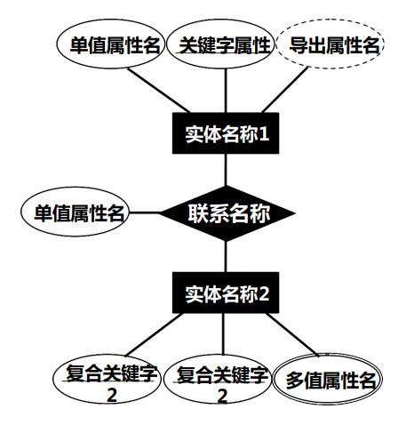

# 数据库设计过程
1. 需求分析
2. 概念数据库设计：E-R模型
3. 逻辑数据库设计：关系模式
4. 物理数据库设计：依赖于具体的DBMS

  

# 实体-联系模型
使用E-R图来对现实世界进行抽象，形成数据库的概念模型。

## 基本概念

### 实体与实例
- **实体**：一类客观存在并可相互区分的事物
- **实例**：实体的具体个体

### 属性
实体所具有的某一特性，有多种类型：
- 单一属性或复合属性
- 单值属性或多值属性
- 可空值属性或非空值属性
- 导出属性（由其他属性计算得到）

### 关键字（码）
能唯一标识实体中某一实例的属性或属性组，也称为码。

### 联系
实体与实体之间的联系，发生联系的**实体**的树木，称为联系的**度**或**元**。
- 一元联系：在一个实体的不同实例之间的联系
- 二元联系：在两个实体的实例之间的联系
    - 一对一联系：两个实体之间一一对应
    - 一对多联系：一个实体的一个实例对应另一个实体的多个实例
    - 多对多联系：实体A可以对应多个实体B的实例，实体B也可以对应多个实体A的实例

### 联系的基数
联系的基数是指实体实例之间联系的数量，有最小基数和最大基数的概念。当最小基数为0时，则称**部分参与联系**，否则称为**完全参与联系**。

  

# 实体-联系图（E-R图）
有三种表示方法，这里给出其中两种

## Chen方法
 
- 实体：矩形
- 属性：椭圆
    - 多值属性：双椭圆
    - 导出属性：虚线椭圆
- 关键字：下划线
- 联系：菱形
- 复合关键字：标相同数字
- 多组关键字：标不同数字

### 联系（图形表达）
 
用箭头指向一侧，用单实现连接部分参与联系的多侧，用双实线连接完全参与联系的多侧。

### 联系（基数表达）
 

## Crow's Foot方法
 
- 实体：矩形框，实体名在横线上方
- 属性：横线的下方
- 关键字：下划线标注

### 联系
 
基本上是把最小基数画在近端，最大基数画在远端。

### 一元联系
用虚线表示

  

# E-R图转化为关系模式

## 基本元素
- 实体 -> 关系
- 属性 -> 关系的属性
- 关键字 -> 关系的关键字

## 复合属性
- 移除复合属性，把复合属性的子属性作为关系的属性
- 直接使用复合属性作为关系的属性

## 多值属性
把多值属性和关键字一起组成一个新的关系。

## 一元、二元联系的转换
- 一对一联系：
    - 均部分参与：把联系作为一个新的关系，属性为两个实体的关键字
    - 有一个完全参与：把完全参与的一侧的关键字作为另一侧的属性
- 一对多联系：一侧的关键字作为多侧的属性
- 多对多联系：把联系作为一个新的关系，属性为两个实体的关键字

## 弱实体的转换
如果一个实体完全依赖于另一个实体，比如手机相对于小米，那么把小米的公司号和手机的产品号一起作为产品的关键字。

## 泛化与具体化之间的转换
泛化的实体（如人）和具体化的实体（如学生）都转换为关系，具体化的实体以泛化的实体的关键字作为关键字。

## 多元联系的转换
多元联系转换为关系，属性为各个实体的关键字。

  

# 不正确设计数据库引发的问题
- 冗余：同一信息在多个地方存储
- 非受控冗余：同一信息的某处发生了修改，其他地方的修改不能由DBMS自动完成
- 受控冗余：相反于非受控冗余，借助外键等机制，可以由DBMS自动完成
