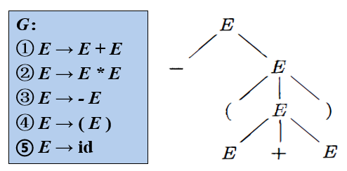

# 基本概念

## 字母表
有穷符号集合，常用符号$\Sigma$表示 
- **乘积**：
    $$ \Sigma _1 \Sigma _2 = \{ ab \ | \ a \in \Sigma _1,b \in \Sigma _2 \} $$
- **幂**：
    $$ \Sigma ^0= \{ \epsilon \} $$
    $$ \Sigma ^n= \Sigma ^{n-1} \Sigma, n\ge 1 $$
- **正闭包**：
    $$ \Sigma ^+= \bigcup _{i=1} ^ \infty \Sigma ^i $$
- **克林闭包**：
    $$ \Sigma ^*= \bigcup _{i=0} ^ \infty \Sigma ^i $$

## 串
定义：$\Sigma$中的符号构成的有穷序列safdsfhh
- **长度**：$|w|$
- **空串**：$\varepsilon$，$| \varepsilon |=0$
- **连接**：$x$和$y$的连接记作$xy$
- **前后缀**：当$w=xy$时，$x$是$w$的前缀，$y$是$w$的后缀
- **幂**：$w^n=ww^{n-1}(n \ge 1)$，$w^0= \varepsilon$

## 文法
定义：$G=(V_T,V_N,P,S)$，其中,
- $V_T$是终结符
- $V_N$是非终结符
- $P$是产生式
- $S$是开始符号
- **文法符号**：$V=V_T \cup V_N$
- **候选式**：对于$\alpha \to \beta$，$\beta$是$\alpha$的候选式
 
 

---------------------------------

# 语言的定义

## 推导和归约
如果有产生式$\alpha \to \beta$，对于串$\gamma \alpha \delta$，可以通过把$\alpha$替换成$\beta$来得到串$\gamma \beta \delta$，记作
$$ \gamma \alpha \delta \Rightarrow \gamma \beta \delta $$
- **直接推导（派生）**：称$\gamma \alpha \delta$直接推导出$\gamma \beta \delta$
- **直接规约**：称$\gamma \beta \delta$直接规约出$\gamma \alpha \delta$
- **n步推导**：$\alpha \Rightarrow ^n \beta$，有如下特殊表示：
    - $\alpha \Rightarrow ^0 \alpha$
    - $\alpha \Rightarrow ^+ \beta$，表示经过正数步推导
    - $\alpha \Rightarrow ^* \beta$，表示经过任意步推导

## 句型和句子
对于文法$G$，可以有
$$ S \Rightarrow ^* \alpha $$
称$\alpha$为$G$的：
- **句型**：当$\alpha \in (V_T\cup V_N)^*$时，可以包含非终结符
- **句子**：当$\alpha \in V_T^*$时，只包含终结符

## 语言
对于文法$G$，其生成的语言为
$$ L(G)= \{ w \in V_T^* \ | \ S \Rightarrow ^* w \} $$
即能推导出的所有**句子**的集合
- **并**：$L_1 \cup L_2 = \{ w \ | \ w \in L_1 \wedge w \in L_2 \}$
- **交**：$L_1 \cap L_2 = \{ w \ | \ w \in L_1 \vee w \in L_2 \}$
- **连接**：$L_1 L_2 = \{ w_1 w_2 \ | \ w_1 \in L_1 \wedge w_2 \in L_2 \}$
- **幂**：$L^n = L L^{n-1} (n \ge 1)$，$L^0 = \{ \varepsilon \}$
- **正闭包**：$L^+ = \bigcup _{i=1} ^ \infty L^i$
- **克林闭包**：$L^* = \bigcup _{i=0} ^ \infty L^i$

## 文法分类
以下4种文法，下方的文法是上方文法的子集
- **0型文法（无限制文法）**：$ \alpha \to \beta $，其中$\alpha$需要包含非终结符
- **1型文法（上下文有关文法，CSG）**：$ \alpha A \beta \to \alpha \gamma \beta $，其中$\gamma$不是空串，即保证左侧的长度不大于右侧的长度
- **2型文法（上下文无关文法，CFG）**：$ A \to \gamma $，其中$A$是非终结符
- **3型文法（正则文法，RG）**：
    - **左线性文法**：$ A \to a \gamma $，其中$A$是非终结符，$a$是终结符。或者$A \to \varepsilon$。
    - **右线性文法**：$ A \to \gamma a $，其中$A$是非终结符，$a$是终结符。或者$A \to \varepsilon$。
 
 

---------------------------------

# CFG的分析树
文法的每一个句型都可以构造出一颗分析树

## 形式

- **根结点**：文法开始符号
- **内部结点**：产生式左部
- **叶结点**：可以是终结符或者非终结符
- **产出（边缘）**：从左到右的叶结点序列，如图中的$-(E+E)$

## 短语
分析树的每一个子树的边缘称为句型的一个短语
- **直接短语**：如果分析树只有两代，则其形成一个直接短语，如图中的$E+E$

## 二义性
对于一个文法，如果有一个句型，可以构造不同的分析树，那么它是二义性的
- 没有算法判定一个文法是否二义性
- 存在无二义性的充分条件