# 正则表达式（RE）
一种用来描述正则语言更紧凑的表达方式，正则表达式可以递归定义，首先有基本规则：
- $\varepsilon$是正则表达式
- $\forall a\in\Sigma$，$a$是正则表达式

然后有递推规则：
- **并**：$r \ | \ s$，
- **连接**：$rs$
- **克林闭包**：$r^*$
- **加括号**：$(r)$

RE定义的语言叫做正则语言或者正则集合（RE与语言文法等价）

  

# 正则定义
以如下形式给出，$d_i$为一个新的符号，$r_i$为$\Sigma \cup \{d_1, d_2, \cdots, d_{i-1}\}$上的正则表达式。
$$ 
d_1 = r_1   \\
d_2 = r_2   \\
\cdots      \\
d_n = r_n   \\   
$$
其实类似CFG的产生式，只不过这里的右部是正则表达式，例如：
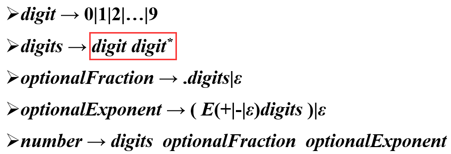

  

# 有穷自动机（FA）
如果串$w$使得自动机$M$，从开始状态转换到某一终止状态并**停止**，则称$w$被$M$接收。所有被$M$接收的串的集合称为$M$定义的语言，记为$L(M)$。
## 基本结构
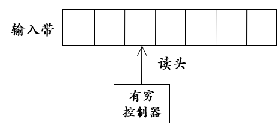
- **输入带**：存放符号串
- **读头**：单向逐个读取符号，不能修改
- **有穷控制器**：根据当前状态和输入符号符号，决定下一状态

## 状态转换图
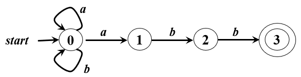
- **状态**：圈
- **初始状态**：start指向的圈
- **接受状态**：双圈
- **转换**：箭头，标记为$\sigma$，表示读到$\sigma$后，从当前状态转移到下一状态

  

# 确定的有穷自动机（DFA）
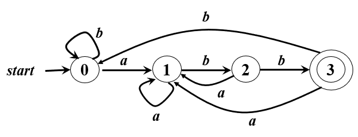

对于状态$q$，读到字符$a$**有且只有**唯一的转换路径，以五元组定义：
$$
M = (Q, \Sigma , \delta , q_0, F)
$$
- $Q$：状态集
- $\Sigma$：字母表
- $\delta$：转换函数，$Q \times \Sigma \rightarrow Q$，如$\delta (q_0, a) = q_1$
- $q_0$：初始状态
- $F$：接受状态集

  

# 非确定的有穷自动机（NFA）
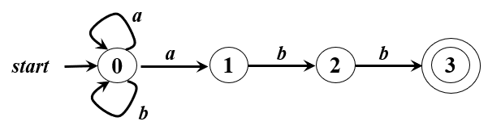

相比于DFA，在状态$q$，读到字符$a$，可以有0-n条转换路径，等价于DFA，以五元组定义：
$$
M = (Q, \Sigma , \delta , q_0, F)
$$
- $Q$：状态集
- $\Sigma$：字母表
- $\delta$：转换函数，$Q \times \Sigma \rightarrow 2^Q$，如$\delta (q_0, a) = \{q_1, q_2\}$
- $q_0$：初始状态
- $F$：接受状态集

  

# 带有空转移的NFA（$\varepsilon$-NFA）
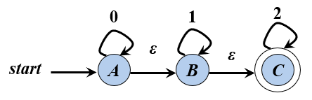

相比于NFA，允许在不读入字符的情况下，进行状态转换，等价于NFA，以五元组定义：
$$
M = (Q, \Sigma , \delta , q_0, F)
$$
- $Q$：状态集
- $\Sigma$：字母表
- $\delta$：转换函数，$Q \times (\Sigma \cup \{\varepsilon\}) \rightarrow 2^Q$，如$\delta (q_0, \varepsilon) = \{q_1, q_2\}$
- $q_0$：初始状态
- $F$：接受状态集

  

# RE的自动机构造

## RE到NFA
需要一些基础的NFA：
- 构造$\varepsilon$的NFA
    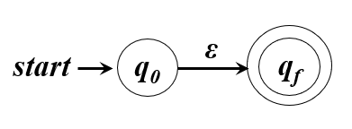
- 构造每个字母的NFA
    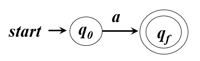

然后使用这些NFA，通过RE的递推规则构造NFA：
- $r = r_1 \ | \ r_2$
    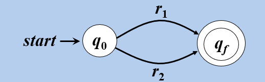
- $r = r_1r_2$
    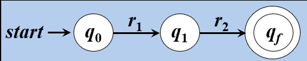
- $r = r_1^*$
    

## NFA到DFA
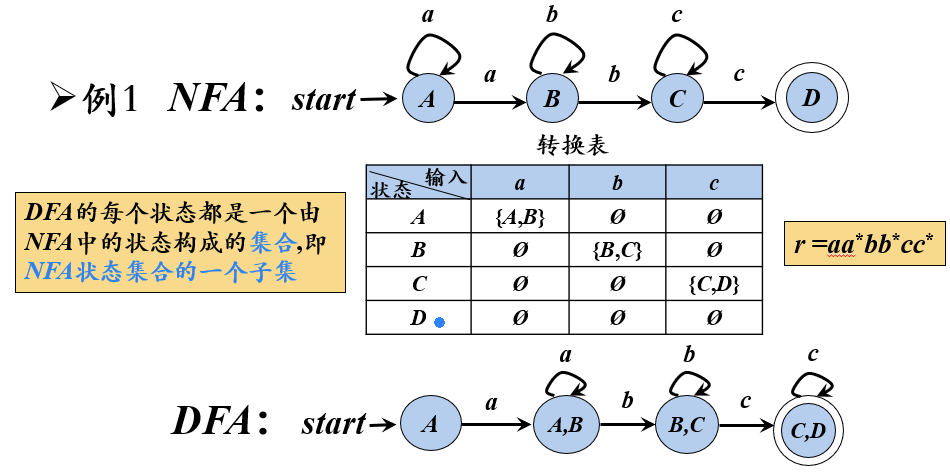
- 把NFA可能的状态集合，例如$\{ q_1, q_2, q_4 \}$，作为DFA的状态
- NFA的初始状态为$q_0$，DFA的初始状态为$\{ q_0 \}$
- NFA的接受状态集为$F$，则DFA中只要包含其中某个状态，则就是一个接受状态
- 如果NFA有转移$\delta (q_1, a) = \{q_2, q_4\}$，则DFA中有转移$\delta (\{ q_1 \}, a) = \{ q_2, q_4 \}$。
- 可以移除DFA中不能到达的状态

## $\varepsilon$-NFA到DFA
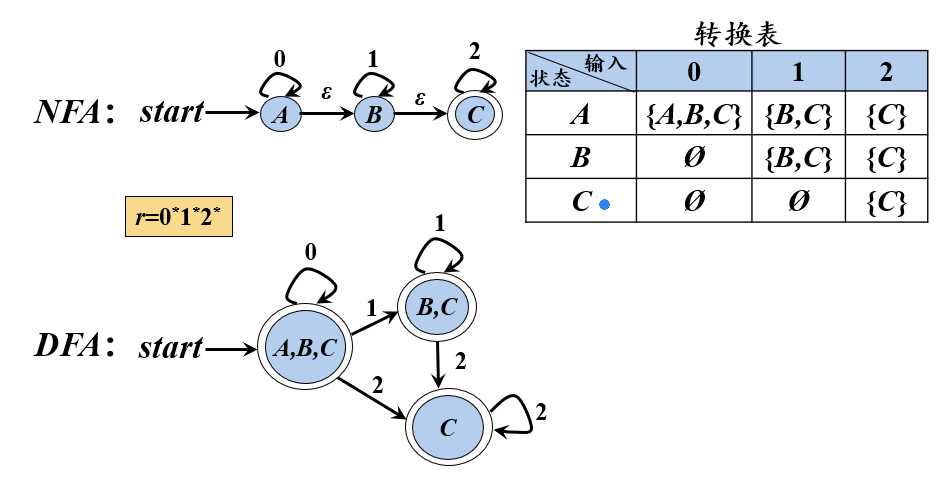
- 把$\varepsilon$-NFA可能的状态集合，例如$\{ q_1, q_2, q_4 \}$，作为DFA的状态
- 定义“$\varepsilon$闭包”为状态$q$仅通过空转移能到达的状态集
- $\varepsilon$-NFA的初始状态为$q_0$，DFA的初始状态为$q_0$的$\varepsilon$闭包
- $\varepsilon$-NFA的接受状态集为$F$，则DFA中只要包含其中某个状态，则就是一个接受状态
- 对于DFA中状态$\{q_i, q_{i+1}, \cdots, q_j\}$，DFA中对于字符a的转移为
    $$
    \delta (\{q_i, q_{i+1}, \cdots, q_j\}, a) = \bigcup_{k=i}^j \varepsilon Closure(\delta _{ \varepsilon -NFA}(q_k, a))
    $$
- 可以移除DFA中不能到达的状态