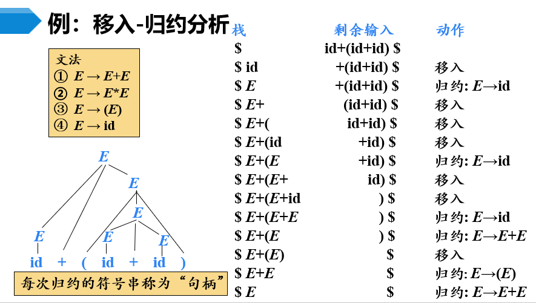
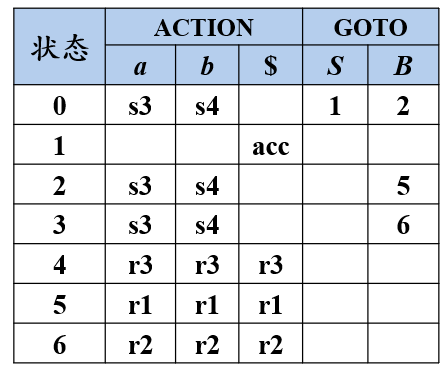
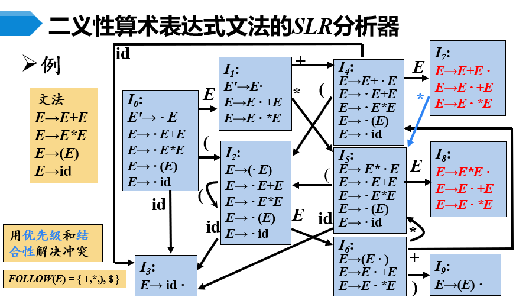

# 自底向上分析概述
从分析树的叶节点向上构建分析树，可以看做是把$w$归约成$S$的过程，使用最左归约

## 句柄
如果选择产生式$A\rightarrow\alpha$进行归约，那么$\alpha$是句柄

## 最左（规范）归约
总是选择句型中最左的句柄归约

## 最右归约
总是选择句型中最右的句柄归约

## 移入-归约分析

使用栈来维护已经读入的符号，当栈中已经集齐可以归约的句柄时，进行归约。如果栈中有开始并且输入流已经读完，那么分析成功。 
移入归约分析可能会出现同时形成多个句柄的情况，如果选择了错误的句柄则会导致分析失败。

  

# LR分析法概述
LR文法是最大的、可以构造出相应移入-归约句法分析器的文法类
- **L**：从左向右扫描输入
- **R**：最右归约

## $LR(k)$ 分析
需要向前看$k$个符号才能确定归约的文法，特别地， $k=0$ 和 $k=1$ 时具有实践意义，LR分析指的是 $LR(1)$ 分析

## 基本原理
LR分析器使用“状态”来表示句柄识别的进展程度，例如：
- $S \rightarrow \cdot bBB$ ，为移进状态
- $S \rightarrow b \cdot BB$ ，为待约状态
- $S \rightarrow bBB \cdot$ ，为归约状态

## $LR(1)$ 分析表

有两个大的栏目：
- **ACTION**：移入、归约、接受
- **GOTO**：状态转移（只是把状态压栈）

在ACTION中，有三种情况：
- **sn**：移入动作，压状态n
- **rj**：归约动作，用第j个产生式
- **acc**：分析成功

## 具体工作流程
- **初始化**：把状态0压状态栈，把结束符 $\$$ 压符号栈
- **移入**：对于输入符号 $a$ ，如果动作为 $sn$
    - 那么把 $a$ 压符号栈
    - 把状态 $n$ 压状态栈
- **归约**：对于输入符号 $a$ ，如果动作为 $rj$ ，那么用第 $j$ 个产生式进行归约。
    - 把产生式右部的符号从符号栈中弹出
    - 同步在状态栈弹出状态
    - 把产生式左部的符号压符号栈
    - 根据当前状态和产生式左部的符号，根据 $GOTO$ 栏目，压入新的状态

  

# $LR(0)$ 分析
针对于 $LR(0)$ 文法的分析方法。如果构造分析表不会出现移入-归约冲突（见下方），这个文法就是 $LR(0)$ 文法。 $CFG$ 不都是 $LR(0)$ 文法。

## $LR(0)$ 项目
右部有一个点的产生式，称为项目，例如：
- $S \rightarrow \cdot bBB$
- $S \rightarrow b \cdot BB$

特别地，对于产生式 $A \to \varepsilon$ ，有 $A \to \cdot$ 作为项目

## 增广文法
为了统一所有的接受状态，
- 添加一个新的开始符号 $S'$
- 并添加产生式 $S' \to S$

这样就只能通过项目 $S' \to S \cdot$ 接收，这样的文法称为增广文法

## 后继项目
对于项目 $A \to B \cdot CD$ ，称 $A \to BC \cdot D$ 为后继项目

## $CLOSURE()$ 函数
对于项目集 $I$ ，对于每个项目 $A \to \alpha \cdot B \beta$ ，如果 $B \to \gamma$ 是产生式，那么把项目 $B \to \cdot \gamma$ 加入 $I$ ，直到 $I$ 不再增大 
含义是，把所有可能的归约路径都加入到项目集中，然后进行后续的分析

## $LR(0)$ 自动机
自动机.png)

### 构造方式
- 状态0是开始状态，把初始项目 $S' \to \cdot S$ 加入，然后计算 $CLOSURE()$得到该项目集
- 输入一个终结符或非终结符以后可以转移，如果使用了产生式 $A \to \alpha \cdot a \beta$ ，那么把它的后继项目加入到新项目集中，然后计算 $CLOSURE()$ 得到新的项目集
- 如果项目集只有归约项目，那么不继续转移

### 使用方式
以图为例
- 如果在状态 $0$ 获得了输入 $b$ ，那么转移到状态 $1$
- 然后状态 $1$ 只有归约项目，所以进行归约
- 返回状态 $0$ ，并得到归约形成的输入 $B$
- 转移到状态 $2$
- 如此，一直到进入状态 $1$ ，此时可以接受

  

## $LR(0)$ 分析表构造

### $CLOSURE()$ 函数
如上

### $GOTO()$ 函数
相当于是在计算项目集接受输入 $X$ 以后转移进的新状态集，跟上面说的自动机构造很像，公式化定义是：
$$
GOTO(I,X) = CLOSURE(\{A \to \alpha X \cdot \beta \ | \ A \to \alpha \cdot X \beta \in I\})
$$

### 规范 $LR(0)$ 项目集族
- 把初始项目集 $I_0=CLOSURE( \{ S' \to \cdot S \} )$ 加入 $C$ 中
- $\forall I \in C$ ，对于每个文法符号 $X$ ，计算 $GOTO(I,X)$ ，如果不在 $C$ 中，那么加入 $C$ 中
- 重复上一步，直到 $C$ 不再增大

### 形成分析表
在上述形成项集族的过程中，可以同步形成分析表，
- 如果 $GOTO()$ 函数输入的是终结符，那么在 $ACTION$ 栏目中填入移入状态
- 如果 $GOTO()$ 函数输入的是非终结符，那么在 $GOTO$ 栏目中填入转移状态
- 如果 $I$ 中有项目 $A \to \alpha \cdot$ ，那么在 $ACTION$ 栏目中填入归约状态（无论输入是什么）
- 如果 $I$ 中有项目 $S' \to S \cdot$ ，那么在 $ACTION$ 栏目中填入接受状态（输入为 $\$$）

## 缺陷（移入-归约冲突）
可能在某个状态下，既可以移入，又可以归约，这种情况称为移入-归约冲突，没有办法正常进行 $LR(0)$ 分析。

  

# $SLR$ 分析
在 $LR(0)$ 分析的基础上，对于移入-归约冲突进行处理，得到 $SLR$ 分析法

## 基本思想
对于存在移入-归约冲突的项目集 $I$ ：
$$
A_1 \to \alpha _1 \cdot a_1 \beta _1 \\
A_2 \to \alpha _2 \cdot a_2 \beta _2 \\
\vdots \\
A_n \to \alpha _n \cdot a_n \beta _n \\
B_1 \to \gamma _1 \cdot \\
B_2 \to \gamma _2 \cdot \\
\vdots \\
B_m \to \gamma _m \cdot \\
$$
考虑集合 $\{a_1,a_2,\cdots,a_n\}$ ，如果它与 $FOLLOW(B_1), FOLLOW(B_2), \cdots, FOLLOW(B_m)$ 都不相交。则如果输入符号与 $a_i$ 匹配，那么进行移入一定不会出错。 
所以可以按如下规则处理冲突（输入符号 $a$ ）：
- 如果 $a \in \{a_1,a_2,\cdots,a_n\}$ ，那么移入
- 如果 $a \in FOLLOW(B_i)$ ，那么归约
- 否则报错

## 缺陷
当集合 $\{a_1,a_2,\cdots,a_n\}$ 与 $FOLLOW(B_i)$ 相交时，无法处理冲突。

  

# $LR(1)$ 分析
在 $SLR$ 分析的基础上，对于移入-归约冲突进一步处理，得到 $LR(1)$ 分析法。 
如果构造分析表不会出现移入-归约冲突，这个文法就是 $LR(1)$ 文法。

## 活前缀
对于规范句型 $\alpha \beta \gamma$ ，对于产生式 $B \to \beta$ ，$\alpha \beta$ 的任何子串称为活前缀

## 规范 $LR(1)$ 项目
形如 $[A \to \alpha \cdot \beta, a]$ 的项目，其中 $a$ 是终结符，表示 $A$ 后面必须跟着 $a$ 才能用这个项目进行归约，称为**展望符**。 $LR(n)$ 的 $n$ 表示的就是展望符的长度。
- 在形如 $[A \to \alpha \cdot \beta, a]$ 且 $\beta \neq \varepsilon$ 的项目中， $a$并不起到作用
- 在形如 $[A \to \alpha \cdot, a]$ 的项目中， 只有输入符号 $a$ 才能进行归约 

这样的 $a$ 总是 $FOLLOW(A)$ 的子集，通常会是一个真子集，因此对于归约项目 $B \to \gamma \cdot$ ， 剔除了 $FOLLOW(B)$ 中的冗余信息，从而减少移入-归约冲突。

### 同心项目
如果有两个项目 $[A \to \alpha \cdot \beta, a]$ 和 $[A \to \alpha \cdot \beta, b]$ ，称它们是同心项目，即只有展望符不同的项目

### 后继项目
对于项目 $[A \to \alpha \cdot B \beta, a]$ ，称 $[A \to \alpha B \cdot \beta, a]$ 为后继项目

## 继承后继符
对于项目 $[A \to \alpha \cdot B \beta, a]$ ，如果 $B \to \gamma$ 是产生式，那么把项目 $[B \to \cdot \gamma, b]$ 加入
- 如果 $\beta \Rightarrow ^+ \varepsilon$ ，那么 $b = a$ ，称为继承的后继符
- 否则称为自生的后继符

## $CLOSURE()$ 函数
计算 $LR(1)$ 项目集闭包 

### 计算方法
对于项目集 $I$ ，对于每个项目 $[A \to \alpha \cdot B \beta, a]$ ，如果 $B \to \gamma$ 是产生式，那么项目 $[B \to \cdot \gamma, FIRST( \beta a)]$ 加入 $I$（实际上是加入多个同心项目），直到 $I$ 不再增大 

## $GOTO()$ 函数
计算项目集接受输入 $X$ 以后转移进的新状态集
$$
GOTO(I,X) = CLOSURE(\{[A \to \alpha X \cdot \beta, a] \ | \ [A \to \alpha \cdot X \beta, a] \in I\})
$$

## $LR(1)$ 自动机
自动机.png)

构造和 $LR(0)$ 自动机类似，只是在转移的时候需要考虑展望符。
- 对于初始项目集 $I_0$ ，把 $[S' \to \cdot S, \$]$ 加入，然后计算 $CLOSURE()$ 得到该项目集
- 输入一个终结符或非终结符以后可以转移，如果使用了产生式 $[A \to \alpha \cdot a \beta, $ ，那么把它的后继项目加入到新项目集中，然后计算 $CLOSURE()$ 得到新的项目集

## $LR(1)$ 项集族
- 把初始项目集 $I_0$ 加入 $C$ 中
- $\forall I \in C$ ，对于每个文法符号 $X$ ，计算 $GOTO(I,X)$ ，如果不在 $C$ 中，那么加入 $C$ 中
- 重复上一步，直到 $C$ 不再增大

## $LR(1)$ 分析表构造
总体跟 $LR(0)$ 类似，但 $LR(0)$ 填写归约项时是把所有输入符号都填入，而 $LR(1)$ 只填写展望符对应的输入符号。

  

# $LALR$ 分析
考虑合并 $LR(1)$ 项集族中具有相同核心的项目集，得到 $LALR$ 项集族，从而减少项目集的数量，减少分析表的大小。（核心指的是去掉展望符的项目集） 
如果构造分析表不会出现移入-归约冲突，这个文法就是 $LALR(1)$ 文法。

## $LALR$ 分析能力
- 由于合并过程产生式没变，故集合 $\{a_1,a_2,\cdots,a_n\}$ 也不变，在两个集合都中不与 $FOLLOW(B_i)$ 相交，那么合并以后也不会相交，故 $LALR$ 的合并并**不会带来新的移入-归约冲突**。
- 既然不会带来新的移入-归约冲突，则大体上分析过程没有改变，故 $LALR$ 的分析**不会产生错误的结果**。
- 然而，在合并后可能会引起多种归约方式的选择，则没有办法决定怎么归约，这被称为**归约-归约冲突**。
- 由于 $LALR$ 合并了一些项，使得某些本来不能发生的归约变得可以进行，所以导致一些语法错误需要继续分析才能发现，故**错误发现被延后**。
- 综上所述，$LALR$ **分析能力是略弱**于 $LR(1)$ 的。

  

# 二义性文法的 $LR$ 分析
二义性文法并不是 $LR$ 文法，在构建自动机时会出现移入-归约冲突，对于这些冲突，可能需要人工依照表达式的优先级和结合性进行处理。例如：
