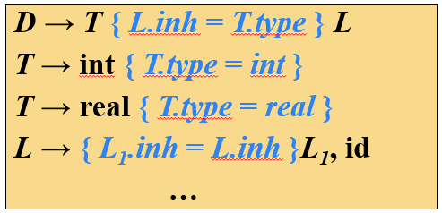

# 句法制导翻译概述
语法分析、语义分析、中间代码生成统称句法制导翻译。它使用 $CFG$ 来引导对语言的翻译，是一种面向文法的翻译技术。

## 基本思想
- 为 $CFG$ 中的文法符号构造**语义属性**，为产生式（句法规则）添加**语义规则**，用来计算语义属性的值。
- 构建输入串的**语法分析树**，在树的每个节点上计算语义属性的值。

## 句法制导定义（SDD）

是对 $CFG$ 的扩展
- 将每个文法符号关联到一个**语义属性**
- 将每个产生式关联到一组**语义规则**

## 句法制导翻译方案（SDT）

是对 $SDD$ 的具体实现形式，直接将**语义动作**嵌入到产生式中，包裹在花括号中。语义动作的位置决定了它的执行时间。

  

# 句法制导定义
概念如上所述，这里介绍具体的实现方法。

## 属性
- **综合属性**：
    - 自行产生属性值
    - 从子节点获取属性值
- **继承属性**：
    - 从父节点获取属性值
    - 从兄弟节点获取属性值

## 副作用
不更改属性值的语义动作，如输出语句。

## 属性文法
没有副作用的SDD

## 求值顺序
在一个属性求值之前，必须先求出它的所有依赖属性。可以使用**依赖图**来表示属性之间的依赖关系，然后根据依赖图求**拓扑排序**。由于有环图不存在拓扑序，所以 $SDD$ 并不总能确定求值顺序。

  

# $S-SDD$ 和 $L-SDD$
由于 $SDD$ 循环依赖的问题，有了 $S-SDD$ 和 $L-SDD$ 两个有用子类，总是能够确定求值顺序。

## $S-SDD$
只使用综合属性的 $SDD$，所有属性只依赖于子节点的属性或自身产生。因此，$S-SDD$ 总是可以**自底向上**（ $LR$ 分析）求值。

## $L-SDD$
属性满足：
- 是综合属性
- 是继承属性，并且只能依赖于：
    - 是父节点的**继承属性**（防止和父节点的综合属性循环依赖）
    - 是**左边**兄弟节点的继承属性
    - 是自身的属性，但是自身的所有属性不能循环依赖

可以**自顶向下**（ $LR$ 分析）求值

## 两者关系
$S-SDD \subset L-SDD$

  

# 句法制导翻译方案
如上所述，这里介绍利用 $SDT$ 实现 $S-SDD$ 和 $L-SDD$ 的方法。

## $S-SDD$ 转换为 $SDT$
将语义动作放在产生式的右侧，语义动作在归约时执行，如：

### 分析方式
- 扩展 $LR$ 分析栈，增加综合属性栈
    
    如果需要支持多个属性，可以增加栈元素的体积，或者存放一个结构体指针
- 把语义动作改写成更具体于实现的形式，如
    
- 当移入时，如果文法符号有综合属性，将其压入综合属性栈；否则，将空值压入综合属性栈占位
- 当归约时，执行产生式的语义动作

## $L-SDD$ 转换为 $SDT$
对于产生式 $A \rightarrow X_1 X_2 \cdots X_n$ 来说，
- $A$ 的综合属性，语义动作放在产生式最右侧
- $X_i$ 的继承属性，语义动作 $X_i$ 的左边

  

# 在非递归的预测分析中进行翻译
[回顾一下非递归分析法（自顶向下的）](4-自顶向下语法分析.md/#非递归的预测分析法)

## 扩展 $LL$ 分析栈
以前的 $LL$ 分析栈只有非终结符，现在需要同时存储：
- 非终结符及其继承属性
- 综合属性
- 语义动作及其参数

参考图片：

## 分析方法
基本思想是：
- **综合属性独立**：计算综合属性需要子节点属性全部计算完毕，所以入栈时把综合属性单独放在栈下方，待所有依赖就绪
- **继承属性依附**：继承属性总能在非终结符出栈时已经计算完毕
    - 用到父节点继承属性时，在父节点出栈时便可以获得
    - 用到左兄弟节点继承属性时，由于左兄弟节点在栈的上方，所以可以在左兄弟节点出栈时获得

以此文法为例：

具体的操作方法是：
- 非终结符入栈时，如果有综合属性，先将其入栈，再将非终结符入栈。参考初始符号入栈：
    
- 栈顶是非终结符，用产生式替换，
    - 语义动作也需要入栈：
        
    - 产生式左部出栈，如果有继承属性，并且右部的语义动作（即将入栈）使用，把它赋予语义动作作为参数：
        
        
- 栈顶是综合属性，可以直接出栈，同时后面如果有语义动作使用到该属性，把属性值赋予该语义动作作为参数：
    
- 栈顶是语义动作，执行相应的语义动作，然后出栈：
    
- 终结符直接与输入串匹配，如果匹配成功，并且有综合属性，把综合属性按继承属性方式记录：
    

  

# 在递归的预测分析中进行翻译
[回顾一下递归分析法（自顶向下的）](4-自顶向下语法分析.md/#递归下降分析通用分析形式)

递归法相比之下直观简单很多，看个例子：

按产生式右部的顺序依次执行：
- 非终结符：调用对应的函数，其继承属性通过返回值获取
- 语义动作：直接执行

# 自底向上翻译
给定一个基于 $LL$ 文法的 $L-SDD$，可以修改文法，并使用 $LR$ 分析器来实现自底向上的翻译。

## 操作方法
实际上是把 $L-SDD$ 转换为 $S-SDD$，然后使用 [$LR$ 分析](#分析方式)。

### 转换方法
- [修改文法形成 $L-SDD$ 的 $SDT$](#句法制导翻译方案)
    
- 对于语义动作，使用一个**标记非终结符** $M$ 来替换，并添加一个产生式 $M \to \varepsilon$，把语义动作放在最右边（动作用到的所有参数变成 $M$ 的继承属性，计算出的所有属性变成 $M$ 的综合属性）：
    
- 然后使用[ $SLR$ 分析](5-自底向上语法分析.md/#基本思想)来分析
- 一些属性暂存在标记非终结符中：
    
