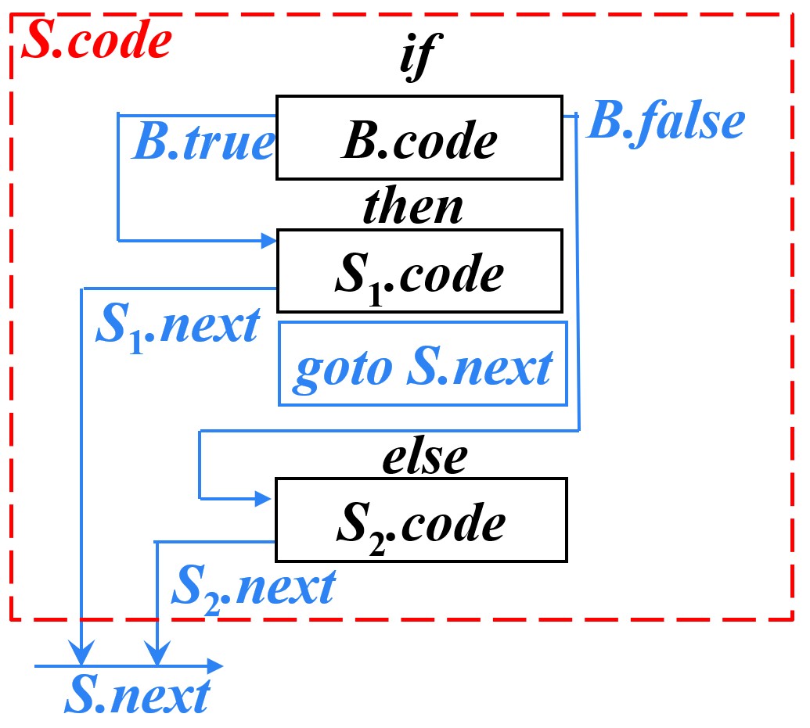

# 类型表达式
递归定义：
- **基本类型**是类型表达式，如：
    - integer
    - real
- 可以为类型表达式命名，**类型名**是类型表达式
- 将**类型构造符**作用于类型表达式，得到新的类型表达式，如：
    - array：`array(50, integer)`
    - pointer：`pointer(integer)`

  

# 下面会用到的语句
用来在 $SDT$ 中表示操作的语句汇总

## 声明语句
- **符号表插入**：`enter(name, type, offset)`
    - name：标识符名
    - type：类型
    - offset：相对地址

## 赋值语句
- **查询符号表**：`lookup(name)`
    - name：标识符名
    - 返回值：符号表中的记录
- **生成赋值语句**：`gen(code)`
    - code：三地址码，如 `p '=' addr`
- **生成临时变量**：`newtemp()`
    - 返回值：临时变量地址

## 控制流语句
- **生成存储标号的变量**：`newlabel()`
    - 返回值：变量地址
- **把下一条三地址码的标号赋值给label指向的变量**：`label(label)`
    - label：变量地址

## 回填
- **创建包含label回填列表**：`makelist(label)`
    - label：标号
    - 返回值：列表的指针
- **合并两个回填列表**：`merge(list1, list2)`
    - list1：列表1
    - list2：列表2
    - 返回值：合并后的列表指针
- **回填**：`backpatch(list, label)`
    - list：需要回填的三地址码列表
    - label：标号

  

# 声明语句的翻译
语义分析的主要任务就是收集标识符的**类型**等信息，并为标识符生成**地址**，保存在符号表中。

## 宽度
通过类型表达式可以计算出类型的宽度，即该类型所占的字节数。

## 翻译方式
以如下文法为例：

$P \to D$ 的时候初始化 $offset$ 。当 $D \to T \ id$ 归约时，需要插入符号表，并且维护好 $offset$ 。其他语句需要维护好类型和宽度。

  

# 简单赋值语句的翻译
主要的任务是生成表达式求值的三地址码。

## $SDT$

如图所示，参考[语句介绍](#赋值语句)，其中 `||` 为三地址码的拼接。这里将三地址码拼接到已有的三地址码后面，称为**增量翻译**。

  

# 数组引用的翻译
数组引用翻译成三地址码的过程中，最重要的是计算数组元素的地址。

## 数组元素寻址
- 一维数组中，如果元素宽 $w$，元素 $a[i]$ 地址为 
    $$
    base + w \times i
    $$
- 二维数组中，如果一行的宽度是 $w_1$ ，一个元素的宽度是 $w_2$ ，元素 $a[i_1][i_2]$ 地址为 
    $$
    base + w_1 \times i_1 + w_2 \times i_2
    $$
- 以此类推，多维数组的元素地址为
    $$
    base + w_1 \times i_1 + w_2 \times i_2 + \cdots + w_n \times i_n
    $$

## 一维数组三地址码
假设数组 $a$ 的类型是 $int$ ，那么单个元素的宽度为 $4$  

## 二维数组三地址码
假设数组 $a$ 的类型是 $int$ ，那么单个元素的宽度为 $4$，一行的宽度为 $4 \times 5 = 20$  

## 多维数组三地址码
假设文法如下：

给 $L$ 附加如下属性：

考虑自顶向下分析的过程，如果计算 $a[i_1][i_2] \cdots [i_n]$ 的地址。
- 非终结符会逐步展开到最高维度，这里可以通过符号表直接获取 $a$ 的地址和类型，从而可以赋值：
    - `type = array(N1, array(N2, array(N3, ...)))`
    - `offset = i1 * sizeof(array(N2, array(N3, ...)))`
    - `array = a`
- 对于下一级，继承属性 $type$ 、 $offset$ 和 $array$ ，然后计算：
    - 把 $type$ 向内拆去一层，即
        `type = array(N2, array(N3, ...))`
    - `offset += i2 * sizeof(array(N3, ...))`
- 一直计算到归约为 $L$ 即可

  

# 控制流语句的翻译
控制流语句的翻译主要维护语句的跳转。

如图所示：

继承属性：
- $B.true$ ：条件语句为真时的跳转标号
- $B.false$ ：条件语句为假时的跳转标号
- $S.next$ ：**非常关键的属性**，会递归式地赋值给子代码块，从而提供了模块化生成代码的能力

## 翻译方式
首先参考[语句声明](#控制流语句)

### 基本文法

- 在语句块产生前，先创建它的 $next$ 变量，当语句块产生完成后，把 $next$ 设置为下一条语句的标号。
- 如果 $S \to S_1 S_2$ 分化出两条语句，那么在产生 $S_2$ 语句块之前先把 $S_2.next$ 设置为 $S_1.next$ ，从而在 $S_1$ 块之后紧接着产生语句块。

### $if-then-else$ 语句

- 判断语句块产生前，先创建 $true$ 和 $false$ 变量
- 产生完毕后，把 $B.true$ 赋值为紧接着判断语句块的位置，表示 $S_1$ 代码块放置在判断块之后。
- $S_1$ 产生前，先把 $S_1.next$ 赋值为 $S.next$ ，也就是继承了整个代码段的 $next$ 属性，以便自身代码块使用
- $S_1$ 产生完毕后，由于不执行 $S_2$ ，所以要产生一条 $goto$ 语句，跳过 $S_2$。并且将 $B.false$ 赋值为紧接着 $goto$ 语句的位置。
- $S_2$ 产生前，先把 $S_2.next$ 赋值为 $S.next$ ，也就是继承了整个代码段的 $next$ 属性，以便自身代码块使用

### $while-do$ 语句

逻辑上与上面的 $if-then-else$ 基本差不多，区别是：
- 添加了 $S.begin$ 属性，用来存储循环体的起始位置（包括判断语句）。然后在循环体生产完后产生一条 $goto$ 语句跳转到 $S.begin$ 。
- $B.false$ 跳转到 $S.next$ ，即循环体之后。

  

# 布尔表达式
上文中的条件判断语句 $B$ 总是一个布尔表达式，这里介绍布尔表达式的翻译。基本文法如下：
 
其中的 $relop$ 为关系运算符，如 $<$ 、 $>$ 、 $==$ 等。

## 基本语句翻译

在生成简单语句判断条件的真假，然后生成跳转语句。如果有嵌套情况，那么把 $true$ 和 $false$ 向内传递，如果是 $not$ 运算就反过来传递。

## 逻辑或

- 如果 $B_1$ 为真，那么整个表达式为真，直接跳转到 $B.true$ 即可
- 如果 $B_1$ 为假，那么需要继续判断 $B_2$ ，所以把 $B_1.false$ 赋值为 $B_2$ 的开始处，然后继续判断 $B_2$ 。
- 如果 $B_2$ 为真，那么表达式为真，跳转到 $B.true$
- 如果 $B_2$ 为假，那么表达式为假，跳转到 $B.false$

## 逻辑与

基本操作方式和逻辑或相同，只是跳转逻辑稍有修改，看图便可知晓

  

# 控制流翻译示例

翻译结果：

实际上手工计算的话并不需要管太多标号信息的维护，按照逻辑直接生成语句一路往下写就行了。

  

# 布尔表达式的回填
上面介绍的翻译方式适用于 $LL$ 分析，但是对于 $LR$ 分析，需要使用回填技术。需要参考[回填函数声明](#回填)。

## 基本文法

可以看到所有的语义动作都被编排到了产生式的末尾，即在 $LR$ 分析中在归约时执行所有的语义动作。由于满足布尔表达式时的跳转方式和跳转位置都尚不能确定，所以这部分的回填需要滞后到上一层的归约时才能确定。

### 属性解释
- `truelist` ：待回填的，需要跳转到条件为真时下一条语句的， `goto` 语句列表
- `falselist` ：待回填的，需要跳转到条件为假时下一条语句的， `goto` 语句列表

### 特别解释一下逻辑或
- 由于在原来的 $SDT$ 中，并没有变量临时存储 $B_2$ 的起始位置，所以就没办法回填 $B_1$ 的跳转位置。
- 在 $B_2$ 归约之前插入一个标记语义符号 $M$ 和它的空产生式，它唯一的作用就是用变量 $M.quad$ 来存储 $B_2$ 的起始位置。
- 在整条语句规约时
    - $B_1$ 判断为假时需要跳转到 $B_2$ 的判断，所以 $B_1.falselist$ 可以直接回填到 $M.quad$ ，也就是 $B_2$ 的起始位置。
    - $B_1$ 判断为真和 $B_2$ 判断为真时，都代表 $B$ 判断为真，所以可以把 $B_1.truelist$ 和 $B_2.truelist$ 合并为 $B.truelist$ ，暂时不能确定回填的标号，等待后续处理。
    - $B_2$ 判断为假时，需要跳转到 $B$ 判断为假去到的位置，由于目前也不能确定，由 $B.falselist$ 接管在后续的归约中回填

  

# 控制流语句的回填
这里多一个 $nextlist$ 属性，用来存储一群跳转语句，需要被回填到语句块之后执行的第一条语句。

## $if-then-else$ 语句的回填

- 这里省略了 $M_1$ 和 $M_2$ 的 $SDT$ ，具体可以参考[逻辑或的回填](#特别解释一下逻辑或)。
- 新加入了一个变量 $N$ ，用来生成一条跳转语句来跳过 $S_2$ 语句块，同时把它维护在自己的 $nextlist$ 中，等待后续回填。
- 如果 $B$ 判断为真，则跳转 $S_1$ 语句块，所以把 $B.truelist$ 回填到 $M_1.quad$
- 如果 $B$ 判断为假，则跳转 $S_2$ 语句块，所以把 $B.falselist$ 回填到 $M_2.quad$
- 无论哪个语句块，执行完毕以后都跳转到整个语句后，所以由 $S.nextlist$ 来接管三个回填列表

## $while-do$ 语句的回填

- 其他的不过多解释，参考上面的例子
- $B$ 为假时需要跳转到循环后面，具体是什么尚不能得知，所以使用 $S.nextlist$ 来接管
- 在最后产生一条跳转语句，跳转到判断语句的开始，从而实现循环，由于地址直接可以确定，不需要回填

## $nextlist$ 的回填

## 普通语句不需要回填

  

# 回填翻译例子

  

# $switch$ 语句的翻译
有两种翻译方式：
- 非常 $if-then-else$ 的翻译方式：
     
    这里比较奇怪的就是 $next$ 是在第一个分支语句块结束以后才创建的，暂时没明白意义何在，或许是因为从这里开始才用得上 $next$ 吧。
- 跳表式的翻译方式：
     
    在最后面生成一个 $test$ 标号和一群判断语句，用于识别 $E$ 的值并跳转到对应的分支。进入 $switch$ 语句以后，先跳转 $test$ ，在这里进行路由跳转。

## 增加一种 $case$ 语句
对于上面的连环 $if$ 指令：

可以加入新的指令：

虽然含义上没有什么区别，但是可以便于编译器识别和优化。

  

# 过程调用语句的翻译
函数调用语句，需要处理参数传递和函数的跳转等问题。

## 基本文法
 
这里值得注意的是 `gen('param' t)` 语句，生成一个临时的实参。