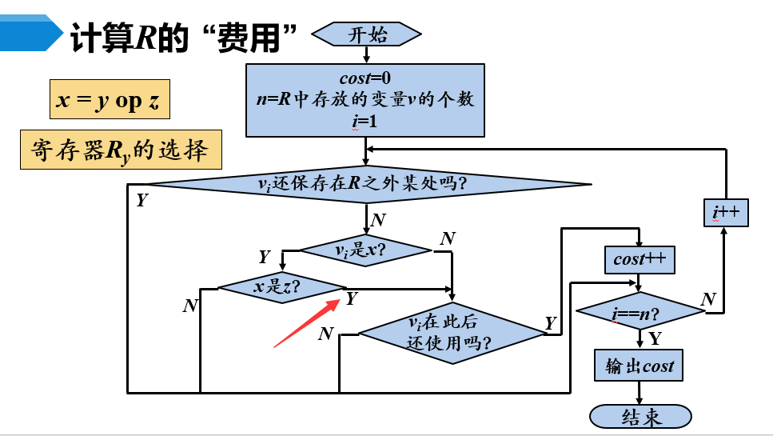
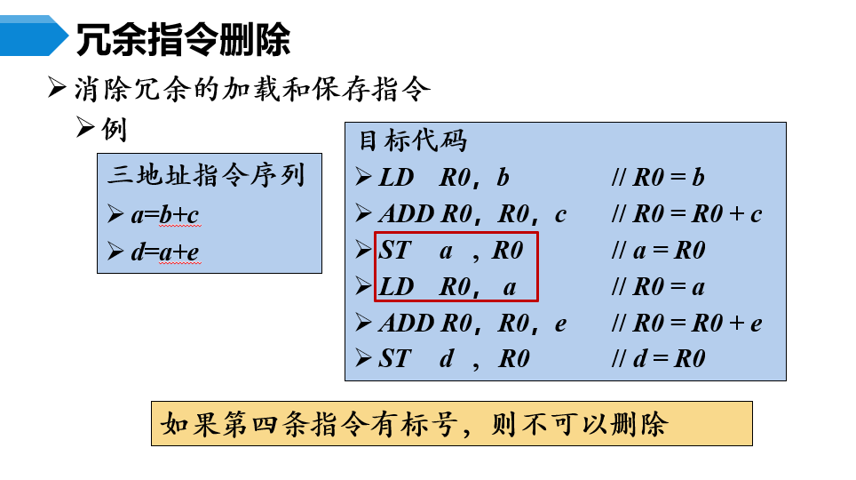
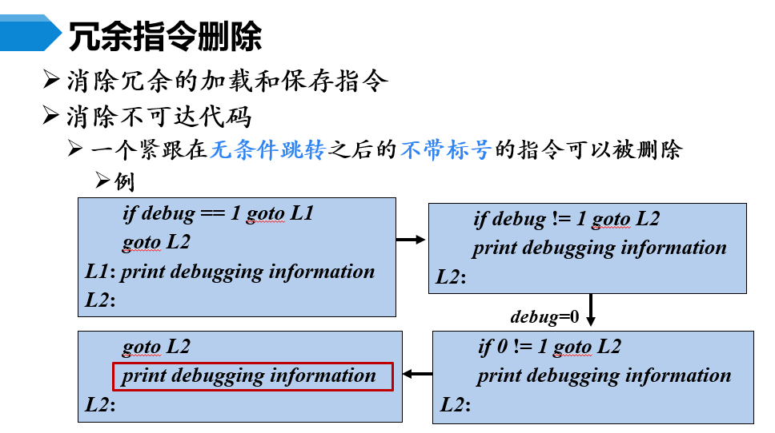
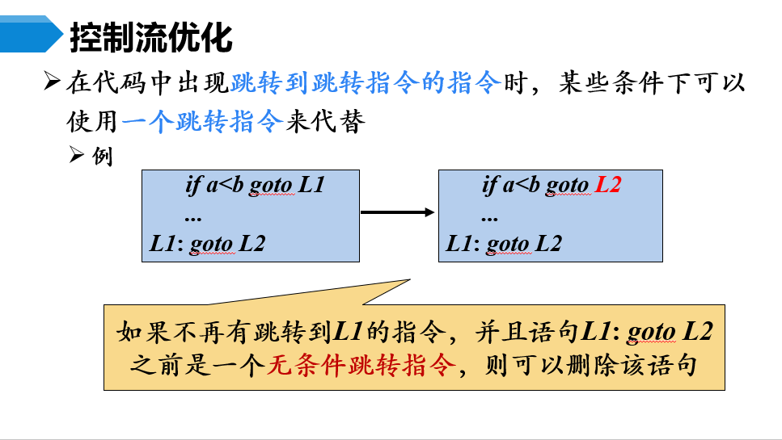
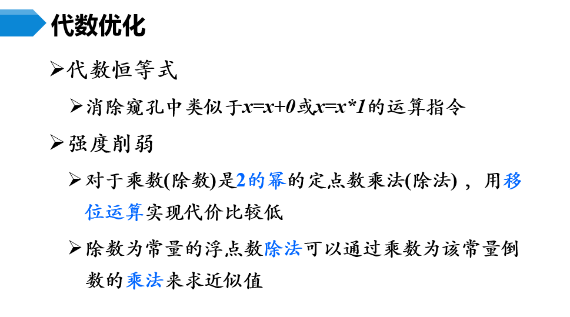
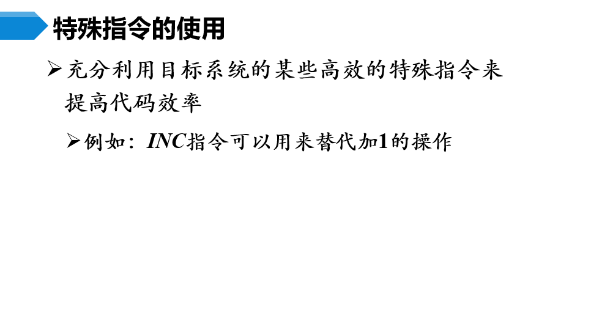

# 代码生成器的主要任务
- **指令选择**：对于之前产生的中间代码（IR），选择合适的目标机器指令实现
- **寄存器分配和指派**：选择把哪个值放在哪个寄存器中
- **指令排序**：对指令进行重新排序

<br><br>

# 一个简单的目标机模型
## 三地址机器模型
- 加载、保存、运算、跳转等操作
- 按字节寻址
- $n$ 个通用寄存器 $R_0, R_1, \cdots, R_{n-1}$
- 假设只有整数运算
- 指令之间可能有一个标号

## 目标机器的主要指令
- **加载**：`LD dst, addr`
- **保存**：`ST x, r`
- **运算**：`OP dst, src1, src2`
- **无条件跳转**：`BR L`
- **条件跳转**：`Bcond r, L`

## 寻址模式
- 变量名
- `a(r)` ：取出地址为寄存器 `r` 加上变量 `a` 的首地址
- `c(r)` ：取出地址为寄存器 `r` 加上常数 `c` 的内存单元的内容
- `*r` ：二次解引用寄存器 `r` 的内容
- `*c(r)` ： 二次解引用寄存器 `r` 的内容加上常数 `c` 的值
- `#c` ：常数 `c`

## 指令开销
- 寄存器寻址代价为 $0$
- 内存寻址代价为 $1$
- 常数寻址代价为 $1$

<br><br>

# 指令选择
## 运算语句的目标代码
例如：`x = y - z`
翻译为：
```
LD R1, y
LD R2, z
SUB R1, R1, R2
ST x, R1
```
尝试优化上面的代码，例如倘若 `y` 和 `z` 之前已经被载入了寄存器，那么就可以直接使用这两个寄存器，而不需要再载入一次。

## 数组寻址
- `b = a[i]` ，且 `a` 每个元素占 $8$ 个字节
    翻译为：
    ```
    LD R1, i
    MUL R1, R1, #8
    ADD R1, R1, a
    LD R2, 0(R1)
    ST b, R2
    ```
- `a[j] = c` ，且 `a` 每个元素占 $8$ 个字节
    翻译为：
    ```
    LD R1, c
    MUL R1, R1, #8
    LD R2, j
    ST a(R1), R2
    ```

## 指针存取
- `x = *p`
    翻译为：
    ```
    LD R1, p
    LD R2, 0(R1)
    ST x, R2
    ```
- `*p = y`
    翻译为：
    ```
    LD R1, p
    LD R2, y
    ST 0(R1), R2
    ```

## 条件跳转
`if x < y goto L`
翻译为：
```
LD R1, x
LD R2, y
SUB R1, R1, R2
BLTZ R1, L
```

## 过程调用和返回（静态）
- `call callee`
    翻译为：
    ```
    ST callee.staticArea, #here + 20
    BR callee.codeArea
    ```
- `return`
    翻译为：
    ```
    BR *callee.staticArea
    ```

## 过程调用和返回（栈式）
- `call callee`
    翻译为：
    ```
    ADD SP, SP, #caller.recordsize
    ST 0(SP), #here + 16
    BR callee.codeArea
    ```
- `return`
    - 被调用过程：
        ```
        BR *0(SP)
        ```
    - 调用过程：
        ```
        SUB SP, SP, #caller.recordsize
        ```

<br><br>

# 寄存器的选择
首先为指令选择需要的寄存器，如果寄存器中存储的变量不是所需要的，那么生成加载指令

## 寄存器描述符和地址描述符
- 寄存器描述符：寄存器中存储的变量
- 地址描述符：变量**当前值**存储在哪（寄存器、内存等），可以附在符号表中

注意：两种描述符都可以指向多个实体，比如一个变量可以同时存储在寄存器和内存中

## 基本块的收尾处理
在基本块的末尾检查所有地址描述符，如果变量的当前值不存在内存中，生成保存指令

## 信息维护
当生成加载、保存等指令的时候，需要同步更新寄存器描述符和地址描述符，如指令 `LD R, x` ，需要：
- 更新寄存器描述符：`R` 中存储的变量为 `x`
- 更新地址描述符：`x` 的当前值存储在 `R` 中
- 从别的地址描述符中删除 `R` 

## 选择算法
当需要一个变量 `x` 的值的时候，按如下顺序选择寄存器：
- 如果 `x` 的当前值在某个寄存器中，那么选择这个寄存器
- 如果有空闲寄存器，那么选择这个寄存器
- 计算一个“费用”最低的寄存器，选择这个寄存器

### 费用计算


箭头指出的地方不能理解

$R_x$ 的选择有所不同，因为它的值在语句中被改变，所以任何地方存储的 $x$ 值都是可以覆盖的。如果 $y$ 的值以后不再使用，那么也可以简单地把 $x$ 的值存储在 $R_y$ 中。

<br><br>

# 窥孔优化
窥孔是程序的一个小滑动窗口，窥孔优化是指在窥孔中进行指令替换来形成更快更短的程序

以下是几个例子：
- 冗余加载保存删除
    
- 不可达代码删除
    
- 控制流优化
    
- 代数优化
    
- 特殊指令优化
    