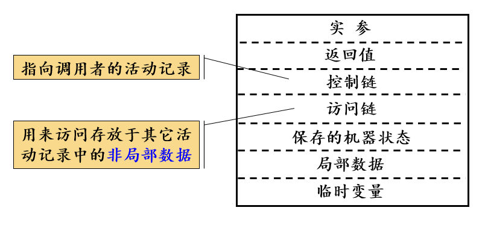
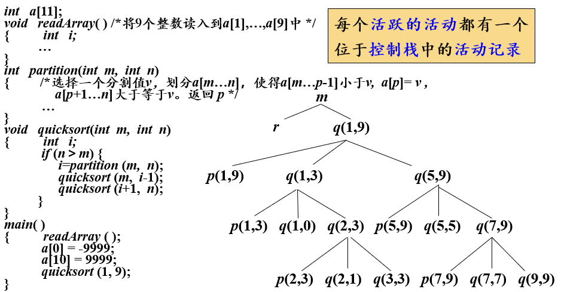

# 运行存储分配概述
编译过程中需要为源程序中出现的数据对象分配存储空间
，编译时可以确定**大小**和**存放位置**的对象，可以**静态存储分配**，否则就只能**动态存储分配**

## 概念
- **过程**：以函数、方法等为用户自定义动作的单元，称为过程，编译器通常以过程为单位分配存储空间
- **活动**：过程体的每次执行
- **活动记录**：活动需要分配一块连续存储区来维护执行所需的信息，称为活动记录。一般形式：
    
    没怎么看懂

<br><br>

# 静态存储分配
变量存储位置确定，可以被hardcode到指令中，不需要运行时计算。同一个名字每次运行都绑定到同样的位置。

## 适合静态存储分配的语言的条件
- 数组上下界必须是常数
- 不允许函数递归调用
- 不允许动态建立数据实体

显然， `C` 语言不满足这些条件。满足这些条件的有 `BASIC` 和 `FORTRAN` 等

## 常用静态存储分配方法

### 顺序分配法
- 按照过程的出现顺序，依次分配存储空间
- 各个过程的活动记录互不相交

显然这是一个简单的方案，但是会带来内部碎片的问题

### 层次分配法
分析过程间的相互调用模式，如果不会直接或间接相互调用的两个过程，就可以共用一个活动记录

<br><br>

# 动态存储分配
在运行过程中可以动态地获取和释放内存

## 栈式存储分配
使用到过程、函数、方法的语言，几乎编译器都会使用栈的方式来分配存储空间

### 活动树
描述程序运行期间，控制进入和离开各个活动的情况，的树。每个结点都是一个活动，同层次的活动是从左到右进行的。


## 设计活动记录的原则
- 调用者和被调用者之间传递值一般放在被调用者的活动记录开始位置
- 固定长度的数据一般放在活动记录的中间，如控制链、机器状态等等
- 预先不知道大小的数据一般放在活动记录的末尾
- 用一个指针指向局部变量开始位置（ `%rsp` ）

## 调用序列和返回序列
过程的调用和返回前都需要特定代码来维护一些信息，如保存机器状态等等。实际上它们经常被拆分到调用过程和被调用过程中。

### 调用序列（非常不准确）
调用者：
- 计算实参
- 写返回地址到机器状态字段
- 写 `%rsp` 到控制链字段，递增 `%rsp` 到指向新的位置

被调用者：
- 保存寄存器值和状态信息
- 初始化自身局部数据并执行

- **返回序列**
被调用者：
- 把返回值放到与参数相邻的位置
- 恢复 `%rsp` 和其他寄存器
- 跳转返回地址

调用者：
- 越过栈顶取出返回值

## 非局部数据的访问
过程除了自己定义的局部数据，可以访问非局部的数据

### 支持过程嵌套声明的语言
可以把一个函数完全包裹在另一个函数里面，并且内部函数可以访问外部函数声明的变量。例如 `Pascal` 语言。<br>
**嵌套深度**：不内嵌在任何其他过程中的过程的嵌套深度为0，其他每嵌套一层深度递增。

### 不支持过程嵌套声明的语言
只能访问自身定义的局部数据或者全局数据。例如 `C` 语言。

### 访问链
嵌套在别的函数内部的函数，可以访问外部声明的变量，这实际上是通过**称为访问链的指针**来实现的，它总是指向直接外层的函数最近一次活动记录。考虑嵌套函数声明：
```c
void A() 
{
    void B()
    {
        void C()
        {
        }
    }

    void D()
    {
    }
}
```
考虑以下三种情况：
- `B` 调用 `C` ：`C` 的访问链指向 `B` 的活动记录
- `B` 调用 `D` ：`D` 的访问链复制 `B` 的访问链
- `C` 调用 `D` ：通过 $2$ 步可以从 `C` 的访问链找到 `A` 的活动记录， `D` 的访问链指向 `A` 的活动记录

## 堆式存储分配
把连续存储区域分块存储，当需要是分配，不需要时释放。所有内存都可能被交叉使用。