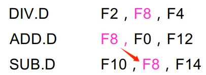
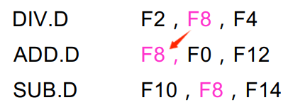
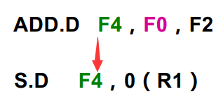
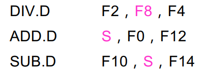

# 指令集并行
指令之间存在的一种并行性，（ILP：Instruction-Level Parallelism）

## 两种开发方法：
- 基于硬件的动态开发方法
- 基于软件的静态开发方法

## 性能标准：
$$ CPI_{流水线} = CPI_{理想} + 停顿_{结构} + 停顿_{数据} + 停顿_{控制} $$

---
<br><br>
# 相关和指令级并行
**相关**：两条指令之间存在某种依赖关系，可能影响并行执行。

## 数据相关（不并行）


对于先后的两条指令A和B，满足：
- A的结果被B使用
- C和A数据相关，B和C数据相关（传递性）

### 解决方法
- 保持相关关系，调整指令执行顺序
- 变换代码，消除相关关系

### 检测
- 数据流经寄存器，检测容易
- 数据流经存储器，检测困难（需要计算有效地址来确定是否相关）

## 名相关（可并行）
对于先后的两条指令A和B，**使用**相同的**名**（寄存器或存储器的名称），则具有名相关。存在两种：
- **反相关**：B的结果，正好是A的操作数（顺序不可互换，保证A读到正确的结果）

- **输出相关**：A和B写同一个名（顺序不可互换，保证最终写入正确的结果）


### 换名技术
改变指令中的操作数来消除名相关，例如下图消除反相关



### 程序顺序
有时改变指令的执行顺序可能会带来错误的结果，则完全按照源程序在串行意义下的顺序执行。

## 数据冲突
对于先后执行的两条指令A和B，存在如下数据冲突的可能

### 写后读（RAW）
在A写入结果之前，B就已经读取。对应于**数据相关**。最为常见。

### 写后写（WAW）
在A写入结果之前，B就已经写入。对应于**输出相关**。可能发生在：
- 流水线中不只一个段可以进行写操作
- 指令被重排

### 读后写（WAR）
在A读取操作数之前，B就已经写入。对应于**反相关**。可能发生在：
- 有些指令的写操作提前，有些指令的读操作延后
- 指令被重排

## 控制相关
由条件分支语句引起，以如下代码为例
```c
if (condition)
{
    statement1;
}
statement2;
```
有以下两个限制：
- statement1不能被排序到if之前
- statement2不能被移到if体中

需要注意：控制相关并不需要严格保持，更重要的保证数据流动和异常行为。

---
<br><br>

# 指令的动态调度
对指令的调度分为两种：
- 静态调度：依赖于编译器的优化
- 动态调度：依赖于专门硬件的优化

## 基本思想
原先顺序流出指令，导致有冲突发生时所有后续指令都被阻塞。现在拆分指令流出过程：
- 流出：如果指令不存在结构冲突就流出
- 读操作数：等待区，当数据冲突消失，读取操作数