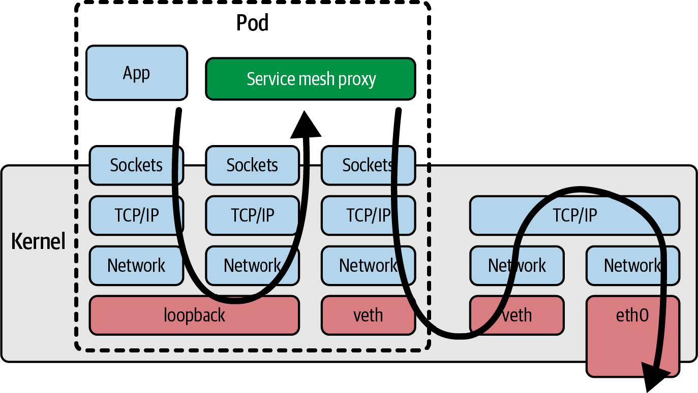

# 1 - 什么是eBPF，为何它如此重要？
eBPF大概可以认为是给内核提供的一段代码，它可以被关联到一个事件上，当这个事件发生时，这段代码就会被执行。eBPF有自己的一套语法，内核会处理好这段代码并验证它的安全性，只有安全的代码才会被接受。这意味着eBPF不会导致机器崩溃或陷入死循环，并且不会允许数据被泄露。

## eBPF的动态加载
eBPF几乎是热插拔的，添加eBPF程序以后无需重启内核就可以生效。

## eBPF程序的高性能
eBPF会被即时编译成本地机器码，并且它直接在内核中运行，不需要用户态和内核态之间的交互，从而获得了非常高的性能。通过eBPF在内核态先处理一些数据，可以避免一些数据被传递到用户态，从而提高性能。

## 云原生环境中的eBPF
云服务器往往采用云原生的方式组织，使用容器、Kubernetes或ECS等编排工具，或者像Lambda、云函数、Fargate等无服务器方法。它们往往自动进行负载均衡，在无服务器环境中，甚至不知道每个工作负载在哪个服务器上运行。

然而使用eBPF可以实现：
- 无需修改应用程序就可以用eBPF监控应用程序
- 无需重启服务器就可以用eBPF观察应用进程

相比之下Sidecar模型把监控工具作为一个容器运行，并向Kubernetes Pod注入它们，这比直接修改应用程序要方便。然而也有一些缺点：
- 添加Sidecar需要重启应用程序Pod
- 需要对应用程序的YAML修改，一般这是自动完成的，不过一旦有问题添加Sidecar就会失败
- 注入Sidecar会显著增加Pod的启动时间，并且可能向程序引入竞争条件或其他不确定问题
- 如果使用Sidecar来实现网络功能，那么流量需要先在内核中绕一圈，然后再到达Sidecar，这会降低性能，如下图

