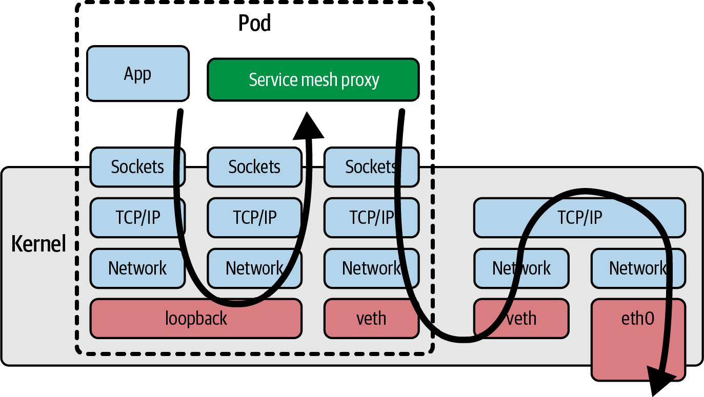
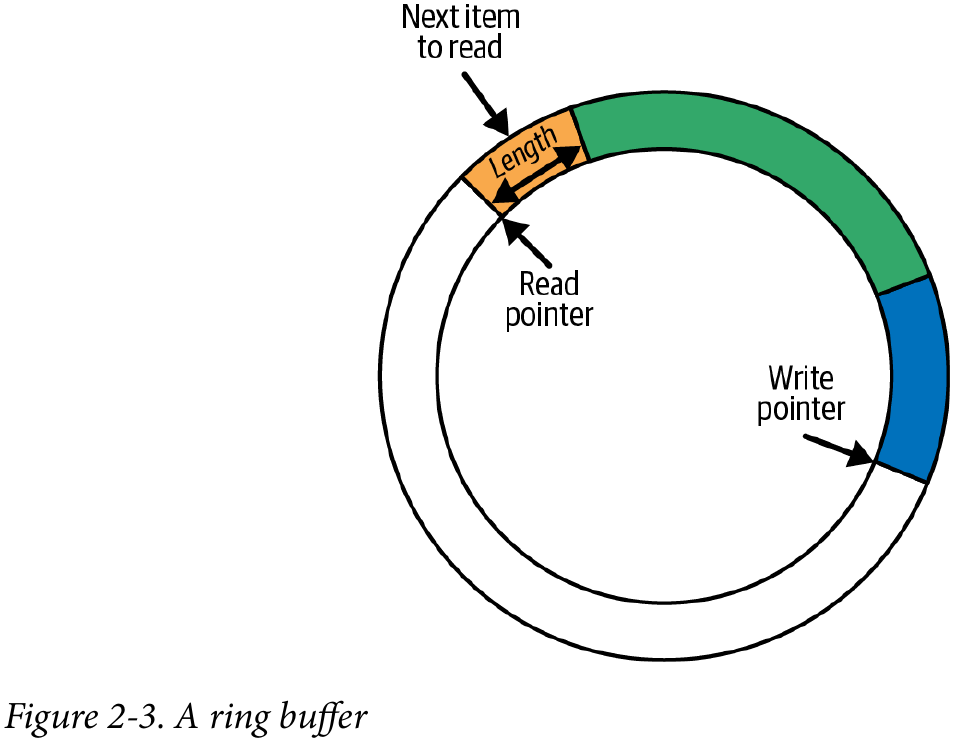

# 1 - 什么是eBPF，为何它如此重要？
eBPF大概可以认为是给内核提供的一段代码，它可以被关联到一个事件上，当这个事件发生时，这段代码就会被执行。eBPF有自己的一套语法，内核会处理好这段代码并验证它的安全性，只有安全的代码才会被接受。这意味着eBPF不会导致机器崩溃或陷入死循环，并且不会允许数据被泄露。

## eBPF的动态加载
eBPF几乎是热插拔的，添加eBPF程序以后无需重启内核就可以生效。

## eBPF程序的高性能
eBPF会被即时编译成本地机器码，并且它直接在内核中运行，不需要用户态和内核态之间的交互，从而获得了非常高的性能。通过eBPF在内核态先处理一些数据，可以避免一些数据被传递到用户态，从而提高性能。

## 云原生环境中的eBPF
云服务器往往采用云原生的方式组织，使用容器、Kubernetes或ECS等编排工具，或者像Lambda、云函数、Fargate等无服务器方法。它们往往自动进行负载均衡，在无服务器环境中，甚至不知道每个工作负载在哪个服务器上运行。

然而使用eBPF可以实现：
- 无需修改应用程序就可以用eBPF监控应用程序
- 无需重启服务器就可以用eBPF观察应用进程

相比之下Sidecar模型把监控工具作为一个容器运行，并向Kubernetes Pod注入它们，这比直接修改应用程序要方便。然而也有一些缺点：
- 添加Sidecar需要重启应用程序Pod
- 需要对应用程序的YAML修改，一般这是自动完成的，不过一旦有问题添加Sidecar就会失败
- 注入Sidecar会显著增加Pod的启动时间，并且可能向程序引入竞争条件或其他不确定问题
- 如果使用Sidecar来实现网络功能，那么流量需要先在内核中绕一圈，然后再到达Sidecar，这会降低性能，如下图



# 2 - eBPF的Hello World

## BCC的Hello World
此程序使用BCC的Python库编写：
```python
#!/usr/bin/python3
from bcc import BPF

# eBPF程序，使用C语言编写，调用辅助函数bpf_trace_printk()打印消息
program = r"""
int hello(void *ctx) {
    bpf_trace_printk("Hello World!");
    return 0;
}
"""

# 创建BPF对象，传入eBPF程序，它会自动编译并加载到内核中
b = BPF(text=program)

# 为了把eBPF附加到系统调用execve()上，先查询该系统调用
syscall = b.get_syscall_fnname("execve")

# 使用内核探针kprobe，把hello程序附加到该事件上
b.attach_kprobe(event=syscall, fn_name="hello")

# 读取内核输出的消息并打印
b.trace_print()
```
实际上 `bpf_trace_printk()` 把输出写入一个伪文件 `/sys/kernel/debug/tracing/trace_pipe` 中，然后程序从中取出输出信息。可以使用 `cat` 查看它的内容，这需要root权限。

## 运行Hello World
eBPF需要特权才能运行，在早期的内核版本上需要root身份或者使用sudo运行。内核5.8版本以后，可以使用 `CAP_BPF` 能力：
- 加载跟踪程序需要：`CAP_PERFMON` 和 `CAP_BPF`
- 加载网络程序需要：`CAP_NET_ADMIN` 和 `CAP_BPF`

运行它可能看到如下的输出：
```shell
$ sudo ./hello.py
b' bash-5412 [001] .... 90432.904952: 0: bpf_trace_printk: Hello World'
```
在这条信息中能够看到，调用 `execve()` 的进程的ID为5412，它正在运行bash，以及打印出来的消息"Hello World"。

使用单一eBPF程序并从 `trace_pipe` 中读取输出是简单的。然而它只能输出字符串并且格式受限，当有多个eBPF程序时更是混乱，相比之下eBPF Map更加灵活。

## BPF Map
Map是一种数据结构，在内核态的eBPF程序和用户态程序都可以访问它，常用于多个eBPF程序以及用户态程序之间进行通信。

它通常有如下用途：
- 用户空间写入配置信息，由eBPF程序读取
- 一个eBPF程序存储状态，供另一个eBPF程序使用
- eBPF程序写入结果或指标，用户空间可以读取

Linux的 `uapi/linux/bpf.h` 文件中定义了各种BPF Map，内核文档中有一些相关信息。它们都是键-值存储，包括哈希表、perf和环形缓冲区以及数组等。

有的Map被定义为数组类型，使用一个4字节索引为键，其他MAP可以使用任意数据类型作为键。

有的Map针对某些操作进行了优化，如队列、栈、LRU存储、最长前缀匹配和Bloom过滤器等。

有的Map用来存储特定类型的信息，如 `sockmap` 和 `devmap` 保存套接字和网络设备的信息，程序数组存储一组eBPF程序的索引便于调用其他的eBPF程序，甚至可以有一个Map存储其他Map。

有的Map具有per-CPU版本，使得每个CPU使用不同的内存来避免数据一致性问题。而对于普通版本，在内核5.1版本以后，提供了自旋锁来进行同步。

### Hash Table Map
看一个使用Map的示例程序，它同样附加到 `execve()` 系统调用上，首先是eBPF程序本身：
```c
// BPF_HASH()是BCC宏，定义了一个哈希表映射（这是一行变量定义语句）
BPF_HASH(counter_table);

int hello(void *ctx) {
   u64 uid;
   u64 counter = 0;
   u64 *p;

   // bpf_get_current_uid_gid()获取触发事件的进程的uid和gid
   // 返回值的低32位为uid，高32位为保存gid
   uid = bpf_get_current_uid_gid() & 0xFFFFFFFF;

   // 在哈希表中查找键为uid的条目，返回一个指向其值的指针，找不到则返回0
   p = counter_table.lookup(&uid);

   // 如果有该条目，把值赋值给counter
   if (p != 0) {
      counter = *p;
   }
   
   // 递增counter
   counter++;

   // 更新哈希表中键为uid的条目的值为counter
   counter_table.update(&uid, &counter);

   return 0;
}
```
比较神奇的是像 `counter_table.lookup(&uid)` 这样的代码，这并不是标准的C语言。BCC会在编译之前对这样的代码进行处理，转换成标准的C语言代码。

然后是Python程序：
```python
b = BPF(text=program)
syscall = b.get_syscall_fnname("execve")
b.attach_kprobe(event=syscall, fn_name="hello")

while True:
    # 每隔两秒执行一次
    sleep(2)

    # 存储结果的字符串
    s = ""

    # 哈希表由BCC创建一个Python对象来维护，可以用名字获取特定的Map
    for k, v in b["counter_table"].items():
        s += s += f"ID {k.value}: {v.value}\t"

    # 打印结果
    print(s)
```
Map的使用非常方便，但是用户空间需要轮询来获取数据。

### Perf和环形缓冲区Map
Linux内核支持了perf子系统，并且eBPF支持perf缓冲区，以及它的后继者BPF环形缓冲区。

在5.8或更高版本的内核中，更推荐使用BPF环形缓冲区，而不是BPF perf缓冲区，在安德烈·纳克里科的[BPF 环形缓冲区博文](https://oreil.ly/ARRyV)介绍了两者的区别。



环形缓冲区并不只用于eBPF，它实际上可以看做逻辑上为环形的一块内存，具有读写两个指针。数据被写入到写指针的位置，并被附上长度信息的头部，然后移动写指针。然后读指针可以通过头部获取信息长度，读取数据并移动读指针。当读指针赶上写指针，表示没有数据可读。当写指针赶上读指针，表示环形缓冲区已满，它不会再写入数据，而是递增丢弃计数器。读取数据时会一并读取丢弃计数器，这样用户空间可以知道有多少数据丢失。

接下来这个Hello World程序会比较复杂，首先是eBPF程序：
```c
// BCC宏BPF_PERF_OUTPUT用于创建一个map，它用来将消息从内核传递到用户空间
BPF_PERF_OUTPUT(output);

// 数据被写入一个结构体，包含pid、uid、当前命令名称、文本消息
struct data_t {
   int pid;
   int uid;
   char command[16];
   char message[12];
};

int hello(void *ctx) {
   // data用来构造要提交的结构体，message保存字符串"Hello World"
   struct data_t data = {};
   char message[12] = "Hello World";

   // bpf_get_current_pid_tgid()获取触发事件线程的pid和tgid（应相同）
   // 高32位为pid，低32位为tgid
   data.pid = bpf_get_current_pid_tgid() >> 32;

   // bpf_get_current_uid_gid()如前所述
   data.uid = bpf_get_current_uid_gid() & 0xFFFFFFFF;

   // bpf_get_current_comm()获取触发事件的进程运行的可执行文件名称
   // 结果被写入提供的缓冲区，需要提供缓冲区大小
   bpf_get_current_comm(&data.command, sizeof(data.command));

   // 本程序中，固定地将消息Hello World写入data结构体的message字段
   bpf_probe_read_kernel(&data.message, sizeof(data.message), message);

   // 结构体准备好，调用perf_submit()将该数据放入map中
   output.perf_submit(ctx, &data, sizeof(data));

   return 0;
}
```
然后可以在Python中读取这个Map：
```python
b = BPF(text=program)
syscall = b.get_syscall_fnname("execve")
b.attach_kprobe(event=syscall, fn_name="hello")

def print_event(cpu, data, size):
    # 同样可以用名字output来获取Map，用event()方法获取数据
    data = b["output"].event(data)
    print(f"{data.pid} {data.uid} {data.command.decode()} {data.message.decode()}")

# 打开perf环形缓冲区，注册收到数据时的回调函数print_event
b["output"].open_perf_buffer(print_event)

# 不断轮询，有数据到达就会触发回调函数
while True:
    b.perf_buffer_poll()
```

### 函数调用
早期的eBPF仅支持调用提供的辅助函数，为了调用其他函数，程序员通常用 `__always_inline` 指示编译器内联展开自己的函数，如：
```c
static __always_inline void my_function(void *ctx, int val)
```
不过在4.16版本的内核和LLVM 6.0开始，eBPF提供了函数调用的支持，名为“BPF to BPF函数调用”或“BPF子程序”，它目前不被BCC支持。

### 尾部调用
尾部调用可以调用其他的eBPF程序，与普通函数调用不同的是，它并不从被调函数中返回，从而不需要为调用函数保存栈帧。实际上eBPF中栈大小限制为512字节，因此这是非常有用的。

尾部调用使用特殊辅助函数实现：
```c
long bpf_tail_call(void *ctx, struct bpf_map *prog_array_map, u32 index);
```
其中， `ctx` 把上下文传递给被调程序； `prog_array_map` 是一个 `BPF_MAP_TYPE_PROG_ARRAY` 类型的Map，保存了一组eBPF程序的描述符； `index` 是要调用的程序的索引。如果它执行成功就不会返回，否则它返回然后程序继续向下执行。

所有要被调用的eBPF需要被加载到内核中，然后存储到Map里面。

看一个示例，主eBPF被附加到系统调用通用入口，它使用尾部调用跟踪某些系统调用操作码的特定消息，如果没有匹配的操作码它就跟踪一个通用的信息。在BCC中，尾部调用可以简化一些：
```c
prog_array_map.call(ctx, index)
```
然后BCC会把它重写为：
```c
bpf_tail_call(ctx, prog_array_map, index)
```

eBPF程序如下：
```c
// BCC宏BPF_PROG_ARRAY定义BPF_MAP_TYPE_PROG_ARRAY类型的Map
// 这里数组名字为syscall，支持最多300条数据
BPF_PROG_ARRAY(syscall, 300);

// 它附加到sys_enter原始跟踪点上，任何系统调用时都会触发它
// 附加到原始跟踪点的程序的上下文以bpf_raw_tracepoint_args的形式传递
int hello(struct bpf_raw_tracepoint_args *ctx) {
    // 对于sys_enter，参数中包括用于标识正在进行的系统调用的操作码
    int opcode = ctx->args[1];

    // 进行尾部调用
    syscall.call(ctx, opcode);

    // 没有对应条目的情况，打印通用调试信息
    bpf_trace_printk("Another syscall: %d", opcode);

    return 0;
}

// 被尾部调用的程序。当操作码指示为execve()时，它被执行，生成一行跟踪信息
int hello_exec(void *ctx) {
    bpf_trace_printk("Executing a program");
    return 0;
}


// 多个opcode会调用这个程序，它在内部根据opcode打印不同的消息
int hello_timer(struct bpf_raw_tracepoint_args *ctx) {
    int opcode = ctx->args[1];
    switch (opcode) {
        case 222:
            bpf_trace_printk("Creating a timer");
            break;
        case 226:
            bpf_trace_printk("Deleting a timer");
            break;
        default:
            bpf_trace_printk("Some other timer operation");
            break;
    }
    return 0;
}

// 什么都不做，不打印跟踪信息的系统调用会调用这个程序
int ignore_opcode(void *ctx) {
    return 0;
}
```

接下来是Python程序：
```python
b = BPF(text=program)

# 不附加到kprobe，而是附加到sys_enter原始跟踪点上
b.attach_raw_tracepoint(tp="sys_enter", fn_name="hello")

# 加载尾部调用程序并返回一个文件描述符
# 尾部调用程序需要与父程序有相同的类型，这里为BPF.RAW_TRACEPOINT
ignore_fn = b.load_func("ignore_opcode", BPF.RAW_TRACEPOINT)
exec_fn = b.load_func("hello_exec", BPF.RAW_TRACEPOINT)
timer_fn = b.load_func("hello_timer", BPF.RAW_TRACEPOINT)

# 在map中创建条目，如果opcode没有对应条目，尾部调用不会被实际执行
prog_array = b.get_table("syscall")
prog_array[ct.c_int(59)] = ct.c_int(exec_fn.fd)
prog_array[ct.c_int(222)] = ct.c_int(timer_fn.fd)
prog_array[ct.c_int(223)] = ct.c_int(timer_fn.fd)
prog_array[ct.c_int(224)] = ct.c_int(timer_fn.fd)
prog_array[ct.c_int(225)] = ct.c_int(timer_fn.fd)
prog_array[ct.c_int(226)] = ct.c_int(timer_fn.fd)

# 一些频繁执行并且没有必要跟踪的系统调用
prog_array[ct.c_int(21)] = ct.c_int(ignore_fn.fd)
prog_array[ct.c_int(22)] = ct.c_int(ignore_fn.fd)
prog_array[ct.c_int(25)] = ct.c_int(ignore_fn.fd)
prog_array[ct.c_int(29)] = ct.c_int(ignore_fn.fd)
prog_array[ct.c_int(56)] = ct.c_int(ignore_fn.fd)
prog_array[ct.c_int(57)] = ct.c_int(ignore_fn.fd)
prog_array[ct.c_int(63)] = ct.c_int(ignore_fn.fd)
prog_array[ct.c_int(64)] = ct.c_int(ignore_fn.fd)
prog_array[ct.c_int(66)] = ct.c_int(ignore_fn.fd)
prog_array[ct.c_int(72)] = ct.c_int(ignore_fn.fd)
prog_array[ct.c_int(73)] = ct.c_int(ignore_fn.fd)
prog_array[ct.c_int(79)] = ct.c_int(ignore_fn.fd)
prog_array[ct.c_int(98)] = ct.c_int(ignore_fn.fd)
prog_array[ct.c_int(101)] = ct.c_int(ignore_fn.fd)
prog_array[ct.c_int(115)] = ct.c_int(ignore_fn.fd)
prog_array[ct.c_int(131)] = ct.c_int(ignore_fn.fd)
prog_array[ct.c_int(134)] = ct.c_int(ignore_fn.fd)
prog_array[ct.c_int(135)] = ct.c_int(ignore_fn.fd)
prog_array[ct.c_int(139)] = ct.c_int(ignore_fn.fd)
prog_array[ct.c_int(172)] = ct.c_int(ignore_fn.fd)
prog_array[ct.c_int(233)] = ct.c_int(ignore_fn.fd)
prog_array[ct.c_int(280)] = ct.c_int(ignore_fn.fd)
prog_array[ct.c_int(291)] = ct.c_int(ignore_fn.fd)

# 将跟踪输出打印到屏幕，直到用户终止程序。
b.trace_print()
```

从内核4.2版本开始，eBPF开始支持尾调用。很长一段时间中，尾部调用和BPF子程序并不兼容，不过在内核5.10版本解决了这个问题。（从BPF子程序进行尾调用需要JIT编译器支持）

尾部调用最多可以链式组合到33次，每个eBPF程序可以复杂到100万条指令，从而eBPF可以完成非常复杂的功能。

<br><br>

# 3 - eBPF程序剖析
eBPF程序从C语言被编译为eBPF字节码，然后被内核JIT编译为本地机器码。从概念上讲，eBPF字节码在内核的eBPF虚拟机中运行。

## eBPF虚拟机
eBPF虚拟机接收eBPF字节码，把它转换为CPU上运行的本机机器指令。早期的eBPF字节码在内核中解释执行，每次运行内核都检查指令并转换为机器码再执行。处于性能考虑以及避免eBPF解释器的Spectre漏洞，解释执行已经由JIT编译取代，从而字节码只需在加载时被编译一次。

eBPF字节码由一组指令组成，它们作用于eBPF虚拟寄存器。指令集和寄存器模型的设计准则是尽可能匹配常见的CPU架构。

### eBPF寄存器
有10个通用寄存器，编号为0-9，还有一个寄存器10用于栈指针（只能读取），它们都是软件模拟的，Linux内核头文件 `include/uapi/linux/bpf.h` 用枚举定义了从 `BPF_REG_0` 到 `BPF_REG_10` 来表示它们。eBPF开始执行前，上下文参数被放入寄存器1，寄存器0用于函数返回值。如果eBPF程序调用其他eBPF程序，寄存器1-5被用于传递参数。

### eBPF指令
`linux/bpf.h` 还定义了一个名为结构体来表示一条eBPF指令：
```c
struct bpf_insn {
    // 操作码表示要执行的操作，实际上具体行为可能还取决于其他字段，如imm有时可以指定算术运算类型（ADD、AND）
	__u8	code;		/* opcode */
    // 不同的操作可能涉及最多两个寄存器。
	__u8	dst_reg:4;	/* dest register */
	__u8	src_reg:4;	/* source register */
    // 根据操作的不同，可能会有一个偏移值和/或一个“立即数”整数值。
	__s16	off;		/* signed offset */
	__s32	imm;		/* signed immediate constant */
};
```
整个结构体的长度为8字节，有时候一条指令可能塞不进8字节，那么可能需要16字节的宽指令编码。加载到内核中时，eBPF程序的字节码由一个个 `bpf_insn` 结构体表示，验证器检查它们的安全性。

操作有如下几类：
- 加载值到寄存器
- 把寄存器的值存到内存
- 算术运算
- 跳转指令

## 用于网络接口的eBPF "Hello World"
接下来看一个例子，它在网络数据报到达时打印一行消息。

eBPF程序如下：
```c
#include <linux/bpf.h>
#include <bpf/bpf_helpers.h>

// eBPF程序可以使用全局变量
int counter = 0;

// 宏SEC()定义了一个名为xdp的section，目前可以简单地认为它定义了一个XDP类型的eBPF程序
SEC("xdp")

// 使用bpf_printk来输出文本、递增counter、然后返回值XDP_PASS（通知内核正常处理这个网络数据包）
int hello(struct xdp_md *ctx) {
    bpf_printk("Hello World %d", counter);
    counter++;
    return XDP_PASS;
}

// 使用SEC()宏定义许可证，一些辅助函数要求GPL许可证，否则程序会被拒绝
char LICENSE[] SEC("license") = "Dual BSD/GPL";
```
这里使用了 `bpf_printk()` 而不是上一章中的 `bpf_trace_printk()` 。实际上BCC的版本为 `bpf_trace_printk()` ，libbpf的版本为 `bpf_printk()` ，它们都是对内核函数 `bpf_trace_printk()` 的封装。

p.s.有些网络适配器支持把XDP程序下载到其中，从而让网络数据包的处理甚至不需要经过CPU

## 编译eBPF目标文件
上面的eBPF程序需要编译成eBPF字节码，这可以通过LLVM的Clang编译器来完成，要求编译的时候指定选项 `-target bpf` 。如这个Makefile：
```makefile
hello.bpf.o: %.o: %.c
	clang \
	    -target bpf \
		-I/usr/include/$(shell uname -m)-linux-gnu \
		-g \
	    -O2 -c $< -o $@
```
这里 `-g` 是可选地，用于生成调试信息。

## 检查eBPF目标文件
检查文件的内容：
```shell
$ file hello.bpf.o
hello.bpf.o: ELF 64-bit LSB relocatable, eBPF, version 1 (SYSV), with debug_info, not stripped
```
说明它是一个ELF文件，包含eBPF代码，适用于具有LSB架构的64位平台，具有调试信息。

进一步地可以查看具体的eBPF指令：
```shell
$ llvm-objdump -S hello.bpf.o
```
可以看到：
```shell
# 表示hello.bpf.o是一个带有eBPF代码的64位ELF文件
hello.bpf.o:    file format elf64-bpf

# xdp section的反汇编，C代码中通过SEC("xdp")定义了这个节
Disassembly of section xdp:

# section是一个名为hello的函数
0000000000000000 <hello>:
;     bpf_printk("Hello World %d", counter);
       0:       18 06 00 00 00 00 00 00 00 00 00 00 00 00 00 00 r6 = 0 ll
       2:       61 63 00 00 00 00 00 00 r3 = *(u32 *)(r6 + 0)
       3:       18 01 00 00 00 00 00 00 00 00 00 00 00 00 00 00 r1 = 0 ll
       5:       b7 02 00 00 0f 00 00 00 r2 = 15
       6:       85 00 00 00 06 00 00 00 call 6
;     counter++;
       7:       61 61 00 00 00 00 00 00 r1 = *(u32 *)(r6 + 0)
       8:       07 01 00 00 01 00 00 00 r1 += 1
       9:       63 16 00 00 00 00 00 00 *(u32 *)(r6 + 0) = r1
;     return XDP_PASS;
      10:       b7 00 00 00 02 00 00 00 r0 = 2
      11:       95 00 00 00 00 00 00 00 exit
```
最前面的数字表示指令的偏移量，以8字节为单位。值得注意的是，第一条指令是宽指令，占用了16字节，因此第二条指令的偏移量是2。每行的第一个字节是操作码，lovisor项目提供了很完整的[eBPF操作码文档](https://github.com/iovisor/bpf-docs/blob/master/eBPF.md)。

## 将程序加载到内核中
使用bpftool来加载和管理eBPF程序：
```shell
$ bpftool prog load hello.bpf.o /sys/fs/bpf/hello
```
它从目标文件中加载eBPF程序，然后把它固定到 `/sys/fs/bpf/hello` 上（对于eBPF程序这是可选的，可以直接把它加载到内核中，而对于bpftool来说这是必须的）。如果命令没有任何输出就表示成功，此时可以看到这个文件：
```shell
$ ls /sys/fs/bpf/
hello
```

## 检查加载的程序
使用bpftool可以列出加载到内核的所有程序：
```shell
$ bpftool prog list
...
540: xdp name hello tag d35b94b4c0c10efb gpl
    loaded_at 2022-08-02T17:39:47+0000 uid 0
    xlated 96B jited 148B memlock 4096B map_ids 165,166
    btf_id 254
```
程序被分配了ID 540，每个程序在加载时都会有一个ID，通过ID可以查询更多信息（指定 `--pretty` 以JSON格式输出）：
```shell
$ bpftool prog show id 540 --pretty
{
    "id": 540,
    "type": "xdp",
    "name": "hello",
    "tag": "d35b94b4c0c10efb",
    "gpl_compatible": true,
    "loaded_at": 1659461987,
    "uid": 0,
    "bytes_xlated": 96,
    "jited": true,
    "bytes_jited": 148,
    "bytes_memlock": 4096,
    "map_ids": [165,166
    ],
    "btf_id": 254
}
```
以上的信息含义分别为：
- ID是540
- 程序可以通过XDP事件附加到网络接口上
- 名字是hello
- 程序有另一个标识符tag
- 使用GPL许可证
- 程序加载的时间
- 加载该程序的用户的uid
- 编译后的程序大小为96字节
- 程序已经被JIT编译
- JIT编译的程序大小为148字节
- 保留了4096字节的内存，不会被分页
- 使用了ID为165和166的Map
- 有一个BTF信息块，只有使用 `-g` 选项编译时才会有

### BPF程序标签（tag）
每个程序会有一个SHA哈希值作为标识符，ID每次加载都会变化，而tag不会。bpftool可以通过不同的方式引用一个程序，如以下方式是同样的操作：
- `bpftool prog show id 540`
- `bpftool prog show tag d35b94b4c0c10efb`
- `bpftool prog show name hello`
- `bpftool prog show pinned /sys/fs/bpf/hello`

不同程序的tag和名字可能重复，但ID和固定路径不会。

### 翻译后的字节码
`bytes_xlated` 表示eBPF程序翻译后的字节码大小，它已经通过了验证器（可能经过了内核更改）。可以查看程序的翻译版本：
```shell
$ bpftool prog dump xlated name hello
int hello(struct xdp_md * ctx):
; bpf_printk("Hello World %d", counter);
    0: (18) r6 = map[id:165][0]+0
    2: (61) r3 = *(u32 *)(r6 +0)
    3: (18) r1 = map[id:166][0]+0
    5: (b7) r2 = 15
    6: (85) call bpf_trace_printk#-78032
; counter++;
    7: (61) r1 = *(u32 *)(r6 +0)
    8: (07) r1 += 1
    9: (63) *(u32 *)(r6 +0) = r1
; return XDP_PASS;
    10: (b7) r0 = 2
    11: (95) exit
```

### JIT编译的机器代码
为了取得更高的性能，通常对eBPF程序进行即时编译。实际上由于eBPF指令集设计和机器指令设计比较接近，运行时解释也是可行的，但会稍微慢一些。启用JIT需要在内核中启用 `CONFIG_BPF_JIT` 选项，然后可以通过 `net.core.bpf_jit_enable sysctl` 在运行中开启或关闭。

同样可以查看JIT编译后的机器代码：
```shell
$ bpftool prog dump jited name hello
int hello(struct xdp_md * ctx):
bpf_prog_d35b94b4c0c10efb_hello:
; bpf_printk("Hello World %d", counter);
    0: hint #34
    4: stp x29, x30, [sp, #-16]!
    8: mov x29, sp
    c: stp x19, x20, [sp, #-16]!
    10: stp x21, x22, [sp, #-16]!
    14: stp x25, x26, [sp, #-16]!
    18: mov x25, sp
    1c: mov x26, #0
    20: hint #36
    24: sub sp, sp, #0
    28: mov x19, #-140733193388033
    2c: movk x19, #2190, lsl #16
    30: movk x19, #49152
    34: mov x10, #0
    38: ldr w2, [x19, x10]
    3c: mov x0, #-205419695833089
    40: movk x0, #709, lsl #16
    44: movk x0, #5904
    48: mov x1, #15
    4c: mov x10, #-6992
    50: movk x10, #29844, lsl #16
    54: movk x10, #56832, lsl #32
    58: blr x10
    5c: add x7, x0, #0
; counter++;
    60: mov x10, #0
    64: ldr w0, [x19, x10]
    68: add x0, x0, #1
    6c: mov x10, #0
    70: str w0, [x19, x10]
; return XDP_PASS;
    74: mov x7, #2
    78: mov sp, sp
    7c: ldp x25, x26, [sp], #16
    80: ldp x21, x22, [sp], #16
    84: ldp x19, x20, [sp], #16
    88: ldp x29, x30, [sp], #16
    8c: add x0, x7, #0
    90: ret
```

## 附加到事件
程序的类型需要和附加的事件类型匹配，它是一个XDP程序，可以附加到网络接口上的XDP事件上：
```shell
$ bpftool net attach xdp id 540 dev eth0
```
这里使用id来标识程序，并把它附加到网络接口 `eth0` 。可以查看所有附加到网络接口上的eBPF程序：
```shell
$ bpftool net list
xdp:
eth0(2) driver id 540

tc:

flow_dissector:
```
使用 `ip link` 检查网络接口的时候也可以看到这个eBPF程序，大致如下：
```shell
1: lo: <LOOPBACK,UP,LOWER_UP> mtu 65536 qdisc noqueue state UNKNOWN mode DEFAULT
group default qlen 1000
    ...
2: eth0: <BROADCAST,MULTICAST,UP,LOWER_UP> mtu 1500 xdp qdisc fq_codel state UP
mode DEFAULT group default qlen 1000
    ...
    prog/xdp id 540 tag 9d0e949f89f1a82c jited
    ...
```
每次收到网络数据包，这个程序会向跟踪管道写入信息，可以用 `cat` 或 `bpftool prog tracelog` 来查看：
```shell
$ cat /sys/kernel/debug/tracing/trace_pipe
<idle>-0    [003] d.s.. 655370.944105: bpf_trace_printk: Hello World 4531
<idle>-0    [003] d.s.. 655370.944587: bpf_trace_printk: Hello World 4532
<idle>-0    [003] d.s.. 655370.944896: bpf_trace_printk: Hello World 4533
```
和第2章中的输出相比，它没有触发时间的命令名和进程ID，而是在最开头有一个 `<idle>-0` ，这是因为事件由网络数据包到达触发，没有特定进程参与。

## 全局变量
该程序还持续递增一个名为 `counter` 的全局变量，这样的特性通过eBPF Map来实现。一个Map可以被eBPF程序或用户空间访问，同一个程序多次运行可以重复访问它，从而实现全局变量的功能。（在2019年前，eBPF没有提供全局变量的支持，必须显式使用Map来实现）

前文中程序使用到ID为165和166的Map，Map的ID是它在内核中创建时分配的，每次都可能有所不同。使用bpftool可以查看加载到内核中的Map：
```shell
$ bpftool map list
165: array name hello.bss   flags 0x400
    key 4B value 4B max_entries 1 memlock 4096B
    btf_id 254
166: array name hello.rodata flags 0x80
    key 4B value 15B max_entries 1 memlock 4096B
    btf_id 254 frozen
```
可以看到两个Map分别对应的是 `hello` 的 `bss` 段和 `rodata` 段。检查 `bss` 段可以找到 `counter` 的信息：
```shell
$ bpftool map dump name hello.bss
[{
        "value": {
            ".bss": [{
                    "counter": 11127
                }
            ]
        }
    }
]
```
也可以通过 `bpftool map show id 165` 来查看。这里的信息之所以如此清晰，是因为采用了 `-g` 选项编译并生成了BTF信息，否则看到的信息可能如下：
```shell
$ bpftool map dump name hello.bss
key: 00 00 00 00 value: 19 01 00 00
Found 1 element
```
字符串"Hello World %d"被放在 `rodata` 段：
```shell
$ bpftool map dump name hello.rodata
[{
        "value": {
            ".rodata": [{
                "hello.____fmt": "Hello World %d"
                }
            ]
        }
    }
]
```
如果没指定 `-g` 选项，那么看到的是：
```shell
$ bpftool map dump id 166
key: 00 00 00 00    value: 48 65 6c 6c 6f 20 57 6f  72 6c 64 20 25 64 00
Found 1 element
```

## 分离程序
可以解除该程序和网络接口的绑定：
```shell
$ bpftool net detach xdp dev eth0
```
如果命令执行成功就不会有任何输出，后面查看XDP程序列表时就不会有这个程序了：
```shell
$ bpftool net list
xdp:

tc:

flow_dissector:
```
不过这个程序仍在内核中保持被加载的状态：
```shell
$ bpftool prog show name hello
395: xdp name hello tag 9d0e949f89f1a82c gpl
    loaded_at 2022-12-19T18:20:32+0000 uid 0
    xlated 48B jited 108B memlock 4096B map_ids 4
```

## 卸载程序
实际上并没有和 `bpftool prog load` 相对应的卸载操作（写书时），但可以通过移除固定文件来卸载程序：
```shell
$ rm /sys/fs/bpf/hello
$ bpftool prog show name hello
# 没有任何输出
```

## BPF到BPF调用
考虑一个非常简单的被调函数，它附加到 `sys_enter` 原始跟踪点，并且跟踪系统调用的操作码：
```c
static __attribute((noinline)) int get_opcode(struct bpf_raw_tracepoint_args *ctx) {
    return ctx->args[1];
}
```
为了避免编译器内联展开它使得调用被绕过，使用 `__attribute((noinline))` 。主eBPF程序如下：
```c
SEC("raw_tp")
int hello(struct bpf_raw_tracepoint_args *ctx) {
    int opcode = get_opcode(ctx);
    bpf_printk("Syscall: %d", opcode);
    return 0;
}
```
把它编译以后并加载到内核中：
```shell
$ bpftool prog load hello-func.bpf.o /sys/fs/bpf/hello
$ bpftool prog list name hello
893: raw_tracepoint name hello tag 3d9eb0c23d4ab186 gpl
    loaded_at 2023-01-05T18:57:31+0000 uid 0
    xlated 80B  jited 208B   memlock 4096B   map_ids 204
    btf_id 302
```
接下来检查整个程序的字节码是怎样的：
```shell
$ bpftool prog dump xlated name hello
int hello(struct bpf_raw_tracepoint_args * ctx):
# hello程序调用get_opcode。指令码为0x85，对应于函数调用。向前跳转7个指令（pc+7）然后继续执行。
; int opcode = get_opcode(ctx);
    0: (85) call pc+7#bpf_prog_cbacc90865b1b9a5_get_opcode
; bpf_printk("Syscall: %d", opcode);
    1: (18) r1 = map[id:193][0]+0
    3: (b7) r2 = 12
    4: (bf) r3 = r0
    5: (85) call bpf_trace_printk#-73584
; return 0;
    6: (b7) r0 = 0
    7: (95) exit
# get_opcode的字节码第一条指令位于偏移量8处，刚好是跳转到的位置
int get_opcode(struct bpf_raw_tracepoint_args * ctx):
; return ctx->args[1];
    8: (79) r0 = *(u64 *)(r1 +8)
; return ctx->args[1];
    9: (95) exit
```
函数调用指令会把当前状态压入栈中，栈最多512字节，从而函数调用的层数不能很多。
