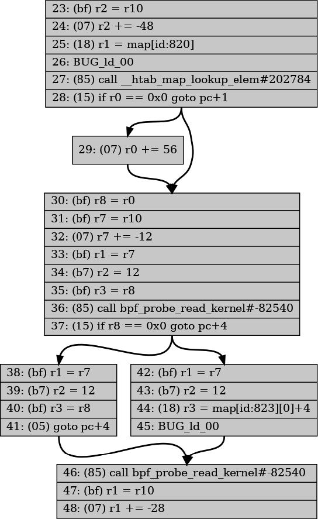

# 1 - 什么是eBPF，为何它如此重要？
eBPF大概可以认为是给内核提供的一段代码，它可以被关联到一个事件上，当这个事件发生时，这段代码就会被执行。eBPF有自己的一套语法，内核会处理好这段代码并验证它的安全性，只有安全的代码才会被接受。这意味着eBPF不会导致机器崩溃或陷入死循环，并且不会允许数据被泄露。

## eBPF的动态加载
eBPF几乎是热插拔的，添加eBPF程序以后无需重启内核就可以生效。

## eBPF程序的高性能
eBPF会被即时编译成本地机器码，并且它直接在内核中运行，不需要用户态和内核态之间的交互，从而获得了非常高的性能。通过eBPF在内核态先处理一些数据，可以避免一些数据被传递到用户态，从而提高性能。

## 云原生环境中的eBPF
云服务器往往采用云原生的方式组织，使用容器、Kubernetes或ECS等编排工具，或者像Lambda、云函数、Fargate等无服务器方法。它们往往自动进行负载均衡，在无服务器环境中，甚至不知道每个工作负载在哪个服务器上运行。

然而使用eBPF可以实现：
- 无需修改应用程序就可以用eBPF监控应用程序
- 无需重启服务器就可以用eBPF观察应用进程

相比之下Sidecar模型把监控工具作为一个容器运行，并向Kubernetes Pod注入它们，这比直接修改应用程序要方便。然而也有一些缺点：
- 添加Sidecar需要重启应用程序Pod
- 需要对应用程序的YAML修改，一般这是自动完成的，不过一旦有问题添加Sidecar就会失败
- 注入Sidecar会显著增加Pod的启动时间，并且可能向程序引入竞争条件或其他不确定问题
- 如果使用Sidecar来实现网络功能，那么流量需要先在内核中绕一圈，然后再到达Sidecar，这会降低性能，如下图


# 2 - eBPF的Hello World

## BCC的Hello World
此程序使用BCC的Python库编写：
```python
#!/usr/bin/python3
from bcc import BPF

# eBPF程序，使用C语言编写，调用辅助函数bpf_trace_printk()打印消息
program = r"""
int hello(void *ctx) {
    bpf_trace_printk("Hello World!");
    return 0;
}
"""

# 创建BPF对象，传入eBPF程序，它会自动编译并加载到内核中
b = BPF(text=program)

# 为了把eBPF附加到系统调用execve()上，先查询该系统调用
syscall = b.get_syscall_fnname("execve")

# 使用内核探针kprobe，把hello程序附加到该事件上
b.attach_kprobe(event=syscall, fn_name="hello")

# 读取内核输出的消息并打印
b.trace_print()
```
实际上 `bpf_trace_printk()` 把输出写入一个伪文件 `/sys/kernel/debug/tracing/trace_pipe` 中，然后程序从中取出输出信息。可以使用 `cat` 查看它的内容，这需要root权限。

## 运行Hello World
eBPF需要特权才能运行，在早期的内核版本上需要root身份或者使用sudo运行。内核5.8版本以后，可以使用 `CAP_BPF` 能力：
- 加载跟踪程序需要：`CAP_PERFMON` 和 `CAP_BPF`
- 加载网络程序需要：`CAP_NET_ADMIN` 和 `CAP_BPF`

运行它可能看到如下的输出：
```shell
$ sudo ./hello.py
b' bash-5412 [001] .... 90432.904952: 0: bpf_trace_printk: Hello World'
```
在这条信息中能够看到，调用 `execve()` 的进程的ID为5412，它正在运行bash，以及打印出来的消息"Hello World"。

使用单一eBPF程序并从 `trace_pipe` 中读取输出是简单的。然而它只能输出字符串并且格式受限，当有多个eBPF程序时更是混乱，相比之下eBPF Map更加灵活。

## BPF Map
Map是一种数据结构，在内核态的eBPF程序和用户态程序都可以访问它，常用于多个eBPF程序以及用户态程序之间进行通信。

它通常有如下用途：
- 用户空间写入配置信息，由eBPF程序读取
- 一个eBPF程序存储状态，供另一个eBPF程序使用
- eBPF程序写入结果或指标，用户空间可以读取

Linux的 `uapi/linux/bpf.h` 文件中定义了各种BPF Map，内核文档中有一些相关信息。它们都是键-值存储，包括哈希表、perf和环形缓冲区以及数组等。

有的Map被定义为数组类型，使用一个4字节索引为键，其他MAP可以使用任意数据类型作为键。

有的Map针对某些操作进行了优化，如队列、栈、LRU存储、最长前缀匹配和Bloom过滤器等。

有的Map用来存储特定类型的信息，如 `sockmap` 和 `devmap` 保存套接字和网络设备的信息，程序数组存储一组eBPF程序的索引便于调用其他的eBPF程序，甚至可以有一个Map存储其他Map。

有的Map具有per-CPU版本，使得每个CPU使用不同的内存来避免数据一致性问题。而对于普通版本，在内核5.1版本以后，提供了自旋锁来进行同步。

### Hash Table Map
看一个使用Map的示例程序，它同样附加到 `execve()` 系统调用上，首先是eBPF程序本身：
```c
// BPF_HASH()是BCC宏，定义了一个哈希表映射（这是一行变量定义语句）
BPF_HASH(counter_table);

int hello(void *ctx) {
   u64 uid;
   u64 counter = 0;
   u64 *p;

   // bpf_get_current_uid_gid()获取触发事件的进程的uid和gid
   // 返回值的低32位为uid，高32位为保存gid
   uid = bpf_get_current_uid_gid() & 0xFFFFFFFF;

   // 在哈希表中查找键为uid的条目，返回一个指向其值的指针，找不到则返回0
   p = counter_table.lookup(&uid);

   // 如果有该条目，把值赋值给counter
   if (p != 0) {
      counter = *p;
   }
   
   // 递增counter
   counter++;

   // 更新哈希表中键为uid的条目的值为counter
   counter_table.update(&uid, &counter);

   return 0;
}
```
比较神奇的是像 `counter_table.lookup(&uid)` 这样的代码，这并不是标准的C语言。BCC会在编译之前对这样的代码进行处理，转换成标准的C语言代码。

然后是Python程序：
```python
b = BPF(text=program)
syscall = b.get_syscall_fnname("execve")
b.attach_kprobe(event=syscall, fn_name="hello")

while True:
    # 每隔两秒执行一次
    sleep(2)

    # 存储结果的字符串
    s = ""

    # 哈希表由BCC创建一个Python对象来维护，可以用名字获取特定的Map
    for k, v in b["counter_table"].items():
        s += s += f"ID {k.value}: {v.value}\t"

    # 打印结果
    print(s)
```
Map的使用非常方便，但是用户空间需要轮询来获取数据。

### Perf和环形缓冲区Map
Linux内核支持了perf子系统，并且eBPF支持perf缓冲区，以及它的后继者BPF环形缓冲区。

在5.8或更高版本的内核中，更推荐使用BPF环形缓冲区，而不是BPF perf缓冲区，在安德烈·纳克里科的[BPF 环形缓冲区博文](https://oreil.ly/ARRyV)介绍了两者的区别。


环形缓冲区并不只用于eBPF，它实际上可以看做逻辑上为环形的一块内存，具有读写两个指针。数据被写入到写指针的位置，并被附上长度信息的头部，然后移动写指针。然后读指针可以通过头部获取信息长度，读取数据并移动读指针。当读指针赶上写指针，表示没有数据可读。当写指针赶上读指针，表示环形缓冲区已满，它不会再写入数据，而是递增丢弃计数器。读取数据时会一并读取丢弃计数器，这样用户空间可以知道有多少数据丢失。

接下来这个Hello World程序会比较复杂，首先是eBPF程序：
```c
// BCC宏BPF_PERF_OUTPUT用于创建一个map，它用来将消息从内核传递到用户空间
BPF_PERF_OUTPUT(output);

// 数据被写入一个结构体，包含pid、uid、当前命令名称、文本消息
struct data_t {
   int pid;
   int uid;
   char command[16];
   char message[12];
};

int hello(void *ctx) {
   // data用来构造要提交的结构体，message保存字符串"Hello World"
   struct data_t data = {};
   char message[12] = "Hello World";

   // bpf_get_current_pid_tgid()获取触发事件线程的pid和tgid（应相同）
   // 高32位为pid，低32位为tgid
   data.pid = bpf_get_current_pid_tgid() >> 32;

   // bpf_get_current_uid_gid()如前所述
   data.uid = bpf_get_current_uid_gid() & 0xFFFFFFFF;

   // bpf_get_current_comm()获取触发事件的进程运行的可执行文件名称
   // 结果被写入提供的缓冲区，需要提供缓冲区大小
   bpf_get_current_comm(&data.command, sizeof(data.command));

   // 本程序中，固定地将消息Hello World写入data结构体的message字段
   bpf_probe_read_kernel(&data.message, sizeof(data.message), message);

   // 结构体准备好，调用perf_submit()将该数据放入map中
   output.perf_submit(ctx, &data, sizeof(data));

   return 0;
}
```
然后可以在Python中读取这个Map：
```python
b = BPF(text=program)
syscall = b.get_syscall_fnname("execve")
b.attach_kprobe(event=syscall, fn_name="hello")

def print_event(cpu, data, size):
    # 同样可以用名字output来获取Map，用event()方法获取数据
    data = b["output"].event(data)
    print(f"{data.pid} {data.uid} {data.command.decode()} {data.message.decode()}")

# 打开perf环形缓冲区，注册收到数据时的回调函数print_event
b["output"].open_perf_buffer(print_event)

# 不断轮询，有数据到达就会触发回调函数
while True:
    b.perf_buffer_poll()
```

### 函数调用
早期的eBPF仅支持调用提供的辅助函数，为了调用其他函数，程序员通常用 `__always_inline` 指示编译器内联展开自己的函数，如：
```c
static __always_inline void my_function(void *ctx, int val)
```
不过在4.16版本的内核和LLVM 6.0开始，eBPF提供了函数调用的支持，名为“BPF to BPF函数调用”或“BPF子程序”，它目前不被BCC支持。

### 尾部调用
尾部调用可以调用其他的eBPF程序，与普通函数调用不同的是，它并不从被调函数中返回，从而不需要为调用函数保存栈帧。实际上eBPF中栈大小限制为512字节，因此这是非常有用的。

尾部调用使用特殊辅助函数实现：
```c
long bpf_tail_call(void *ctx, struct bpf_map *prog_array_map, u32 index);
```
其中， `ctx` 把上下文传递给被调程序； `prog_array_map` 是一个 `BPF_MAP_TYPE_PROG_ARRAY` 类型的Map，保存了一组eBPF程序的描述符； `index` 是要调用的程序的索引。如果它执行成功就不会返回，否则它返回然后程序继续向下执行。

所有要被调用的eBPF需要被加载到内核中，然后存储到Map里面。

看一个示例，主eBPF被附加到系统调用通用入口，它使用尾部调用跟踪某些系统调用操作码的特定消息，如果没有匹配的操作码它就跟踪一个通用的信息。在BCC中，尾部调用可以简化一些：
```c
prog_array_map.call(ctx, index)
```
然后BCC会把它重写为：
```c
bpf_tail_call(ctx, prog_array_map, index)
```

eBPF程序如下：
```c
// BCC宏BPF_PROG_ARRAY定义BPF_MAP_TYPE_PROG_ARRAY类型的Map
// 这里数组名字为syscall，支持最多300条数据
BPF_PROG_ARRAY(syscall, 300);

// 它附加到sys_enter原始跟踪点上，任何系统调用时都会触发它
// 附加到原始跟踪点的程序的上下文以bpf_raw_tracepoint_args的形式传递
int hello(struct bpf_raw_tracepoint_args *ctx) {
    // 对于sys_enter，参数中包括用于标识正在进行的系统调用的操作码
    int opcode = ctx->args[1];

    // 进行尾部调用
    syscall.call(ctx, opcode);

    // 没有对应条目的情况，打印通用调试信息
    bpf_trace_printk("Another syscall: %d", opcode);

    return 0;
}

// 被尾部调用的程序。当操作码指示为execve()时，它被执行，生成一行跟踪信息
int hello_exec(void *ctx) {
    bpf_trace_printk("Executing a program");
    return 0;
}


// 多个opcode会调用这个程序，它在内部根据opcode打印不同的消息
int hello_timer(struct bpf_raw_tracepoint_args *ctx) {
    int opcode = ctx->args[1];
    switch (opcode) {
        case 222:
            bpf_trace_printk("Creating a timer");
            break;
        case 226:
            bpf_trace_printk("Deleting a timer");
            break;
        default:
            bpf_trace_printk("Some other timer operation");
            break;
    }
    return 0;
}

// 什么都不做，不打印跟踪信息的系统调用会调用这个程序
int ignore_opcode(void *ctx) {
    return 0;
}
```

接下来是Python程序：
```python
b = BPF(text=program)

# 不附加到kprobe，而是附加到sys_enter原始跟踪点上
b.attach_raw_tracepoint(tp="sys_enter", fn_name="hello")

# 加载尾部调用程序并返回一个文件描述符
# 尾部调用程序需要与父程序有相同的类型，这里为BPF.RAW_TRACEPOINT
ignore_fn = b.load_func("ignore_opcode", BPF.RAW_TRACEPOINT)
exec_fn = b.load_func("hello_exec", BPF.RAW_TRACEPOINT)
timer_fn = b.load_func("hello_timer", BPF.RAW_TRACEPOINT)

# 在map中创建条目，如果opcode没有对应条目，尾部调用不会被实际执行
prog_array = b.get_table("syscall")
prog_array[ct.c_int(59)] = ct.c_int(exec_fn.fd)
prog_array[ct.c_int(222)] = ct.c_int(timer_fn.fd)
prog_array[ct.c_int(223)] = ct.c_int(timer_fn.fd)
prog_array[ct.c_int(224)] = ct.c_int(timer_fn.fd)
prog_array[ct.c_int(225)] = ct.c_int(timer_fn.fd)
prog_array[ct.c_int(226)] = ct.c_int(timer_fn.fd)

# 一些频繁执行并且没有必要跟踪的系统调用
prog_array[ct.c_int(21)] = ct.c_int(ignore_fn.fd)
prog_array[ct.c_int(22)] = ct.c_int(ignore_fn.fd)
prog_array[ct.c_int(25)] = ct.c_int(ignore_fn.fd)
prog_array[ct.c_int(29)] = ct.c_int(ignore_fn.fd)
prog_array[ct.c_int(56)] = ct.c_int(ignore_fn.fd)
prog_array[ct.c_int(57)] = ct.c_int(ignore_fn.fd)
prog_array[ct.c_int(63)] = ct.c_int(ignore_fn.fd)
prog_array[ct.c_int(64)] = ct.c_int(ignore_fn.fd)
prog_array[ct.c_int(66)] = ct.c_int(ignore_fn.fd)
prog_array[ct.c_int(72)] = ct.c_int(ignore_fn.fd)
prog_array[ct.c_int(73)] = ct.c_int(ignore_fn.fd)
prog_array[ct.c_int(79)] = ct.c_int(ignore_fn.fd)
prog_array[ct.c_int(98)] = ct.c_int(ignore_fn.fd)
prog_array[ct.c_int(101)] = ct.c_int(ignore_fn.fd)
prog_array[ct.c_int(115)] = ct.c_int(ignore_fn.fd)
prog_array[ct.c_int(131)] = ct.c_int(ignore_fn.fd)
prog_array[ct.c_int(134)] = ct.c_int(ignore_fn.fd)
prog_array[ct.c_int(135)] = ct.c_int(ignore_fn.fd)
prog_array[ct.c_int(139)] = ct.c_int(ignore_fn.fd)
prog_array[ct.c_int(172)] = ct.c_int(ignore_fn.fd)
prog_array[ct.c_int(233)] = ct.c_int(ignore_fn.fd)
prog_array[ct.c_int(280)] = ct.c_int(ignore_fn.fd)
prog_array[ct.c_int(291)] = ct.c_int(ignore_fn.fd)

# 将跟踪输出打印到屏幕，直到用户终止程序。
b.trace_print()
```

从内核4.2版本开始，eBPF开始支持尾调用。很长一段时间中，尾部调用和BPF子程序并不兼容，不过在内核5.10版本解决了这个问题。（从BPF子程序进行尾调用需要JIT编译器支持）

尾部调用最多可以链式组合到33次，每个eBPF程序可以复杂到100万条指令，从而eBPF可以完成非常复杂的功能。

<br><br>

# 3 - eBPF程序剖析
eBPF程序从C语言被编译为eBPF字节码，然后被内核JIT编译为本地机器码。从概念上讲，eBPF字节码在内核的eBPF虚拟机中运行。

## eBPF虚拟机
eBPF虚拟机接收eBPF字节码，把它转换为CPU上运行的本机机器指令。早期的eBPF字节码在内核中解释执行，每次运行内核都检查指令并转换为机器码再执行。处于性能考虑以及避免eBPF解释器的Spectre漏洞，解释执行已经由JIT编译取代，从而字节码只需在加载时被编译一次。

eBPF字节码由一组指令组成，它们作用于eBPF虚拟寄存器。指令集和寄存器模型的设计准则是尽可能匹配常见的CPU架构。

### eBPF寄存器
有10个通用寄存器，编号为0-9，还有一个寄存器10用于栈指针（只能读取），它们都是软件模拟的，Linux内核头文件 `include/uapi/linux/bpf.h` 用枚举定义了从 `BPF_REG_0` 到 `BPF_REG_10` 来表示它们。eBPF开始执行前，上下文参数被放入寄存器1，寄存器0用于函数返回值。如果eBPF程序调用其他eBPF程序，寄存器1-5被用于传递参数。

### eBPF指令
`linux/bpf.h` 还定义了一个名为结构体来表示一条eBPF指令：
```c
struct bpf_insn {
    // 操作码表示要执行的操作，实际上具体行为可能还取决于其他字段，如imm有时可以指定算术运算类型（ADD、AND）
	__u8	code;		/* opcode */
    // 不同的操作可能涉及最多两个寄存器。
	__u8	dst_reg:4;	/* dest register */
	__u8	src_reg:4;	/* source register */
    // 根据操作的不同，可能会有一个偏移值和/或一个“立即数”整数值。
	__s16	off;		/* signed offset */
	__s32	imm;		/* signed immediate constant */
};
```
整个结构体的长度为8字节，有时候一条指令可能塞不进8字节，那么可能需要16字节的宽指令编码。加载到内核中时，eBPF程序的字节码由一个个 `bpf_insn` 结构体表示，验证器检查它们的安全性。

操作有如下几类：
- 加载值到寄存器
- 把寄存器的值存到内存
- 算术运算
- 跳转指令

## 用于网络接口的eBPF "Hello World"
接下来看一个例子，它在网络数据报到达时打印一行消息。

eBPF程序如下：
```c
#include <linux/bpf.h>
#include <bpf/bpf_helpers.h>

// eBPF程序可以使用全局变量
int counter = 0;

// 宏SEC()定义了一个名为xdp的section，目前可以简单地认为它定义了一个XDP类型的eBPF程序
SEC("xdp")

// 使用bpf_printk来输出文本、递增counter、然后返回值XDP_PASS（通知内核正常处理这个网络数据包）
int hello(struct xdp_md *ctx) {
    bpf_printk("Hello World %d", counter);
    counter++;
    return XDP_PASS;
}

// 使用SEC()宏定义许可证，一些辅助函数要求GPL许可证，否则程序会被拒绝
char LICENSE[] SEC("license") = "Dual BSD/GPL";
```
这里使用了 `bpf_printk()` 而不是上一章中的 `bpf_trace_printk()` 。实际上BCC的版本为 `bpf_trace_printk()` ，libbpf的版本为 `bpf_printk()` ，它们都是对内核函数 `bpf_trace_printk()` 的封装。

p.s.有些网络适配器支持把XDP程序下载到其中，从而让网络数据包的处理甚至不需要经过CPU

## 编译eBPF目标文件
上面的eBPF程序需要编译成eBPF字节码，这可以通过LLVM的Clang编译器来完成，要求编译的时候指定选项 `-target bpf` 。如这个Makefile：
```makefile
hello.bpf.o: %.o: %.c
	clang \
	    -target bpf \
		-I/usr/include/$(shell uname -m)-linux-gnu \
		-g \
	    -O2 -c $< -o $@
```
这里 `-g` 是可选地，用于生成调试信息。

## 检查eBPF目标文件
检查文件的内容：
```shell
$ file hello.bpf.o
hello.bpf.o: ELF 64-bit LSB relocatable, eBPF, version 1 (SYSV), with debug_info, not stripped
```
说明它是一个ELF文件，包含eBPF代码，适用于具有LSB架构的64位平台，具有调试信息。

进一步地可以查看具体的eBPF指令：
```shell
$ llvm-objdump -S hello.bpf.o
```
可以看到：
```shell
# 表示hello.bpf.o是一个带有eBPF代码的64位ELF文件
hello.bpf.o:    file format elf64-bpf

# xdp section的反汇编，C代码中通过SEC("xdp")定义了这个节
Disassembly of section xdp:

# section是一个名为hello的函数
0000000000000000 <hello>:
;     bpf_printk("Hello World %d", counter);
       0:       18 06 00 00 00 00 00 00 00 00 00 00 00 00 00 00 r6 = 0 ll
       2:       61 63 00 00 00 00 00 00 r3 = *(u32 *)(r6 + 0)
       3:       18 01 00 00 00 00 00 00 00 00 00 00 00 00 00 00 r1 = 0 ll
       5:       b7 02 00 00 0f 00 00 00 r2 = 15
       6:       85 00 00 00 06 00 00 00 call 6
;     counter++;
       7:       61 61 00 00 00 00 00 00 r1 = *(u32 *)(r6 + 0)
       8:       07 01 00 00 01 00 00 00 r1 += 1
       9:       63 16 00 00 00 00 00 00 *(u32 *)(r6 + 0) = r1
;     return XDP_PASS;
      10:       b7 00 00 00 02 00 00 00 r0 = 2
      11:       95 00 00 00 00 00 00 00 exit
```
最前面的数字表示指令的偏移量，以8字节为单位。值得注意的是，第一条指令是宽指令，占用了16字节，因此第二条指令的偏移量是2。每行的第一个字节是操作码，lovisor项目提供了很完整的[eBPF操作码文档](https://github.com/iovisor/bpf-docs/blob/master/eBPF.md)。

## 将程序加载到内核中
使用bpftool来加载和管理eBPF程序：
```shell
$ bpftool prog load hello.bpf.o /sys/fs/bpf/hello
```
它从目标文件中加载eBPF程序，然后把它固定到 `/sys/fs/bpf/hello` 上（对于eBPF程序这是可选的，可以直接把它加载到内核中，而对于bpftool来说这是必须的）。如果命令没有任何输出就表示成功，此时可以看到这个文件：
```shell
$ ls /sys/fs/bpf/
hello
```

## 检查加载的程序
使用bpftool可以列出加载到内核的所有程序：
```shell
$ bpftool prog list
...
540: xdp name hello tag d35b94b4c0c10efb gpl
    loaded_at 2022-08-02T17:39:47+0000 uid 0
    xlated 96B jited 148B memlock 4096B map_ids 165,166
    btf_id 254
```
程序被分配了ID 540，每个程序在加载时都会有一个ID，通过ID可以查询更多信息（指定 `--pretty` 以JSON格式输出）：
```shell
$ bpftool prog show id 540 --pretty
{
    "id": 540,
    "type": "xdp",
    "name": "hello",
    "tag": "d35b94b4c0c10efb",
    "gpl_compatible": true,
    "loaded_at": 1659461987,
    "uid": 0,
    "bytes_xlated": 96,
    "jited": true,
    "bytes_jited": 148,
    "bytes_memlock": 4096,
    "map_ids": [165,166
    ],
    "btf_id": 254
}
```
以上的信息含义分别为：
- ID是540
- 程序可以通过XDP事件附加到网络接口上
- 名字是hello
- 程序有另一个标识符tag
- 使用GPL许可证
- 程序加载的时间
- 加载该程序的用户的uid
- 编译后的程序大小为96字节
- 程序已经被JIT编译
- JIT编译的程序大小为148字节
- 保留了4096字节的内存，不会被分页
- 使用了ID为165和166的Map
- 有一个BTF信息块，只有使用 `-g` 选项编译时才会有

### BPF程序标签（tag）
每个程序会有一个SHA哈希值作为标识符，ID每次加载都会变化，而tag不会。bpftool可以通过不同的方式引用一个程序，如以下方式是同样的操作：
- `bpftool prog show id 540`
- `bpftool prog show tag d35b94b4c0c10efb`
- `bpftool prog show name hello`
- `bpftool prog show pinned /sys/fs/bpf/hello`

不同程序的tag和名字可能重复，但ID和固定路径不会。

### 翻译后的字节码
`bytes_xlated` 表示eBPF程序翻译后的字节码大小，它已经通过了验证器（可能经过了内核更改）。可以查看程序的翻译版本：
```shell
$ bpftool prog dump xlated name hello
int hello(struct xdp_md * ctx):
; bpf_printk("Hello World %d", counter);
    0: (18) r6 = map[id:165][0]+0
    2: (61) r3 = *(u32 *)(r6 +0)
    3: (18) r1 = map[id:166][0]+0
    5: (b7) r2 = 15
    6: (85) call bpf_trace_printk#-78032
; counter++;
    7: (61) r1 = *(u32 *)(r6 +0)
    8: (07) r1 += 1
    9: (63) *(u32 *)(r6 +0) = r1
; return XDP_PASS;
    10: (b7) r0 = 2
    11: (95) exit
```

### JIT编译的机器代码
为了取得更高的性能，通常对eBPF程序进行即时编译。实际上由于eBPF指令集设计和机器指令设计比较接近，运行时解释也是可行的，但会稍微慢一些。启用JIT需要在内核中启用 `CONFIG_BPF_JIT` 选项，然后可以通过 `net.core.bpf_jit_enable sysctl` 在运行中开启或关闭。

同样可以查看JIT编译后的机器代码：
```shell
$ bpftool prog dump jited name hello
int hello(struct xdp_md * ctx):
bpf_prog_d35b94b4c0c10efb_hello:
; bpf_printk("Hello World %d", counter);
    0: hint #34
    4: stp x29, x30, [sp, #-16]!
    8: mov x29, sp
    c: stp x19, x20, [sp, #-16]!
    10: stp x21, x22, [sp, #-16]!
    14: stp x25, x26, [sp, #-16]!
    18: mov x25, sp
    1c: mov x26, #0
    20: hint #36
    24: sub sp, sp, #0
    28: mov x19, #-140733193388033
    2c: movk x19, #2190, lsl #16
    30: movk x19, #49152
    34: mov x10, #0
    38: ldr w2, [x19, x10]
    3c: mov x0, #-205419695833089
    40: movk x0, #709, lsl #16
    44: movk x0, #5904
    48: mov x1, #15
    4c: mov x10, #-6992
    50: movk x10, #29844, lsl #16
    54: movk x10, #56832, lsl #32
    58: blr x10
    5c: add x7, x0, #0
; counter++;
    60: mov x10, #0
    64: ldr w0, [x19, x10]
    68: add x0, x0, #1
    6c: mov x10, #0
    70: str w0, [x19, x10]
; return XDP_PASS;
    74: mov x7, #2
    78: mov sp, sp
    7c: ldp x25, x26, [sp], #16
    80: ldp x21, x22, [sp], #16
    84: ldp x19, x20, [sp], #16
    88: ldp x29, x30, [sp], #16
    8c: add x0, x7, #0
    90: ret
```

## 附加到事件
程序的类型需要和附加的事件类型匹配，它是一个XDP程序，可以附加到网络接口上的XDP事件上：
```shell
$ bpftool net attach xdp id 540 dev eth0
```
这里使用id来标识程序，并把它附加到网络接口 `eth0` 。可以查看所有附加到网络接口上的eBPF程序：
```shell
$ bpftool net list
xdp:
eth0(2) driver id 540

tc:

flow_dissector:
```
使用 `ip link` 检查网络接口的时候也可以看到这个eBPF程序，大致如下：
```shell
1: lo: <LOOPBACK,UP,LOWER_UP> mtu 65536 qdisc noqueue state UNKNOWN mode DEFAULT
group default qlen 1000
    ...
2: eth0: <BROADCAST,MULTICAST,UP,LOWER_UP> mtu 1500 xdp qdisc fq_codel state UP
mode DEFAULT group default qlen 1000
    ...
    prog/xdp id 540 tag 9d0e949f89f1a82c jited
    ...
```
每次收到网络数据包，这个程序会向跟踪管道写入信息，可以用 `cat` 或 `bpftool prog tracelog` 来查看：
```shell
$ cat /sys/kernel/debug/tracing/trace_pipe
<idle>-0    [003] d.s.. 655370.944105: bpf_trace_printk: Hello World 4531
<idle>-0    [003] d.s.. 655370.944587: bpf_trace_printk: Hello World 4532
<idle>-0    [003] d.s.. 655370.944896: bpf_trace_printk: Hello World 4533
```
和第2章中的输出相比，它没有触发时间的命令名和进程ID，而是在最开头有一个 `<idle>-0` ，这是因为事件由网络数据包到达触发，没有特定进程参与。

## 全局变量
该程序还持续递增一个名为 `counter` 的全局变量，这样的特性通过eBPF Map来实现。一个Map可以被eBPF程序或用户空间访问，同一个程序多次运行可以重复访问它，从而实现全局变量的功能。（在2019年前，eBPF没有提供全局变量的支持，必须显式使用Map来实现）

前文中程序使用到ID为165和166的Map，Map的ID是它在内核中创建时分配的，每次都可能有所不同。使用bpftool可以查看加载到内核中的Map：
```shell
$ bpftool map list
165: array name hello.bss   flags 0x400
    key 4B value 4B max_entries 1 memlock 4096B
    btf_id 254
166: array name hello.rodata flags 0x80
    key 4B value 15B max_entries 1 memlock 4096B
    btf_id 254 frozen
```
可以看到两个Map分别对应的是 `hello` 的 `bss` 段和 `rodata` 段。检查 `bss` 段可以找到 `counter` 的信息：
```shell
$ bpftool map dump name hello.bss
[{
        "value": {
            ".bss": [{
                    "counter": 11127
                }
            ]
        }
    }
]
```
也可以通过 `bpftool map show id 165` 来查看。这里的信息之所以如此清晰，是因为采用了 `-g` 选项编译并生成了BTF信息，否则看到的信息可能如下：
```shell
$ bpftool map dump name hello.bss
key: 00 00 00 00 value: 19 01 00 00
Found 1 element
```
字符串"Hello World %d"被放在 `rodata` 段：
```shell
$ bpftool map dump name hello.rodata
[{
        "value": {
            ".rodata": [{
                "hello.____fmt": "Hello World %d"
                }
            ]
        }
    }
]
```
如果没指定 `-g` 选项，那么看到的是：
```shell
$ bpftool map dump id 166
key: 00 00 00 00    value: 48 65 6c 6c 6f 20 57 6f  72 6c 64 20 25 64 00
Found 1 element
```

## 分离程序
可以解除该程序和网络接口的绑定：
```shell
$ bpftool net detach xdp dev eth0
```
如果命令执行成功就不会有任何输出，后面查看XDP程序列表时就不会有这个程序了：
```shell
$ bpftool net list
xdp:

tc:

flow_dissector:
```
不过这个程序仍在内核中保持被加载的状态：
```shell
$ bpftool prog show name hello
395: xdp name hello tag 9d0e949f89f1a82c gpl
    loaded_at 2022-12-19T18:20:32+0000 uid 0
    xlated 48B jited 108B memlock 4096B map_ids 4
```

## 卸载程序
实际上并没有和 `bpftool prog load` 相对应的卸载操作（写书时），但可以通过移除固定文件来卸载程序：
```shell
$ rm /sys/fs/bpf/hello
$ bpftool prog show name hello
# 没有任何输出
```

## BPF到BPF调用
考虑一个非常简单的被调函数，它附加到 `sys_enter` 原始跟踪点，并且跟踪系统调用的操作码：
```c
static __attribute((noinline)) int get_opcode(struct bpf_raw_tracepoint_args *ctx) {
    return ctx->args[1];
}
```
为了避免编译器内联展开它使得调用被绕过，使用 `__attribute((noinline))` 。主eBPF程序如下：
```c
SEC("raw_tp")
int hello(struct bpf_raw_tracepoint_args *ctx) {
    int opcode = get_opcode(ctx);
    bpf_printk("Syscall: %d", opcode);
    return 0;
}
```
把它编译以后并加载到内核中：
```shell
$ bpftool prog load hello-func.bpf.o /sys/fs/bpf/hello
$ bpftool prog list name hello
893: raw_tracepoint name hello tag 3d9eb0c23d4ab186 gpl
    loaded_at 2023-01-05T18:57:31+0000 uid 0
    xlated 80B  jited 208B   memlock 4096B   map_ids 204
    btf_id 302
```
接下来检查整个程序的字节码是怎样的：
```shell
$ bpftool prog dump xlated name hello
int hello(struct bpf_raw_tracepoint_args * ctx):
# hello程序调用get_opcode。指令码为0x85，对应于函数调用。向前跳转7个指令（pc+7）然后继续执行。
; int opcode = get_opcode(ctx);
    0: (85) call pc+7#bpf_prog_cbacc90865b1b9a5_get_opcode
; bpf_printk("Syscall: %d", opcode);
    1: (18) r1 = map[id:193][0]+0
    3: (b7) r2 = 12
    4: (bf) r3 = r0
    5: (85) call bpf_trace_printk#-73584
; return 0;
    6: (b7) r0 = 0
    7: (95) exit
# get_opcode的字节码第一条指令位于偏移量8处，刚好是跳转到的位置
int get_opcode(struct bpf_raw_tracepoint_args * ctx):
; return ctx->args[1];
    8: (79) r0 = *(u64 *)(r1 +8)
; return ctx->args[1];
    9: (95) exit
```
函数调用指令会把当前状态压入栈中，栈最多512字节，从而函数调用的层数不能很多。

<br><br>

# 4 - bpf()系统调用
用户空间应用程序可以使用 `bpf()` 系统调用来加载eBPF程序到内核中，它还可以用来操作eBPF程序和Map。eBPF本身并不需要通过系统调用来访问Map，实际上它使用辅助函数。一般来说应用程序不会直接使用 `bpf()` 系统调用，而是使用一些封装库，不过底层上还是使用 `bpf()` 系统调用。它的原型如下：
```c
int bpf(int cmd, union bpf_attr *attr, unsigned int size);
```
参数 `cmd` 指定要执行的命令，包括加载eBPF程序、创建Map、把程序附加到事件、访问Map中的键值对。`attr` 用于传递命令需要的任何参数，`size` 指示 `attr` 的字节数。

看一个 BCC 程序的例子，它监控系统调用 `execve()` ，每次向 perf 缓冲区发送一条信息，实际上非常类似[第 2 章的版本](#perf和环形缓冲区map)。eBPF 代码：
```c
// 用于保存 12 个字符的消息
struct user_msg_t {
   char message[12];
};

// 宏 BPF_HASH 定义一个名为 config 的 Map，键类型为 u32，值类型为 user_msg_t
// 如果不指定键和值的类型，则 BCC 默认为 u64
BPF_HASH(config, u32, struct user_msg_t);

// 定义 perf 缓冲区，可以向缓冲区提交任意数据，因此无需指定任何数据类型
BPF_PERF_OUTPUT(output);

// 实际上，在这个示例中，程序总是提交一个 data_t 结构
struct data_t {
   int pid;
   int uid;
   char command[16];
   char message[12];
};

// 其余部分与第二章的 hello() 几乎没有变化
int hello(void *ctx) {
   struct data_t data = {};
   struct user_msg_t *p;
   char message[12] = "Hello World";

   data.pid = bpf_get_current_pid_tgid() >> 32;
   data.uid = bpf_get_current_uid_gid() & 0xFFFFFFFF;

   bpf_get_current_comm(&data.command, sizeof(data.command));
   // 唯一的区别如果是哈希表中存在与 uid 匹配的条目，则输出值存储的消息，而不是默认的“Hello World”
   p = config.lookup(&data.uid);
   if (p != 0) {
      bpf_probe_read_kernel(&data.message, sizeof(data.message), p->message);
   } else {
      bpf_probe_read_kernel(&data.message, sizeof(data.message), message);
   }

   output.perf_submit(ctx, &data, sizeof(data));

   return 0;
}
```
Python 代码也类似第 2 章中的代码，不过增加了两行提前定义了特定用户需要返回的信息：
```python
# 使用 Python 的 ctype 包来保证值和 C 中的 int 类型是一致的
b["config"][ct.c_int(0)] = ct.create_string_buffer(b"Hey root!")
b["config"][ct.c_int(501)] = ct.create_string_buffer(b"Hi user 501!")
```
用 `strace` 跟踪这个程序，可以找到关于 `bpf()` 的部分：
```shell
$ strace -e bpf ./hello-buffer-config.py
...
bpf(BPF_BTF_LOAD, ...) = 3
bpf(BPF_MAP_CREATE, {map_type=BPF_MAP_TYPE_PERF_EVENT_ARRAY...) = 4
bpf(BPF_MAP_CREATE, {map_type=BPF_MAP_TYPE_HASH...) = 5
bpf(BPF_PROG_LOAD, {prog_type=BPF_PROG_TYPE_KPROBE,...prog_name="hello",...) = 6
bpf(BPF_MAP_UPDATE_ELEM, ...}
...
```

## 加载BTF数据
首先观察第一个`bpf` 调用：
```shell
bpf(BPF_BTF_LOAD, {btf="\237\353\1\0...}, 128) = 3
```
它进行的操作是 `BPF_BTF_LOAD`，如果在老版本内核中可能看不到这条调用（BTF 是在 5.1 内核的上游引入的，但有些发行版把它移植到了更早的版本），BTF 允许 eBPF 程序在不同的内核版本间移植，例如在一台机器上编译程序并在另一台使用不同内核版本、具有不同内核数据结构的机器上使用它。这行语句把 BTF 数据块加载到内核中，然后它返回一个对应于该数据的文件描述符。

## 创建Map
首先是 `output` 的创建：
```shell
bpf(BPF_MAP_CREATE, {map_type=BPF_MAP_TYPE_PERF_EVENT_ARRAY, , key_size=4,
value_size=4, max_entries=4, ... map_name="output", ...}, 128) = 4
```
它执行的操作为 `BPF_MAP_CREATE`，即创建一个 Map，它的类型是 `BPF_MAP_TYPE_PERF_EVENT_ARRAY`，键和值大小都是 4 字节，最大条目数是 4，它的名字是 `output` 。

然后是 `config` 的创建：
```shell
bpf(BPF_MAP_CREATE, {map_type=BPF_MAP_TYPE_HASH, key_size=4, value_size=12,
max_entries=10240... map_name="config", ...btf_fd=3,...}, 128) = 5
```
这个 Map 的类型是 `BPF_MAP_TYPE_HASH`，键大小是 4 字节，值大小是 12 字节。没有指定这个表的大小，BCC 默认最多可以有 10240 个条目，名字是 `config` 。返回的文件描述符是 5。比上一个 Map 多了一个 `btf_fd` 字段，它通知内核 BTF 数据的文件描述符，bpftool 等工具借助它可以漂亮地打印 Map 转储信息。

## 加载程序
接下来是加载程序：
```shell
bpf(BPF_PROG_LOAD, {prog_type=BPF_PROG_TYPE_KPROBE, insn_cnt=44,
insns=0xffffa836abe8, license="GPL", ... prog_name="hello", ...
expected_attach_type=BPF_CGROUP_INET_INGRESS, prog_btf_fd=3,...}, 128) = 6
```
第二个参数中字段比较多：
- prog_type：程序类型，这里是 `BPF_PROG_TYPE_KPROBE`，表示它要附加到 kprobe 上
- insn_cnt：指令计数，字节码中指令的数量
- insns：保存指令的内存地址
- license：许可证，这里是 `GPL`
- prog_name：程序名字，这里是 `hello`
- expected_attach_type：预期的附加类型，这里是 `BPF_CGROUP_INET_INGRESS`，这看起来好像跟网络设备有关，然而它应该被附加到 kprobe 上。实际上这个字段值用于部分程序类型，`BPF_PROG_TYPE_KPROBE` 正好不使用它，所以设置成 0，碰巧 `BPF_CGROUP_INET_INGRESS` 是该常量列表的第一个且拥有值 0。
- prog_btf_fd：BTF 数据的文件描述符，这里是 3

如果程序没能通过验证，返回一个负数。这里它返回文件描述符 6。

## 从用户空间修改Map
前面在 Python 代码中用两行代码修改了 `config` Map，这也是通过 `bpf()` 系统调用来完成的：
```shell
bpf(BPF_MAP_UPDATE_ELEM, {map_fd=5, key=0xffffa7842490, value=0xffffa7a2b410, flags=BPF_ANY}, 128) = 0
```
这行代码执行的操作是 `BPF_MAP_UPDATE_ELEM`，即更新 Map 中的值。`BPF_ANY` 标志表示如果 Map 中还不存在这个键，就插入这个键值对。`map_fd` 是 Map 的文件描述符，`key` 是键，`value` 是值。值得注意的是，文件描述符是进程本地的，同一个文件描述符在不同进程中可能指向不同的对象。

这里键和值都是指针，无法直观看出来具体内容，这时候可以使用 `bpftool`：
```shell
$ bpftool map dump name config
[{
         "key": 0,
         "value": {
             "message": "Hey root!"
         }
     },{
         "key": 501,
         "value": {
             "message": "Hi user 501!"
         }
     }
]
```

## BPF程序和map引用
当退出程序的时候，会发现 eBPF 程序和 map 都被卸载，实际上内核用打开的文件描述的引用计数来维护它们。如果把程序固定到某个文件上，会形成一个额外的引用。

### 固定
```shell
bpftool prog load hello.bpf.o /sys/fs/bpf/hello
```
如果不提供固定功能，那么bpftool在加载程序以后就退出，此时引用计数为 0，操作系统卸载 eBPF 程序，这是没有任何意义的。

当 eBPF 程序附加到某个事件上时，内核也会增加程序的引用计数，如加载 XDP 程序：
```shell
ip link set dev eth0 xdp obj hello.bpf.o sec xdp
```
此时已经没有用户空间应用程序引用这个程序了，此时查看内核中加载的程序：
```shell
$ bpftool prog list
…
1255: xdp name hello tag 9d0e949f89f1a82c gpl
        loaded_at 2022-11-01T19:21:14+0000 uid 0
        xlated 48B jited 108B memlock 4096B map_ids 612
```
可以看到这个程序并没有被卸载。

相似的，map 也有引用计数器，如果引用计数下降为 0 也会被卸载。可以通过 `bpf(BPF_PROG_BIND_MAP)` 把 map 和程序绑定在一起，这样程序退出时 map 也不会被卸载。map 也可以固定到文件系统，用户可以通过 map的路径来访问它。

### BPF 链接
这是创建 BPF 程序引用的另一种方法。它在和它所附加的事件之间提供了一个抽象层，BPF 链接本身可以固定到文件系统，这会增加程序的引用计数。

## eBPF涉及的其他系统调用

### 初始化perf缓冲区
对于 perf 缓冲区，可以看到如下的系统调用：
```shell
bpf(BPF_MAP_UPDATE_ELEM, {map_fd=4, key=0xffffa7842490, value=0xffffa7a2b410, flags=BPF_ANY}, 128) = 0
```
这和上面对于 `config` 的更新很像，不过这里的文件描述符 4 是 `output` 的文件描述符。这样的系统调用执行了 4 次，此后再也没有 `bpf()` 系统调用，则用户空间获取数据显然不是通过 `bpf()` 系统调用来完成的。为了了解背后的操作，需要让 `strace` 跟踪更多的系统调用：
```shell
$ strace -e bpf,perf_event_open,ioctl,ppoll ./hello-buffer-config.py
```

### 附加到Kprobe事件
为了附加 eBPF程序到某个事件上，需要获得指定该事件的文件描述符，`execve() kprobe` 的文件描述符创建如下：
```shell
perf_event_open({type=0x6 /* PERF_TYPE_??? */, ...},...) = 7
```
根据 [perf_event_open() 系统调用的手册页](https://man7.org/linux/man-pages/man2/perf_event_open.2.html)，它“创建一个允许测量性能信息的文件描述符”。`strace` 不知道如何解读 6,实际上它描述了 Linux 如何支持性能测量单元的动态类型。在 /sys/bus/event_source/devices 下，每个 PMU 实例都有一个子目录，每个子目录下都有一个 type 文件，其内容为可用于 type 字段的整数。如：
```shell
$ cat /sys/bus/event_source/devices/kprobe/type
6
```
因此这里的 `type=0x6` 表示 kprobe 类型的 perf 事件。

该调用返回代表 kprobe 的 perf 事件文件描述符 7，接下来需要通过 `ioctl()` 系统调用来附加 eBPF 程序到这个事件上：
```shell
# 绑定事件
ioctl(7, PERF_EVENT_IOC_SET_BPF, 6) = 0

# 开启事件
ioctl(7, PERF_EVENT_IOC_ENABLE, 0) = 0
```
然后每当 `execve()` 执行的时候，eBPF 程序就会被触发。

### 设置和读取 perf 事件
上面提到 `bpf(BPF_MAP_UPDATE_ELEM)` 执行了 4 次，实际上还有其他的系统调用参与：
```shell
perf_event_open({type=PERF_TYPE_SOFTWARE, size=0 /* PERF_ATTR_SIZE_??? */,
config=PERF_COUNT_SW_BPF_OUTPUT, ...}, -1, X, -1, PERF_FLAG_FD_CLOEXEC) = Y
ioctl(Y, PERF_EVENT_IOC_ENABLE, 0) = 0
bpf(BPF_MAP_UPDATE_ELEM, {map_fd=4, key=0xffffa7842490, value=0xffffa7a2b410, flags=BPF_ANY}, 128) = 0
```
其中 `X` 在四次调用中分别是 0、1、2 和 3，这是因为作者的电脑有 4 个 CPU 核心，因此 output perf 缓冲区也有 4 个条目，实际上是每个 CPU 核心有一个条目。这也就是为什么创建 perf 缓冲区的时候指定的类型为 `BPF_MAP_TYPE_PERF_EVENT_ARRAY`，因为每个 CPU 核心都有一个 perf 缓冲区，它们一起形成的数组。

每个缓冲区打开时都返回一个文件描述符，即上面的 `Y` ，这里分别是 8、9、10 和 11。然后 `ioctl()` 用于启用 perf 输出。最后 `bpf()` 系统调用把缓冲区加入数组中。

用户空间代码会在 4 个描述符上调用 `ppoll()` 来检查是否有数据到达：
```shell
ppoll([{fd=8, events=POLLIN}, {fd=9, events=POLLIN}, {fd=10, events=POLLIN},
{fd=11, events=POLLIN}], 4, NULL, NULL, 0) = 1 ([{fd=8, revents=POLLIN}])
```
这个调用会阻塞直至数据到达。

## 环形缓冲区
在内核版本 5.8 以后，使用 BPF 环形缓冲区比使用 perf 缓冲区更好，一方面是性能原因，另一方面它可以保留数据的提交顺序，即使数据来自不同的 CPU 核心。它只有一个缓冲区，所有核心共享。

使用环形缓冲区的版本和 perf 缓冲区的版本非常相似，它们的区别为：
| hello-buffer-config.py                        | hello-ring-buffer-config.py                    |
| --------------------------------------------- | ---------------------------------------------- |
| BPF_PERF_OUTPUT(output);                      | BPF_RINGBUF_OUTPUT(output, 1);                 |
| output.perf_submit(ctx, &data, sizeof(data)); | output.ringbuf_output(&data, sizeof(data), 0); |
| b["output"].open_perf_buffer(print_event)     | b["output"].open_ring_buffer(print_event)      |
| b.perf_buffer_poll()                          | b.ring_buffer_poll()                           |

创建环形缓冲区的系统调用如下：
```shell
bpf(BPF_MAP_CREATE, {map_type=BPF_MAP_TYPE_RINGBUF, key_size=0, value_size=0,
max_entries=4096, ... map_name="output", ...}, 128) = 4
```
而等待数据到达则使用了较新的 `epoll`：
```shell
# 创建 epoll 文件描述符
epoll_create1(EPOLL_CLOEXEC) = 8

# 添加环形缓冲区文件描述符到 epoll
epoll_ctl(8, EPOLL_CTL_ADD, 4, {events=EPOLLIN, data={u32=0, u64=0}}) = 0

# 等待数据到达
epoll_pwait(8, [{events=EPOLLIN, data={u32=0, u64=0}}], 1, -1, NULL, 8) = 1
```

## 从map中读取数据
查看这个过程使用的系统调用：
```shell
$ strace -e bpf bpftool map dump name config
```
可以发现，有两个步骤：
1. 遍历所有 map，查找名为 `config` 的 map
1. 如果找到了，就遍历其中所有元素

### 找到map
```shell
# BPF_MAP_GET_NEXT_ID 获取 start_id 中指定值之后的下一个 map 的 ID。
bpf(BPF_MAP_GET_NEXT_ID, {start_id=0,...}, 12) = 0

# BPF_MAP_GET_FD_BY_ID 返回指定 map ID 的文件描述符。
bpf(BPF_MAP_GET_FD_BY_ID, {map_id=48...}, 12) = 3

# BPF_OBJ_GET_INFO_BY_FD 检索文件描述符所引用对象的信息。其中包括名称，可以用于检查是否正在查找的 map
bpf(BPF_OBJ_GET_INFO_BY_FD, {info={bpf_fd=3, ...}}, 16) = 0

# 重复该序列，获取步骤 1 中 map 之后下一张 map ID。
bpf(BPF_MAP_GET_NEXT_ID, {start_id=48, ...}, 12) = 0
bpf(BPF_MAP_GET_FD_BY_ID, {map_id=116, ...}, 12) = 3
bpf(BPF_OBJ_GET_INFO_BY_FD, {info={bpf_fd=3...}}, 16) = 0
```
如果遍历完了所有的 map，会遇到：
```shell
bpf(BPF_MAP_GET_NEXT_ID, {start_id=133,...}, 12) = -1 ENOENT (No such file or directory)
```

### 读取map中的元素
通过遍历 map 获得了对应的文件描述符，接下来就是读取 map 中的元素：
```shell
# BPF_MAP_GET_NEXT_KEY 返回 key 的下一个 key，如果传入 NULL，则返回第一个 key。结果写入 next_key
bpf(BPF_MAP_GET_NEXT_KEY, {map_fd=3, key=NULL, next_key=0xaaaaf7a63960}, 24) = 0

# 给定一个键，返回对应的值，写入 value 的位置
bpf(BPF_MAP_LOOKUP_ELEM, {map_fd=3, key=0xaaaaf7a63960,
value=0xaaaaf7a63980, flags=BPF_ANY}, 32) = 0

# 此时，bpftool获得了第一个键值对的内容，并将该信息写入屏幕。
[{
    "key": 0,
    "value": {
        "message": "Hey root!"
    }

# 移动到下一个键，获取它的值，并将这个键值对写到屏幕上
bpf(BPF_MAP_GET_NEXT_KEY, {map_fd=3, key=0xaaaaf7a63960,
next_key=0xaaaaf7a63960}, 24) = 0
bpf(BPF_MAP_LOOKUP_ELEM, {map_fd=3, key=0xaaaaf7a63960,
value=0xaaaaf7a63980, flags=BPF_ANY}, 32) = 0
    },{
        "key": 501,
        "value": {
            "message": "Hi user 501!"
        }

# 下一次调用 BPF_MAP_GET_NEXT_KEY 返回 ENOENT，表示 map 中没有更多的条目
bpf(BPF_MAP_GET_NEXT_KEY, {map_fd=3, key=0xaaaaf7a63960,
next_key=0xaaaaf7a63960}, 24) = -1 ENOENT (No such file or directory)

# 此处，bpftool 完成写入屏幕的输出并退出。
    }
]
+++ exited with 0 +++
```

<br><br>

# 5 - CO-RE、BTF 和 Libbpf
BTF 是 BPF Type Format 的缩写，即 BPF 类型格式。它可以让 BPF 一次编译、到处运行（CO-RE），解决了 eBPF 程序在不同内核版本间的可移植问题。

许多 eBPF 程序需要访问内核中的数据结构，然而随着内核的迭代其中的数据结构也会发生变化，从而带来了兼容性问题。CO-RE 允许 eBPF 程序包含编译时的数据结构信息，同时提供机制在必要时调整字段的访问方式，从而保证只要程序不访问目标机器内核中不存在的字段或数据结构，就可以在不同内核版本之间移植。

## BCC 的可移植性方法
BCC 解决跨内核移植问题的办法是，运行时在目标计算机重新编译 eBPF 程序。这样有许多问题：
- 需要在目标机器上安装编译工具链和头文件
- 每次可能需要几秒钟来编译程序
- 如果大量的机器都是相同的，重复编译是浪费的
- 嵌入式设备可能没有足够的资源来编译程序

因为这样，BCC 并不是开发现代 eBPF 程序的最佳工具。（在 BCC 的 libbpf-tools 目录中有用 C 语言编写的更新版本的工具，它们使用了 libbpf 和 CO-RE，从而避免了这些问题）

## CO-RE 概述
CO-RE 的组成要素如下:
- BTF：表达数据结构和函数签名布局的格式，被用来检查编译时和运行时数据结构的差异，也被 bpftool 等工具用来按可读方式打印数据，从内核 5.4 开始被支持
- 内核头：内核源代码中描述数据结构的头文件，在不同版本的内核中可能有所不同。eBPF 程序员可以直接包含内核的头文件，或使用 bpftool 从当前内核中生成的 vmlinux.h 头文件，它包含了 BPF 程序可能用到的所有数据结构
- 编译器支持：Clang 编译器在使用 `-g` 编译选项的时候会包含 CO-RE 信息，GCC 也在版本 12 加入了对 CO-RE 的支持
- 支持数据结构体重定位的库：运行时，由于字段的偏移量可能会发生变化，需要调整字节码进行补偿。有几个库可以做到这一点：libbpf 是该功能的原始 C 库，Cilium 为 Go 提供了一个库，Aya 为 Rust 提供了一个库
- BPF 框架：这是可选的。可以从编译的 BPF 对象文件自动生成一个框架，提供一些便捷函数供用户空间程序使用，用于管理 BPF 程序的生命周期（加载、附加到事件、卸载等），相较于直接使用 libbpf 这样的底层库更方便

## BPF 类型格式
BTF 信息描述数据结构和代码在内存中的布局方式。

### BTF 用例
BTF 具有许多用途：
- 在程序加载到内核的时候，根据数据结构的不同进行适当的调整
- 用于调试时按可读方式打印数据
- 包含行和函数信息，让 bpftool 在编译后的程序转储的输出中交错显示源代码
- BPF 自旋锁也用到了 BTF 信息，自旋锁用于阻止两个 CPU 核心访问相同的 map 值。eBPF 程序使用辅助函数 `bpf_spin_lock()` 和 `bpf_spin_unlock()` 来操作自旋锁，只有当 BTF 信息中包含了自旋锁在结构体中的位置时，这两个函数才能正确工作。自旋锁在内核 5.1 版本被支持，只能用于哈希或数组 map 类型。

### 使用 bpftool 列出 BTF 信息
在运行上一章中的 hello-buffer-config 时测试，以下命令列出加载到内核的所有 BTF 信息：
```shell
$ bpftool btf list
1: name [vmlinux] size 5843164B
2: name [aes_ce_cipher] size 407B
3: name [cryptd] size 3372B
...
149: name <anon> size 4372B prog_ids 319 map_ids 103
        pids hello-buffer-co(7660)
155: name <anon> size 37100B
        pids bpftool(7784)
```
第一个条目是 vmlinux，保存当前内核相关的 BTF 信息。

注意到条目 149，它包含的信息为：
- 这个 BTF 信息的 ID 是 149
- 这是一个大约 4KB 的匿名信息块
- 它被 ID 319 的 BPF 程序和 ID 103 的 map 使用
- 它被 ID 7660 的 hello-buffer-config 程序使用（名字被截断为 15 个字符）

### BTF 类型
得到 BTF 信息的 ID 以后，可以通过 bpftool 来检查其中的内容。作者检查 ID 149 中的信息时得到了 69 行输出，每行都是一个类型定义。这里查看前几行作为示例，它们与 config map 的定义相关，首先回看源代码中的定义：
```c
struct user_msg_t {
    char message[12];
};
BPF_HASH(config, u32, struct user_msg_t);
```
然后看看 BTF 信息中对应的信息的前三行：
```shell
$ bpftool btf dump id 149
[1] TYPEDEF 'u32' type_id=2
[2] TYPEDEF '__u32' type_id=3
[3] INT 'unsigned int' size=4 bits_offset=0 nr_bits=32 encoding=(none)
...
```
每行开头的数字是类型 ID，因此这里包含了三种类型的信息：
- 类型 1：名为 `u32` 的别名，具体的类型由类型 2 定义
- 类型 2：名为 `__u32` 的别名，具体的类型由类型 3 定义
- 类型 3：名为 `unsigned int` 的整型，即 4 字节的无符号整数

因此 `u32` 实际上就是 `unsigned int` 的别名。

然后再看接下来几行：
```shell
[4] STRUCT 'user_msg_t' size=12 vlen=1
        'message' type_id=6 bits_offset=0
[5] INT 'char' size=1 bits_offset=0 nr_bits=8 encoding=(none)
[6] ARRAY '(anon)' type_id=5 index_type_id=7 nr_elems=12
[7] INT '__ARRAY_SIZE_TYPE__' size=4 bits_offset=0 nr_bits=32 encoding=(none)
```
这些就与 `user_msg_t` 结构体相关：
- 类型 4：名为 `user_msg_t` 的结构体，大小为 12 字节，总共有一个字段。然后依次列出其中的字段，这里只有一个 `message` 字段，类型为类型 6。
- 类型 5：名为 `char` 的整型，即 C 语言中的 `char` 类型
- 类型 6：匿名的数组类型，包含的元素类型是类型 5，有 12 个元素
- 类型 7：一个 4 字节的整型，用于表示数组的大小

目前所有条目的 bits_offset 都是 0，在具有多个字段的结构体中，这个值会有所不同：
```shell
[8] STRUCT '____btf_map_config' size=16 vlen=2
        'key' type_id=1 bits_offset=0
        'value' type_id=4 bits_offset=32
```
这是由 BCC 自动生成的，名为 config 的 map 的键值对类型，可以看到 `value` 是从 32 位开始的。

之所以需要有 bits_offset，是因为可能编译器会对字段进行对齐处理，这样的处理在不同的编译器和架构上可能会有所不同。

### 带有 BTF 信息的 map
看看创建一个 map 的时候如何把 BTF 信息传递给内核，上一章提到 map 的创建是通过系统调用 `bpf(BPF_MAP_CREATE)` 来完成的，这需要传递一个 `bpf_attr` 结构体作为参数，内核中它的定义如下（省略一些细节）：
```c
struct { /* anonymous struct used by BPF_MAP_CREATE command */
    __u32    map_type;    /* one of enum bpf_map_type */
    __u32    key_size;    /* size of key in bytes */
    __u32    value_size;    /* size of value in bytes */
    __u32    max_entries;    /* max number of entries in a map */
    ...
    char    map_name[BPF_OBJ_NAME_LEN];
    ...
    __u32    btf_fd;        /* fd pointing to a BTF type data */
    __u32    btf_key_type_id;    /* BTF type_id of the key */
    __u32    btf_value_type_id;    /* BTF type_id of the value */
    ...
};
```
在引入 BTF 之前，这个结构体中没有 btf 相关字段，内核知道 key 和 value 的大小，但不知道它们的具体类型。这里把 key 和 value 的类型都单独传递给了内核，因此上面看到的 btf_map_config 结构体并未被内核使用，它只是提供给用户空间程序使用的。

### 函数和函数原型的 BTF 数据
以下是 `hello()` 的相关信息：
```shell
[31] FUNC_PROTO '(anon)' ret_type_id=23 vlen=1
        'ctx' type_id=10
[32] FUNC 'hello' type_id=31 linkage=static
```
这里有两个类型：
- 类型 32：名为 `hello` 的函数，它的类型是类型 31
- 类型 31：一个函数原型，它有 1 个参数。参数 `ctx`，类型是类型 10；返回类型是类型 23

用到的两个类型是：
```shell
[10] PTR '(anon)' type_id=0
...
[23] INT 'int' size=4 bits_offset=0 nr_bits=32 encoding=SIGNED
```
其中类型 10 是一个匿名指针，默认类型为 0（没有被列出，实际上是 `void *`）。类型 23 是一个 4 字节整数，encoding=SIGNED 表示它是有符号整数。

### 检查 map 和程序的 BTF 数据
查看 config map 的 BTF 数据：
```shell
bpftool btf dump map name config
[1] TYPEDEF 'u32' type_id=2
[4] STRUCT 'user_msg_t' size=12 vlen=1
    'message' type_id=6 bits_offset=0
```
类似的，可以使用 `bpftool btf dump prog <program_name>` 来查看某个程序相关的 BTF 数据。

## 生成内核头文件
查看内核中的所有 BTF 数据块时，会发现有许多预先存在的块，如：
```shell
$ bpftool btf list
1: name [vmlinux] size 5842973B
2: name [aes_ce_cipher] size 407B
3: name [cryptd] size 3372B
...
```
第一项是 vmlinux，它包含了当前内核的所有数据类型、数据结构和函数定义的 BTF 信息，这要求内核使用 CONFIG_DEBUG_INFO_BTF 选项编译。

eBPF 程序需要了解它需要使用的内核数据结构和类型的定义，在 CO-RE 之前，开发人员甚至需要知道它们在哪个具体的头文件中。不过现在支持 BTF 的工具可以从内核包含的 BTF 信息中生成一个合适的头文件。

这个头文件一般是 vmlinux.h，可以通过以下命令生成：
```shell
$ bpftool btf dump file /sys/kernel/btf/vmlinux format c > vmlinux.h
```
该文件定义了所有内核数据类型，因此 eBPF 程序只需要包含这个头文件就可以了。当把程序编译为目标文件后，其中将会包含与头文件中定义相匹配的 BTF 信息。

自内核 5.4 版本以来，/sys/kernel/btf/vmlinux 文件包含了 BTF 信息。如果希望在更早的机器上使用相关特性，需要自行为 libbpf 准备原始 BTF 数据。

## CO-RE eBPF 程序
假设使用 C 语言编写 eBPF 程序并使用 Clang 编译器和 libbpf 库实现。实现一个非常类似于上一章中的 `hello-buffer-config.py` 的程序，不过这里用 C 语言实现，从而可以使用 libbpf 和 CO-RE。

首先来实现程序的 eBPF 部分 hello-buffer-config.bpf.c，然后再实现用户空间部分 hello-buffer-config.c。

### 头文件
eBPF 程序需要包含一些头文件：
```c
#include "vmlinux.h"
#include <bpf/bpf_helpers.h>
#include <bpf/bpf_tracing.h>
#include <bpf/bpf_core_read.h>
#include "hello-buffer-config.h"
```
这基本是 libbpf 程序的典型模式。

#### 内核头信息
引用任何内核数据结构或类型的程序，最简单的选择就是包含 vmlinux.h 头文件。更复杂些的是引用内核中单独的头文件，或者干脆自行定义类型。如果需要用到 libbpf 提供的辅助函数，就需要包含 vmliunx.h 或者 linux/types.h 来获取 BPF辅助函数所使用的 u32 和 u64 等类型。

vmlinux.h 是从内核头文件提取出来的，但它并不包含 #define 定义的常量值。比如网络程序可能定义了一组常量来表示协议类型，而 vmlinux.h 就不包含它们，则可能需要在自己的代码中处理。

#### 来自 libbpf 的头文件
如果需要使用 BPF 辅助函数，就要包含 libbpf 中相关的头文件。

实际上经常会把 libbpf 作为一个子模块，然后从源代码构建/安装它，这需要在 libbpf/src 目录下运行 `make install` 。

#### 用于应用程序的头文件
用于在 eBPF 程序和用户空间程序之间共享数据结构的头文件。这里定义了传输的数据的结构：
```c
struct data_t {
   int pid;
   int uid;
   char command[16];
   char message[12];
   char path[16];
};
```

### 定义 map
包含头文件以后，接下来的几行定义了 map 的结构体：
```c
struct {
    __uint(type, BPF_MAP_TYPE_PERF_EVENT_ARRAY);
    __uint(key_size, sizeof(u32));
    __uint(value_size, sizeof(u32));
} output SEC(".maps");

struct user_msg_t {
   char message[12];
};

struct {
    __uint(type, BPF_MAP_TYPE_HASH);
    __uint(max_entries, 10240);
    __type(key, u32);
    __type(value, struct user_msg_t);
} my_config SEC(".maps");
```
在 BCC 中，这只有一行：
```c
BPF_HASH(config, u32, struct user_msg_t);
```
然而不使用 BCC 时这个宏并不可用，所以需要自行手写。其中用到了几个宏，它们定义在 bpf/bpf_helpers_def.h 中：
```c
#define __uint(name, val) int (*name)[val]
#define __type(name, val) typeof(val) *name
#define __array(name, val) typeof(val) *name[]
```

### eBPF 程序节
libbpf 要求每个 eBPF 程序都使用 `SEC()` 宏来定义程序类型，如：
```c
SEC("kprobe")
```
这会在 ELF 目标文件中产生一个 kprobe 节，从而 libbpf 知道把该程序加载为 BPF_PROG_TYPE_KPROBE 类型。实际上还可以把类型定义地更细致：
```c
SEC("kprobe/__arm64_sys_execve")
```
这样 libbpf 就知道把这个程序附加到哪个事件上，从而不需要在用户空间程序中手工附加。不过开发人员需要知道当前架构上的系统调用名称（可以通过 /proc/kallsyms 查看，它列出了所有的内核符号）。而 libbpf 提供了一个 ksyscall 节来简化开发，它让加载程序自动附加到特定架构版本的 kprobe 上：
```c
SEC("ksyscall/execve")
```

然后是程序本身：
```c
SEC("ksyscall/execve")
// libbpf 中的 BPF_KPROBE_SYSCALL 宏，可以通过名称方便地访问传给系统调用的参数。对于 execve()，第一个参数是要执行的程序的路径名，这里被命名为 pathname。
int BPF_KPROBE_SYSCALL(hello, const char *pathname)
{
   struct data_t data = {};
   struct user_msg_t *p;

   data.pid = bpf_get_current_pid_tgid() >> 32;
   data.uid = bpf_get_current_uid_gid() & 0xFFFFFFFF;

   bpf_get_current_comm(&data.command, sizeof(data.command));
   // 复制内存需要使用 BPF 辅助函数
   bpf_probe_read_user_str(&data.path, sizeof(data.path), pathname);

   // bpf_map_lookup_elem() 是 BPF 辅助函数，在 map 中查找键对应的值
   // BCC 中使用 p = my_config.lookup(&data.uid)，在编译前也会重写成 bpf_map_lookup_elem() 调用
   p = bpf_map_lookup_elem(&my_config, &data.uid);
   if (p != 0) {
      bpf_probe_read_kernel_str(&data.message, sizeof(data.message), p->message);
   } else {
      bpf_probe_read_kernel_str(&data.message, sizeof(data.message), message);
   }

   // BCC 中为 output.perf_submit(ctx, &data, sizeof(data))
   bpf_perf_event_output(ctx, &output, BPF_F_CURRENT_CPU, &data, sizeof(data));

   return 0;
}
```
由于 BCC 不支持全局变量， `message` 需要定义在 `hello()` 中成为局部变量。而使用 libbpf 时就可以把它定义成全局变量。

另外注意到 `ctx` 并没有显式的定义，实际上它的定义隐藏在 bpf/bpf_tracing.h 内的 BPF_KPROBE_SYSCALL 宏定义中。

### 使用 CO-RE 进行内存访问
用于跟踪的 eBPF 程序通过 `bpf_probe_read*()` 系列的 BPF 辅助函数有限制地对内存进行访问（处理网络包的 eBPF 函数无法使用这些函数，因此只能访问网络数据包内存）。

libbpf 库围绕这一些列的辅助函数提供了 CO-RE 封装器，从而利用 BTF 信息使得内存访问操作可以跨内核版本移植。如 bpf_core_read.h 头文件中的一个封装器示例：
```c
#define bpf_core_read(dst, sz, src)                        \
    bpf_probe_read_kernel(dst, sz, (const void *)__builtin_preserve_access_index(src))
```
它使用 `__builtin_preserve_access_index()` 封装了 `src` 字段，这告诉 Clang 创建 CO-RE 重定位项以及访问内存中该地址的 eBPF 指令。这实际上是一种 C 扩展。CO-RE 重定位项告诉 libbpf 把 eBPF 程序加载到内核时根据 BTF 信息的差别重写地址。

libbpf 库提供了一个 `BPF_CORE_READ()` 宏，这样就可以在一行中写多个 `bpf_core_read()` 调用。比如，如果想要得到 `d = a->b->c->d` 的效果，常规的写法是：
```c
struct b_t *b;
struct c_t *c;

bpf_core_read(&b, 8, &a->b);
bpf_core_read(&c, 8, &b->c);
bpf_core_read(&d, 8, &c->d);
```
而更简洁的写法是：
```c
d = BPF_CORE_READ(a, b, c, d);
```

### 许可证定义
```c
char LICENSE[] SEC("license") = "Dual BSD/GPL";
```

## 编译 eBPF 程序为 CO-RE
在第 3 章中提到了把 C 代码编译为 eBPF 字节码的 [Makefile](#编译ebpf目标文件)，接下来分析一下使用的编译选项。

### 调试信息
为了让 eBPF 程序包含 BTF 信息，必须向 Clang 传递 `-g` 选项。默认情况下，`-g` 会把 DWARF 调试信息也加入到目标文件中，但这不被 eBPF 程序所需要，从而可以把它删除来缩小程序体积：
```shell
$ llvm-strip -g <file>
```

### 优化
Clang 需要 `-O2` 或更高的优化级别来生成将通过验证器的 eBPF 字节码。如果优化等级不够高，可能会导致验证器失败。比如，默认情况下，Clang 使用 `callx <register>` 来调用辅助函数，但 eBPF 并不支持把调用地址放在寄存器中。

### 目标架构
如果使用 libbpf 定义的某些宏，需要在编译时指令目标架构。比如 bpf/bpf_helpers.h 定义了几个特定于平台的宏，包括 BPF_KPROBE 和 BPF_KPROBE_SYSCALL。

kprobe 的参数是一个 pt_regs 结构体，保存 CPU 寄存器内容的副本。由于寄存器是特定于架构的，则 pt_regs 结构体也是特定于架构的，因此生成代码时需要知道目标架构。一般通过 `-D __TARGET_ARCH_<arch>` 来指定。

倘若不使用这样的宏，就必须编写特定于架构的代码来访问 kprobe 的寄存器信息。从而需要为每个架构编写不同的代码。

### Makefile
```makefile
hello-buffer-config.bpf.o: %.o: %.c
    clang \
        -target bpf \
        -D __TARGET_ARCH_$(ARCH) \
        -I/usr/include/$(shell uname -m)-linux-gnu \
        -Wall \
        -O2 -g \
        -c $< -o $@
    llvm-strip -g $@
```

### 目标文件中的 BTF 信息
[BTF 的内核文档](https://www.kernel.org/doc/html/latest/bpf/btf.html#elf-file-format-interface)描述了 BTF 数据如何在 ELF 目标文件中编码为 .BTF 和 .BTF.ext 两部分，前者包含数据和字符串信息，后者包含函数和行信息。可以查看目标文件是否包含 BTF 信息：
```shell
$ readelf -S hello-buffer-config.bpf.o | grep BTF
 [10] .BTF 				PROGBITS 		0000000000000000 	000002c0
 [11] .rel.BTF 			REL 			0000000000000000 	00000e50
 [12] .BTF.ext 			PROGBITS 		0000000000000000 	00000b18
 [13] .rel.BTF.ext 		REL 			0000000000000000 	00000ea0
```
进一步检查 BTF 信息：
```shell
$ bpftool btf dump file hello-buffer-config.bpf.o
```

## BTF 重定位
libbpf 借助 Clang 在编译过程中生成的 BPF CO-RE 重定位信息来调整 eBPF 程序的内存访问。其中关键的是 linux/bpf.h 中的一个结构体：
```c
struct bpf_core_relo {
    __u32 insn_off;
    __u32 type_id;
    __u32 access_str_off;
    enum bpf_core_relo_kind kind;
};
```
每个需要重定位的指令都有一个此结构体。考虑某条指令把寄存器设置为某个结构体中字段的值，它会有一个 `bpf_core_relo` 结构体，`insn_off` 标识这个结构体，`type_id` 指示访问的结构体的 BTF 类型 ID，`access_str_off` 表示字段是如何被访问的。

重定位数据是 Clang 自动生成并编码在 ELF 文件中的，在 vmlinux.h 中有一行令 Clang 执行这样的操作：
```c
#pragma clang attribute push (__attribute__((preserve_access_index)), apply_to = record)
```
其中 `preserve_access_index` 属性告诉 Clang 为类型定义生成 CO-RE 重定位项。`clang attribute push` 表示该属性应该应用于所有的定义，直到遇到 `clang attribute pop` 为止。

加载 BPF 程序时，可以同时查看发生的重定位，通过 `-d` 选项来指示：
```shell
$ bpftool -d prog load hello.bpf.o /sys/fs/bpf/hello
```
它会打印大量的输出，跟重定位相关的输出如下所示：
```shell
libbpf: CO-RE relocating [24] struct user_pt_regs: found target candidate [205] struct user_pt_regs in [vmlinux]
libbpf: prog 'hello': relo #0: <byte_off> [24] struct user_pt_regs.regs[0] (0:0:0 @ offset 0)
libbpf: prog 'hello': relo #0: matching candidate #0 <byte_off> [205] struct user_pt_regs.regs[0] (0:0:0 @ offset 0)
libbpf: prog 'hello': relo #0: patched insn #1 (LDX/ST/STX) off 0 -> 0
```
hello 程序 ID 24 的 BTF 信息引用了 user_pt_regs 结构体，它在 vmlinux BTF 数据集中的 ID 是 205。由于作者在同一台机器上编译和加载程序，所以距离结构开头的偏移量 0 保持不变。

## CO-RE 用户空间代码
有不同语言的框架来支持把 eBPF 程序加载到内核的同时完成 CO-RE 重定位。这里使用 C 语言的 libbpf 库，其他语言的版本在后面的章节中介绍。

## 用户空间的 Libbpf 库
libbpf 库有用户空间部分，它封装了 `bpf()` 系统调用和其他相关的函数，如果不需要考虑移植性可以直接使用而不使用 CO-RE。使用这个库的常规而简单的方式是使用自动生成的 BPF 框架代码。

### BPF 框架
从现有的 ELF 格式 eBPF 对象中可以自动生成框架代码：
```shell
bpftool gen skeleton hello-buffer-config.bpf.o > hello-buffer-config.skel.h
```
这个框架头文件中包含 eBPF 程序和 map 的结构定义，还有几个名字以 `hello_buffer_config_bpf__` 开头的函数（通过目标文件的名称生成），这些函数管理 eBPF 程序和 map 的生命周期。虽然可以不使用框架，但是通常使用框架会节约时间和精力。

在框架文件的末尾有一个 `hello_buffer_config_bpf__elf_bytes()` 函数，返回 ELF 目标文件的字节内容，从而生成了框架以后就不再需要目标文件了。（实际上也可以通过 `bpf_object__open_file()` 从 ELF 文件加载 eBPF 程序和 map，而不是用框架中的内容）

使用框架的代码如下：
```c
... [other #includes]
// 引用框架头文件，以及为用户空间和内核代码共享数据结构手动编写的头文件
#include "hello-buffer-config.h"
#include "hello-buffer-config.skel.h"
... [some callback functions]
int main()
{
    struct hello_buffer_config_bpf *skel;
    struct perf_buffer *pb = NULL;
    int err;

    // 设置一个回调函数，该函数将打印 libbpf 生成的任何日志消息。
    libbpf_set_print(libbpf_print_fn);

    // 创建一个 skel 结构体，表示 ELF 字节码中定义的所有 map 和程序，并将它们加载到内核中
    skel = hello_buffer_config_bpf__open_and_load();
...
    // 程序自动附加到相应的事件
    err = hello_buffer_config_bpf__attach(skel);
...
    // 创建一个结构体，用于处理 perf buffer 的输出
    pb = perf_buffer__new(bpf_map__fd(skel->maps.output), 8, handle_event, lost_event, NULL, NULL);

...
    // 持续轮询 perf 缓冲区
    while (true) {
    	err = perf_buffer__poll(pb, 100);
... }

    // 清理代码
    perf_buffer__free(pb);
    hello_buffer_config_bpf__destroy(skel);
    return -err;
}
```

#### 将程序和 map 加载到内核
对自动生成函数的第一次调用为：
```c
skel = hello_buffer_config_bpf__open_and_load();
```
它读取 ELF 数据并转换为 eBPF 程序和 map 结构体，然后加载到内核中，必要时进行 CO-RE 修复。

这两个过程可以分离开，框架提供了单独的 `hello_buffer_config_bpf__open()` 和 `hello_buffer_config_bpf__load()` 函数。因此可以在加载之前对程序进行操作，如：
```c
skel = hello_buffer_config_bpf__open();
if (!skel) {
    // Error ...
}
skel->data->c = 10;
err = hello_buffer_config_bpf__load(skel);
```
`skel` 保存的只是 ELF 数据的一个副本，当它被加载到内核中以后，对它再进行修改并不会影响内核中的程序。

#### 访问存在的 map
libbpf 会自动创建 ELF 数据中定义的所有 map，如果有时候会想要访问已经存在的 map，此时可以通过 `bpf_map__set_autocreate()` 来改变 libbpf 的行为。

如果想要访问现有的 map，可以通过 map 固定的路径来访问，如：
```c
struct bpf_map_info info = {};
unsigned int len = sizeof(info);

int findme = bpf_obj_get("/sys/fs/bpf/findme");
if (findme <= 0) {
    printf("No FD\n");
} else {
    bpf_obj_get_info_by_fd(findme, &info, &len);
    printf("Name: %s\n", info.name);
}
```

#### 附加到事件
```c
err = hello_buffer_config_bpf__attach(skel);
```
libbpf 自动从 `SEC()` 定义中获取附加点。如果只定义了类型而没有定义具体的附加点，则需要调用类似于 `bpf_program__attach_kprobe()` 和 `bpf_program__attach_xdp()` 这一系列的函数。

#### 管理事件缓冲区
这里使用的是 libbpf 原生的函数，而不是框架生成的函数：
```c
pb = perf_buffer__new(bpf_map__fd(skel->maps.output), 8, handle_event, lost_event, NULL, NULL);
```
传入的第一个参数是 output 的文件描述符。`handle_event` 是新数据到达时的回调函数，如果 perf 缓冲区没有空间写入新数据，`lost_event` 就会被调用。

程序需要轮询 perf 缓冲区：
```c
while (true) {
    err = perf_buffer__poll(pb, 100);
    ...
}
```
100 是超时时间，单位是毫秒。

最后清理资源，释放 perf 缓冲区，销毁内核中的程序和 map：
```c
perf_buffer__free(pb);
hello_buffer_config_bpf__destroy(skel);
```
libbpf 有一整套 `perf_buffer__*()` 函数和 `ring_buffer__*()` 函数用来管理事件缓冲区。

<br><br>

# 6 - eBPF 验证器
当 eBPF 程序加载到内核中时，验证器负责确保程序是安全的。它根据字节码，检查程序每一条可能的执行路径，同时对字节码进行一些更新为执行做准备。

## 验证过程
验证器按顺序逐步检查指令，但实际上它不执行它们。过程中，它用 bpf_reg_state 结构体来跟踪每个 eBPF 寄存器的状态，其中有一个名为 bpf_reg_type 字段用于描述寄存器中值的类型：
- NOT_INIT：寄存器还没有被初始化
- SCALAR_VALUE：该值不是一个指针
- PTR_TO_* 类型，表示值是指针：
    - PTR_TO_CTX：指向作为参数传递给 BPF 程序的上下文
    - PTR_TO_PACKET：指向网络数据包
    - PTR_TO_MAP_KEY：指向 map 的键
    - PTR_TO_MAP_VALUE：指向 map 的值

还有其他的几种 PTR_TO_* 类型，可以在 linux/bpf.h 中找到。

该结构体还维护寄存器可能持有值的范围，如果超出了范围表示程序有错误。

每当验证器遇到一个分支，它采用类似于 DFS 的方式，选择一条路径尝试并把当前寄存器状态压入栈中便于后续回溯。它一直持续检查直到到达程序结尾的返回指令，或者超出了最大的指令数（目前是一百万条，以前相当长的时间里只有 4096 条。不过现在对于非特权用户也只有 4096 条）。然后它回溯到栈中的上一个状态，尝试另一条路径。如果发现了一个错误，验证过程就结束。

由于这样的验证方式开销可能非常大，它采用了名为 “状态剪枝” 的优化方法。即验证过程中，验证器在某些位置记录寄存器状态，如果后面的验证过程中再次遇到相同的状态，说明两条路径实际上等效，因此可以跳过后面的验证。曾经验证器会在每个跳转指令的前后记录状态，但研究表明平均每 4 条指令就需要存储一次状态，事实上每 10 条指令存储一次的策略会更好。

## 验证器日志
如果验证失败，验证器生成一条日志表示失败的原因。当通过 `bpftool prog load` 加载程序时，错误信息会被输出到 stderr。如果用 libbpf 编写程序，可以使用函数 `libbpf_set_print()` 设置一个处理程序来显示错误信息。

验证器日志会包含验证器所做工作的摘要：
```shell
processed 61 insns (limit 1000000) max_states_per_insn 0 total_states 4 peak_states 4 mark_read 3
```
可以看出，验证器处理了 61 条指令，当一行指令通过不同路径到达时，它会被计算多次。存储的状态数量总数是 4，跟峰值数量相同，如果有状态被剪枝，峰值数量可能会小于总数。

日志输出还包含验证器分析过的 BPF 指令、对应的 C 语言代码行（使用了 `-g` 选项编译从而包含了调试信息）、验证器状态信息摘要。如：
```shell
0: (bf) r6 = r1
# 源代码行，需要在编译步骤中使用 -g 标志来建立调试信息
; data.counter = c;
1: (18) r1 = 0xffff800008178000
3: (61) r2 = *(u32 *)(r1 +0)
 # 寄存器状态信息。寄存器 1 包含映射值，寄存器 6 保存上下文，寄存器 10 是栈指针
 R1_w=map_value(id=0,off=0,ks=4,vs=16,imm=0) R6_w=ctx(id=0,off=0,imm=0) R10=fp0
; c++;
4: (bf) r3 = r2
5: (07) r3 += 1
6: (63) *(u32 *)(r1 +0) = r3
 # 寄存器状态信息。除了寄存器中保存的值的类型，还有寄存器 2 和寄存器 3 的可能值的范围
 R1_w=map_value(id=0,off=0,ks=4,vs=16,imm=0) R2_w=inv(id=1,umax_value=4294967295,
 var_off=(0x0; 0xffffffff)) R3_w=inv(id=0,umin_value=1,umax_value=4294967296,
 var_off=(0x0; 0x1ffffffff)) R6_w=ctx(id=0,off=0,imm=0) R10=fp0
```
通常调用 eBPF 程序时上下文会被放在寄存器 1 中传入，而这里把它保存到了寄存器 6 中，这是因为调用辅助函数的时候寄存器 1 到寄存器 5 会被使用，同时它保证不会修改寄存器 6 到寄存器 9，因此通过寄存器 6 来保存上下文。此外，寄存器 0 用于辅助函数的返回值，寄存器 10 用于保存栈指针（程序无法修改）。

观察一下寄存器 2 和 3：
```shell
R2_w=inv(id=1,umax_value=4294967295,var_off=(0x0; 0xffffffff))
R3_w=inv(id=0,umin_value=1,umax_value=4294967296,var_off=(0x0; 0x1ffffffff))
```
首先它们都是 8 字节的寄存器。寄存器 2 没有最小值，最大值是 4294967295，从而这个可以保存 unsigned int 范围的所有值。在指令 4 和 5 中，寄存器 3 被赋值为寄存器 2 的值加 1，因此它的最小值是 1，最大值是 4294967295 + 1 = 4294967296。

## 可视化控制流
验证器会探索 eBPF 中所有可能路径，在调试时查看这些路径可能会有帮助，bpftool 可以生成 DOT 格式的程序控制流图，然后可以把它转换成图像：
```shell
$ bpftool prog dump xlated name kprobe_exec visual > out.dot
$ dot -Tpng out.dot > out.png
```
生成的图像类似于下面这样：



## 验证辅助函数
一般不允许直接从 eBPF 程序调用任何内核函数（除非注册为 kfunc），但它可以通过辅助函数间接实现。

不同的辅助函数适用于不同的 BPF 程序类型，如 `bpf_get_current_pid_tgid()` 用于查看触发事件的进程 ID，然而 XDP 程序调用这个函数就没有意义，因为不存在这样的一个进程。当这样调用的时候，验证器会报错：
```shell
...
16: (85) call bpf_get_current_pid_tgid#14
unknown func bpf_get_current_pid_tgid#14
```
unknown 并不说明这个函数不存在，只是对于这种 BPF 程序类型来说，它不应该能够调用这个函数。

## 辅助函数参数
大多数的辅助函数定义在 kernel/bpf/helpers.c 中，如果查看这个文件会发现每个辅助函数都有一个 bpf_func_proto 结构体，如：
```c
const struct bpf_func_proto bpf_map_lookup_elem_proto = {
    .func = bpf_map_lookup_elem,
    .gpl_only = false,
    .pkt_access = true,
    .ret_type = RET_PTR_TO_MAP_VALUE_OR_NULL,
    .arg1_type = ARG_CONST_MAP_PTR,
    .arg2_type = ARG_PTR_TO_MAP_KEY,
};
```
它定义了辅助函数的参数和返回值的约束，从而当向辅助函数传递了错误类型的参数时，验证器可以检测到。例如当进行这样的调用：
```c
// 正确的调用应该是 bpf_map_lookup_elem(&my_config, &uid)
p = bpf_map_lookup_elem(&data, &uid);
// my_config 是一个 map，data 是一个 data_t 结构体
```
这样的代码是可以通过编译并构建出 eBPF 程序的，但是验证器会报错：
```shell
27: (85) call bpf_map_lookup_elem#1
R1 type=fp expected=map_ptr
```
这表示在寄存器 1 中的值是帧指针，但是辅助函数期望的是一个 map 指针。

## 检查许可证
如果使用了要求 GPL 许可证的 BPF 辅助函数，验证器还会检查程序是否有 GPL 兼容的许可。如果没有，验证器会报错：
```shell
...
37: (85) call bpf_probe_read_kernel#113
cannot call GPL-restricted function from non-GPL compatible program
```
直至调用到强制 GPL 许可证的辅助函数时，验证器才会报错。

## 检查内存访问
验证器会做出大量的检查来保证 BPF 程序只访问它们能够访问的内存。例如 XDP 程序处理网络数据包时只允许访问数据包的内存，大多数 XDP 程序开头都会有这样的代码：
```c
SEC("xdp")
int xdp_load_balancer(struct xdp_md *ctx)
{
    void *data = (void *)(long)ctx->data;
    void *data_end = (void *)(long)ctx->data_end;
...
```
其中上下文信息 `ctx` 包含了数据包，其中的 `data` 和 `data_end` 字段分别指向数据包的开始和结束。验证器将确保内存访问不会超出这个范围。例如以下程序是有效的：
```c
SEC("xdp")
int xdp_hello(struct xdp_md *ctx) {
    void *data = (void *)(long)ctx->data;
    void *data_end = (void *)(long)ctx->data_end;
    bpf_printk("%x", data_end);
    return XDP_PASS;
}
```
可能恶意程序的编写者会尝试递增 `data_end` 的值，并通过它来访问数据包之外的内存，如：
```c
data_end++;
```
验证器会检测到这个问题：
```shell
; data_end++;
1: (07) r3 += 1
R3 pointer arithmetic on pkt_end prohibited
```
另外，访问数组时需要确保不会超出数组的范围，考虑示例代码：
```c
if (c < sizeof(message)) {
    char a = message[c];
    bpf_printk("%c", a);
}
```
这样的代码是安全的，并且会通过验证。但如果不小心写成了：
```c
if (c <= sizeof(message)) {
    char a = message[c];
    bpf_printk("%c", a);
}
```
验证器会报错：
```shell
invalid access to map value, value_size=16 off=16 size=1
R2 max value is outside of the allowed memory range
```
当遇到这个错误的时候，可能需要进一步观察日志信息来找到问题具体在哪里（以下注释从下往上读）：
```shell
; if (c <= sizeof(message)) {
# 寄存器 1 的最大值为 0xc 而 message 的长度为 12 个字节，从而可以确定错误源于 c <= sizeof(message)
30: (25) if r1 > 0xc goto pc+10
 R0_w=map_value_or_null(id=2,off=0,ks=4,vs=12,imm=0) R1_w=inv(id=0,
 umax_value=12,var_off=(0x0; 0xf)) R6=ctx(id=0,off=0,imm=0) ...
; char a = message[c];
# 寄存器 2 被设置为一个地址，然后加上寄存器 1 的值。这对应于访问 message[c] 的代码行，因此寄存器 2 被设置为指向 message，然后偏移 c，则 c 保存在寄存器 1 中。
31: (18) r2 = 0xffff800008e00004
33: (0f) r2 += r1
last_idx 33 first_idx 19
regs=2 stack=0 before 31: (18) r2 = 0xffff800008e00004
regs=2 stack=0 before 30: (25) if r1 > 0xc goto pc+10
regs=2 stack=0 before 29: (61) r1 = *(u32 *)(r8 +0)
# 从错误开始回溯，最后的寄存器状态信息显示寄存器 2 的最大值可为 12
34: (71) r3 = *(u8 *)(r2 +0)
 R0_w=map_value_or_null(id=2,off=0,ks=4,vs=12,imm=0) R1_w=invP(id=0,
 umax_value=12,var_off=(0x0; 0xf)) R2_w=map_value(id=0,off=4,ks=4,vs=16,
 umax_value=12,var_off=(0x0; 0xf),s32_max_value=15,u32_max_value=15)
 R6=ctx(id=0,off=0,imm=0) ...
```
值得一提的是，message 被定义为全局变量，而全局变量是通过 map 来支持的，所以错误信息是 `invalid access to map value`。

## 在解引用指针之前检查他们
解引用空指针是 C 程序崩溃的常见原因，因此验证器要求解引用之前检查指针。考虑以下代码：
```c
p = bpf_map_lookup_elem(&my_config, &uid);
```
这个辅助函数在找不到条目的时候会返回 NULL，如果不检查就直接解引用：
```c
char a = p->message[0];
bpf_printk("%c", a);
```
通常它可以通过编译，但验证器会报错：
```shell
; p = bpf_map_lookup_elem(&my_config, &uid);
25: (18) r1 = 0xffff263ec2fe5000
27: (85) call bpf_map_lookup_elem#1
# 辅助函数调用的返回值存储在寄存器 0 中。将该值存储到寄存器 7 中，则此时它保存局部变量 p 的值。
28: (bf) r7 = r0
; char a = p->message[0];
# 尝试解引用指针值 p。验证器跟踪寄存器 7 并知道它可能保存指向 map 值的指针或者可能为空
29: (71) r3 = *(u8 *)(r7 +0)
# 报错
R7 invalid mem access 'map_value_or_null'
```
不过如果在解引用之前检查指针，验证器就不会拒绝程序：
```c
if (p != 0) {
    char a = p->message[0];
    bpf_printk("%d", cc);
}
```
有些辅助函数会在使用参数指针之前检查它们，如：
```c
long bpf_probe_read_kernel(void *dst, u32 size, const void *unsafe_ptr)
```
注意到第三个参数的名字是 `unsafe_ptr`，函数会对它进行检查。

## 访问上下文
eBPF 程序总会得到一个上下文参数，然而根据程序类型的不同，它能够使用上下文信息的部分是不同的。如果它访问了不应该访问的上下文信息，会遇到 invalid bpf_context access 错误。

## 可运行结束
验证器会确保 eBPF 程序可以运行结束，否则程序可能持续运行并占有资源。为此，它限制了处理的指令总数，这个限制为一百万条，并且是硬编码到内核中从而不可配置的。

## 循环
为了确保程序可以结束，在内核版本 5.3 之前对循环做出了限制。一般循环需要通过跳转指令跳转到之前的指令来实现，但是验证器不允许这样做。eBPF 程序员通过使用 #pragma unroll 编译器指令来告诉编译器展开循环，生成若干组相似的指令来代替循环。

从内核版本 5.3 开始，验证器开始支持跟踪循环的分支，从而解除了这个限制。只要不超过处理指令数量的限制循环就可以运行。

内核版本 5.17 引入了一个新的辅助函数 `bpf_loop()` ，它使得验证器能更容易接受循环。该函数把最大迭代次数作为第一个参数，每次迭代执行的函数作为第二个参数，从而验证器只需验证一次循环体。当函数返回非零值，循环提前结束。

还有一个辅助函数 `bpf_for_each_map_elem()`，提供了遍历 map 的功能，对于每个元素调用指定的函数。

## 检查返回值
eBPF 程序通过寄存器 0 传回返回值，如果函数返回时寄存器 0 没有被初始化，如：
```c
SEC("xdp")
int xdp_hello(struct xdp_md *ctx) {
    void *data = (void *)(long)ctx->data;
    void *data_end = (void *)(long)ctx->data_end;
    // bpf_printk("%x", data_end);
    // return XDP_PASS;
}
```
验证器会报错，不过只取消 `return XDP_PASS;` 的注释就可以通过验证，因为辅助函数设置了返回值，从而初始化了寄存器 0。

## 不可到达的指令
验证器会拒绝不可达指令，但一般来说编译器会优化掉这些指令。
