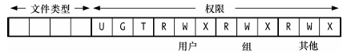
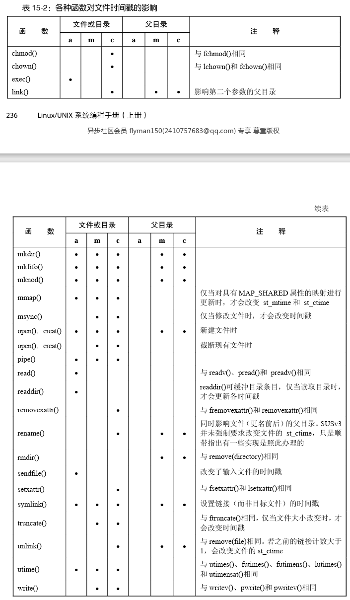
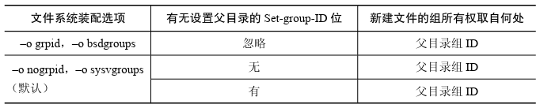

# 15 - 文件属性
介绍文件的各种属性，即文件元数据。介绍怎么查看文件的属性，如何修改文件的属性，以及文件的权限控制等。

## 15.1 - 获取文件信息：stat()
以下系统调用用于获取与文件有关的信息，大部分信息从 inode 中提取：
```c
#include <sys/stat.h>

// 成功返回 0，失败返回 -1
int stat(const char *pathname, struct stat *buf);
int lstat(const char *pathname, struct stat *buf);
int fstat(int fd, struct stat *buf);
```
它们的区别在于查找文件的方式不同：
- `stat()`：返回文件名对应文件的信息，会解析符号链接
- `lstat()`：通过文件名查找文件，如果文件是符号链接，不解析符号链接，返回符号链接本身的信息
- `fstat()`：返回给定文件描述符对应文件的信息

使用 `stat()` 和 `lstat()` 不需要对文件本身有权限，但是需要对父目录具有搜索权限。而只要提供有效的文件描述符，`fstat()` 总是成功。

它们向传入的缓冲区写入一个保存文件信息的结构体：
```c
struct stat {
    dev_t     st_dev;         // 文件所在设备的设备号
    ino_t     st_ino;         // inode 号
    mode_t    st_mode;        // 文件类型和许可权限
    nlink_t   st_nlink;       // 硬链接计数
    uid_t     st_uid;         // 属主的 uid
    gid_t     st_gid;         // 属组的 gid
    dev_t     st_rdev;        // 字符特殊设备和块特殊设备使用，包含实际设备的设备号
    off_t     st_size;        // 文件字节大小
    blksize_t st_blksize;     // 文件系统 I/O 块大小
    blkcnt_t  st_blocks;      // 文件使用的 512 字节块数
    time_t    st_atime;       // 最后访问时间
    time_t    st_mtime;       // 最后修改时间
    time_t    st_ctime;       // 最后状态改变时间
};
```
各个字段的类型都在 SUSv3 中有明确的定义。

根据 SUSv3，`lstat()` 作用于符号链接时，只需要设置 `st_size` 和 `st_mode` 字段，其他字段的值是否设置则取决于具体实现。早期 UNIX 标准旨在把符号链接实现为 inode 或一个目录项，如果是后一种情况，很多字段都没有意义。现在主流 UNIX 实现中，符号链接基本上以 inode 形式实现，Linux 也一样，从而在 Linux 中 `lstat()` 设置所有的字段。

#### 设备 ID 和 inode 号
`st_dev` 表示文件所在的设备（包含设备的主、辅 ID），`st_ino` 表示文件的 inode 号，通过两个字段可以在所有文件系统中唯一标识一个文件。

如果 inode 指示文件是一个设备，那么 `st_rdev` 会保存实际设备的主、辅 ID。

对其中主、辅 ID 的提取可以使用宏 `major()` 和 `minor()`，它们所在的头文件由 UNIX 实现决定。在 Linux 中，如果定义了宏 `_BSD_SOURCE` 那么它们定义于 `<sys/types.h>` 中。

#### 文件所有权
`st_uid` 和 `st_gid` 分别表示文件的属主和属组。

#### 链接数
`st_nlink` 表示文件的硬链接数。

#### 文件类型及权限
`st_mode` 字段保存了文件的类型和权限信息，它按位掩码的方式实现，Linux 中布局如图（SUSv3 没有规定文件类型如何表示）：



与常量 `S_IFMT` 按位与可以提取出文件类型，把它跟一系列常量比较可以确定文件类型：
```c
if ((statbuf.st_mode & S_IFMT) == S_IFREG) 
    printf("regular file\n");
```
这样的操作非常常见，所以 SUSv3 定义了一系列宏来简化操作：
```c
if (S_ISREG(statbuf.st_mode))
    printf("regular file\n");
```
这些宏定义在 `<sys/stat.h>` 中，在下表中列出。还有的 UNIX 实现定义了自己的类型。

| 常量 | 测试宏 | 文件类型 |
| --- | --- | --- |
| `S_IFREG` | `S_ISREG()` | 普通文件 |
| `S_IFDIR` | `S_ISDIR()` | 目录 |
| `S_IFCHR` | `S_ISCHR()` | 字符设备 |
| `S_IFBLK` | `S_ISBLK()` | 块设备 |
| `S_IFIFO` | `S_ISFIFO()` | FIFO 或管道 |
| `S_IFSOCK` | `S_ISSOCK()` | 套接字 |
| `S_IFLNK` | `S_ISLNK()` | 符号链接 |

值得一提的是：
- 要得到 `S_IFSOCK` 和 `S_ISOCK()` 的定义，要么定义 `_BSD_SOURCE`，要么定义 `_XOPEN_SOURCE` 为 500 或更高（有时需要 600）
- 由于 `stat()` 会解析符号链接，它永远不会返回 `S_IFLNK`

#### 文件大小、已分配块以及最优 I/O 块大小
对不同的文件 `st_size` 有不同的含义：
- 常规文件：文件的字节大小
- 符号链接：链接到路径的长度
- 共享内存对象：对象的大小

`st_blocks` 表示分配给文件的总块数，块大小为 512 字节，把支持多级索引分配的块也算在内。之所以是 512 字节，是因为早期 UNIX 文件系统块大小为 512 字节，现代的 UNIX 文件系统可能选择更大的逻辑块。（实际上 SUSv3 并没有规定块大小，但大多数 UNIX 实现都是 512 字节）

当文件存在文件空洞时，使用这个字段计算的文件大小可能还会小于 `st_size`，因为空洞的空间会被计入 `st_size` 中，但不会占用磁盘空间。

`st_blksize` 字段表示文件系统的最优 I/O 块大小，如果进行 I/O 操作指定的大小小于这个值，会有性能的浪费。一般来说，这个值是 4096 字节。

#### 文件时间戳
`st_atime`、`st_mtime` 和 `st_ctime` 分别表示最后访问时间、最后修改时间和最后状态改变时间。它们是标准 UNIX 时间格式，记录从 Epoch 以来的秒数。

#### 使用示例
对 `stat()` 等系统调用的[使用示例](src/files/t_stat.c)

## 15.2 - 文件时间戳
大多数 Linux 和 UNIX 系统都支持文件的三种时间戳，然而有些非 UNIX 文件系统则不然。不同的系统调用会对文件的不同时间戳做出更新，大多数情况下是设置为当前时间，也有 `utime()` 这样的系统调用专门修改时间戳为任意值。下表列出了书中所有系统调用对于时间戳的影响：



在 `open()` 和 `mount()` 调用时传入特定的标志，可以阻止一些时间戳的更新，从而减少磁盘 I/O 操作。

一般系统并不记录文件的创建时间，不过 BSD 在 `stat` 结构体中提供了 `st_birthtime` 字段来记录文件的创建时间。

#### 纳秒时间戳
Linux 2.6 版本把 3 个时间戳的精度提高到了纳秒级，SUSv3 没有要求支持这个，但 SUSv4 对此做了明确规定。不是所有的文件系统都支持纳秒级时间戳，JFS、XFS、ext4、Btrfs 支持，但是 ext2、ext3、ReiserFS 不支持。为了支持纳秒级时间戳，实际上时间戳通过 `struct timespec` 来保存，其中包含了秒数和纳秒数两部分，对于原先 `st_atime` 等的访问则是通过宏导向了其中的秒级字段。

### 15.2.1 - 使用 utime() 和 utimes() 来改变文件时间戳
使用 `utime()` 系统调用可以显示改变文件的上次访问时间和上次修改时间：
```c
#include <utime.h>

// 成功返回 0，失败返回 -1
int utime(const char *pathname, const struct utimbuf *buf);
```
参数 `pathname` 指示要修改的文件，会解析符号链接。参数 `buf` 要么是 `NULL`，要么指向一个 `utimbuf` 结构体：
```c
struct utimbuf {
    time_t actime;  // 上次访问时间
    time_t modtime; // 上次修改时间
};
```
`utime()` 实际的行为取决于传入的 `buf`：
- `NULL`：两个时间戳都设置为当前时间，对权限的要求需满足下列之一
    - 具有特权 CAP_FOWNER 或 CAP_DAC_OVERRIDE
    - 有效用户 ID（Linux 中实际上是文件系统用户 ID，两者一般相等）等于文件的属主 ID，并且有写权限
- `struct utimbuf`：用 `actime` 和 `modtime` 分别设置时间戳，对权限的要求需满足下列之一
    - 具有特权 CAP_FOWNER
    - 有效用户 ID 等于文件的属主 ID，并且有写权限

如果只想修改其中一个时间戳，一般先用 `stat()` 获取原来的时间戳：
```c
struct stat sb;
struct utimbuf utb;

if (stat(pathname, &sb) == -1)
    errExit("stat");
utb.actime = sb.st_atime;
utb.modtime = sb.st_mtime;
if (utime(pathname, &utb) == -1)
    errExit("utime");
```
Linux 还提供了源于 BSD 的 `utimes()` 系统调用：
```c
#include <sys/time.h>

// 成功返回 0，失败返回 -1
int utimes(const char *pathname, const struct timeval tv[2]);
```
它和 `utime()` 的区别在于它可以通过 `timeval` 按微秒级精度设置时间戳，`tv[0]` 设置上次访问时间，`tv[1]` 设置上次修改时间。使用 `utimes()` 的[示例](src/files/t_utimes.c)可以查看代码。

还有两个库函数：
```c
#include <sys/time.h>

// 成功返回 0，失败返回 -1
int futimes(int fd, const struct timeval tv[2]);
int lutimes(const char *pathname, const struct timeval tv[2]);
```
它们和 `utimes()` 类似，`futimes` 使用文件描述符定位文件，`lutimes` 不解析符号链接。glibc 分别在 2.3 和 2.6 版本支持两个函数。

### 15.2.2 - 使用 utimensat() 和 futimens() 改变文件时间戳
`utimensat()` 系统调用和 `futimens()` 库函数比起前面的接口有许多优点：
- 支持纳秒级精度
- 可以独立设置某一时间戳
- 可以独立把某个时间戳置为当前时间

这两个接口在 SUSv4 被纳入规范。

`utimensat()` 系统调用把文件 `pathname` 的时间戳更新为 `times` 指定的值：
```c
#define _XOPEN_SOURCE 700   // 或者 _POSIX_C_SOURCE >= 200809L
#include <sys/stat.h>

// 成功返回 0，失败返回 -1
int utimensat(int dirfd, const char *pathname, 
        const struct timespec times[2], int flags);
```
当 `times` 指定为 `NULL`，两个时间戳都设置为当前时间；否则，`times[0]` 和 `times[1]` 分别用于设置上次访问时间和上次修改时间。其中 `timespec` 结构体定义如下：
```c
struct timespec {
    time_t tv_sec;  // 秒
    long   tv_nsec; // 纳秒
};
```
如果希望把时间戳置为当前时间，把 `tv_nsec` 设置为 `UTIME_NOW`；如果希望保持原来的时间戳，把 `tv_nsec` 设置为 `UTIME_OMIT`。

`dirfd` 可以指定 `AT_FDCWD`，`pathname` 被正常用于寻找文件。也可以传入代表目录的文件描述符，18.11 节介绍其含义。

`flags` 参数可以是 0，也可以是 `AT_SYMLINK_NOFOLLOW`，表示不解析符号链接。

它们需要遵循的权限规则和上面的 API 类似。

`futimens()` 库函数通过文件描述符来定位文件：
```c
#define _GNU_SOURCE
#include <sys/stat.h>

// 成功返回 0，失败返回 -1
int futimens(int fd, const struct timespec times[2]);
```

## 15.3 - 文件属主
每个文件都有一个 uid 和 gid，分别表示文件的属主和属组。

### 15.3.1 - 新建文件的属主
文件创建时，属主 ID 取自创建文件的进程的有效用户 ID。属组 ID 要么取自创建文件的进程的有效组 ID（System V 的默认行为），要么取自父目录的属组 ID（BSD 的默认行为）。

配置 ext2 文件系统时，采用不同的 `mount` 选项会有不同的行为，具体如下表：



写书时支持上述选项的只有 ext2、ext3 和 ext4 文件系统，还有内核 2.6.14 后支持的 XFS 文件系统。其他的文件系统都遵循 System V 的默认行为。

### 15.3.2 - 修改文件属主：chown()、fchown() 和 lchown()
三个系统调用可以改变文件的属主和属组：
```c
#include <unistd.h>

// 成功返回 0，失败返回 -1
int chown(const char *pathname, uid_t owner, gid_t group);

// --------------------------------------------------------

#define _XOPEN_SOURCE 500   // 或者 _BSD_SOURCE
#include <unistd.h>

// 成功返回 0，失败返回 -1
int lchown(const char *pathname, uid_t owner, gid_t group);
int fchown(int fd, uid_t owner, gid_t group);
```
它们三个的区别跟 `stat()` 那一套类似。（在内核 2.2 版本之前 `chown()` 不会解析符号链接，2.2 版本修改了语义并引入了 `lchown()`）

参数 `owner` 和 `group` 分别指定新的属主和属组，如果设置为 -1，表示不改变对应的 ID。

只有带 CAP_CHOWN 的特权进程可以改变文件的 uid。其他进程只能在有效用户 ID 和文件 uid 匹配时，修改文件的 gid 为自己任一属组的 ID。

如果文件的 uid 或 gid 被修改，set-user-ID 和 set-group-ID 位会被清除。这是为了防止某些用户把文件的属主或属组改为某些特权用户，从而获得特权。

如果改变的是目录的所有权，或者文件属组的可执行权限被屏蔽，则不会清除 set-group-ID 位，因为这两种情况下 set-group-ID 位的含义并不是给可执行程序提供权限：
- 目录：set-group-ID 位控制新建文件的所有权
- 文件属组的可执行权限被屏蔽：set-group-ID 位用于启用强制文件锁定。

`chown()` 用法可以查看[代码示例](src/files/t_chown.c)。

## 15.4 - 文件权限

### 15.4.1 - 普通文件的权限


如图所示，`st_mode` 的低 12 位定义了文件权限，最高 3 位为专用位，分别用于 set-user-ID、set-group-ID、 sticky，标记为 U、G、T。剩余 9 位称为权限掩码，分为 3 组：
- 用户：文件属主的权限
- 组：文件属组成员的权限
- 其他：其他用户的权限

其中每组权限有 3 种：
- 读权限
- 写权限
- 执行权限（要执行程序还需要同时有读权限）

头文件 `<sys/stat.h>` 定义了一组常量用来检查权限：
| 常量 | 八进制值 | 权限位 | 
| --- | --- | --- |
| `S_ISUID` | 04000 | set-user-ID 位 |
| `S_ISGID` | 02000 | set-group-ID 位 |
| `S_ISVTX` | 01000 | sticky 位 |
| `S_IRWXU` | 00700 | 用户读写执行 |
| `S_IRUSR` | 00400 | 用户读 |
| `S_IWUSR` | 00200 | 用户写 |
| `S_IXUSR` | 00100 | 用户执行 |
| `S_IRWXG` | 00070 | 组读写执行 |
| `S_IRGRP` | 00040 | 组读 |
| `S_IWGRP` | 00020 | 组写 |
| `S_IXGRP` | 00010 | 组执行 |
| `S_IRWXO` | 00007 | 其他读写执行 |
| `S_IROTH` | 00004 | 其他读 |
| `S_IWOTH` | 00002 | 其他写 |
| `S_IXOTH` | 00001 | 其他执行 |

对于这些常量的使用，可以查看一个把权限掩码转换为字符串的[示例](src/files/file_perms.c)。

### 15.4.2 - 目录权限
目录的权限位和文件的权限位类似，但对于读写执行的解读有所不同：
- 读：可以列出目录中的条目
- 写：可以在目录中创建、删除文件
- 执行：可以访问目录条目指向的文件（包括其 inode 和内容）

当对目录有执行权限，并且知道要访问文件的名字时，可以访问文件，不需要对目录的读权限。

要添加或删除文件，需要同时有目录的写权限和执行权限。

### 15.4.3 - 权限检查算法
对于某个文件，检查权限的算法如下：
1. 特权级进程授予所有权限
1. 如果进程的有效用户 ID 和文件 uid 相同，赋予用户权限
1. 如果进程有效组 ID 或任一附属组 ID 和文件 gid 匹配，赋予组权限
1. 赋予其他权限

任何一个步骤授予权限以后，立即检查是否具有足够的权限，如果没有，就拒绝访问。这意味着如果进程是属主（无读权限），并且位于文件属组（有读权限）中，那么它会被赋予属主权限从而不能读取文件。

Linux 2.6 开始支持访问控制列表（ACL），当文件与一个 ACL 挂钩，那么权限检查算法有一些不同。

另外，具有 CAP_DAC_READ_SEARCH 能力的进程可以获得任何文件的读权限，并且对于目录总是有读和执行权限。具有 CAP_DAC_OVERRIDE 能力的进程对任何文件都有读写执行权限，目录或文件的三类用户之一具有执行权限时它也获得执行权限。

#### 检查特权级别进程的权限
对于特权进程实际上还有个限制。对于非目录文件，在 Linux 中只有用户、组、其他的某一个具有执行权限时，特权进程才能获得执行权限；而其他一些 UNIX 实现则没有这个限制。而目录文件则没有这个限制。

### 15.4.4 - 检查对文件的访问权限：access()
一般来说，系统通过进程的有效用户 ID 和有效组 ID 以及附属组 ID 来做权限检查。不过，对于 set-user-ID 和 set-group-ID 程序，它们可能暂时持有特权，但仍只希望执行真实 ID 能够执行的操作，从而需要根据真实 ID 做权限检查。这可以通过 `access()` 系统调用来实现：
```c
#include <unistd.h>

// 通过权限检查返回 0，否则返回 -1
int access(const char *pathname, int mode);
```
如果 `pathname` 是符号链接，会解析符号链接。`mode` 是位掩码的形式，表示希望检查的权限，只要有一项权限不满足就返回失败，可以使用的常量有：
- `F_OK`：文件存在
- `R_OK`：有读权限
- `W_OK`：有写权限
- `X_OK`：有执行权限

使用 `access()` 的问题在于权限的检查和实际访问文件两个操作不是原子的，从而中间的时间差可能权限发生了变化，带来安全漏洞。比如，对于一个 set-user-ID-root 程序，`access()` 检查的是一个符号链接，检查时发现真实 ID 有权限执行该文件，但在执行前符号链接被替换为一个真实 ID 无权限执行的文件，从而达成提权。

由于这样的安全隐患，`access()` 的使用是不被建议的。更好的方案应该是 set-user-ID 程序把自己切换到真实 ID 的身份，然后直接尝试访问文件，如果访问失败查看 errno 来判断是否权限不足。

GNU C 库提供了功能类似的非标准函数 `euidaccess()`，以及同义函数 `eaccess()`。

### 15.4.5 - Set-User-ID、Set-Group-ID 和 Sticky 位
对于 set-user-ID 和 set-group-ID 位，它们的用途分别在其他章节介绍。这里着重介绍 sticky 位。

在老的 UNIX 实现中，提供 sticky 位旨在让常用程序运行速度更快。如果一个程序被设置了 sticky 位，首次执行程序时系统把它的 .text 段副本保存在交换区中（即 “粘” 在交换区中），从而提高了程序的执行速度。现代 UNIX 实现对内存管理更精准，这样的用法已经被废弃。

现在 UNIX 中，sticky 位具有完全不同的语义。当目录设置了 sticky 位，如果非特权进程要删除或重命名其中的文件，需要对目录有写权限，同时它要是文件的属主（或者具有 CAP_FOWNER）。这样的机制常用于创建共享目录，每个用户仅能删除自己创建的文件，如 /tmp 默认设置了 sticky 位。

使用 `chmod +t` 命令来设置 sticky 位，然后使用 `ls -l` 可以看到类似 `-rw-r--r-T` 的权限位。这里 `T` 表示设置了 sticky 位，如果其他用户具有执行权限，那么会显示为 `t`。

### 15.4.6 - 进程的文件模式创建掩码：umask()
在使用 `open()` 和 `mkdir()` 系统调用创建文件或目录的时候，会传入掩码来指示其权限，但实际上这个掩码会被文件模式创建掩码（umask）修改，它屏蔽掉一些权限位。

进程的 umask 一般继承自父进程，大多数情况下来自于 shell。在 shell 中可以使用命令 `umask` 来改变进程的默认 umask。大多数 shell 默认把 umask 设置为屏蔽组和其他用户的写权限，即八进制 022。因此无论调用 `open()` 时是否允许组和其他用户写该文件，最终它们都不会有写权限。

系统调用 `umask()` 可以让进程自行修改 umask：
```c
#include <sys/stat.h>

// 总会成功，并且返回之前的 umask
mode_t umask(mode_t mask);
```
使用的掩码和 `open()` 使用的相同。

`umask()` 的使用示例参考[代码](src/files/t_umask.c)。

### 15.4.7 - 更改文件权限：chmod() 和 fchmod()
两个系统调用直接修改文件的权限：
```c
#include <sys/stat.h>

// 成功返回 0，失败返回 -1
int chmod(const char *pathname, mode_t mode);

// --------------------------------------------------------

#define _XOPEN_SOURCE 500   // 或者 _BSD_SOURCE
#include <sys/stat.h>

// 成功返回 0，失败返回 -1
int fchmod(int fd, mode_t mode);
```
`chmod()` 会解析符号链接（符号链接自从被创建，所有的权限被所有用户共享，并且不可改变），`fchmod()` 使用文件描述符定位文件。它们使用的权限掩码也和 `open()` 一样。

进程要修改一个文件的权限，要么具有 CAP_FOWNER 特权；要么文件的 uid 与进程的有效用户 ID 相同。

两个调用的语义是替换掉原来的权限位，如果只是想加上或屏蔽某个权限，一般先用 `stat()` 获取原来的权限位。

前面提到，如果一个目录，所在的文件系统挂载时使用 `-o bsdgroups`，或者使用 `-o sysvgroups` 但是目录设置了 set-group-ID 位，那么其中创建的文件会继承目录的属组。为了防止进程通过 `chmod()` 设置该文件 set-group-ID 位来提权，当文件 gid 不能匹配进程有效组 ID 时或附属组 ID 时，调用 `chmod()` 总会屏蔽 set-group-ID 位。

## 15.5 - inode 标志（ext2 扩展文件属性）
某些 Linux 文件系统提供了非标准的扩展功能，允许为文件和目录设置 inode 标志。（现代 BSD 支持类似的特性，使用 `chflags(1)` 和 `chflags(2)` 来设置）

ext2 是首个支持 inode 标志的 Linux 文件系统，因此很多人也把它称为 ext2 扩展文件属性。后来诸如 Btrfs、ext3、ext4、Reiserfs、XFS、JFS 都加入了对 inode 标志的支持。（各个文件系统对 inode 标志的支持程度不同，比如 Reiserfs 上使用 inode 标志要求挂载时使用 `-o attrs`）

在 shell 中通过 `chattr` 和 `lsattr` 命令可以查看和设置 inode 标志。

在程序中需要使用 `ioctl()` 系统调用来获取并修改 inode 标志。对于普通文件和目录都可以设置 inode 标志，不过大多数标志是供普通文件使用的，有少部分是专供目录使用的。下表列出了不同选项在 `ioctl()` 需要使用的常量（它们定义在 `<linux/fs.h>` 中），还列出了 `chattr` 需要使用的选项：
| 常量 | 选项 | 含义 |
| --- | --- | --- |
| `FS_APPEND_FL` | `a` | 只能在文件末尾追加数据（需要特权） |
| `FS_COMPR_FL` | `c` | 启用文件压缩（未实现） |
| `FS_DIRSYNC_FL` | `D` | 目录更新同步（自 Linux 2.6） |
| `FS_IMMUTABLE_FL` | `i` | 文件不可修改（需要特权） |
| `FS_JOURNAL_DATA_FL` | `j` | 启用数据日志（需要特权） |
| `FS_NOATIME_FL` | `A` | 不更新访问时间 |
| `FS_NODUMP_FL` | `d` | 不转储 |
| `FS_NOTAIL_FL` | `t` | 禁用尾部打包 |
| `FS_SECRM_FL` | `s` | 安全删除（未实现） |
| `FS_SYNC_FL` | `S` | 文件（和目录）同步更新 |
| `FS_TOPDIR_FL` | `T` | 使用 Orlov 策略来处理顶层目录（自 Linux 2.6） |
| `FS_UNRM_FL` | `u` | 可以恢复删除的文件（未实现） |

实际上 Linux 2.6.19 之前它们并未被定义到 `<linux/fs.h>` 中，每个文件系统都有自己的定义，如 ext2 中在 `<linux/ext2_fs.h>` 中定义。基本每个文件系统定义的常量值都是相同的，所以老内核中随便包含一个头文件即可。

一般来说，如果目录设置了 inode 标志，那么其中的文件和子目录都会继承这些标志，也有例外：
- `FS_DIRSYNC_FL`：只对目录有效，故只有子目录继承它
- `FS_IMMUTABLE_FL`：阻止了目录中条目的创建，自然没有继承的问题

设置一个属性的代码示例如下：
```c
int attr;

if (ioctl(fd, FS_IOC_GETFLAGS, &attr) == -1)
    errExit("ioctl");
attr |= FS_IMMUTABLE_FL;
if (ioctl(fd, FS_IOC_SETFLAGS, &attr) == -1)
    errExit("ioctl");
```
这要求进程满足两个条件之一：
- 有效 ID 匹配文件 uid
- 具有 CAP_FOWNER 特权

#### FS_APPEND_FL
要打开并写入文件，必须指定 `O_APPEND`。具有 CAP_LINUX_IMMUTABLE 特权的进程可以设置该标志。

#### FS_COMPR_FL
文件被压缩以后存储在磁盘上，实际上它不是标配特性，有些软件包实现了这个特性。然而由于磁盘空间很廉价，而且压缩和解压缩会消耗 CPU 时间，所以这个特性并不常用。

#### FS_DIRSYNC_FL（Linux 2.6）
对目录的更新会变成同步的，有性能上的开销。

#### FS_IMMUTABLE_FL
文件不可修改，元数据也不能修改，连特权进程也不能修改。只有具有 CAP_LINUX_IMMUTABLE 特权的进程可以设置该标志。

#### FS_JOURNAL_DATA_FL
启用数据日志，只有 ext3 和 ext4 文件系统支持。它们提供 3 种层次的日志：journal、ordered、writeback。无论如何元数据的更新都会计入日志，journal 模式还同时记录数据的更新。在 ordered 和 writeback 模式下，具有 CAP_SYS_RESOURCE 特权的进程可以对单个文件设置该标志。

#### FS_NOATIME_FL
不更新访问时间，从而减少磁盘 I/O 操作。

#### FS_NODUMP_FL
通过 `dump` 命令备份文件系统时，不备份这个文件。

#### FS_NOTAIL_FL
禁用尾部打包，只有 Reiserfs 支持。Reiserfs 会尝试把小文件和它的元数据放进一个磁盘块。如果挂载时使用 `-o notail` 会禁用整个文件系统的尾部打包。

#### FS_SECRM_FL
安全删除文件，即保证把被删除文件的数据覆盖掉，避免有些软件扫描磁盘重建文件。这个特性尚未实现。研究表明，这个操作比较复杂，需要反复写入磁盘稳妥地抹去之前的数据。

#### FS_SYNC_FL
对文件的更新会变成同步的，有性能上的开销。如同打开文件时指定 `O_SYNC`。

#### FS_TOPDIR_FL（Linux 2.6）
在 Orlov 块分配策略下对目录进行特殊处理，这个策略试图增大相关文件在磁盘上相邻的可能性来缩短寻道时间。只有 ext 系列文件系统支持。

#### FS_UNRM_FL
允许文件在删除后可以恢复，这个特性尚未由内核实现，但在内核外不难完成。