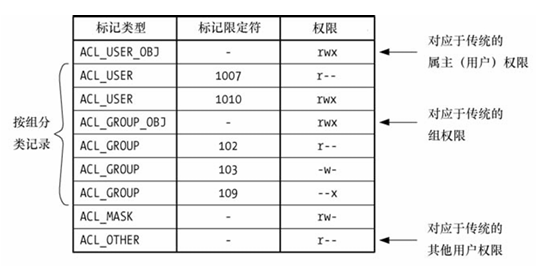
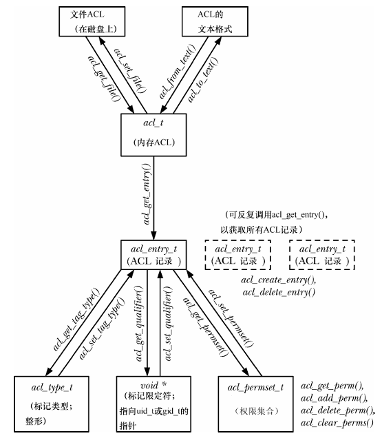

# 17 - 访问控制列表
在 [15.4](15.md/#154---文件权限) 节中介绍了传统 UNIX 权限方案，大多数情况下这个方案已经足够。但有的应用要求对授权进行更精确的控制，许多 UNIX 系统提供了名为访问控制列表（ACL）的扩展，Linux 从内核 2.6 开始支持 ACL。

注意，各个文件系统对 ACL 的支持是可选的，由 File systems 菜单下的内核配置选项控制。Reiserfs 文件系统从内核 2.6.7 开始支持 ACL。要在 ext 系列和 Reiserfs 文件系统上创建 ACL，要求挂载时使用 `mount -o acl` 。

UNIX 曾经试图在 POSIX.1e 和 POSIX.2c 草案中标准化 ACL，它们分别定义了用于 ACL 的 API 和 shell 命令，但最终都以失败告终。然而，许多的 UNIX 实现 ACL 时仍以上述草案为参考，不过各种实现间的差异仍比较大，从而 ACL 技术妨碍了应用程序的可移植性。

## 17.1 - 概述
ACL 是由 ACL 记录（以下简称 ACE）组成的，每条记录定义某个用户或某个组队文件的访问权限。如图所示：



ACL 记录由 3 个部分组成：
- 标记类型：表示该记录针对用户、组还是其他用户
- 标记限定符（可选）：指示特定的用户或组
- 权限集合：允许的权限

其中标记类型有一些固定的可取值，以下一一介绍。

#### ACL_USER_OBJ
授予文件属主的权限，每个 ACL 只能有一条。

#### ACL_USER
授予某个用户的权限，该用户通过标记限定符指定。一个 ACL 可以有零或多条，但是每个用户只能有最多一条。

#### ACL_GROUP_OBJ
授予文件属组的权限，每个 ACL 只能有一条。如果 ACL 不包含 ACL_MASK 记录，那么它指定的权限就是属组实际拥有的权限。

#### ACL_GROUP
授予某个组的权限，该组通过标记限定符指定。每个 ACL 可以有零或多条，但是每个组只能有最多一条。

#### ACL_MASK
限制了 ACL_USER、ACL_GROUP_OBJ、ACL_GROUP 实际能拥有的权限。一个 ACL 最多只能有一条 ACL_MASK 记录。如果 ACL 有 ACL_USER 或 ACL_GROUP 记录，那么必须有 ACL_MASK 记录。

#### ACL_OTHER
如果没有匹配其他的记录，赋予此记录的权限。每个 ACL 只能有一条。

#### 最小 ACL 和扩展 ACL
最小化 ACL 只有 3 条记录：ACL_USER_OBJ、ACL_GROUP_OBJ 和 ACL_OTHER，它等效于传统的权限控制模型。扩展 ACL 包含了 ACL_USER 和 ACL_GROUP 记录，同时还需要一条 ACL_MASK 记录。

一方面扩展 ACL 是对传统权限控制模型的扩展。

另一方面，Linux 通过系统扩展属性 system.posix_acl_access 来支持 ACL（在 16 章中介绍），仅当文件使用了扩展 ACL 时才使用该属性。

最小化的 ACL 可以直接存储在 `stat` 结构体的 `st_mode` 字段中。

## 17.2 ACL 权限检测算法
1. 如果进程具有特权，授予所有访问权限。有个例外，仅当某条 ACL 记录赋予了可执行权限时，该进程才能获得可执行权限。
1. 如果进程有效 ID 和文件 uid 匹配，授予 ACL_USER_OBJ 记录的权限。
1. 如果进程有效用户 ID 匹配某条 ACL_USER 记录的标记限定符，授予该记录的权限与 ACL_MASK 记录的权限的交集。
1. 如果进程的有效组 ID 或任一辅助组 ID 匹配文件的 gid 或是某条 ACL_GROUP 记录的标记限定符
    1. 如果匹配的是文件的 gid 并且， ACL_GROUP_OBJ 记录带有需要的权限，授予该记录的权限与 ACL_MASK 记录的权限的交集
    1. 如果能匹配到 ACL_GROUP 记录，并且该记录带有需要的权限，授予该记录的权限与 ACL_MASK 记录的权限的交集
    1. 否则，拒绝访问
1. 授予 ACL_OTHER 记录的权限

## 17.3 - ACL 的长、短文本格式
使用命令操纵 ACL 的时候，需要指出 ACE 的文本表现形式，有 2 种：
- 长文本格式 ACL：每行一条 ACE，可以在 `#` 后面写注释。`getfacl` 命令以长文本格式显示 ACL，也可以让它从文件中读取长文本格式 ACL（使用 `-M <file>` 选项）。
- 短文本格式 ACL：一系列的 ACE 通过逗号分隔

无论哪种格式，ACE 都是如下格式：
```
标记类型:[标记限定符]:权限集合
```

其中标记类型的文本格式如下：
- ACL_USER_OBJ：`user`
- ACL_USER：`u` 或 `user`
- ACL_GROUP_OBJ：`g` 或 `group`
- ACL_GROUP：`g` 或 `group`
- ACL_MASK：`m` 或 `mask`
- ACL_OTHER：`o` 或 `other`

短文本 ACL 的例子，3 行是等价的：
```
u::rw-,g::r-x,o::---
u::rw,g::rx,o::-
user::rw,group::rx,other::--
```

## 17.4 - ACL_MASK 型 ACE 和 ACL 组分类
前面提到，ACL_MASK 记录会限制 ACL_USER、ACL_GROUP_OBJ、ACL_GROUP 能获得的最大权限。

实际上引入 ACL_MASK 记录的目的在于让不知晓 ACL 存在的程序也能保持行为的一致性。

考虑一个文件原有的 ACL 如下（假设没有引入 ACL_MASK）：
```
user::rwx           # ACL_USER_OBJ
user:paulh:r-x      # ACL_USER
group::r-x          # ACL_GROUP_OBJ
group:teach:--x     # ACL_GROUP
other::--x          # ACL_OTHER
```
如果现在一个传统程序对这个文件修改访问权限：
```c
chmod(pathname, 0700);
```
那么它认为文件属主具有读、写和执行权限，其他用户没有任何权限。没有 ACL_MASK 的情况下有几种不完美的方式来执行这个操作：
- 修改 ACL_GROUP_OBJ 和 ACL_GROUP 记录，屏蔽所有权限。对于 ACL_USER 和 ACL_OTHER 记录，保持不变，则它们仍具有一些权限。
- 修改除了 ACL_USER_OBJ 记录外的所有记录，屏蔽所有权限。

虽然看起来第二种方法执行了正确的语义，可是这破坏了 ACL 概念的使用，后续如果再修改文件权限：
```c
chmod(pathname, 0751);
```
那么 ACL_USER 和 ACL_GROUP 的权限却无法得到恢复，因为已经不知道它们原来的权限是什么了。

或许让 ACL_GROUP_OBJ 的权限作为掩码来限制 ACL_USER 和 ACL_GROUP 呢？问题在于有时 ACL_USER 和 ACL_GROUP 的权限是超出 ACL_GROUP_OBJ 的权限的。

综上，引入 ACL_MASK 记录是最好的解决方案。使用 `chmod` 修改组权限时改变的是 ACL_MASK 记录，而不是 ACL_GROUP_OBJ 记录。同时 `stat()` 在 `st_mode` 中返回的组权限也是 ACL_MASK 记录的权限。

虽然 ACL_MASK 保护了使用 ACL 的应用不被传统应用误伤，但它对于传统应用并不足够友好。因为如果 ACL_GROUP_OBJ 的权限是 `---`，传统应用调用 `chmod()` 只能修改到 ACL_MASK，从而它发现修改完以后仍然没有获得组权限。

一个策略是当使用 `chmod()` 修改组权限时，赋予 ACL_GROUP_OBJ 所有的权限，从而实际获得的权限是 ACL_MASK 记录的权限。

## 17.5 - getfacl 和 setfacl 命令
`getfacl` 用于查看文件的 ACL：
```shell
# 屏蔽组和其他用户的写权限
$ umask 022
$ touch file
$ getfacl file
# file: file
# owner: mtk
# group: users
user::rw-
group::r--
other::r--
```
可以看到这里还显示了文件的名称、属主、属组，如果带上 `--omit-header` 选项则不显示这些信息。

它是最小 ACL 的形式，没有 ACL_MASK。调用 `chmod` 修改文件权限时，会作用到 ACL 上：
```shell
$ chmod u=rwx,g=rx,o=x file
$ getfacl file --omit-header
user::rwx
group::r-x
other::--x
```

`setfacl` 用于修改文件的 ACL，比如 `-m` 修改 ACL 记录，当记录不存在的时候就追加：
```shell
$ setfacl -m u:paulh:rx,g:teach:x file
$ getfacl file --omit-header
user::rwx
user:paulh:r-x
group::r-x
group:teach:--x
mask::r-x
other::--x
```
当对目录使用 `setfacl` 时，可以指定 `-R` 来递归作用到目录树中所有文件和目录。可以看到，追加 ACL_USER 和 ACL_GROUP 记录后，它自动创建了一个 ACL_MASK 记录。此时文件转换成扩展 ACL，在 `ls` 中可以看到权限位最后面的 `+` 号：
```shell
$ ls -l file
-rwxr-xr-x+ 1 mtk users 0 12月  6 21:00 file
```

接下来在 ACL_MASK 中仅保留执行权限：
```shell
$ setfacl -m m::x file
$ getfacl file --omit-header
user::rwx
user:paulh:r-x      # effective: --x
group::r-x          # effective: --x
group:teach:--x
mask::--x
other::--x
$ ls -l file
-rwx--x--x+ 1 mtk users 0 12月  6 21:00 file
```
当实际获得的权限受到 ACL_MASK 的限制时，会在注释中写出实际的权限。

也可以从 ACL 中删除记录：
```shell
$ setfacl -x u:paulh,g:teach file
$ getfacl file --omit-header
user::rwx
group::r-x
mask::r-x
other::--x
```
这里 `setfacl` 自动调整了 ACL_MASK 为所有组 ACE 权限的并集，如果不希望这样，需要带上 `-n` 。

最后，执行 `-b` 选项，把 ACL 转换为最小 ACL。

## 17.6 - 默认 ACL 与文件创建
目前讨论的 ACL 实际上都属于访问型 ACL，对于目录还有另一种 ACL，即默认型 ACL。它并不关乎目录本身，而是决定在目录中创建的文件或子目录的 ACL 和权限。

带 `-d` 选项的 `getfacl` 和 `setfacl` 命令用于查看和修改默认 ACL：
```shell
$ mkdir sub
$ setfacl -d -m u::rwx,u:paulh:rx,g::rx,g:teach:rwx,o::- sub
$ getfacl -d --omit-header sub
user::rwx
user::paulh:r-x
group::r-x
group:teach:rwx
mask::rwx
other::---
```
执行 `-k` 选项可以删除默认 ACL。如果目录设置了默认 ACL，那么：
- 其中新建的子目录会继承默认 ACL
- 其中新建的文件和子目录访问 ACL 会继承其默认 ACL。其中 ACL_USER_OBJ、ACL_MASK（如没有则为 ACL_GROUP_OBJ）、ACL_OTHER 记录的权限，需要和创建文件时传入的属主、属组、其他用户权限做交集。

如果目录有了默认 ACL，那么其中新建文件时进程 umask 不生效。

## 17.7 - ACL 在实现方面的限制
各类文件系统都对一个文件的 ACE 数目有所限制：
- ext 系列：受制于扩展属性的所有名称与值需要塞进一个磁盘块，每个 ACE 8 字节，并且该扩展属性名字也要塞进去，从而数目应当略少于块大小的 1/8。（内核 2.6.11 之前，内核要求 ext2/3 中 ACE 不得超过 32 条）
- XFS：最多 25 条
- Reiserfs、JFS：最多 8191 条，因为 VFS 要求扩展属性的值不能超过 64KB
- Btrfs：写书时 500 条左右

虽然 ACL 列表可以非常长，但是还是尽量避免过多的 ACE：
- 冗长的 ACL 难以维护且容易出错
- 权限检查的时间可能会很长

通常会建立多个用户组，通过组来控制权限。

## 17.8 - ACL API
POSIX.1e 围绕 ACL 定义了大量的函数和数据结构，这里对此类函数的用法做概括。

为了使用 ACL API，需要包含头文件 `<sys/acl.h>`。如果用到了 POSIX.1e 中的各种 Linux 扩展则可能还要包含 `<acl/libacl.h>`。为了链接 libacl 库，需要在编译时加上 `-lacl` 选项。

由于 ACL API 基本通过附加属性实现，它们会调用 `getxattr()` 和 `setxattr()` 函数，实际上也可以通过这两个函数直接操作 ACL，但不建议。

### 概述
ACL API 定义了大量的数据结构和函数，各种数据结构的关系如下图所示：



ACL API 以层次化的方式实现 ACL 对象：
- ACL 包含 ACE
- ACE 包含标记类型、标记限定符、权限集合

接下来简要介绍 ACL 函数。返回整数的函数大多返回 0 表示成功，-1 表示失败；返回指针的函数失败时返回 NULL。它们出错时会在内部设置 errno。

### 将文件的 ACL 读入内存
```c
acl_t acl;
acl = acl_get_file(pathname, type);
```
`type` 为 `ACL_TYPE_ACCESS` 则读入访问 ACL，为 `ACL_TYPE_DEFAULT` 则读入默认 ACL。函数返回一个句柄供其他操作使用。

### 从内存 ACL 中获取记录
```c
acl_entry_t entry;
status = acl_get_entry(acl, entry_id, &entry);
```
函数通过 `entry` 返回一个指向 ACE 的句柄，`entry_id` 决定它指向的是哪条 ACE：
- `ACL_FIRST_ENTRY`：第一条 ACE
- `ACL_NEXT_ENTRY`：下一条 ACE

如果成功，返回 1；如果没有更多 ACE，返回 0；如果出错，返回 -1。

### 获取并修改 ACE 中的属性
首先是标记类型：
```c
acl_tag_t tag_type;
status = acl_get_tag_type(entry, &tag_type);
status = acl_set_tag_type(entry, tag_type);
```
`tag_type` 可以取以下值：
- `ACL_USER_OBJ`
- `ACL_USER`
- `ACL_GROUP_OBJ`
- `ACL_GROUP`
- `ACL_MASK`
- `ACL_OTHER`

然后是标记限定符：
```c
uid_t *qualp;
qualp = acl_get_qualifier(entry);
status = acl_set_qualifier(entry, qualp);
```

最后是权限集合：
```c
acl_permset_t permset;
status = acl_get_permset(entry, &permset);
status = acl_set_permset(entry, permset);
```

操纵权限集合有一组专门的函数：
```c
int is_set;
is_set = acl_get_perm(permset, perm);       // 判断是否有 perm 中的权限，有则返回 1，否则返回 0。为 Linux 对 POSIX.1e 的扩展
status = acl_add_perm(permset, perm);       // 向 permset 中添加 perm 中的权限
status = acl_delete_perm(permset, perm);    // 从 permset 中删除 perm 中的权限（如果有）
status = acl_clear_perms(permset);          // 清空 permset
```
其中 `perm` 可以取以下值：
- `ACL_READ`
- `ACL_WRITE`
- `ACL_EXECUTE`

### 创建和删除 ACE
```c
acl_entry_t entry;
status = acl_create_entry(&acl, &entry);
status = acl_delete_entry(acl, entry);
```

### 更新文件的 ACL
把内存中的 ACL 副本写回文件：
```c
int status;
status = acl_set_file(pathname, type, acl);
```
同样需要指定 `type` 为 `ACL_TYPE_ACCESS` 或 `ACL_TYPE_DEFAULT`。

### ACL 在内存和文本格式之间的转换
把文件形式的 ACL（无论长短格式）转换为内存形式并返回对应的句柄：
```c
acl = acl_from_text(acl_string);
```
把内存形式的 ACL 转换成长文本格式：
```c
char *str;
ssize_t len;
str = acl_to_text(acl, &len);
```
也可以把第二个参数指定为 NULL，从而函数不操作这个参数。

### ACL API 中的其他函数
还有几个常用的 ACL 函数。

`acl_calc_mask(&acl)` 通常在修改或创建 ACL 的时候使用。它对 ACL 中的 ACL_USER、ACL_GROUP_OBJ、ACL_GROUP 记录权限做并集，然后把结果写入 ACL_MASK 记录。如果 ACL 中没有 ACL_MASK 记录，会创建一个。

`acl_valid(acl)` 在 `acl` 参数有效的时候返回 0，否则返回 -1。当下面条件全部满足，认为 ACL 有效：
- ACL_USER_OBJ、ACL_GROUP_OBJ、ACL_OTHER 都只有一条
- 如果有 ACL_USER 或 ACL_GROUP 记录，必须有 ACL_MASK 记录
- ACL_MASK 记录最多只有一条
- ACL_USER 记录有用户 ID，并且多条记录的用户 ID 不能相同
- ACL_GROUP 记录有组 ID，并且多条记录的组 ID 不能相同

还有 `acl_check()` 和 `acl_error()`，后者为 Linux 的扩展，它们和 `acl_valid()` 作用很像，但是会返回更多的错误信息。虽然，它们的可移植性不强。

`acl_delete_def_file(pathname)` 删除文件的默认 ACL。

`acl_init(count)` 创建一个空的 ACL 结构，拥有足够容纳 `count` 条 ACE 的空间，返回句柄。（`count` 条的空间只是编程者的请求，系统不一定实际做到）

`acl_dup(acl)` 用来为 ACL 创建一个副本，返回句柄。

`acl_free(handle)` 用来释放 ACL 函数分配的内存，如 `acl_from_text()`、`acl_to_text()`、`acl_get_file()`、`acl_init()`、`acl_dup()` 等分配的内存。

### 程序示例
参考[代码](src/acl/acl_view.c)。