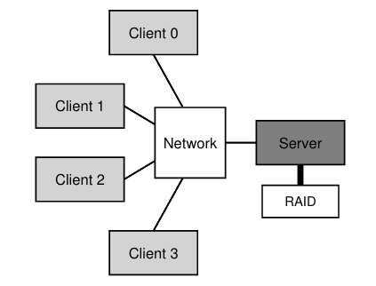

# 48 - 分布式系统
分布式系统已经在全世界得到广泛应用，比如当用浏览器登陆一个网站时，实际上就加入了一个**客户/服务器**分布式系统。当跟如谷歌一样的现代网络服务交互时，并不是在跟单独的一台机器交互，在这之后隐藏了成千上万台服务器相互合作来提供服务。

建立分布式系统会面临许多的挑战，最主要的问题是**故障**。机器、硬盘、网络、软件都随时可能出现故障，然而当使用这些分布式系统提供的服务时，似乎并没有感知到这些故障，这就是构建分布式系统的核心。

另一个挑战是**性能**。分布式系统的性能通常是很关键的，系统的设计者需要仔细设计，从而尽量让机器间的交互变得高效，从而减少服务的时延和提高吞吐量。

还有一个问题是**安全**。一方面，客户需要有某种方式来确保它正在交互的对象就是提供服务的机器，而不是一个恶意的第三方。另一方面，需要保证不会有中间人监控或改变交互双方的通信。

本章主要的视角是分布式系统中的**通讯**，即机器之间如何交换信息，其中必须考量如何处理故障等情况。

## 48.1 - 通信基础
现代计算机网络是在不可靠通信的基础上设计的，无论在什么网络环境，数据包传输都可能出现丢失、损坏等问题。即使数据包正常到达，对方主机也可能发生故障，或者数据包到达太快导致对方主机缓冲区塞不下等。

## 48.2 - 不可靠通信层
最简单的处理方法就是，干脆不处理这些问题，把问题留给上层的应用。这也就是常常提到的**端到端原则**，一个典型的例子就是基于 IP 协议的 UDP 协议。使用 UDP，一个进程用**套接字**创建一个**通信端点**作为服务器，另一个其他机器上的进程发送 UDP **报文段**到这个进程，然后服务器发回一个响应，这就形成了一个最简单的分布式系统。

虽然 UDP 没提供什么机制来处理丢包等问题，它还是提供了一个简单的**检验和**让接收方可以检测出简单的数据包损坏。

## 48.3 可靠通信层
为了实现可靠通信层，需要一些新的机制来处理丢包。

首先需要让发送方知道自己的数据包是否到达了接收方。这通过**确认**来实现，简称 **ACK**。简单来说，当接收方收到一个数据包时，它会发回一个简短的信息通知发送方自己已经收到。当发送方收到这个确认信息时，就知道自己的数据包已经到达了接收方。

然而确认信息也可能丢失。当发送方发送一个信息，过了一段时间没有收到确认，它无法分辨是对方没有收到数据包，还是确认信息丢失，或者只是确认信息经历非常长的时间才能到达。

实际上发送方使用**超时**机制处理这个问题，即发送方发送一个数据包后，启动一个定时器，在预设的超时时间以后它就中断发送方。当发送方发现定时器超时，它简单地认为数据包丢失了，然后**重传**数据包。这样的方案下，发送方在收到确认之前必须暂存数据包用于可能的重传。

以上称为**超时/重传**机制，但它现在仍不够好：如果接收方收到一个数据包并发回一个确认，但确认丢失了，发送方会重传数据包，当接收方再次收到这个数据包时，他不知道发送方是在重传还是在发送一个新的数据包（只是内容刚好相同）。因此需要一个机制来唯一标识数据包。

常常使用的是**序列号**，比如初始从某个序列号 N 开始，把它附带在数据包中。发送下一个数据包时，就带上序列号 N+1，以此类推。当接收方收到一个数据包，它就知道是否是新的数据包，而无论这个数据包是新的还是重传的，它都简单地发回一个确认。

**TCP/IP** 使用这样的方案来实现可靠通信层，但是细节上有一些区别。除此之外，它还提供了流量控制和拥塞控制的功能。

## 48.4 - 通信抽象
在更高的层次上，我们不希望考虑底层的通信情况，而是希望从抽象模型来考量分布式系统。

一种模型从操作系统领域扩展得来的，称为**分布式共享内存（DSM）**。顾名思义，让所有的机器共享一个虚拟地址空间，好像它们实际共用了内存一样，物理内存分布在多台机器上。在这样的模型下，分布式计算就好像在同一台机器上的多个线程一样。这样的方案通常由 OS 的分页内存系统来提供支持，当读取一个页时，如果页已经在本地就直接读取；否则触发一个页错误，然后 OS 会从远程机器上获取这个页。

这样的方案有两个大的缺陷：
- 故障处理：因为虚拟页是绑定到一台机器的物理内存的，当这台机器故障的时候，指向其上内存的虚拟页很难处理。如果它的内存关乎多个数据结构，单台机器故障可能造成多个数据结构不可用。
- 性能：单次内存访问可能跨越数毫秒乃至数秒时间，几乎没有多少时间用于实际的计算。

综上，现今 DSM 几乎不再使用。

## 48.5 - 远程过程调用（RPC）
OS 层面的抽象几乎没有实用性的情况下，编程语言层面的抽象显得更有效。主流的方案是**远程过程调用（RPC）**。

RPC 的目标是：令调用远程机器上的程序代码就像调用本地函数一样简单直接。从而在用户的角度来看，它执行一个过程调用，经过一段时间完成并返回了结果。服务方通常定义一些接口暴露出来。除此之外，所有的细节都有 RPC 系统来处理，一般两个主要模块，包括**桩代码生成器**（或**协议编译器**）和**运行时库**。

### 桩代码生成器
它可以自动完成函数参数和返回值的打包，从而避免了手动编写这些代码，并且它可以做一些常见的优化工作。

传递给它的输入通常是一组服务器希望提供给客户的接口，如：
```
interface {
    int func1(int arg1);
    int func2(int arg1, int arg2);
}
```
它会生成**客户端桩代码**，用户需要链接这些代码，并在需要时调用这些函数来使用 RPC。在这些代码内部，它们完成了需要的所有工作，以 `func1()` 为例：
1. 创建一个信息缓冲区：通常分配一块连续内存
1. 打包需要的信息放进缓冲区：比如标识需要被调用函数的标识符，还有函数参数。把这些信息放进缓冲区的过程通常称为参数的 **marshaling** 或是信息的**序列化**。
1. 发送信息到目的 RPC 服务方：发送信息、保证信息到达等工作，由 RPC 运行时库处理
1. 等待回复：这些调用一般是**同步**的，调用方阻塞等待远程方的回复
1. 解包返回代码和其他参数：如果远程方只返回了一个返回码，那么这个过程就很简单；但远程方也可以返回复杂的结果，这时候就需要解包返回的信息。这一步称为 **unmarshaling** 或 **反序列化**。
1. 返回到调用方：返回结果给调用方

它还为生成**服务端桩代码**，执行的工作如下：
1. 解包信息：把信息从到来的数据包中 **unmarshaling** 或**反序列化**，从其中得到函数标识符和参数
1. 调用实际的函数：RPC 运行时会调用标识符指示的函数，并传递参数
1. 打包结果：**marshaling** 或**序列化** 结果进回复缓冲区
1. 发送回复：发送回复给调用方

实际上背后有很多细节。如参数的传递，当需要传递一个指针参数时，RPC 需要能识别出来并取出指针指向的数据，然后打包传递。还有服务器程序结构的问题，它需要良好的并发性，从而常常使用**线程池**来实现程序，这也意味着 RPC 调用要通过同步原语来处理好函数的并发调用。

#### 运行时库
RPC 系统最复杂的部分都由运行时库来处理，它需要保证服务的性能和可靠性。

实现运行时库的一个挑战是如何定位远程服务，这关乎远程服务的**命名**问题。最简单的方案是在已有命名系统上建构一个系统，如因特网协议的主机名和端口号就可以为我们所用。这样的话，客户端需要有某种方式知道自己需要的服务在哪里，同时协议套件需要有特定的机制把请求路由到正确的位置。

RPC 作为一种应用层协议，需要选择一个传输层协议来提供服务。实际上 RPC 的工作模式已经一定程度上提供了确认机制：当客户端发送一个请求，然后服务器回送过程执行的结果。如果选择 TCP，一定程度上存在冗余，对于性能有影响。从而 RPC 选择基于 UDP 自行实现可靠数据传输，包括超时重传、确认等机制。

#### 其他问题
如果一个请求发出，服务端收到了并进行处理，但是处理时间很长，那么客户端可能就选择重传请求。一种解决方案是服务端收到请求时，如果不能马上得到结果就先回送确认，然后再处理请求。然后客户端需要知道服务器仍在处理请求，否则可能由于服务端故障等原因停止工作，重启后丢失了请求。故客户端定时发送心跳检测，服务端对此进行确认。

有时传送的参数非常大，导致数据包无法塞进一个链路层帧，低层的协议如 IP 可能对数据包进行分片并在接收方重组。如果低层的协议没有提供这样的服务，就需要 RPC 自己来划分数据包。

还有**字节序**的问题，有的机器使用**大端序**，有的使用**小端序**。一般 RPC 包会规定一个字节序，比如在 Sun 的 RPC 包中，**XDR（eXternal Data Representation）**层提供了这个功能，如果发送的数据就是 XDR 的字节序，那么数据被直接传送；否则，信息中的每个字段都需要翻转字节序，从而带来一些小的开销。

最后一个问题是，是否应该把客户端接口调用背后的异步性暴露给用户，从而让用户可以不用阻塞在函数调用中来提高性能。典型的 RPC 是按同步的方式设计的，但也有一些 RPC 包提供了异步的接口。异步 RPC 接口在发送完请求后就立即返回，然后用户可以继续做其他事情，完成了要做的事情以后，他可以通过 RPC 接口来等待结果。

# 49 - Sun 网络文件系统（NFS）
客户/服务器体系结构的分布式系统的一个重要应用就是分布式文件系统。在这样的系统中，会有许多客户机和一个服务器（可能多个），服务器在磁盘上存储数据，客户通过协议信息请求数据。基本的体系结构如图：



之所以选择让服务器存储数据，有几个原因：
- 简单的数据**共享**：所有的客户对于同一个文件系统都有相同的视图
- **中心化管理**：数据集中到一起便于管理，如需要备份数据时只需从服务器上拷贝，而不是访问所有的机器
- **安全性**：集中保护好服务器，比如放置在同一个房间来避免一系列安全问题

## 49.1 - 一个基本的分布式文件系统
了解了基本体系结构以后，来考虑一个简单的分布式文件系统的各个构件。

在客户一侧，有应用程序通过**客户端文件系统**来访问文件和目录。对应用程序来说，它使用**系统调用**到请求访问文件，跟访问普通的文件除了慢一些以外没有什么区别。从而说分布式文件系统提供了对文件的**透明**访问，即用户一般不知道自己实际访问了一个位于远程服务器上的文件。

在背后，客户端文件系统执行需要的工作，比如用户请求读取远程文件时，它可能发送一个信息到**服务器端文件系统**（通常也称为**文件服务器**），来读取一个文件块。文件服务器会从磁盘中读出需要的块，回送给客户端。然后客户端文件系统把它的内容拷贝到用户空间提供的缓冲区中。（文件系统可能缓存这些块，从而下次读取就不用再次访问服务器）

因此，两个重要的软件组件就是客户端文件系统和服务器端文件系统。它们的行为加在一起决定了分布式文件系统的行为。

## 49.2 - 来到 NFS
最早的分布式文件系统之一是 Sun 公司开发的，并且它也相当成功，被称为 Sun 网络文件系统，简称 NFS。

Sun 在设计 NFS 时选择了一个不寻常的方式。它没有建立一个专利式的、闭源的分布式文件系统，而是选择开发一个**开放协议**，它简单地定义了客户端和服务端交互信息的确切格式。

不同的组织可以开发自己的 NFS 服务端并在市场中竞争，同时它们开发的组件可以彼此交互。现今许多公司出售 NFS 服务器软件，NFS 的成功也部分归功于这种开放的设计。

## 49.3 - 焦点：简单快速的服务器崩溃恢复
本章主要关注 NFSv2，NFSv3 在 NFSv2 的基础上做了一些小的改动，NFSv4 则对协议做了大规模的改动。

NFSv2 的主要目标是简单且快速的崩溃恢复。在单服务器多客户机的体系结构中，服务器的崩溃几乎意味着整个系统的同时瘫痪，从而过长的恢复时间是不可接受的。

## 49.4 - 快速崩溃恢复的关键：无状态
NFSv2 通过**无状态**协议来实现快速崩溃恢复，服务器不保存客户端的任何状态信息，从而客户端每次都在请求信息中包含服务器可能需要的所有信息。

**有状态**协议的一个例子是系统调用 `open()`，它打开文件以后只返回一个文件描述符，应用程序只需把文件描述符传递给其他系统调用如 `read()`、`write()` 等，这是因为内核为应用程序维护了文件描述符和文件的映射关系，这就是应用程序的状态信息。

如果采用这样的设计，客户端通过 `open()` 打开一个文件，实际上一个请求被发送到服务器，服务器维护好相关的信息并返回一个文件描述符，然后客户端通过这个文件描述符来操作文件。

这样的文件描述符是客户端和服务端的一种**共享状态**（或叫**分布式状态**）。共享状态的存在使得服务器的恢复变得很复杂，为了保证系统的正确工作，服务器还需要恢复这些状态信息。为了做到这点，需要额外设计**恢复协议**，从而客户端需要保存状态信息来帮助服务器恢复。

更糟糕的是，服务器可能还需处理客户端的崩溃。比如客户打开一个文件以后崩溃了，服务器如果不能知道此情况，就会一直维护这个文件的状态，从而导致资源泄漏。

因此 NFS 的设计者选择设计一个无状态协议，从而服务端在崩溃时只需要重启，客户端只需要重传请求即可。

## 49.5 - NFSv2 协议
NFS 协议的一个关键是**文件句柄**，它唯一标识了一个文件和目录，大多数的协议请求都附带一个文件句柄表示需要操作的对象。

文件句柄有 3 个重要组成部分：
- volume ID：一个 NFS 服务器可以暴露出多个文件系统，volume ID 指示请求指向哪个文件系统
- inode number：在同一个文件系统中，inode 号唯一标识一个文件
- generation number：由于 inode 号是有限的，当一个文件被删除后，inode 号可能在创建一个新的文件时被重用，此时递增 generation number 来表示它是一个新的文件。如果服务器发现请求的 generation number 小于当前的 generation number，它拒绝请求。

协议的重要操作如下：
| 操作 | 参数 | 返回值 |
| --- | --- | --- |
| NFSPROC_GETATTR | 文件句柄 | 文件属性 |
| NFSPROC_SETATTR | 文件句柄、文件属性 | 文件属性 |
| NFSPROC_LOOKUP | 目录的文件句柄、查找的文件名 | 文件句柄、文件属性 |
| NFSPROC_READ | 文件句柄、偏移量、读取的长度 | 读取的数据、文件属性 |
| NFSPROC_WRITE | 文件句柄、偏移量、写入数据的长度、数据 | 文件属性 |
| NFSPROC_CREATE | 目录的文件句柄、文件名、文件属性 | 文件句柄、文件属性 |
| NFSPROC_REMOVE | 目录的文件句柄、文件名 | 无 |
| NFSPROC_MKDIR | 目录的文件句柄、目录名、文件属性 | 文件句柄、文件属性 |
| NFSPROC_RMDIR | 目录的文件句柄、目录名 | 无 |
| NFSPROC_READDIR | 目录的文件句柄、读取的偏移量（字节）、cookie | 读取的文件名、文件句柄、文件属性 |

考虑现在客户端需要访问一个文件。

它首先需要使用 LOOKUP 逐层深入目录。最初它需要持有根目录的文件句柄（通常通过 NFS **挂载协议**在挂载时获得），然后它使用 LOOKUP 查找需要的条目，从而服务器返回该条目的文件句柄和文件属性。

文件属性实际上是文件的元数据，对常规文件来说用 `stat()` 系统调用可以获得类似的数据。

当获得文件句柄以后，客户端可以使用 READ 和 WRITE 来读写文件，传回文件句柄指示要操作的文件。服务器通过文件句柄来定位到文件，然后尝试完成请求并回送结果，如果失败了就回送错误信息。

有意思的是 GETATTR，它指示要求服务端返回一个文件的状态信息。后面将会看到，它是 NFSv2 的一个关键操作。

## 49.6 - 从协议到分布式文件系统
大体来说，客户端需要跟踪打开的文件（如保存文件句柄、文件偏移量等）并把应用程序的请求转换成协议信息，然后发送信息接收回复；服务端只需要处理好协议请求。

另外，如果客户端要访问一个路径较深的文件，它需要在每级目录中调用一个 LOOKUP。

## 49.7 - 借助幂等操作来处理服务器故障
有时客户发送了一个请求而没有收到回复，这在网络中有许多可能的原因。在 NFSv2 中，无论出于怎样的原因，客户端在定时器超时后认为请求已经丢失并且重传请求。

之所以这样的方案可以工作，基于 NFSv2 大多数请求的**幂等性**，这意味着对同一个操作的每次调用都会产生相同的结果。因此哪怕之前的请求实际到达了服务器，重传请求也是正确的。

有少量的请求很难设计成幂等的。如 MKDIR，当创建一个已经存在的目录时，服务器会返回错误。

## 提升性能：客户端缓存
经由网络的读写操作都非常慢，因此客户端使用**缓存**来加速。客户端在请求文件以后，把文件和它的元数据都缓存在本地，后续的请求就会非常快。

对于写操作，客户端也同样使用**写缓冲**。它把写操作的结果作用于缓存内的数据副本，然后就可以立即返回，从而大幅降低了写操作时延。后面数据才会被写回服务器。

读写缓存使得效率大大提高，然而带来了**缓存一致性问题**。

## 49.9 - 缓存一致性问题
首先需要考虑的是**更新可见性**的问题。一个客户端会把对文件的修改暂放在自己的缓存中，直到它写回服务器前，其他客户端都只能读到旧的版本。

然后需要考虑的是**过期缓存**的问题，即一个客户端缓存了文件，其他客户端修改了这个文件并写回服务器，而这个客户端还在使用旧的版本。

NFSv2 用两种方法来分别解决这两个问题：
- 更新可见性：使用名为**关闭时刷新**（或**关闭再打开**）的方法，当文件更新后被应用程序关闭时，数据被写回服务器，从而保证接下来读取文件的客户端能看到最新的版本。
- 过期缓存：在使用缓存之前，客户端会向服务器发送一个 GETATTR 请求，目的是了解文件最后一次修改的时间，如果发现文件已经被修改则把缓存**作废**并获取文件的最新版本。

NFS 的设计者发现，这样的设计使得服务器需要处理大量的 GETATTR 请求。比较糟糕的情况是，一个文件只被一个客户端频繁地使用，它仍旧持续发送 GETATTR 请求，这样的设计显然是低效的。

因此，NFS 在性能和一致性之间做了一个权衡。它在每个客户端上维护了一个**属性缓存**，它缓存了已缓存文件的属性，并且每过特定时间就会超时，然后客户端才会发送 GETATTR 请求更新属性缓存。相比于总是发送 GETATTR 请求查询文件属性，客户端转而从属性缓存中查询属性。

## 49.10 - 评估 NFS 缓存一致性
关闭时刷新策略实际上给 NFS 带来一些性能开销，比如一个客户端可能创建一个小文件，不久之后它删除这个文件，这个文件其实没有必要写回服务器。更理想的方案是这个文件被放在客户端内存中，直到文件被删除。

更重要的问题是，属性缓存的引入使得客户端无法确知自己到底得到的是文件的什么版本，它仍旧可能使用缓存中老的版本。虽然由于超时时间比较短，大多数情况下这不是什么问题，但偶尔也会导致奇怪的错误。

## 49.11 - 对服务器端写入缓冲的影响
由于 NFS 服务器往往具有大量的内存，通常也在服务端使用缓存技术提高性能。当数据从硬盘中读出来以后就把它缓存在内存中，后续的读取就可以直接从内存中读。

而对于写操作，NFS 总是强制把数据写回磁盘以后才发送成功的回复。这是因为服务器如果还没来得及把数据写回磁盘就崩溃了，前面执行的写入操作会丢失，但客户端仍接收到成功的回复，这使得客户端感到困惑。

虽然这样的方案保证写入不会有问题，但也导致写操作很容易就会成为 NFS 的主要性能瓶颈。有的公司甚至依赖于构建能够快速完成写入的 NFS 服务器为生，一种技巧是首先把数据写入具有后备电源的内存中，然后马上发送成功的回复；另一种技巧是优化文件系统的设计来加速最终到磁盘的写入操作。