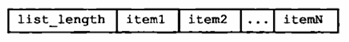

# 10 - RDB持久化
Redis是内存数据库，为了把数据写入磁盘，Redis提供了RDB持久化功能，可以把Redis在内存中的数据库状态保存到磁盘上。RDB持久化既可以手动执行也可以根据服务器配置选项定期执行，它生成一个经过压缩的二进制RDB文件，通过该文件就可以还原数据库状态。

## 10.1 - RDB文件的创建和载入
有两个命令用于手动创建RDB文件，分别是 `SAVE` 和 `BGSAVE` 。其中 `SAVE` 命令阻塞Redis服务器进程直到RDB文件创建完成，如：
```shell
redis> SAVE
# 阻塞直到完成
OK
```
相比之下， `BGSAVE` 命令会派生一个子进程来执行RDB文件的创建，父进程可以继续处理客户端请求，如：
```shell
redis> BGSAVE
# 立即返回
Background saving started
```
创建RDB文件实际上通过 `rdb.c/rdbSave` 函数完成，两个命令以不同的方式调用这个函数。以Python伪代码来表示：
```python
def SAVE():
    rdbSave()   # 直接调用

def BGSAVE():
    pid = fork()    # 创建子进程
    if pid == 0:
        rdbSave()           # 子进程调用
        signal_parent()     # 通知父进程完成
    elif pid > 0:
        handle_request_and_wait_signal()
    else:
        handle_fork_error()
```
虽然RDB文件通过两个命令手动创建，但启动服务器时Redis会自动检测并载入RDB文件，因此它没有提供载入RDB文件的命令。RDB文件的载入是通过 `rdb.c/rdbLoad` 函数来完成的，在有RDB文件的情况下，可以看到这样的日志：
```shell
$ redis-server
[7379] 30 Aug 21:07:01.270 * Server started, Redis version 2.9.11
[7379] 30 Aug 21:07:01.270 * DB loaded from disk: 0.018 seconds     # 表示载入RDB文件
[7379] 30 Aug 21:07:01.270 * The server is now ready to accept connections on port 6379
```
由于AOF文件更新频率更高，因此它记录的数据库很可能更新，Redis会优先选择AOF文件来载入数据库。

### 10.1.1 - SAVE命令执行时的服务器状态
服务器被阻塞，所有的客户端请求也被阻塞，只有执行完 `SAVE` 以后服务器才重新开始处理客户端请求。

### 10.1.2 - BGSAVE命令执行时的服务器状态
虽然 `BGSAVE` 在写入RDB文件时依然可以处理客户端请求，但是它处理 `SAVE` 、`BGSAVE`、`BGREWRITEAOF` 等命令的方式会和平时不同：
- 为了防止父进程和子进程同时调用 `rdbSave` 产生竞争条件，不允许在此时调用 `SAVE` 和 `BGSAVE` 命令
- 为了避免短时间内占用过多性能，`BGREWRITEAOF` 命令会被推迟到 `BGSAVE` 完成后执行

如果服务器正在执行 `BGRWRITEAOF` 命令，那么 `BGSAVE` 命令会被拒绝。

### 10.1.3 - RDB文件载入时的服务器状态
服务器一直阻塞直至RDB文件载入完成。

## 10.2 - 自动间隔性保存
Redis允许配置服务器的 `save` 选项，让其每过一段时间自动执行一次 `BGSAVE` 命令。可以同时设置多个 `save` 配置，其中一个满足就会执行 `BGSAVE` 命令。例如：
```
save 900 1
save 300 10
save 60 10000
```
那么任何一个条件满足就会进行保存：
- 900秒内，进行了1次修改
- 300秒内，进行了10次修改
- 60秒内，进行了10000次修改

自动保存时可以看到如下日志：
```shell
[5085] 03 Sep 17:09:49.463 * 10000 changes in 60 seconds. Saving...
[5085] 03 Sep 17:09:49.463 * Background saving started by pid 5189
[5189] 03 Sep 17:09:49.522 * DB saved on disk
[5189] 03 Sep 17:09:49.522 * RDB: 0 MB of memory used by copy-on-write
[5085] 03 Sep 17:09:49.563 * Background saving terminated with success
```

### 10.2.1 - 设置保存条件
可以通过设置配置文件或传入启动参数来设置 `save` 选项，如果没有进行设置，Redis会使用默认的 `save` 选项：
```
save 900 1
save 300 10
save 60 10000
```
这些选项被保存在 redisServer 结构体的 saveparams 字段中：
```c
struct redisServer {
    // ...
    struct saveparam *saveparams;
    // ...
};
```
这实际上是一个数组，指向的每个 saveparam 结构都包含了一个保存条件：
```
struct saveparam {
    time_t seconds;     // 间隔时间
    int changes;        // 修改次数
};
```

### 10.2.2 - dirty 计数器和 lastsave 属性
除了 saveparams 数组，服务器还维护一个 dirty 计数器和 lastsave 属性：
```c
struct redisServer {
    // ...

    // 修改计数器
    long long dirty;

    // 上一次执行保存的时间
    time_t lastsave;

    // ...
}
```
每当服务器执行一个修改数据的指令，服务器就递增 dirty 计数器，修改了多少次数据库就增加多少，比如：
```shell
redis> SADD database Redis MongoDB MariaDB
(integer) 3
```
这个命令会把 dirty 增加 3。

当执行 SAVE 或 BGSAVE 以后，dirty 会被重置。

lastsave 是一个秒级 UNIX 时间戳，记录上一次执行 SAVE 或 BGSAVE 的时间。

### 10.2.3 - 检查保存条件是否满足
Redis 每隔 100 毫秒执行一次 serverCron 函数，它负责维护正在执行的服务器，其中一项工作就是检查所有 save 的条件，如果其中一个满足它执行 BGSAVE 命令，当 BGSAVE 执行完毕以后 dirty 才被重置。

## 10.3 - RDB 文件结构


如图，RDB 文件总共分为五个部分。最前面是 5 个字符 REDIS，标志这是一个 RDB 文件。

然后是 db_version，一个 4 字节整数，表示 RDB 文件的版本号。

接着是 RDB 文件的主体部分，即 databases，包含零或多个数据库。如果数据库为空，则没有这个不分。

后面是 EOF，表示 RDB 文件正文部分结束。最后还放了一个 8 字节的校验和 check_sum。

### 10.3.1 - databases 部分
每个非空数据库的结构为：


最前面的 1 字节 SELECTDB 是一个固定常量，表示这是一个数据库的开始。然后是数据库编号 db_number，根据号码大小的不同，它可以是 1、2、5 字节长。

key_value_pairs 部分则保存全部的键值对，如果键有过期时间，那么它也会跟键值对保存在一起。

### 10.3.2 - key_value_pairs 部分
不带过期时间的键值对结构为：


TYPE 记录值的类型，长度 1 字节，可以取如下常量值：
- REDIS_RDB_TYPE_STRING
- REDIS_RDB_TYPE_LIST
- REDIS_RDB_TYPE_SET
- REDIS_RDB_TYPE_ZSET
- REDIS_RDB_TYPE_HASH
- REDIS_RDB_TYPE_LIST_ZIPLIST
- REDIS_RDB_TYPE_SET_INTSET
- REDIS_RDB_TYPE_ZSET_ZIPLIST
- REDIS_RDB_TYPE_HASH_ZIPLIST

key 和 value 分别是键和值。


如果有过期时间，它被保存在键值对的前面。EXPIRETIME_MS 是 1 字节常量，表示这个键值对有过期时间。接下来的 ms 是 8 字节长的 UNIX 毫秒级时间戳，即过期的时间。

### 10.3.3 - value 的编码
取决于 TYPE 的值，不同类型的 value 有不同的编码方式。

#### 字符串对象
REDIS_RDB_TYPE_STRING。第 8 章提到，字符串对象有不同的编码方式。

如果字符串对象是 REDIS_ENCODING_INT 编码，那么在 RDB 中它的格式如下图。其中 ENCODING 可以取 REDIS_RDB_ENC_INT8、REDIS_RDB_ENC_INT16、REDIS_RDB_ENC_INT32 中的一个，分别使用 8、16、32 位来存储整数。


如果字符串对象是 REDIS_ENCODING_RAW 编码，当它的长度不超 20 字节，字符串就被原样保存，如下图：


如果它的长度超过 20 字节，那么它被压缩以后存储，如下图。可以看到类型被标记为 REDIS_RDB_ENC_LZF，表示字符串通过 LZF 压缩算法压缩过。后面的 compressed_len 是压缩后的长度，original_len 是原始长度。compressed_string 是压缩后的字符串。


#### 列表对象
REDIS_RDB_TYPE_LIST。此时 value 保存一个 REDIS_ENCODING_LINKEDLIST 编码的列表对象，结构如图：



list_length 是列表中元素数量。后面多个 item 连续存放，每个是一个对象，并没有指向下一个元素的指针。

#### 集合对象
REDIS_RDB_TYPE_SET。此时 value 保存一个 REDIS_ENCODING_HT 编码的集合对象，结构如图：


跟列表对象没有什么区别。

#### 哈希表对象
REDIS_RDB_TYPE_HASH。此时 value 保存一个 REDIS_ENCODING_HT 编码的哈希表对象，跟集合对象一样。区别在于它的每个对象都是一个键值对：


#### 有序集合对象
REDIS_RDB_TYPE_ZSET。此时 value 保存一个 REDIS_ENCODING_SKIPLIST 编码的有序集合对象，结构如图：


跟上面的类似。每个元素的 member 保存字符串对象，score 保存分值（从 double 转换成字符串存储）。

#### INTSET 编码的集合
REDIS_RDB_TYPE_SET_INTSET。此时 value 保存一个整数集合对象，它被转换成字符串对象存储。

#### ZIPLIST 编码的列表、哈希表或有序集合
REDIS_RDB_TYPE_LIST_ZIPLIST、REDIS_RDB_TYPE_HASH_ZIPLIST、REDIS_RDB_TYPE_ZSET_ZIPLIST。此时 value 保存一个 ziplist 对象，它被转换成字符串对象存储。

## 10.4 - 分析 RDB 文件
通过 `od` 命令可以分析 Redis 生成的 RDB 文件，可以按照执行的格式打印输入文件。给定 `-c` 按 ASCII 打印，`-x` 按十六进制打印，等等。

### 10.4.1 - 不包含任何键值对的 RDB 文件
先创建一个不含数据的 RDB 文件：
```shell
redis> FLUSHALL
OK

redis> SAVE
OK
```
使用 `od` 命令查看：


一开始是 REDIS，然后 0006 是 RDB 文件版本号，377 是常量 EOF，紧接着的 8 个字节是检验和。

### 10.4.2 - 包含字符串键的 RDB 文件
创建一个字符串键：
```shell
redis> FLUSHALL
OK

redis> SET MSG "HELLO"
OK

redis> SAVE
OK
```
使用 `od` 命令查看：


观察 0006 后面的部分。376 是 SELECTDB，\0 表示数据库编号 0。接下来的部分就是字符串对象：
```
\0 003 M S G 005 H E L L O
```
\0 是 REDIS_RDB_TYPE_STRING 对应的值，003 是键的长度，MSG 是键的内容，005 是值的长度，HELLO 是值的内容。

### 10.4.3 - 包含带有过期时间的字符串键的 RDB 文件
创建一个带有过期时间的字符串键：
```shell
redis> FLUSHALL
OK

redis> SETEX MSG 10086 "HELLO"
OK

redis> SAVE
OK
```
查看 RDB 文件：


可以看到过期时间的部分：
```
374 \ 2 365 336 @ 001 \0 \0
```
374 是 EXPIRETIME_MS，后面的 8 个字节是时间戳。

### 10.4.4 - 包含列表键的 RDB 文件
```shell
redis> FLUSHALL
OK

redis> SADD LANG "C" "JAVA" "RUBY"
(integer) 3

redis> SAVE
OK
```
查看 RDB 文件：


002 是 REDIS_RDB_TYPE_SET，004 是集合键的长度，LANG 是键。后面是集合中的三个字符串对象 RUBY、JAVA、C。

### 10.4.5 - 关于分析 RDB 文件的说明
实际上 Redis 自带 RDB 文件检查工具 redis-check-dump，也有很多其他处理 RDB 文件的工具，从而并不需要人工分析 RDB 文件。

另外，使用 `od` 指令时，传入 `-cx` 选项可以同时显示 ASCII 和十六进制，会更加直观。