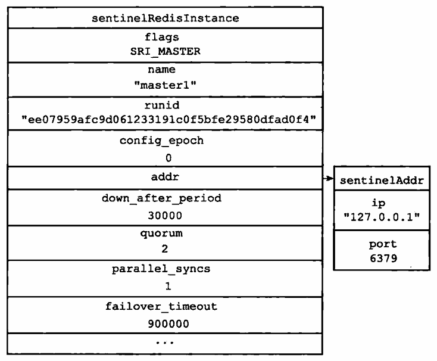

# 16 - Sentinel
Sentinel 又称哨兵，是 Redis 的高可用性解决方案。它们监控 Redis 主从服务器的状态，在主服务器下线的时候自动实现故障转移，挑选一个从服务器提升为主服务器。

## 16.1 - 启动并初始化 Sentinel
通过以下两条指令都可以让 Redis 以 Sentinel 模式启动：
```shell
$ redis-server /path/to/sentinel.conf --sentinel
$ redis-sentinel /path/to/sentinel.conf
```
此时会依次执行如下步骤：
1. 初始化服务器
1. 将普通的 Redis 代码替换为 Sentinel 代码
1. 初始化 Sentinel 状态
1. 根据配置文件初始化 Sentinel 的监视主服务器列表
1. 创建连向主服务器的网络连接

### 16.1.1 - 初始化服务器
本质上 Sentinel 是一个运行在特殊模式下的 Redis 服务器，因此一开始它经历普通服务器的初始化过程。不过有一些区别：
- Sentinel 服务器没有数据库，所有不会有数据库相关的初始化操作，以及数据库载入等等
- Sentinel 支持的操作不同，因此它的符号表中的命令也不同

一般来讲，它只支持以下几个命令：
- 复制命令：由 Sentinel 内部使用，不可以由客户端调用
- 发布与订阅指令：订阅指令都可以使用，PUBLISH 命令不能由客户端调用
- 文件事件处理器：Sentinel 内部使用，但操作和普通服务器不同
- 时间事件处理器：Sentinel 内部使用，也是 serverCron 函数，此时它会调用 sentinel.c/sentinelTimer 函数，它处理 Sentinel 的所有操作

### 16.1.2 - 使用 Sentinel 专用代码
比如 Sentinel 服务器的命令表不同，而且它使用的端口是 sentinel.c/REDIS_SENTINEL_PORT，而不是普通服务器的端口。

### 16.1.3 - 初始化 Sentinel 状态
一般服务器相关的状态仍然由 redis.h/redisServer 保存，Sentinel 相关的状态则由 sentinel.h/sentinelState 保存：
```c
struct sentinelState {
    // 当前纪元，用于实现故障转移
    uint64_t current_epoch;

    // 所有被监视的主服务器
    dict *masters;

    // 是否进入了 TILT 模式
    int tilt;

    // 目前正在执行的脚本数量
    int running_scripts;

    // 进入 TILT 模式的时间
    mstime_t tilt_start_time;

    // 最后一次执行时间处理器的时间
    mstime_t previous_time;

    // 包含所有用户要执行的脚本的队列
    list *scripts_queue;
} sentinel;
```

### 16.1.4 - 初始化 Sentinel 状态的 masters 属性
其中的 masters 字典记录了所有被 Sentinel 监视的主服务器的相关信息，键是被监视主服务器的名字，值是被监视主服务器的 sentinel.c/sentinelRedisInstance 结构。

每个 sentinelRedisInstance 用来记录 Sentinel 架构中的一个实例，可以是主服务器、从服务器或者另一个 Sentinel 服务器。结构如下：
```c
typedef struct sentinelRedisInstance {
    // 标识值，记录实例类型和当前状态
    int flags;

    // 实例名字，主服务器在配置文件中指定，从服务器自动设置为 ip:port
    char *name;

    // 实例的运行 ID
    char *runid;

    // 配置纪元，用于实现故障转移
    uint64_t config_epoch;

    // 实例的地址
    sentinelAddr *addr;

    // SENTINEL down-after-milliseconds 选项的值
    mstime_t down_after_period;

    // 判断客观下线需要的投票数量
    int quorum;

    // 故障转移时，可以同时对新的主服务器进行同步的从服务器数量
    int parallel_syncs;

    // 刷新故障迁移状态的最大时限
    mstime_t failover_timeout;

    // ...
} sentinelRedisInstance;
```
其中的 addr 属性是一个 sentinel.c/sentinelAddr 指针，保存实例的 IP 和端口号：
```c
typedef struct sentinelAddr {
    char *ip;
    int port;
} sentinelAddr
```
如果配置文件中制定了服务器 master1：


那么生成的 sentinelRedisInstance 结构如：



### 16.1.5 - 创建连向主服务器的网络连接
Sentinel 会向每个监视的主服务器建立两个连接：
- 命令连接，作为客户端向主服务器发送命令
- 订阅连接，用于订阅主服务器的 __sentinel__:hello 频道

## 16.2 - 获取主服务器信息
Sentinel 默认每 10 秒向主服务器发送 `INFO` 命令，它主要关注两方面的信息：
- 主服务器的本身的状态，Sentinel 根据其中的 run_id 和 role 属性来更新 sentinelRedisInstance 结构
- 主服务器保存的所有从服务器的值信息，Sentinel 会记录下所有的从服务器

主服务器关联的从服务器被记录在主服务器 sentinelRedisInstance 结构的 slaves 属性中，这是一个字典，键是从服务器的名字，值是从服务器的 sentinelRedisInstance 结构。从服务器的名字被设置为 ip:port。

主服务器的 flags 为 SRI_MASTER，从服务器的 flags 为 SRI_SLAVE。

## 16.3 - 获取从服务器信息
当 Sentinel 发现新的从服务器，它会创建到从服务器的命令连接和订阅连接，同样每过 10 秒它会向从服务器发送 `INFO` 命令，从回复中提取如下信息：
- 从服务器的运行 ID
- 从服务器的角色 role
- 主服务器的 IP 和端口号
- 主从服务器的连接状态
- 从服务器的优先级
- 从服务器的复制偏移量

## 16.4 - 向主服务器和从服务器发送信息
Sentinel 默认每 2 秒通过命令连接向所有监视的主从服务器发送命令：
```
PUBLISH __sentinel__:hello "<s_ip>,<s_port>,<s_runid>,<s_epoch>,<m__name>,<m_ip>,<m_port>,<m_epoch>"
```
其中，s 开头的是 Sentinel 自己的信息；m 开头的是主服务器的信息，对于主服务器是自己的信息，对于从服务器是它复制的主服务器的信息。

这表示它希望向 \__sentinel__:hello 频道发送信息。

## 16.5 - 接受来自主服务器和从服务器的频道信息
Sentinel 建立订阅连接以后会在订阅连接发送命令：
```
SUBSCRIBE __sentinel__:hello
```
这表示它希望接收到 \__sentinel__:hello 频道的信息。

因此，当一个 Sentinel 向该频道发布信息以后，其他 Sentinel 就可以注意到它，比把它记录下来。

### 16.5.1 - 更新 sentinels 字典
Sentinel 把关注一个主服务器的其他 Sentinel 记录在主服务器的 sentinelRedisInstance 结构的 sentinels 字典中，键是 Sentinel 的 ip:port，键是 Sentinel 的 sentinelRedisInstance 结构。

### 16.5.2 - 创建连向其他 Sentinel 的命令连接
Sentinel 之间为了交换一些信息，会建立命令连接，通常它们分别建立一条到对方的连接。

由于订阅连接是用于发现其他 Sentinel 的，因此 Sentinel 之间并不需要订阅连接。

## 16.6 - 检测主观下线状态
Sentinel 默认每 1 秒向了解到的所有实例发送 PING 命令检查它们是否在线。一般它可能收到的有效回复有 +PONG、-LOADING、-MASTERDOWN，其他的回复视为无效回复。

Sentinel 配置文件中的 down-after-milliseconds 选项指定了一个超时时间，如果超过这个时间没收到一个实例的有效回复，则认为这个实例已经主观下线。把它的 flags 按位与上 SRI_S_DOWN 标识。

注意，监视同一个主服务器的多个 Sentinel 可能设置了不同的超时时间。

## 16.7 - 检查客观下线状态
只有足够多的 Sentinel 认为一个主服务器已经主观下线，才认为它已经客观下线。

### 16.7.1 - 发送 SENTINEL is-master-down-by-addr 命令
Sentinel 通过该命令询问其他 Sentinel 是否认为一个主服务器已经下线：
```
SENTINEL is-master-down-by-addr <ip> <port> <current_epoch> <runid>
```
其中 runid 可以是 * 或运行 ID，如果是 * 则用于检测主服务器的客观下线状态，如果是运行 ID 则用于选举领头 Sentinel。

### 16.7.2 - 接收 SENTINEL is-master-down-by-addr 命令
当一个 Sentinel 收到该命令，它回送一个回复，包含 3 个参数：
- down_state：1 表示主服务器已经下线，0 表示主服务器没有下线
- leader_runid：如果是 * 则仅用于检测主服务器下线状态，如果是运行 ID 则用于选举领头 Sentinel
- leader_epoch：领头 Sentinel 的配置纪元，如果 leader_runid 是 * 则该值总为 0

### 16.7.3 - 接收 SENTINEL is-master-down-by-addr 命令的回复
如果最初发出询问的 Sentinel 收到足够多认为主服务器下线的回复，它就认为该服务器客观下线，并把它的 flags 进一步按位与上 SRI_O_DOWN 标识。用于判断的数量由 Sentinel 配置的 quorum 参数决定。

同样，不同的 Sentinel 可能设置不同的 quorum 参数。

## 16.8 - 选举领头 Sentinel
当认为主服务器客观下线时，就需要一个领头 Sentinel 来负责执行故障转移。

规则如下：
- 每个认为主服务器客观下线的 Sentinel 都可以参与竞选
- 每次竞选无论是否成功，递增配置纪元
- 参与竞选的 Sentinel 会向其他 Sentinel 发送 SENTINEL is-master-down-by-addr 命令，带上自己的运行 ID 来要求其他 Sentinel 投票
- 每个 Sentinel 为最先收到的运行 ID 投票，然后拒绝其他 Sentinel 的投票请求。它发送一个回复，带上自己投票的领导者的运行 ID 和配置纪元
- 竞选的 Sentinel 收到回复以后如果发现其中的运行 ID 和自己的相同，就知道对方给自己投了一票
- 如果一个 Sentinel 收到超过半数的投票，它就成为领头 Sentinel
- 如果超过一定意见没有选出领头 Sentinel，那么在一段时间以后再次选举

## 16.9 - 故障转移
有了领头 Sentinel，就可以进行故障转移操作了，分为 3 个步骤。

### 16.9.1 - 选出新的主服务器
按如下规则，从从服务器列表中依次排除：
1. 删除已经下线或断联的从服务器
1. 删除最近 5 秒都没有回复过领头 Sentinel 的 INFO 命令的服务器
1. 删除与主服务器连接断开超过 down-after-milliseconds * 10 毫秒的服务器，避免它的状态落后主服务器太多

然后依次挑选：
1. 最高优先级
1. 最大复制偏移量
1. 最小运行 ID

然后它向选出的服务器发送 `SLAVEOF no one` 命令，让它成为新的主服务器。当下次它对于 `INFO` 命令的回复中带有 role:master 时，就认为它已经成为新的主服务器。

### 16.9.2 - 修改从服务器的复制目标
给所有的其他从服务器发送 `SLAVEOF new_master_ip new_master_port` 命令，让它们复制新的主服务器。

### 16.9.3 - 将旧的主服务器变为从服务器
主服务器的 sentinelRedisInstance 结构被保留，当它再次上线的时候，领头 Sentinel 会向它发送发送 `SLAVEOF` 命令，让它成为新主服务器的从服务器。