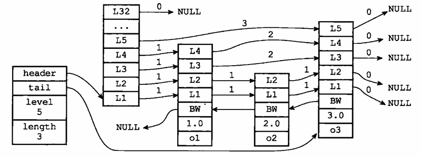

# 5 - 跳跃表
跳跃表是一种有序数据结构，通过在节点中维持多个指向其他节点的指针来达到快速访问节点的目的。它支持平均 $O(logN)$ 和最坏 $O(N)$ 的节点查找，同时可以通过顺序性操作批量处理节点。大部分情况下跳跃表的速度堪比平衡树，但它的实现要更简单。

Redis 使用跳表作为有序集合键的底层实现之一，当有序集合包含的元素多或者元素的成员是比较长的字符串时，Redis 就会使用跳跃表来作为其底层实现。比如：
```shell
# 打印有序集合 fruit-price 的前三个（把元素的分数一起打印）
redis> ZRANGE fruit-price 0 2 WITHSCORES
1) "banana"
2) "5"
3) "cherry"
4) "6.5"
5) "apple"
6) "8"

# 查看元素数量
redis> ZCARD fruit-price
(integer)130
```
跳跃表的应用没有链表、字典那么广泛，Redis 只在实现有序集合和集群节点中使用了它。

## 跳跃表的实现
Redis 的跳跃表由 redis.h/zskiplistNode 和 redis.h/zskiplist 两个结构体定义，一个跳跃表的示例如下：



最左边是 zskiplist 结构，它有 4 个属性：
- header：指向跳跃表的头结点
- tail：指向跳跃表的尾结点
- level：跳跃表内节点的最大层数（不计表头节点的层数）
- length：跳跃表的长度，即节点的数量（不计表头节点）

右侧的 4 个都是 zskiplistNode 结构，它有如下属性：
- 层：图中的 L1、L2 等。每个层带有两个属性，前进指针属性用于向前访问其他节点；跨度属性为前进指针指向的节点与当前节点的距离，在图中用箭头上的数字表示。
- 后退指针：节点中用 BW 标记的指针，指向当前节点距离为 1 的前一个节点，当从表尾向表头遍历时使用。
- 分值：图中节点里的 1.0、2.0 等，节点会按照分值从小到大排列。
- 成员对象：图中的 o1、o2 等，每个节点实际保存一个对象。

表头节点的结构实际上跟其他节点是一样的，但是它只用得上层指针，从而其他属性没有在图中显示。

### 跳跃表节点
跳跃表节点的定义如下
```c
typedef struct zskiplistNode {
    // 层
    struct zskiplistLevel {
        // 前进指针
        struct zskiplistNode *forward;

        // 跨度
        unsigned int span;
    } level[];

    // 后退指针
    struct zskiplistNode *backward;

    // 分值
    double score;

    // 成员对象
    robj *obj;
} zskiplistNode;
```

#### 层
跳跃表节点包含的是一个层数组，其中每个元素都指向一个其他节点，一般来说层的数量越多访问节点的速度越快。

每次创建一个跳跃表节点时，会根据幂次定律（越大的数出现的概率越小）随机生成一个介于 1 和 32 之间的数作为 level 数组的大小，作为层的高度。

每个层都有一个前进指针，指向下一个节点。

层的跨度指出前进指针指向的节点与当前节点的距离。跨度越大，说明节点之间的距离越远。如果前进指针指向的是 NULL ，那么跨度为 0。

当遍历的时候，只使用前进指针，同时不断累加跨度，当找到节点时就知道节点的位置（排位，rank）。

#### 后退指针
后退指针用于逆向遍历跳跃表，与前进指针一次可能跨越多个节点不同，后退指针只能移动到前一个节点。第一个节点（不是表头节点）的后退指针指向 NULL，标志着遍历结束。

#### 分值和成员
节点有一个 double 类型的 score，跳跃表中的节点按照 score 从小到大排列。还有一个 obj 指针，指向一个 SDS 字符串对象。每个节点保存的对象需要是唯一的，但是 score 可以相同，此时它们按照成员对象的字典序大小排列。

### 跳跃表
Redis 使用了一个 zskiplist 结构体来维护跳跃表，它的定义如下：
```c
typedef struct zskiplist {
    // 表头节点和表尾节点
    struct zskiplistNode *header, *tail;

    // 表中节点的数量
    unsigned long length;

    // 表中层数最大的节点的层数
    int level;
} zskiplist;
```

## 跳跃表 API
| 函数 | 作用 | 时间复杂度 |
| --- | --- | --- |
| zslCreate | 创建一个跳跃表 | O(1) |
| zslFree | 释放跳跃表以及所有节点 | O(N) |
| zslInsert | 向跳跃表中插入给定成员和分值的节点 | 平均 O(logN)，最坏 O(N) |
| zslDelete | 从跳跃表中删除给定成员和分值的节点 | 平均 O(logN)，最坏 O(N) |
| zslGetRank | 获取给定成员和分值的节点在跳跃表中的排位 | 平均 O(logN)，最坏 O(N) |
| zslGetElementByRank | 获取跳跃表中给定排位的节点 | 平均 O(logN)，最坏 O(N) |
| zslIsInRange | 给定分值范围，检查跳跃表中是否有节点在范围内 | O(1) |
| zslFirstInRange | 获取跳跃表中第一个分值在给定范围内的节点 | 平均 O(logN)，最坏 O(N) |
| zslLastInRange | 获取跳跃表中最后一个分值在给定范围内的节点 | 平均 O(logN)，最坏 O(N) |
| zslDeleteRangeByScore | 删除跳跃表中在给定分值范围内的节点 | O(N)，N为被删除的节点数量 |
| zslDeleteRangeByRank | 删除跳跃表中在给定排位范围内的节点 | O(N)，N为被删除的节点数量 |