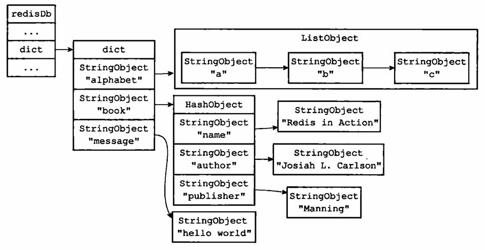
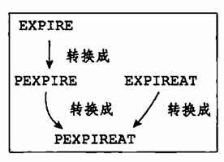

# 9 - 数据库

## 9.1 - 服务器中的数据库
Redis 把所有数据库保存在 redis.h/redisServer 中的 db 数组中，每个元素都是一个 resemble.h/redisDb 结构体，表示一个数据库：
```c
struct redisServer {
    // ...
    redisDb *db;
    // ...
};
```
其中还有一个字段决定服务器初始化时创建的数据库数量：
```c
struct redisServer {
    // ...
    int dbnum;
    // ...
};
```
这个数量由服务器配置的 database 选项决定，默认值为 16。

## 9.2 - 切换数据库
Redis 每个客户端有一个目标数据库，当它们要执行读写命令时，就会操作目标数据库。默认情况下的目标数据库为 0 号数据库，客户端可以通过 SELECT 命令切换目标数据库：
```shell
redis > SELECT 1
```
实际上这是由客户端结构体 redisClient 中的指针 db 保存的：
```c
typedef struct redisClient {
    // ...
    redisDb *db;
    // ...
} redisClient;
```

注意，Redis 当前没有指令查看当前目标数据库的编号，虽然在交互模式中提示符会显示当前数据库的编号，但不使用交互模式的情况下可能搞不清楚当前目标数据库。

## 9.3 - 数据库键空间
在 redisDb 中，使用一个字典保存所有的键值对，称为键空间：
```c
typedef struct redisDb {
    // ...
    dict *dict;
    // ...
} redisDb;
```
它使用对象的键作为字典的键，使用对象的值作为字典的值。



### 9.3.1 - 添加新键
```shell
redis> SET date "2013.12.1"
OK
```
键是字符串对象，内容为 date；值是字符串对象，内容为 2013.12.1。

### 9.3.2 - 删除键
```shell
redis> DEL book
(integer) 1
```

### 9.3.3 - 更新键
```shell
redis> SET date "2013.12.2"
OK
```

### 9.3.4 - 对键取值
```shell
redis> GET message
"Hello, world!"
```

### 9.3.5 - 读写键空间时的维护操作
Redis 通常在执行读写命令的同时进行一些额外维护操作，包括：
- 读取一个键后，根据键是否存在来更新键空间的命中和不命中次数。可以通过 `INFO stats` 返回的 `keyspace_hits` 和 `keyspace_misses` 字段查看。
- 读取一个键以后，会更新键的最后访问时间，可以用于计算键的闲置时间。使用 `OBJECT idletime key` 命令查看。
- 如果读取一个键时发现键已经过期，会先删除一个键然后执行余下操作。
- 如果客户端使用 `WATCH` 监视了某个键，这个键被修改以后会被标记为脏
- 服务器每修改一个键，就递增脏计数器，用于触发持久化和复制
- 如果开启了数据库通知功能，修改了键以后会发送通知

## 9.4 - 设置键的生存时间或过期时间
通过 `EXPIRE` 命令（秒）和 `PEXPIRE` 命令（毫秒）可以为键设置生存时长，经过指定时间后键会被自动删除：
```shell
redis> EXPIRE key 10
(integer) 1
```
`SETEX` 可以在设置一个键的同时指定过期时间，但它只能用于字符串对象。

客户端还可以使用 `EXPIREAT` 命令（秒）和 `PEXPIREAT` 命令（毫秒）为键设置过期时间，是一个 UNIX 时间戳，到达其指定的时间时键会被自动删除：
```shell
redis> EXPIREAT key 1293840000
(integer) 1
```

对于设定了生存时长或过期时间的键，可以通过 `TTL` 命令（秒）和 `PTTL` 命令（毫秒）查看它还有多少时间会被删除：
```shell
redis> TTL key
(integer) 10
```

### 9.4.1 - 设置过期时间
实际上它们都是通过 `PEXPIREAT` 实现的：


### 9.4.2 - 保存过期时间
在 `redisDb` 中使用了一个 `expires` 字典来保存所有键的过期时间，称为过期字典：
```c
typedef struct redisDb {
    // ...
    dict *expires;
    // ...
} redisDb;
```
它的键是指向某个键的指针，值是一个 long long 类型的整数，保存过期的毫秒级 UNIX 时间戳。

### 9.4.3 - 移除过期时间
使用 `PERSIST` 可以移除键的过期时间：
```shell
redis> PERSIST key
(integer) 1

redis> TTL key
(integer) -1
```

### 9.4.4 计算并返回剩余生存时间
`TTL` 和 `PTTL` 分别获得秒级和毫秒级的剩余生存时间，它们在过期字典中找到过期的时间戳，然后减去当前时间戳，得到剩余生存时间。

### 9.4.5 - 过期键的判定
对于一个键，先检查它是否存在于过期字典中，如果不在则键不会过期；如果在，再检查当前时间戳是否超过了过期时间戳，如果超过则键已经过期，否则未过期。

## 9.5 - 过期键删除策略
一个过期的键，有 3 种不同的删除策略：
- 定时删除：设置键的过期时间同时创建一个定时器，超时的时候删除键。
- 惰性删除：不主动删除过期键，在读取键的时候检查是否过期，过期则删除。
- 定期删除：每过一段时间对数据库中的键做检查，删除其中的过期键。检查多少个数据库、删除多少个过期键都由算法决定。

### 9.5.1 - 定时删除
因为键过期就被删除，最节约内存。然而总是执行键的删除，会消耗 CPU 时间，在高负载的情况下可能会影响性能。

并且创建定时器需要用到 Redis 时间事件，它的实现方式是无序链表，查找一个事件的复杂度是 O(N)，从而不能高效处理大量时间事件。

### 9.5.2 - 惰性删除
时间开销最小，但过期键被保留从而消耗内存。根据它的策略，没有被访问的过期键甚至带来内存泄漏，除非手动执行 `FLUSHDB`。

### 9.5.3 - 定期删除
这可以看做一种折中方案，然而难点是确定删除的频率和单次删除执行时长。如果删除策略过于激进则会影响性能，如果过于保守则会浪费内存。

## 9.6 - Redis 的过期键删除策略
Redis 实际搭配使用惰性删除和定期删除两种策略，从而兼顾了内存和 CPU 的消耗。

### 9.6.1 - 惰性删除策略的实现
惰性删除通过 db.c/expireIfNeeded 函数实现，每次读写数据库之前都会通过它对输入键进行检查，如果键过期它直接删除这个键。然后，才会执行实际的读写操作。

### 9.6.2 - 定期删除策略的实现
定期删除通过 db.c/activeExpireCycle 函数实现，服务器会周期性执行 redis.c/serverCron 函数，其中会调用 activeExpireCycle 函数。它在规定时间内分多次遍历所有数据库，从 `expires` 字典中随机取出一部分键检查是否过期，如果超出了规定的时间则停止。

因为需要遍历所有数据库，维护一个全局变量 current_db 来保存到的数据库编号，下次从这里继续。遍历完一轮以后把它重置为 0。

## 9.7 - AOF、RDB 和复制功能对过期键的处理

### 9.7.1 - 生成 RDB 文件
在生成 RDB 文件时，会对键进行检查，从而过期键不会被保存。

### 9.7.2 - 载入 RDB 文件
- 如果服务器是主服务器，那么载入 RDB 文件时会对键进行检查，过期键不会被载入
- 如果服务器是从服务器，那么不管键是否过期都会被载入，它们直到主从同步的时候被删除

### 9.7.3 - AOF 文件写入
当键被惰性删除或者定期删除以后，程序向 AOF 文件追加一条 DEL 命令来表示键已被删除。

### 9.7.4 - AOF 重写
在 AOF 进行重写的时候，它会检查键是否过期，如果过期则不会备份它。

### 9.7.5 - 复制
如果服务器运行在复制模式下，从服务器的过期键删除由主服务器控制：
- 主服务器删除一个键后，显式向从服务器发送一个 DEL 指令，通知它删除该键
- 从服务器在处理客户端读请求时，并不主动删除过期键，只有在接收到主服务器的 DEL 指令后才会删除

这样的策略可以保证主从服务器的数据一致性，当过期键还没有被主服务器删除时，它也没有被从服务器删除。

## 9.8 - 数据库通知
这是 Redis 2.8 新增的功能，可以让客户端订阅给定的频道或模式，从而获知特定键的变化，以及命令的执行情况。例如，以下代码订阅 0 号数据库的对于键 message 的所有命令：
```shell
redis> SUBSCRIBE __keyspace@0__:message
Reading messages... (press Ctrl-C to quit)

1) "subscribe"  # 订阅成功
2) "__keyspace@0__:message"
3) (integer) 1

1) "message"    # 收到通知
2) "__keyspace@0__:message"
3) "set"

1) "message"
2) "__keyspace@0__:message"
3) "expire"

1) "message"
2) "__keyspace@0__:message"
3) "del"
```
这样的通知称为键空间通知，关注对于键执行了什么指令；还有一类通知叫键事件通知，关注某个指令作用于哪个键。例如：
```shell
redis> SUBSCRIBE __keyevent@0__:del
Reading messages... (press Ctrl-C to quit)

1) "subscribe"
2) "__keyevent@0__:del"
3) (integer) 1

1) "message"
2) "__keyevent@0__:del"
3) "key"

1) "message"
2) "__keyevent@0__:del"
3) "number"

1) "message"
2) "__keyevent@0__:del"
3) "message"
```
通过配置服务器的 notify-keyspace-events 选项，决定服务器发送通知的类型：
- AKE：发送所有键空间和键事件通知
- AK：发送所有键空间通知
- AE：发送所有键事件通知
- K$：只发送和字符串键有关的键空间通知
- El：只发送和列表键有关的键事件通知

### 9.8.1 - 发送通知
发送通知是通过函数 notify.c/notfyKeyspaceEvent 来实现的，原型如下：
```c
void notifyKeyspaceEvent(int type, char *event, robj *key, int dbid);
```
`type` 是想要发送的通知类型，程序会跟 notify-keyspace-events 选项比对来决定是否发送通知。`event` 是事件名称，`key` 产生事件的键，`dbid` 产生事件的数据库编号。

像 set 和 del 之类的命令，完成相应的操作以后都调用这个函数发送通知。

### 9.8.2 - 发送通知的实现
- 如果传入的通知类型不被 notify-keyspace-events 选项允许，直接返回
- 检测服务器是否允许发送键空间通知，允许则发送键空间通知
- 检测服务器是否允许发送键事件通知，允许则发送键事件通知

发送通知实际上通过 PUBLISH 命令会用到的 pubsubPublishMessage 函数实现，在 18 章详细介绍。