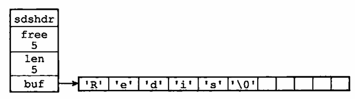
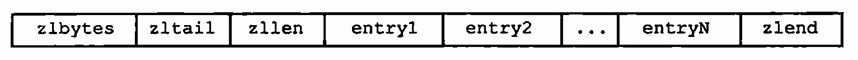

# 2 - 简单动态字符串
Redis没有使用C风格字符串，而是构建了一种名为简单动态字符串（SDS）的抽象类型，用它做默认字符串表示。C风格字符串则基本只用于字面值常量，如：
```c
redisLog(REDIS_WARNING, "Redis is now ready to exit, bye bye...");
```

因此，在Redis数据库中，存储字符串使用的是SDS。例如执行命令：
```shell
redis> SET msg "hello world"
```
Redis创建一个键值对：
- 键是一个字符串对象，底层中是保存"msg"的SDS
- 值是一个字符串对象，底层中是保存"hello world"的SDS

SDS还可以用作缓冲区，如AOF模块中的缓冲区，以及客户端状态中的输入缓冲区。

## SDS的定义
```c
struct sdshdr {
    int len;        // 已使用空间的长度
    int free;       // 未使用空间的长度
    char buf[];     // 字节数组，保存字符串（以'\0'结尾）
};
```
空字符由Redis自动维护，len和free均不计入空字符。例如：



## SDS和C字符串的区别

### 常数复杂度获取字符串长度
对于C风格字符串，获取它的长度总是需要遍历整个字符串。而SDS则可以简单地返回len属性。SDS在操作字符串的时候会自动维护好len属性。

### 杜绝缓冲区溢出
由于C字符串获取长度的困难，库函数往往不对字符串进行检查，很容易会有缓冲区溢出的问题。如在没有分配空间的情况下就把字符串 `strcat` 到已有字符串后面。

相比之下SDS会提前检查空间是否足够，如果不够则会自动扩展空间。

### 减少修改字符串时带来的内存重分配次数
SDS通过预留一部分未使用空间来试图减少内存重新分配的次数，它通过两种优化策略来实现：
- 空间预分配：如果字符串需要更大的空间，SDS通常会多分配一些内存，具体策略为
    - 如果需要的长度小于1M，那么free会等于len，即分配双倍的空间
    - 如果需要的长度大于1M，那么free会等于1M，即多分配1M的空间
- 惰性空间释放：如果字符串的长度缩短，SDS并不会立即释放多余的空间，同时它提供了API来手动释放多余的空间。

### 二进制安全
SDS是二进制安全的，这意味着字符串中间可以出现空字符，SDS的API可以良好的处理这种情况。从而可以使用SDS存储图片等二进制数据。

### 兼容部分C字符串函数
因为SDS的数组也以空字符结尾，所以它能够复用某些C语言字符串库函数。

### 总结
两者的区别在表格中列出：
| 特点 | SDS | C字符串 |
| --- | --- | --- |
| 获取长度 | O(1) | O(N) |
| 防止缓冲区溢出 | 是 | 否 |
| 减少内存重分配次数 | 是 | 否 |
| 可以保存二进制数据 | 是 | 否 |
| 使用 `<string.h>` 中函数 | 部分 | 全部 |

## SDS API
| 函数 | 作用 | 时间复杂度 |
| --- | --- | --- |
| sdsnew | 创建一个包含给定C字符串的SDS | O(N) |
| sdsempty | 创建一个空SDS | O(1) |
| sdsfree | 释放SDS | O(N) |
| sdslen | 获取SDS的长度 | O(1) |
| sdsavail | 获取SDS的未使用空间 | O(1) |
| sdsdup | 复制SDS | O(N) |
| sdsclear | 清空SDS | O(1) |
| sdscat | 将给定C字符串拼接到SDS的末尾 | O(N)，N为C字符串的长度 |
| sdscatsds | 将给定SDS拼接到SDS的末尾 | O(N)，N为被拼接的SDS的长度 |
| sdscpy | 将给定C字符串复制到SDS中，覆盖原有字符串 | O(N)，N为C字符串的长度 |
| sdsgrowzero | 扩展SDS的长度，未使用空间用0填充 | O(N)，N为扩展的长度 |
| sdsrange | 截取SDS的一部分 | O(N)，N为截取的长度 |
| sdstrim | 提供一个C字符串，如果SDS两端出现了其中的字符，移除它们 | O(MN)，M为C字符串的长度，N为SDS的长度 |
| sdscmp | 比较两个SDS是否相同 | O(N)，N为两个SDS中较短的长度 |

<br><br>

# 3 - 链表
由于C语言没有自己的链表，Redis自己定义了链表实现，常常在列表键中使用。当列表包含了比较多的元素或其中的元素都是长字符串时，Redis会使用链表。例如：
```shell
# 查看列表integers的长度
redis> LLEN integers
(integer) 1024

# 查看索引0到10的元素
redis> LRANGE integers 0 10
1) "1"
2) "2"
3) "3"
4) "4"
5) "5"
6) "6"
7) "7"
8) "8"
9) "9"
10) "10"
11) "11"
```
`integers` 底层就是使用链表实现的，每个节点保存一个整数。除了列表，发布与订阅、慢查询、监视器等功能也用到链表，Redis服务器也使用链表来保存客户端状态，并且构建客户端输出缓冲区。

## 链表和链表节点的实现
链表节点通过 `adlist.h` 中的一个结构体定义：
```c
typedef struct listNode {
    // 前置节点
    struct listNode *prev;

    // 后置节点
    struct listNode *next;

    // 节点的值
    void *value;
} listNode;
```
仅使用节点就可以形成链表了，不过Redis还在 `adlist.h` 中定义了链表结构体：
```c
typedef struct list {
    // 表头节点
    listNode *head;

    // 表尾节点
    listNode *tail;

    // 节点数量
    unsigned long len;

    // 节点值复制函数
    void *(*dup)(void *ptr);

    // 节点值释放函数
    void (*free)(void *ptr);

    // 节点值对比函数
    int (*match)(void *ptr, void *key);
} list;
```
其中 `dup` 、 `free` 和 `match` 用于实现多态链表。

可以看出，Redis的链表具有如下特性：
- 双向：具有指向前置节点和后置节点的指针
- 无环：表头节点的 `prev` 和表尾节点的 `next` 都指向 `NULL`
- 带表头和表尾指针：可以快速在头部和尾部操作
- 带链表长度计数器：可以快速获取链表长度
- 多态：三个函数被实现为函数指针，可以自行定义来用于保存不同类型的值

## 链表和链表节点的API
| 函数 | 作用 | 时间复杂度 |
| --- | --- | --- |
| listSetDupMethod | 设置 `match` 函数 | O(1) |
| listGetDupMethod | 获取 `match` 函数 | O(1) |
| listSetFreeMethod | 设置 `free` 函数 | O(1) |
| listGetFree | 获取 `free` 函数 | O(1) |
| listSetMatchMethod | 设置 `match` 函数 | O(1) |
| listGetMatchMethod | 获取 `match` 函数 | O(1) |
| listLength | 获取链表长度 | O(1) |
| listFirst | 获取链表头节点 | O(1) |
| listLast | 获取链表尾节点 | O(1) |
| listPrevNode | 获取给定节点的前置节点 | O(1) |
| listNextNode | 获取给定节点的后置节点 | O(1) |
| listNodeValue | 获取给定节点的值 | O(1) |
| listCreate | 创建一个链表 | O(1) |
| listAddNodeHead | 在链表头部添加一个节点 | O(1) |
| listAddNodeTail | 在链表尾部添加一个节点 | O(1) |
| listInsertNode | 在给定节点前或后插入一个节点 | O(1) |
| listSearchKey | 在链表中查找包含给定值的节点 | O(N) |
| listIndex | 获取链表中给定索引的节点 | O(N) |
| listDelNode | 删除给定节点 | O(1) |
| listRotate | 将链表尾部节点移动到头部 | O(1) |
| listDup | 复制链表 | O(N) |
| listRelease | 释放链表以及所有节点 | O(N) |

<br><br>

# 4 - 字典
字典又称符号表、关联数组、映射，按键值对的方式保存数据。由于C语言没有自己的字典，Redis自己实现了字典，它的应用相当广泛，实际上Redis数据库底层上就是使用字典来实现的。例如：
```shell
# 创建一个键值对，它被保存在数据库的字典中
redis> SET msg "hello world"
OK
```
除了数据库，哈希键也使用字典实现。如果它的键值对比较多或者键值对中元素都是长字符串，Redis就会使用字典。例如：
```shell
# 查看哈希键website的键值对数量
redis> HLEN website
(integer) 10086

# 查看哈希键website的所有键值对
redis> HGETALL website
1) "Redis"          # 键
2) "Redis.io"       # 值
3) "MariaDB"        # 键
4) "MariaDB.org"    # 值
5) "MangoDB"        # 键
6) "MangoDB.org"    # 值
# ...
```

## 字典的实现
字典是通过哈希表数据结构实现的。

### 哈希表
哈希表定义在 `dict.h` 中：
```c
typedef struct dictht {
    // 哈希表数组
    dictEntry **table;

    // 哈希表大小
    unsigned long size;

    // 哈希表大小掩码，用于计算索引值，总是等于size-1
    unsigned long sizemask;

    // 哈希表已有节点的数量
    unsigned long used;
} dictht;
```
`table` 是一个指针数组，每个元素指向一个 `dictEntry` 结构体，它保存一个键值对。 `sizemask` 和哈希值一起决定一个键应该被放到哈希表的哪个索引上。

### 哈希表节点
哈希表节点也通过结构体定义：
```c
typedef struct dictEntry {
    // 键
    void *key;

    // 值
    union {
        void *val;
        uint64_t u64;
        int64_t s64;
    } v;

    // 指向下一个哈希表节点，形成链表
    struct dictEntry *next;
} dictEntry;
```
可以看出，值可以是指针和64位整数。有一个 `next` 指针，说明Redis哈希表使用的是链地址法解决哈希冲突。

### 字典
字典定义在 `dict.h` 中：
```c
typedef struct dict {
    // 类型特定函数
    dictType *type;

    // 私有数据
    void *privdata;

    // 哈希表
    dictht ht[2];

    // rehash索引。如果值为-1，说明此时没有进行rehash操作
    long rehashidx;
} dict;
```
`type` 和 `privdata` 是为了支持多态字典：
- `type` 指向一个 `dictType` 结构体，它保存了一组用于操作键值对的函数
- `privdata` 保存了传递给这些函数的可选参数

其中 `dictType` 结构体定义如下：
```c
typedef struct dictType {
    // 计算哈希值的函数
    unsigned int (*hashFunction)(const void *key);

    // 复制键的函数
    void *(*keyDup)(void *privdata, const void *key);

    // 复制值的函数
    void *(*valDup)(void *privdata, const void *obj);

    // 对比键的函数
    int (*keyCompare)(void *privdata, const void *key1, const void *key2);

    // 销毁键的函数
    void (*keyDestructor)(void *privdata, void *key);

    // 销毁值的函数
    void (*valDestructor)(void *privdata, void *obj);
} dictType;
```

注意到 `ht` 包含两个元素，它们都是一个哈希表，一般来说字典只使用 `ht[0]` ，在 `rehash` 的时候会临时使用 `ht[1]` 。

一般情况下的字典如下图所示：


## 哈希算法
Redis使用的哈希算法如下：
```c
// 使用type中的hashFunction函数计算键的哈希值
hash = dict->type->hashFunction(key);

// 使用掩码计算索引值
index = hash & dict->ht[0].sizemask;
```
如果字典用作数据库的底层实现， `hashFunction` 由Redis来选择，它会使用 `MurmurHash` 算法。这个算法的优点是，即使输入的键是有规律的，算法依然能良好地把它们分布到哈希表的不同索引上。算法最新的版本已经是 `MurmurHash3` 了，不过Redis仍然使用 `MurmurHash2` 。

## 解决键冲突
Redis使用链地址法解决键冲突，因为没有指向表尾的指针，所以Redis使用的是头插法。

## rehash
如果哈希表的负载因子太大，效率就不理想；如果太小，会浪费内存。因此在负载因子达到一定阈值的时候，哈希表会进行 `rehash` 操作。步骤如下：
1. 为 `ht[1]` 分配空间，大小取决于执行的操作：
    - 扩展：原来的 `used` 为 $N_0$ ，新 `size` 是 $N$ ，满足 $N \geq 2N_0$ 并且 $N$ 是2的幂次方
    - 缩小：原来的 `used` 为 $N_0$ ，新 `size` 是 $N$ ，满足 $N \leq N_0$ 并且 $N$ 是2的幂次方
1. 把 `ht[0]` 中的所有键值对迁移到 `ht[1]` 中
1. 释放 `ht[0]` 的空间，把 `ht[1]` 的地址赋给 `ht[0]`，在 `ht[1]` 上重新创建一个空的哈希表

### 哈希表的扩展与收缩
当满足以下条件时，Redis会对哈希表进行扩展：
- 服务器当前没有执行 `BGSAVE` 或 `BGREWRITEAOF` 命令，且哈希表的负载因子达到1
- 服务器正在执行 `BGSAVE` 或 `BGREWRITEAOF` 命令，但哈希表的负载因子达到5

负载因子如下计算：
```c
load_factor = ht[0].used / ht[0].size
```

当负载因子小于0.1时，Redis会对哈希表进行收缩。

## 渐进式rehash
实际上把 `ht[0]` 中的键值对迁移到 `ht[1]` 并不是一次性完成的，这是为了避免迁移过程在短时间内占用了大量的服务器资源从而导致服务器停止服务。因此，渐进式 `rehash` 过程如下：
1. 为 `ht[1]` 分配空间
1. 把 `rehashidx` 设为0，标志着 `rehash` 开始
1. 每次对字典执行添加、删除、查找或更新操作时，顺带把 `ht[0]` 中对应于 `rehashidx` 索引的桶中的所有键值对迁移到 `ht[1]` 中，然后递增 `rehashidx`
1. 直到某个时刻完成所有的迁移，把 `rehashidx` 设为-1，表示 `rehash` 结束

### 渐进式rehash执行期间的哈希表操作
如果查找某个键，先在 `ht[0]` 中查找，如果没有找到还需要在 `ht[1]` 中查找。所有的添加操作只会在 `ht[1]` 中进行。

## 字典API
| 函数 | 作用 | 时间复杂度 |
| --- | --- | --- |
| dictCreate | 创建一个字典 | O(1) |
| dictAdd | 向字典中添加一个键值对 | O(1) |
| dictReplace | 向字典中添加一个键值对，如果键已存在则替换原有值 | O(1) |
| dictFetchValue | 返回给定键的值 | O(1) |
| dictGetRandomKey | 随机返回一个键值对 | O(1) |
| dictDelete | 删除给定键的键值对 | O(1) |
| dictRelease | 释放字典以及所有键值对 | O(N) |

<br><br>

# 5 - 跳跃表
跳跃表是一种有序数据结构，通过在节点中维持多个指向其他节点的指针来达到快速访问节点的目的。它支持平均 $O(logN)$ 和最坏 $O(N)$ 的节点查找，同时可以通过顺序性操作批量处理节点。大部分情况下跳跃表的速度堪比平衡树，但它的实现要更简单。

Redis 使用跳表作为有序集合键的底层实现之一，当有序集合包含的元素多或者元素的成员是比较长的字符串时，Redis 就会使用跳跃表来作为其底层实现。比如：
```shell
# 打印有序集合 fruit-price 的前三个（把元素的分数一起打印）
redis> ZRANGE fruit-price 0 2 WITHSCORES
1) "banana"
2) "5"
3) "cherry"
4) "6.5"
5) "apple"
6) "8"

# 查看元素数量
redis> ZCARD fruit-price
(integer)130
```
跳跃表的应用没有链表、字典那么广泛，Redis 只在实现有序集合和集群节点中使用了它。

## 跳跃表的实现
Redis 的跳跃表由 redis.h/zskiplistNode 和 redis.h/zskiplist 两个结构体定义，一个跳跃表的示例如下：


最左边是 zskiplist 结构，它有 4 个属性：
- header：指向跳跃表的头结点
- tail：指向跳跃表的尾结点
- level：跳跃表内节点的最大层数（不计表头节点的层数）
- length：跳跃表的长度，即节点的数量（不计表头节点）

右侧的 4 个都是 zskiplistNode 结构，它有如下属性：
- 层：图中的 L1、L2 等。每个层带有两个属性，前进指针属性用于向前访问其他节点；跨度属性为前进指针指向的节点与当前节点的距离，在图中用箭头上的数字表示。
- 后退指针：节点中用 BW 标记的指针，指向当前节点距离为 1 的前一个节点，当从表尾向表头遍历时使用。
- 分值：图中节点里的 1.0、2.0 等，节点会按照分值从小到大排列。
- 成员对象：图中的 o1、o2 等，每个节点实际保存一个对象。

表头节点的结构实际上跟其他节点是一样的，但是它只用得上层指针，从而其他属性没有在图中显示。

### 跳跃表节点
跳跃表节点的定义如下
```c
typedef struct zskiplistNode {
    // 层
    struct zskiplistLevel {
        // 前进指针
        struct zskiplistNode *forward;

        // 跨度
        unsigned int span;
    } level[];

    // 后退指针
    struct zskiplistNode *backward;

    // 分值
    double score;

    // 成员对象
    robj *obj;
} zskiplistNode;
```

#### 层
跳跃表节点包含的是一个层数组，其中每个元素都指向一个其他节点，一般来说层的数量越多访问节点的速度越快。

每次创建一个跳跃表节点时，会根据幂次定律（越大的数出现的概率越小）随机生成一个介于 1 和 32 之间的数作为 level 数组的大小，作为层的高度。

每个层都有一个前进指针，指向下一个节点。

层的跨度指出前进指针指向的节点与当前节点的距离。跨度越大，说明节点之间的距离越远。如果前进指针指向的是 NULL ，那么跨度为 0。

当遍历的时候，只使用前进指针，同时不断累加跨度，当找到节点时就知道节点的位置（排位，rank）。

#### 后退指针
后退指针用于逆向遍历跳跃表，与前进指针一次可能跨越多个节点不同，后退指针只能移动到前一个节点。第一个节点（不是表头节点）的后退指针指向 NULL，标志着遍历结束。

#### 分值和成员
节点有一个 double 类型的 score，跳跃表中的节点按照 score 从小到大排列。还有一个 obj 指针，指向一个 SDS 字符串对象。每个节点保存的对象需要是唯一的，但是 score 可以相同，此时它们按照成员对象的字典序大小排列。

### 跳跃表
Redis 使用了一个 zskiplist 结构体来维护跳跃表，它的定义如下：
```c
typedef struct zskiplist {
    // 表头节点和表尾节点
    struct zskiplistNode *header, *tail;

    // 表中节点的数量
    unsigned long length;

    // 表中层数最大的节点的层数
    int level;
} zskiplist;
```

## 跳跃表 API
| 函数 | 作用 | 时间复杂度 |
| --- | --- | --- |
| zslCreate | 创建一个跳跃表 | O(1) |
| zslFree | 释放跳跃表以及所有节点 | O(N) |
| zslInsert | 向跳跃表中插入给定成员和分值的节点 | 平均 O(logN)，最坏 O(N) |
| zslDelete | 从跳跃表中删除给定成员和分值的节点 | 平均 O(logN)，最坏 O(N) |
| zslGetRank | 获取给定成员和分值的节点在跳跃表中的排位 | 平均 O(logN)，最坏 O(N) |
| zslGetElementByRank | 获取跳跃表中给定排位的节点 | 平均 O(logN)，最坏 O(N) |
| zslIsInRange | 给定分值范围，检查跳跃表中是否有节点在范围内 | O(1) |
| zslFirstInRange | 获取跳跃表中第一个分值在给定范围内的节点 | 平均 O(logN)，最坏 O(N) |
| zslLastInRange | 获取跳跃表中最后一个分值在给定范围内的节点 | 平均 O(logN)，最坏 O(N) |
| zslDeleteRangeByScore | 删除跳跃表中在给定分值范围内的节点 | O(N)，N为被删除的节点数量 |
| zslDeleteRangeByRank | 删除跳跃表中在给定排位范围内的节点 | O(N)，N为被删除的节点数量 |

<br><br>

# 6 - 整数集合
整数集合是集合的底层实现之一，当集合只包含整数且元素竖向不多时，Redis 就会使用整数集合来实现集合。如：
```shell
# 创建一个小集合，全部由整数组成
redis> SADD integers 1 2 3 4 5
(integer) 5

# 查看集合的底层实现
redis> OBJECT ENCODING numbers
"intset"
```

## 整数集合的实现
整数集合可以保存类型为 int16_t、int32_t、int64_t 的整数值，并且保证集合中不会出现重复元素。

整数集合用 intset.h/intset 结构体表示，它的定义如下：
```c
typedef struct intset {
    // 编码方式
    uint32_t encoding;

    // 集合包含的元素数量
    uint32_t length;

    // 保存元素的数组
    int8_t contents[];
} intset;
```
`contents` 数组是整数集合的底层实现，整数集合的每个元素都是一个数组项，各个项在数组中按照从小到大的顺序排列，其中没有重复元素。`length` 记录了整数集合包含的元素数量，即 `contents` 数组的长度。

虽然 `contents` 数组声明为 `int8_t` 类型，实际上它的真正类型由 `encoding` 属性决定：
- `INTSET_ENC_INT16`：类型为 `int16_t`，每个项都是一个 16 位有符号整数
- `INTSET_ENC_INT32`：类型为 `int32_t`
- `INTSET_ENC_INT64`：类型为 `int64_t`

因此，整个整数集合的编码方式都是统一的，只有有一个元素需要非常大的类型，其他的元素也会使用这个类型。

## 升级
如果插入一个新元素，并且它需要的类型比整数集合现有的类型要大，那么整数集合会进行升级。升级的步骤如下：
1. 扩展存储空间，同时为新元素分配空间
1. 把原有的元素转换成新的类型，放到正确的位置
1. 插入新元素到末尾（显然它会比所有的元素都大）

## 升级的好处

### 提升灵活性
可以随意添加不同类型的整数，整数集合会处理好类型问题。

### 节约内存
当存入集合的整数比较小时，不需要使用大的类型，节约了内存。

## 降级
整数集合不支持降级操作，一旦升级就不会再降级，即使引起升级的元素被删除了。

## 整数集合API
| 函数 | 作用 | 时间复杂度 |
| --- | --- | --- |
| intsetNew | 创建一个新的压缩列表 | O(1) |
| intsetAdd | 向整数集合中添加一个元素 | O(N) |
| intsetRemove | 从整数集合中删除一个元素 | O(N) |
| intsetFind | 检查给定值是否存在于集合 | O(logN) |
| intsetRandom | 从整数集合中随机返回一个元素 | O(1) |
| intsetGet | 获取底层数组中给定索引位置的元素 | O(1) |
| intsetLen | 获取整数集合的元素数量 | O(1) |
| intsetBlobLen | 获取整数集合占用的内存字节数 | O(1) |

<br><br>

# 7 - 压缩列表
压缩列表是列表和哈希的底层实现之一，当列表只包含少量元素，且元素要么是小整数要么是短字符串时，Redis 就会使用压缩列表来实现列表键。例如：
```shell
# 创建一个小列表
redis> RPUSH lst 1 3 5 10086 "hello" "world"
(integer) 6

# 查看列表的底层实现
redis> OBJECT ENCODING lst
"ziplist"
```
另外，当哈希只包含少量元素，且每个元素的键和值都是小整数或短字符串时，Redis 也会使用压缩列表来实现哈希键。如：
```shell
# 创建一个小哈希
redis> HMSET profile "name" "Jack" "age" 28 "job" "Programmer"
OK

# 查看哈希的底层实现
redis> OBJECT ENCODING profile
"ziplist"
```

## 压缩列表的构成
压缩列表的主要目的是为了节约内存，它是由一系列特殊编码的连续内存块组成的顺序型数据结构。一个压缩列表可以保存任意多个节点，每个节点可以保存一个字节数组或整数值。

压缩列表的结构如图：



其中的字段含义如下：
- zlbytes：`uint32_t` 类型，整个压缩列表占用的字节数
- zltail：`uint32_t` 类型，表尾节点（图中 entryN）距离压缩列表开头的偏移量
- zllen：`uint16_t` 类型，压缩列表节点数量，当实际节点数量达到 65535 以后，这个值保持为 65535，因此需要实际遍历压缩列表才能获得真实的节点数量
- entryX：压缩列表第 X 个节点，长度需要考虑实际保存的内容
- zlend：`uint8_t` 类型，常量值 0xFF，标志着压缩列表的末尾

## 压缩列表节点的构成
每个节点可以保存一个字节数组或一个整数值。字节数组的长度可以是三种情况：
- 小于 64 字节，即 $2^6$ 
- 小于 16384 字节，即 $2^{14}$
- 小于 4294967296 字节，即 $2^{32}$

整数值可以是 6 种情况：
- 4 位长，表示 0-12 的整数（不含 0 和 12）
- 1 字节长的有符号整数
- 3 字节长的有符号整数
- int16_t
- int32_t
- int64_t

每个节点的结构如下：


### previous_entry_length
上一个节点有多少个字节，这个字段本身可以有两种长度：
- 1 字节：前一个节点的长度小于 254 字节，长度就放在这个字节里
- 5 字节：前一个节点的长度大于等于 254 字节，第一个字节置为 0xFE(254)，用来指示该字段是 5 字节的，后面 4 个字节保存前一个节点的长度

通过这个字段可以快速定位到前一个节点，从而压缩列表可以支持反向的遍历。

### encoding
指示 content 保存的数据类型和长度，它可以有不同的格式：
- 保存字节数组：可以是 1、2、5 字节长，值的最高两位分别为 00、01、10，content 长度由除去最高两位的其他位保存
- 保存整数：1 字节长，最高两位为 11，整型值的类型和长度由除去最高两位的其他位表示

其中，保存整数时，除去最高两位后的不同值含义如下：
- 000000：`int16_t`
- 010000：`int32_t`
- 100000：`int64_t`
- 110000：24 位有符号整数
- 111110：8 位有符号整数
- 11xxxx：当整数是 0-12 之间的数，它直接存放在 xxxx 中，content 为空

### content
实际存储数据，类型和长度由 encoding 决定。

## 连锁更新
考虑压缩列表中有多个连续的、长度介于 250 到 253 字节之间的节点，此时它们只需要 1 字节的 previous_entry_length。

如果在压缩链表的头部插入一个长度达到 254 字节的节点，则需要增加原来第一个节点的 previous_entry_length 字段的长度。但是这使得原来第一个节点的长度也达到了 254，则原来第二个节点的 previous_entry_length 字段的长度也需要增加，以此类推。这种现象称为连锁更新。

类似的，删除一个节点也可能引起连锁更新。

连锁更新在最坏情况下，需要对压缩列表进行 N 次空间重分配操作，而每次重分配的时间复杂度是 O(N)，所以连锁更新的时间复杂度是 O(N^2)。（这里有点奇怪，理论上只需要计算好每个节点新的长度，而不需要总是实际执行重分配操作）

虽然连锁更新看起来是严重的问题，然而实际应用中却很少因为它产生严重的性能问题：
- 如上所述，压缩列表需要恰好形成特定的结构
- 如果连锁更新涉及的节点数量不多，那么对性能的影响不大，毕竟大量节点连锁更新的条件比较苛刻

综上，实际上 `ziplistPush` 的平均复杂度只有 `O(N)`，不用过多担心性能问题。

## 压缩列表 API
| 函数 | 作用 | 算法复杂度 |
| --- | --- | --- |
| ziplistNew | 创建一个新的压缩列表 | O(1) |
| ziplistPush | 传入一个值，创建新节点并添加到表头或者表尾 | 平均 O(N)，最坏 O(N^2) |
| ziplistIndex | 获取压缩列表中给定索引位置的节点 | O(N) |
| ziplistFind | 查找包含给定值的节点 | O(N)，但如果节点的值是字节数组，在字节数组中还需要做匹配 |
| ziplistNext | 返回给定节点的后一个节点 | O(1) |
| ziplistPrev | 返回给定节点的前一个节点 | O(1) |
| ziplistGet | 获取给定节点保存的值 | O(1) |
| ziplistDelete | 删除给定节点 | 平均 O(N)，最坏 O(N^2) |
| ziplistDeleteRange | 删除给定索引处的多个节点 | 平均 O(N)，最坏 O(N^2) |
| ziplistBlobLen | 获取压缩列表占用的内存字节数 | O(1) |
| ziplistLen | 获取压缩列表目前的节点数量 | 节点数量小于 65535 时 O(1)，否则 O(N) |

<br><br>

# 8 - 对象
前面介绍了数种底层数据结构，不过 Redis 没有直接使用它们来实现数据库，而是建立了一个对象系统，包括字符串、列表、哈希、集合、有序集合五种对象类型，它们分别使用了一种或几种底层数据结构来实现。

Redis 对于对象提供了引用计数的机制。一方面程序不使用某个对象时它会被自动回收，另一方面多个数据库可以共享一个对象来节约内存。

Redis 还会记录对象的最后一次访问时间，从而在服务器启用了 maxmemory 功能时，在必要时服务器优先删除最久未被访问的对象。

## 对象的类型和编码
Redis 的每个对象都由一个 redisObject 结构表示：
```c
typedef struct redisObject {
    // 类型
    unsigned type:4;

    // 编码
    unsigned encoding:4;

    // 指向底层数据结构的指针
    void *ptr;

    // ...
} robj;
```

### 类型
`type` 字段表示对象的类型，它可以是以下值之一：
- `REDIS_STRING`：字符串对象
- `REDIS_LIST`：列表对象
- `REDIS_HASH`：哈希对象
- `REDIS_SET`：集合对象
- `REDIS_ZSET`：有序集合对象

在 Redis 中，键总会是一个字符串对象，而值可以是任意一种对象。因此当称一个数据库键是“字符串键”时，实际上是指这个键的值是字符串对象；而称一个键是“列表键”时，实际上是指这个键的值是列表对象。

`TYPE` 命令的思想与这相似，它返回给定键的值的类型：
```shell
# 创建字符串键
redis> SET msg "hello world"
OK

# 创建列表键
redis> RPUSH numbers 1 3 5
(integer) 3

# 创建哈希键
redis> HMSET profile name Tom age 25 career Programmer
OK

# 创建集合键
redis> SADD fruits apple banana cherry
(integer) 3

# 创建有序集合键
redis> ZADD price 8.5 apple 5.0 banana 6.0 cherry
(integer) 3

# 查看键的类型
redis> TYPE msg
string

redis> TYPE numbers
list

redis> TYPE profile
hash

redis> TYPE fruits
set

redis> TYPE price
zset
```

### 编码和底层实现
`ptr` 指向的是对象的底层实现，具体内容取决于 `encoding` 字段，它可以是以下值之一：
- `REDIS_ENCODING_INT`：`long` 整型
- `REDIS_ENCODING_EMBSTR`：`embstr` 编码的 SDS
- `REDIS_ENCODING_RAW`：SDS
- `REDIS_ENCODING_HT`：字典
- `REDIS_ENCODING_LINKEDLIST`：双端链表
- `REDIS_ENCODING_ZIPLIST`：压缩列表
- `REDIS_ENCODING_INTSET`：整数集合
- `REDIS_ENCODING_SKIPLIST`：跳跃表和字典

每种对象类型都在不同的情况下采用了两种或以上编码方式：
- `REDIS_STRING`：字符串对象
    - `REDIS_ENCODING_INT`
    - `REDIS_ENCODING_EMBSTR`
    - `REDIS_ENCODING_RAW`
- `REDIS_LIST`：列表对象
    - `REDIS_ENCODING_ZIPLIST`
    - `REDIS_ENCODING_LINKEDLIST`
- `REDIS_HASH`：哈希对象
    - `REDIS_ENCODING_ZIPLIST`
    - `REDIS_ENCODING_HT`
- `REDIS_SET`：集合对象
    - `REDIS_ENCODING_INTSET`
    - `REDIS_ENCODING_HT`
- `REDIS_ZSET`：有序集合对象
    - `REDIS_ENCODING_ZIPLIST`
    - `REDIS_ENCODING_SKIPLIST`

`OBJECT ENCODING` 命令可以查看一个数据库键的值使用的编码方式：
```shell
# 创建一个短字符串键
redis> SET msg "hello world"
OK

# 创建一个长字符串键
redis> SET story "long long long long long long ago ..."
OK

# 查看键的编码方式
redis> OBJECT ENCODING msg
"embstr"

redis> OBJECT ENCODING story
"raw"

# 创建一个小整数集合键
redis> SADD numbers 1 3 5
OK

# 查看它的编码方式
redis> OBJECT ENCODING numbers
"intset"

# 添加一个字符串元素
redis> SADD numbers "seven"
OK

# 查看它的编码方式
redis> OBJECT ENCODING numbers
"hashtable"
```
不同的 `encoding` 对应的 `OBJECT ENCODING` 输出如下：
- `REDIS_ENCODING_INT`：int
- `REDIS_ENCODING_EMBSTR`：embstr
- `REDIS_ENCODING_RAW`：raw
- `REDIS_ENCODING_HT`：hashtable
- `REDIS_ENCODING_LINKEDLIST`：linkedlist
- `REDIS_ENCODING_ZIPLIST`：ziplist
- `REDIS_ENCODING_INTSET`：intset
- `REDIS_ENCODING_SKIPLIST`：skiplist

使用 encoding 来支持对象在编码方式之间切换，提高了 Redis 的灵活性和效率。

## 字符串对象
字符串对象的可以按 int、raw、embstr 三种编码方式来实现。

如果字符串对象保存的是整数值，且它的值可以用 `long` 类型来表示，那么 Redis 会让 `ptr` 指向一个 `long` 类型的值，同时 `encoding` 设置为 `REDIS_ENCODING_INT`。

如果字符串对象保存的是一个字符串值，并且它长度大于 32 字节，那么 Redis 会让 `ptr` 指向一个 SDS 结构，同时 `encoding` 设置为 `REDIS_ENCODING_RAW`。

如果字符串对象保存的是一个字符串值，并且它的长度小于等于 32 字节，那么 Redis 会让 `ptr` 指向一个使用 embstr 编码的 SDS 结构，同时 `encoding` 设置为 `REDIS_ENCODING_EMBSTR`。

其中 embstr 编码是用来优化短字符串存储的。在 raw 方式中，Redis 先后调用两次内存分配函数来分配 redisObject 结构和 sdshdr 结构；在 embstr 方式中，因为字符串部分占的空间不大，它会一次性分配连续存放的 redisObject 和 sdshdr 结构。因此，embstr 的优势在于只需要一次内存分配开销和一次内存释放开销，并且连续存放两个结构体能更好利用 CPU 缓存。

像浮点类型这样的数据，一般使用 embstr 或 raw 编码方式，从而在计算的时候需要先转换成浮点数，完成计算时候再转换回字符串，如：
```shell
# 创建一个浮点数键
redis> SET pi 3.14
OK

# 查看键的编码方式
redis> OBJECT ENCODING pi
"embstr"

# 增加 pi 的值
redis> INCRBYFLOAT pi 2.0
"5.14"

# 查看键的编码方式
redis> OBJECT ENCODING pi
"embstr"
```

### 编码的转换
int 和 embstr 编码的字符串对象在特定条件下会被转换成 raw 编码的字符串对象。

对于 int 来说，有的操作可能使得它不再是一个整数或者不能用 `long` 类型来表示，此时 Redis 会把它转换成 raw 编码的字符串对象。如：
```shell
redis> SET num 10086
OK

redis> OBJECT ENCODING num
"int"

redis> APPEND number " is a good number!"
(integer) 23

redis> GET number
"10086 is a good number!"

redis> OBJECT ENCODING number
"raw"
```

Redis 对于 embstr 的处理方式是只读的，只要尝试修改 embstr 编码的字符串对象，它就会被转换成 raw 编码。如：
```shell
redis> SET msg "hello world"
OK

redis> OBJECT ENCODING msg
"embstr"

redis> APPEND msg " again!"
(integer) 18

redis> OBJECT ENCODING msg
"raw"
```

### 字符串命令的实现
命令在不同的编码方式下的表现出不同的行为：
| 命令 | int | embstr | raw |
| --- | --- | --- | --- |
| SET | 用 int 保存 | 用 embstr 保存 | 用 raw 保存 |
| GET | 拷贝整数值，转换成字符串返回 | 直接返回 | 同 embstr |
| APPEND | 转换成 raw 编码后按 raw 方式处理 | 同 int | 调用 `sdscatlen()` 函数 |
| INCRBYFLOAT | 把整型转换成 `long double` 进行计算然后存储结果 | 把字符串转换成 `long double` 进行计算，如果转换失败返回一个错误 | 同 embstr |
| INCRBY | 对整型做加法 | 不允许，返回错误 | 同 embstr |
| DECRBY | 对整型做减法 | 不允许，返回错误 | 同 embstr |
| STRLEN | 返回整数值转换成字符串后的长度 | 调用 `sdslen()` 返回长度 | 同 embstr |
| SETRANGE | 转换成 raw 编码后按 raw 方式处理 | 同 int | 直接返回字符串指定索引上的字符 |

## 列表对象
有 ziplist 和 linkedlist 两种编码方式。

ziplist 使用压缩列表作为底层实现，每个节点保存一个列表元素，里面的内容按照压缩列表自己的方式存储。linkedlist 使用双端链表作为底层实现，每个节点使用字符串对象来保存元素。

### 编码转换
当列表同时满足以下条件时才会使用 ziplist 编码：
- 所有字符串元素长度小于 64 字节
- 元素数量小于 512 个

这两个条件可以通过 Redis 配置文件中的 list-max-ziplist-value 和 list-max-ziplist-entries 选项来调整。

当两个条件任一个已经不能满足，ziplist 被转换成 linkedlist。如：
```shell
redis> RPUSH blah "hello" "world" "again"
(integer) 3

redis> OBJECT ENCODING blah
"ziplist"

redis> RPUSH blah "wwww...wwwww" # 65 字节长
(integer) 4

redis> OBJECT ENCODING blah
"linkedlist"
```

### 列表命令的实现
列表支持的操作有：
| 命令 | ziplist | linkedlist |
| --- | --- | --- |
| LPUSH | 调用 `ziplistPush` 函数，新元素插入到表头 | 调用 `listAddNodeHead` 函数，新元素插入到表头 |
| RPUSH | 调用 `ziplistPush` 函数，新元素插入到表尾 | 调用 `listAddNodeTail` 函数，新元素插入到表尾 |
| LPOP | 调用 `ziplistIndex` 函数找到表头节点，用 `ziplistDelete` 删除它并把值返回 | 调用 `listFirst` 函数找到表头节点，用 `listDelNode` 删除它并把值返回 |
| RPOP | 同上处理表尾节点 | 调用 `listLast` 函数找到表尾节点，用 `listDelNode` 删除它并把值返回 |
| LINDEX | 调用 `ziplistIndex` 函数找到指定索引的节点，返回它的值 | 调用 `listIndex` 函数找到指定索引的节点，返回它的值 |
| LLEN | 调用 `ziplistLen` 函数返回节点数量 | 调用 `listLength` 函数返回节点数量 |
| LINSERT | 插入到表头表尾时调用 `ziplistPush` 函数，否则调用 `ziplistInsert` 函数 | 调用 `listInsertNode` 函数插入节点 |
| LREM | 遍历压缩链表，调用 `ziplistDelete` 函数删除含给定值的节点 | 遍历链表，调用 `listDelNode` 函数删除含给定值的节点 |
| LTRIM | 调用 `ziplistDeleteRange` 函数删除不在给定索引范围内的节点 | 调用 `listDelRange` 函数删除不在给定索引范围内的节点 |
| LSET | 调用 `ziplistDelete` 函数删除指定索引的节点，再调用 `ziplistInsert` 函数插入新值到同样的索引位置 | 调用 `listIndex` 函数找到指定索引的节点，修改它的值 |

## 哈希对象
哈希对象可以使用 ziplist 或 hashtable 两种编码方式。

使用 ziplist 时，每当插入新键值对，它首先把键压入表尾，紧接着把值压入表尾。使用 hashtable 时，使用字典来作为底层实现，键和值都使用字符串对象来保存。

### 编码转换
当哈希对象同时满足以下条件时才会使用 ziplist 编码：
- 所有键和值字符串长度都小于 64 字节
- 键值对数量小于 512 个

这两个条件可以通过 Redis 配置文件中的 hash-max-ziplist-value 和 hash-max-ziplist-entries 选项来调整。

当两个条件任一个已经不能满足，ziplist 被转换成 hashtable。

### 哈希命令的实现
| 命令 | ziplist | hashtable |
| --- | --- | --- |
| HSET | 调用 `ziplistPush` 函数两次，分别插入键和值到表尾 | 调用 `dictAdd` 函数插入键值对到字典 |
| HGET | 调用 `ziplistFind` 函数找到键，再调用 `ziplistNext` 函数找到值，返回值 | 调用 `dictFind` 函数找到键，调用 `dictGetVal` 函数找到值，返回值 |
| HDEL | 调用 `ziplistFind` 函数找到键，然后删除键和值 | 调用 `dictDelete` 函数删除键值对 |
| HLEN | 调用 `ziplistLen` 函数得到节点数量，除以 2 后返回 | 调用 `dictSize` 函数返回键值对数量 |
| HGETALL | 遍历压缩链表，每次调用 `ziplistGet` 返回键和值 | 遍历字典，每次调用 `dictGetKey` 和 `dictGetVal` 返回键和值 |

## 集合对象
集合对象的编码可以是 intset 或 hashtable。

intset 编码采用整数集合作为底层实现。hashtable 使用字典作为底层实现，键是字符串对象，值是 NULL。

### 编码的转换
当集合同时满足以下条件时才会使用 intset 编码：
- 所有元素都是整数
- 元素数量小于 512 个

第二个条件可以通过 Redis 配置文件中的 set-max-intset-entries 选项来调整。

当两个条件任一个已经不能满足，intset 被转换成 hashtable。

### 集合命令的实现
| 命令 | intset | hashtable |
| --- | --- | --- |
| SADD | 调用 `intsetAdd` 函数插入新元素 | 调用 `dictAdd` 函数插入新元素，值为 NULL |
| SCARD | 调用 `intsetLen` 函数返回节点数量 | 调用 `dictSize` 函数返回键值对数量 |
| SISMEMBER | 调用 `intsetFind` 函数查找元素，返回元素是否在集合中 | 调用 `dictFind` 函数查找元素，返回元素是否在集合中 |
| SMEMBERS | 遍历整数集合，调用 `intsetGet` 函数返回元素 | 遍历字典，调用 `dictGetKey` 函数返回元素 |
| SRANDMEMBER | 调用 `intsetRandom` 函数返回随机元素 | 调用 `dictGetRandomKey` 函数返回随机元素 |
| SPOP | 调用 `intsetRandom` 函数随机选择元素，返回并删除它 | 调用 `dictGetRandomKey` 函数随机选择元素，返回并删除它 |
| SREM | 调用 `intsetRemove` 函数删除元素 | 调用 `dictDelete` 函数删除元素 |

## 有序集合对象
有序集合对象的编码可以是 ziplist 或 skiplist。

ziplist 使用压缩列表作为底层实现，每个元素使用相邻的两个节点来保存，第一个节点是成员，第二个节点是分值。元素会按照分值从小到大排列，较小的靠近表头。

skiplist 使用 zset 结构作为底层实现，它同时包含一个字典和一个跳跃表：
```c
typedef struct zset {
    dict *dict;
    zskiplist *zsl;
} zset;
```
其中跳跃表按分值从小到大保存了所有元素，每个节点保存一个元素，通过该表可以对集合进行范围性操作。字典则为有序集合创建一个成员到分值的映射，从而支持 O(1) 复杂度查找成员分值的操作。

有序集合的每个元素都是字符串对象，分支是 `double` 类型。

### 编码的转换
当有序集合同时满足以下条件时才会使用 ziplist 编码：
- 元素数量小于 128 个
- 所有元素字符串长度小于 64 字节

这两个条件可以通过 Redis 配置文件中的 zset-max-ziplist-value 和 zset-max-ziplist-entries 选项来调整。

当两个条件任一个已经不能满足，ziplist 被转换成 skiplist。

### 有序集合命令的实现
| 命令 | ziplist | skiplist |
| --- | --- | --- |
| ZADD | 调用 `ziplistInsert` 函数分别插入成员和分值 | 调用 `zslInsert` 函数插入元素到跳跃表，调用 `dictAdd` 函数插入成员到字典 |
| ZCARD | 调用 `ziplistLen` 函数获得节点数量，除以 2 后返回 | 获取跳跃表的长度返回 |
| ZCOUNT | 遍历节点，统计分值在给定范围内的节点数量 | 同 ziplist |
| ZRANGE | 遍历节点，返回给定范围内的节点 | 同 ziplist |
| ZREVRANGE | 遍历节点，返回给定范围内的节点，从表尾开始 | 同 ziplist |
| ZRANK | 遍历节点查找给定的成员，返回它的排位 | 同 ziplist |
| ZREVRANK | 逆向遍历节点查找给定的成员，返回它从表尾开始的排位 | 同 ziplist |
| ZREM | 遍历节点删除包含给定成员的节点，同时删除分值节点 | 遍历跳跃表删除包含给定成员的节点，同时删除字典中的关联关系 |
| ZSCORE | 遍历节点查找给定成员，返回它的分值 | 从字典中查找给定成员，返回它的分值 |

## 类型检查与命令多态
Redis 中有些命令可以对任何类型的键执行，如 `DEL`、`EXPRIE`、`RENAME`、`TYPE`、`OBJECT` 等。

其余的命令则只能对特定的键执行：
- `SET`、`GET`、`APPEND`、`STRLEN` 等命令只能对字符串键执行
- `HDEL`、`HSET`、`HGET`、`HLEN` 等命令只能对哈希键执行
- `RPUSH`、`LPOP`、`LLEN`、`LINSERT` 等命令只能对列表键执行
- `SADD`、`SPOP`、`SINTER`、`SCARD` 等命令只能对集合键执行
- `ZADD`、`ZCARD`、`ZRANK`、`ZSCORE` 等命令只能对有序集合键执行

如果使用命令操作不兼容的键，Redis 会返回一个错误：
```shell
redis> SET msg "hello world"
OK

redis> LLEN msg
(error) WRONGTYPE Operation against a key holding the wrong kind of value
```

### 类型检查的实现
显然 Redis 需要一种机制来支持类型检查，这是通过 redisObject 结构的 `type` 字段来实现的。如果发现命令的参数不是期望的类型，Redis 会拒绝执行命令并返回一个错误。

### 多态命令的实现
Redis 对于一个对象类型，还会根据它的编码方式来执行不同的操作。这类似于面向对象编程中的多态。

### 内存回收
C 语言本身并没有 GC，Redis 自己在对象系统中使用引用计数来实现内存回收。它以字段的形式保存在 redisObject 结构中：
```c
typedef struct redisObject {
    // ...

    // 引用计数
    int refcount;

    // ...
} robj;
```
- 创建一个新对象时，引用计数被初始化为 1
- 对象被一个新的程序引用时，引用计数加 1
- 对象不再被一个程序引用时，引用计数减 1
- 引用计数变为 0 时，对象被释放

引用计数通过 `incrRefCount`、`decrRefCount`、`resetRefCount` 函数来操作。它们名字是自解释的，其中 `resetRefCount` 虽然把引用计数设置为 0 却不释放对象。

## 对象共享
引用计数还可以用来实现对象共享。如键 A 创建了一个包含整数值 100 的字符串对象，而键 B 也希望创建一个包含整数值 100 的字符串对象。此时服务器有两种选择：
- 为键 B 创建一个新的字符串对象，它的值是 100
- 让键 A 和键 B 共享同一个字符串对象

显然第二种方式更节省内存。从而 Redis 可以让 B 的指针指向 A 的指针指向的对象，同时增加对象的引用计数。

进一步地，Redis 初始化服务器时直接就创建 10000 个字符串来表示 0 到 9999 的整数，这样所有的键都可以共享这些对象而不需要创建新的对象。（10000 这个数量可以通过修改 redis.h/REDIS_SHARED_INTEGERS 常量来调整）比如：
```shell
redis> SET num1 100
OK

redis> OBJECT REFCOUNT num1
(integer) 2  # 已经由 Redis 提前创建
```

## 对象的空转时长
redisObject 中还有一个字段用来记录对象最后一次被访问的时间：
```c
typedef struct redisObject {
    // ...

    // 最后一次访问时间
    unsigned lru:22;

    // ...
} robj;
```
通过命令 `OBJECT IDLETIME` 可以查看一个键的空转时长：
```shell
redis> SET msg "hello world"
OK

# 等待一段时间

redis> OBJECT IDLETIME msg
(integer) 20

# 再等待一段时间

redis> OBJECT IDLETIME msg
(integer) 40

redis> GET msg
"hello world"

redis> OBJECT IDLETIME msg
(integer) 0
```
如果服务器打开了 maxmemory 选项，并且服务器使用的内存回收算法为 volatile-lru 或 allkeys-lru，那么当服务器的内存使用达到设置的上限时，服务器会优先删除空转时间最长的键。