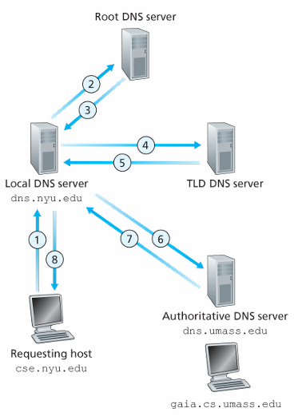
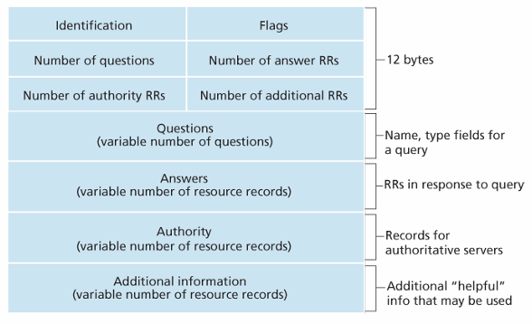
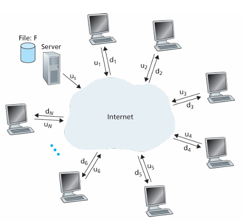
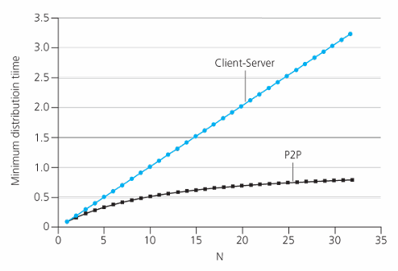

# 计算机网络和因特网

## 什么是因特网
考虑两个方面：
- 构成因特网的基本硬件和软件组件
- 为分布式应用提供服务的联网基础设施

### 具体构成描述
所有联网设备称为**主机**或**端系统**，它们通过**通信链路**和**分组交换机**连接到一起。
不同的链路具有不同的**传输速率**，以比特/秒（bit/s，或bps）度量。主机向其他主机发送分段的数据，每段加上首部字节形成信息包，称为**分组**。

在分组传输的过程中， 分组交换机负责把分组从入通信链路转发到出通信链路。最常见的分组交换机是**路由器**和**链路层交换机**。一个分组从起点到终点所经历的一系列通信链路和分组交换机称为**路径**。

端系统通过**因特网服务提供商ISP**接入因特网。每个ISP本身就是一个有多台分组交换机和多段通信链路的网络。

端系统、分组交换机和其他因特网部件都要运行一系列**协议**来控制信息的接受和发送。其中**传输控制协议TCP**和**网际协议IP**是因特网最重要的两个协议。

为了统一每个人对于协议的认识，**因特网标准**由因特网工程任务组IETF制定。IETF的标准文档称为**请求评论RFC**。

### 服务描述
涉及多个相互交换数据的主机的应用程序称为**分布式应用程序**。

与因特网相连的端系统提供了一个**套接字接口**，规定了程序和另一个端系统上的程序交付数据的方式。

### 什么是协议
协议定义了在两个或多个通信实体之间交换的报文格式和顺序，以及报文发送和/或接收一条报文或其他事件所采取的动作。

## 网络边缘
主机被划分为**客户**和**服务器**。很多服务器都属于大型**数据中心**。

### 接入网
**边缘路由器**指端系统到任何其他远程端系统路径上的第一台路由器。**接入网**指的是将端系统物理连接到其边缘路由器的网络。有几种常见的接入网。

#### 家庭接入：DSL、电缆、FTTH、拨号和卫星
宽带住宅接入有两种最流行的类型：**数字用户线DSL**和电缆。

其中DSL服务通常从本地电话公司获得，它相当于用户的ISP。用户的调制解调器使用现有的电话线（双绞铜线）和位于电话公司本地中心局的数字用户线接入设备（DSLAM）交换数据。家庭电话线同时承载数据和传统的电话信号，分别使用不同的频率编码：
- 高速下行信道，位于50kHz到1MHz之间
- 中速上行信道，位于4kHz到50kHz之间
- 普通的双向电话信道，位于0到4kHz之间

DSL标准定义了多个传输速率，包括12Mbps的下行速率和1.8Mbps的上行速率，以及55Mbps的下行速率和15Mbps的上行速率。由于上下行速率不同， 故被称为不对称的接入。一般来说DSL是为了短距离接入而设计的，如果住宅不是位于本地中心局的5到10公里内，必须采用其他形式的因特网接入。


**电缆因特网接入**则利用了有限电视公司现有的有线电视基础设施。光缆从电缆头端分别接到各个地区枢纽，然后从此引出传统的同轴电缆到达各家各户，每个地区枢纽通常支持500~5000个家庭。因为这样的系统混合使用光缆和同轴电缆，所以被称为混合光纤同轴HFC系统。

它需要特殊的电缆调制解调器，一般是一个外部设备，通过以太网端口连接到家庭PC。在电缆头端，电缆调制解调器端接系统CMTS则与DSL的DSLAM类似，把光缆上的模拟信号转换回数字信号。电缆调制解调器把HFC网络划分为上行和下行两个信道，下行信道的速率通常更高。DOCSIS 2.0标准定义了42.8Mbps的下行速率和30.7Mbps的上行速率。

电缆因特网接入的特征是共享广播媒体，因为所有用户共享一条链路，需要一个分布式多路访问协议来协调传输和避免碰撞。


以上两种方式在美国占有率很高，但有一种更高速的新兴技术逐渐称为主流，**光纤到户FTTH**，它直接从本地中心局连接一条光线到家庭。

光纤的分布有几种方案。最简单的是每户有一根到中心局的光纤。更常见的是，中心局引出的一根光纤末端分出多条光纤分别连接位置相近的多个家庭，这种分配有两种光纤分布体系结构：有源光纤网络AON、无源光纤网络PON。其中AON本质上就是交换以太网。

简要讨论PON，它用于Verizon的FIOS服务中。每个家庭有一个光纤网络端接器ONT，它由光纤连接到邻近的光纤分配器，分配器把多根连接到家庭的光纤集结到一根光纤连接到中心局的光纤线路端接器OLT。OLT实现光信号到电信号的转换，然后经过本地电话公司的路由器连接到因特网。在家庭中，用户将家庭路由器与ONT相连并通过该路由器接入因特网。所有从OLT发送到分配器的分组在分配器上复制。

FTTH可以提供每秒千兆比特的速率，但大多ISP提供不同速率和价格的服务。美国在2011年的平均下行速率只有20Mbps，实际上与13Mbps的电缆接入网相当。

还有其他两种接入网技术。在无法提供以上三种技术的地区，可以使用卫星链路提供超过1Mbps的速率，StarBand和HughesNet是两家卫星接入提供商。还有使用传统电话线的拨号接入，它与DSL基于同样的模式，但是速率只有56kbps。

#### 企业（家庭）接入：以太网和WiFi
许多公司和大学等环境，使用局域网LAN将端系统连接到边缘路由器。有许多的局域网技术，最流行的还是以太网。端系统使用双绞铜线和以太网交换机相连，然后再与更大的因特网相连。使用以太网接入，用户通常以100Mbps或1Gbps的速率接入以太网交换机，对于服务器可能具有1Gbps或10Gbps的速率。


然而，越来越多人使用无线方式接入因特网。在无线LAN环境中，无线用户从一个接入点发送或接收分组
，该接入点与企业网连接（可能使用了有线以太网），企业网再与有限因特网连接。IEEE 802.11技术的无线LAN接入，称为WiFi，提供高达100Mbps的共享传输速率。

#### 广域无线接入：3G和LTE
使用与蜂窝移动电话相同的无线基础设施，通过蜂窝网提供商运营的基站来发送和接收分组，与WiFi不同，用户可以距离基站达数万米。电信公司在第三代（3G）无线技术中进行了大量投资，它为分组交换广域无线因特网接入提供了超过1Mbps的速率。长期演进LTE技术来源于3G技术，能够取得超过10Mbps的速率，甚至达到几十Mbps的下行速率。

### 物理媒体
发送接收信息，需要通过一种**物理媒体**来传播电磁波或光脉冲，它可以具有多种形状和形式，包括双绞铜线、同轴电缆、多模光纤缆、陆地无线电频谱和卫星无线电频谱。物理媒体分为两种类型：**导引型媒体**和**非导引媒体**。对于导引型媒体，电波沿着固体媒体前行，如光缆、双绞铜线和同轴电缆。对于非导引媒体，电波在空气或外太空中传播，如无线局域网或数字卫星频道。

物理链路（铜线、光缆等）的实际成本比其他网络成本低很多。因此许多建筑商通常一次性安装好双绞线、光缆和同轴电缆，即使当下不需要。

#### 双绞铜线
它是最便宜并且最常用的导引型传输媒体，一直用于电话网，从电话机到本地电话交换机的连线基本是双绞铜线。它由两根绝缘的铜线组成，每根1mm粗，以规则的螺旋状排列着，两根线绞合起来减少邻近双绞线的电气干扰，通常许多双绞线捆扎到一起形成一根电缆，并在双绞线外覆盖一层保护层。**无屏蔽双绞线**常用于建筑内的计算机网络中，即LAN中。

目前LAN中双绞线速率从10Mbps到10Gbps，传输速率取决于线的粗细和两端的距离。6a类的双绞线已经能达到10Gbps的速率，距离长达100米。双绞线已经是高速LAN联网的主导性解决方案。它也用于住宅因特网接入，如拨号调制解调器使用双绞线达到56kbps的速率，DSL通过双绞线达到数十Mbps的速率。

#### 同轴电缆
它也由两个铜导体组成，但是它们是同心的而不是并行的。借助这样的结构以及特殊的绝缘体和保护层，它可以达到较高的数据传输速率。他在电缆电视系统中相当普遍。同轴电缆能被用作导引型**共享媒体**，许多端系统能够直接与该电缆相连，每个端系统都能接收其他端系统发送的内容。

#### 光纤
它是一种细而柔软、能够导引光脉冲的媒体，每个脉冲表示一个比特。一根光纤能够支持极高的比特速率，高达数十甚至数百Gbps。它们不受电磁干扰，长达100km的光缆信号衰减极低，并且很难窃听。这使得它称为长途导引型传输媒体，尤其是跨海链路。许多长途电话网络全面使用光纤，并且许多因特网主干也使用光纤。虽然，光设备（发射器、接收器、交换机）的成本很高，阻碍了它在短途传输的应用，如LAN或家庭接入网。

光载波OC标准链路速率的范围从51.8Mbps到39.8Gbps。这些标准称为OC-n，其中链路速率等于n*51.8Mbps。目前正在使用的的标准包括OC-1、OC-3、OC-12、OC-24、OC-48、OC-96、OC-192和OC-768。

#### 陆地无线电信道
无线电信道承载电磁频谱中的信号。它不用安装物理线路，可以穿透墙壁、提供与移动用户的连接以及长距离承载信号的能力。它极大地依赖于传播环境和信号传输的距离。环境上的考虑取决于路径损耗和遮挡衰落、多径衰落以及干扰。

它一般分为三类：
- 运行在很短距离，1m或2m
- 运行在局域，跨越几十到几百米
- 运行在广域，跨越数万米

#### 卫星无线电信道
一颗通信卫星连接地球上的两个或多个微波发射器/接收器，它们被称为地面站。卫星在一个频段上接收传输，使用一个转发器再生信号，并在另一个频段上发射信号。常常使用两种卫星：**同步卫星**和**近地轨道LEO卫星**。

同步卫星位于地面上方36000公里，故传输时延达到了280ms。它们通常用于无法使用DSL或电缆因特网的地区。

近地轨道卫星非常接近地球，并且多个卫星彼此可以通信。目前有许多低轨道通信系统在研制中，未来也许能用于因特网接入。

## 网络核心

### 分组交换
在网络应用中，端系统彼此交换**报文**。为了发送一个报文，源端系统把它划分为较小的数据块，称为**分组**。分组依次通过链路和**分组交换机**传送。

#### 存储转发运输
多数分组交换机在链路的输入端使用**存储转发运输**机制，指交换机直到接收完整个分组才开始转发，这样的机制加大了端到端时延。考虑传输L比特的分组，链路传输速率为R比特/秒，忽略中间信号传输的时间，如果不进行存储直接转发，则时延为L/R秒。如果进行存储转发，则每经过一个路由器就需要等待L/R秒，有
$$
d_{端到端}=N\frac{L}{R}
$$
其中N是路径上链路的数量。

#### 排队时延和分组丢失
每台分组交换机有多条链路与之相连，每条链路都有一个**输出缓存**或叫**输出队列**。如果有一个分组需要发往一条链路，但此时链路正在传输其他的分组，则它就在输出缓存中等待，此时它需要承受**排队时延**。如果输出缓存已满，新到达的分组就会被丢弃，这种现象称为**分组丢失（丢包）**。

#### 转发表和路由选择协议
路由器得到了分组以后需要转发它，它用IP查询**转发表**来决定把分组转发到哪条链路。为了设置转发表，需要使用**路由选择协议**。

#### 电路交换
通过网络链路和交换机移动数据有两种基本方法：**电路交换**和**分组交换**。

电路交换网络中，两个主机要通信时先建立**端到端连接**，然后它们独占分配给它们的链路。


而分组交换网络则只是把分组发送进网络，不会预留任何链路资源，资源不足时它则需要等待。因特网对于分组的传输不做任何保证。

#### 电路交换网络中的复用
链路中的电路是通过**频分服用FDM**或**时分复用TDM**来实现的。

对于FDM，跨越链路的所有连接共享链路的频谱，每条连接专用其中的一个频段。在电话网络中，频段的宽度一般为4kHz，这称为**带宽**。调频无线电台也使用FDM来共享88MHz到108MHz的频谱。

对于TDM，时间被划分为固定长度的帧，每个帧又被划分为固定数量的时隙，每个连接在每个帧中可以独占一个时隙。


电路交换因为在**静默期**也会占用资源，即连接的两端不传输数据时其他连接也不能使用这些资源，所以它的资源利用率较低。并且创建端到端电路和预留端到端带宽是复杂的，需要复杂的信令软件以及协调沿端到端路径的所有交换机。

#### 分组交换和电路交换的对比
分组交换不适用于实时服务，因为端到端时延是可变且不可预测的。虽然如此，它提供了比电路交换更好的带宽共享，并且更简单、更有效、成本更低。虽然两种交换方式都是广泛使用的，但分组交换有更大的优势，许多电路交换电话网都在朝着分组交换网络转变，比如硬件成本高昂的海外电话线路。

### 网络的网络


**存在点PoP**没有在图上画出，它存在于网络结构的所有层次，是供应商网络的一个或多个路由器，客户ISP可以通过它们与供应商ISP相连。要与提供商PoP连接的客户网络，可以从第三方电信提供商租用高速链路将它的路由器之一直接连接到该PoP中的一台路由器。

ISP可以选择**多宿**，即从多个供应商ISP处获得服务，这样可以实现更好的容错性。

因为低层的ISP需要向高层ISP支付费用，低层ISP之间很可能实现**对等**，直接连线交换数据而不经过高层ISP来节约费用。此时它们互相不收费，称为无结算。

为了更好地实现对象，有第三方公司创建**因特网交换点IXP**，多个ISP一同在这里对等。它通常位于一个有自己交换机的独立建筑物中。

还有一些**内容提供商网络**。如谷歌的网络，它们只处理经过谷歌服务器的流量，与它直接与低层ISP连接或者在IXP处与它们连接实现对等来节约费用。然而有的网络只能通过一层ISP，因此谷歌也需要与一层ISP直接相连，为这些流量支付相应的费用。

## 分组交换网中的时延、丢包和吞吐量

### 分组交换网中的时延概述
主要有**节点处理时延**、**排队时延**、**传输时延**和**传播时延**。这些时延累加起来是**节点总时延**。

#### 时延的类型
- 处理时延：检查分组首部、决定将该分组导向何处所需要的时间，还有一些其他因素。通常在微秒或更低级别。
- 排队时延：分组在链路上等待传输的时间。实际的排队时延可以是毫秒到微秒级别。
- 传输时延：把分组推向链路所需要的时间。通常在毫秒到微秒级别。
- 传播时延：信号在链路上传播的时间。在广域网中，为毫秒级别。

$$
d_{总时延}=d_{处理}+d_{排队}+d_{传输}+d_{传播}
$$

### 排队时延和丢包
对于一个输出队列，令 $a$ 为分组到达队列的平均速率，每个分组都是 $L$ 比特， $R$ 为链路传输速率。则定义**流量强度**为 $\frac{La}{R}$ 。当流量强度大于1，队列长度趋于无限增加，排队时延趋于无穷大。当流量强度不大于1，那么如果分组周期性到达，则每个分组到达时队列都为空，没有排队时延；如果是突发到达，那么第一个分组没有排队时延，第二个分组排队时延为 $L/R$ ，第三个分组排队时延为 $2L/R$ ，以此类推，第 $n$ 个分组排队时延为 $(n-1)L/R$ 。实际上分组的到达往往是随机的，但是有平均排队时延与流量强度的一般统计关系：


#### 丢包
实际情况中，由于输出队列的容量是有限的，排队时延并不会趋于无穷大，而是路由器会**丢弃**后续到达的分组，即分组发生**丢失**。

### 端到端时延
假设源主机和目的主机之间有 $N-1$ 台路由器，并且网络无拥塞（认为没有排队时延），每台路由器和源主机的处理实验为 $d_{处理}$ ，路由器和源主机的输出速率是 $R$ bps，每条链路的传播时延为 $d_{传播}$ ，发送长度为 $L$ 的分组的端到端时延为
$$
d_{端到端}=N(d_{处理}+d_{传播}+\frac{L}{R})
$$

#### Traceroute
用户指定一个目的主机，源主机的程序朝着目的地发送多个特殊的分组，它们向目的地传送的过程中经过一系列的路由器，这些路由器接收到特殊的分组时回传一个短报文，包含路由器的名字和地址。

实际上，源主机发送编号从1到N的分组，路径上的第n个路由器接收到编号为n的分组时，它会回传一个报文。Traceroute会重复这个过程三遍。具体的流程定义在RFC 1393中。

#### 端系统、应用程序和其他时延
希望向共享媒体（如WiFi）传输分组的端系统而可能有意延迟它的传输，把这作为它和其他端系统共享媒体的协议的一部分。

还有媒体分组化时延，出现在IP语音（VoIP）0的应用中，发送方在向因特网传递分组之前必须首先用编码的数字化语音填充一个分组，这个过程的时间称为分组化实验，它可能会比较大，可能影响VoIP的质量。

### 计算机网络中的吞吐量
考虑从主机A到主机B通过网络传输一个大文件。任意时刻的**瞬时吞吐量**指主机B接受该文件的速率（以bps计）。如果文件由 $F$ 比特组成，主机B接收到所有 $F$ 比特用去了 $T$ 秒，那么**平均吞吐量**为 $F/T$ bps。


像图中的线性路径，它的吞吐量取决于其中吞吐量最小的一条链路，它被称为**瓶颈链路**。


像图中a那样的服务器和客户端交互情况，往往中间经过的互联网核心配置了高速链路，很少出现拥塞，因此瓶颈往往出现在客户端和服务器的接入链路上。而像图中b那样的情况，则需要看中间链路的速率，如果它的速率很高，那么瓶颈还是在接入链路上；如果它的速率不够高，则瓶颈在中间链路上。

## 协议层次及其服务模型

### 分层的体系结构

#### 协议分层
互联网协议的设计采用**分层**的方式来组织协议以及实现协议的软硬件。其中每一层向它的上一层提供**服务**，即所谓一层的**服务模型**。

分层具有概念化和结构化的优点，然而它的潜在缺点是高层可能冗余底层的功能并且某层可能用到其他层才出现的信息。

所有协议被称为**协议栈**，总共有五层：物理层、链路层、网络层、运输层和应用层。

##### 应用层
包含网络应用程序和它们的应用层协议。它包含HTTP、SMTP、FTP等协议。应用层协议分布在多个端系统上，两个端系统上的应用程序根据协议交换信息分组，应用层的信息分组叫做**报文**。

##### 运输层
运输层在应用程序端点之间传送应用层报文。有两种主要的运输层协议：TCP和UDP。TCP提供了面向连接的服务，包括确保传递和流量控制。它把长报文划分为短报文并提供拥塞控制机制。UDP提供无连接服务，没有可靠性、流量控制、拥塞控制。运输层分组称为**报文段**。

##### 网络层
网络层负责传送称为**数据报**的网络层分组。运输层协议向网络层协议提交报文段和目的地址。常见的网络层协议有网际协议IP，所有具有网络层的组件都必须运行IP。还有路由选择协议等其他协议。一般称网络层为IP层，因为IP将因特网连接在了一起。

##### 链路层
网络层需要传输数据报，必须依赖于链路层的服务。链路层提供的服务取决于应用于该链路的特定链路层协议，一个数据报可能经过多种链路层协议传输。链路层分组称为**帧**。

##### 物理层
链路层负责把一个帧传送到下一个节点，而物理层负责把帧的逐个比特传送到下一个节点。它与链路使用的实际传输媒体高度相关，如以太网有许多物理层协议：关于双绞铜线的、关于同轴电缆的、关于光纤的等。

#### OSI模型
因特网的五层协议栈不是唯一的协议栈。20世纪70年代后期，国际标准化组织ISO提出开放系统互连OSI模型，是一个七层模型。因为它在网络教育中的早期影响，仍以某种方式存留在一些教科书和培训课程中。

OSI七层模型分别是：应用层、表示层、会话层、运输层、网络层、链路层和物理层。其中五层和因特网协议栈名字类似，实际也提供类似的功能。其中多出了表示层和会话层。表示层作用是使通信的应用程序能够解释交换数据的含义，包括数据压缩、数据加密、数据描述。会话层提供了数据交换的定界和同步功能。

在因特网协议中，缺失的两个层的功能，如果真的被需要，就交给应用程序开发者来处理。

### 封装
因特网协议栈很重要的概念是**封装**。**应用层报文**被传送给运输层。运输层收到报文以后附上运输层首部信息构成**运输层报文段**，此时它封装了应用层报文。同样，网络层给运输层报文段附加网络层首部信息生成了网络层数据报。链路层给网络层数据报附加链路层首部信息生成了链路层帧。物理层给链路层帧附加物理层首部信息生成了物理层比特流。

在每一层，一个分组具有两种类型的字段：**首部字段**和**数据字段**。

## 面对攻击的网络

### 坏家伙能够经因特网将有害程序放入你的计算机中
可能从因特网接收到具有恶意的东西，可以统称为**恶意软件**。受害的主机构成的网络称为**僵尸网络**。大多数的恶意软件是**自我复制**的，其中**病毒**是一种需要某种形式的用户交互来感染用户设备的恶意软件，而**蠕虫**则是一种不需要明显用户交互就能感染用户设备的恶意软件。

### 坏家伙能够攻击服务器和网络基础设施
一种常见的安全性威胁是**拒绝服务攻击DoS**，大多数的DoS属于以下三种类型之一：
- 弱点攻击：向目标主机上运行的易受攻击的应用程序或操作系统发送特殊报文。
- 带宽洪泛：向目标主机发送大量的报文，使得服务器的接入链路拥塞。
- 连接洪泛：与目标主机建立大量的半开或全开的TCP连接，使得服务器无法接受新的连接。

如果服务器的接入速率非常大，那么单一的攻击源可能无法产生足够大的流量来攻击服务器，而且可能被路由器拦截。因此攻击者可能使用**分布式拒绝服务攻击DDoS**，它使用了大量的攻击源同时向目标主机发送流量。

### 坏家伙能够嗅探分组
记录每个流经的分组副本的被动接收机被称为**分组嗅探器**。电缆接入技术也广播分组，容易受到嗅探攻击。因为分组嗅探器被动接受分组而不发送分组，很难检测到它们的存在，只能通过密码学手段来防范。

### 坏家伙能够伪装成你信任的人
很容易就能生成具有任意源地址、分组内容和目的地址的分组，把带有虚假的源地址的分组注入因特网称为**IP欺骗**。为了避免这样的问题，需要使用端点鉴别技术。

<br><br>

# 应用层

## 应用层协议原理

### 网络应用体系结构
在开发者的角度看，网络体系结构是固定的，并为应用程序提供了特定的服务集合。**应用程序体系结构**由应用程序研发者设计，规定了如何在各种端系统上组织该应用程序。现代网络应用程序所使用的两种主流体系结构为：**客户-服务器体系结构**和**对等（P2P）体系结构**。

在客户-服务器体系结构中，有一个总是打开的主机称为服务器，服务其他称为客户的主机。客户之间不直接通信。服务器具有固定的众知地址。服务器的性能需要很强大，故常常会使用配备大量主机的**数据中心**。

在P2P体系结构中，主机与主机直接通信，它们被称为对等方。适用于流量密集型应用。它最大的特点是**自扩展性**。即每个主机要享受服务就需要提供服务。然而P2P由于高度非集中结构，面临安全性、性能和可靠性的挑战。

### 进程通信
用操作系统的术语来说，进行通信的实际上是**进程**而不是程序。两个主机上的进程通过交换报文进行通信。

#### 客户和服务器进程
在一对进程之间的通信会话场景中，发起通信的进程被表示为**客户**，而等待联系的进程被表示为**服务器**。在Web中，作为服务器的进程总是Web服务器；在P2P中，谁请求对方发送文件，谁就是客户，对方就是服务器。

#### 进程与计算机网络之间的接口
进程通过一个称为**套接字**的软件接口向网络发送报文和从网络接收报文，它也被称为应用程序与网络之间的**应用程序编程接口API**。应用程序开发者对于运输层的控制仅限于：选择运输层协议；设定几个运输层参数。

#### 进程寻址
为了定位到对方进程，需要提供一个地址，包含两种信息：主机地址和进程标识符。其中主机由**IP地址**标识，进程由**端口号**标识。

### 可供应用程序使用的运输服务
为了选择一个合适的运输层协议，一般需要考虑这些方面：可靠数据传输、吞吐量、定时和安全性。

#### 可靠数据传输
如果一个协议确保应用程序发送的数据正确、完全地交付给应用程序的另一端，就认为它提供了**可靠数据传输**。如果一个运输层协议不提供可靠数据传输，它们常常被**容忍丢失的应用**所接受。

#### 吞吐量
有的运输层协议确保能以某种特定的速率提供可用吞吐量。像因特网电话应用程序以32kbps的速率进行编码，如果协议不能提供足够的吞吐量，那么传输的信息基本是没有意义的。这样具有吞吐量要求程序被称为**带宽敏感的应用**。其他的应用称为**弹性应用**。

#### 定时
运输层协议可以提供定时保证，即发送出去的数据在规定时间内交付。

#### 安全性
运输层协议可以提供机密性、数据完整性和断点鉴别。

### 因特网提供的运输服务

#### TCP服务
TCP的特点为：
- 面向连接的服务：在交换数据之前，TCP让客户和服务器交换控制信息，这被称为握手阶段。握手以后**TCP连接**建立完成，它是全双工的，即双方进程能同时进行报文收发。当结束报文发送时，需要解除该连接。
- 可靠数据传送服务：通信进程能够无差错、按适当顺序交付所有发送的数据。过程中不会出现字节的丢失和冗余。
- 拥塞控制：一般来说这对应用程序没直接的好处，在网络出现拥塞时，TCP限制发送速率，以缓解网络拥塞。

TCP没有加密机制，有安全性的问题。故有加强版的TCP存在，称为**安全套接字层SSL**。它除了实现传统TCP的功能以外，还可以实现加密、数据完整性和端点鉴别。它并不是一种独立的协议，而是一种运行在TCP之上的协议，强化是在应用层实现的。如果应用程序需要使用SSL，需要在客户端和服务器端包含SSL的相关代码，它有自己的API。当数据传送给SSL以后，它进行加密处理，然后把加密的数据传递给TCP；在对侧，则SSL把从TCP得到的数据进行解密。

#### UDP服务
它是一种只提供最小服务的轻量级运输协议。它并不建立连接，也不提供可靠数据传送，没有拥塞控制。

#### 因特网传输协议所不提供的服务
TCP和UDP都不提供定时保证和吞吐量保证。大多数应用程序使用特殊的设计来对抗这种服务的缺乏。

### 应用层协议
**应用层协议**定义了运行在不同端系统上的应用程序进程如何相互传递报文，包括：
- 报文的类型：比如请求报文、响应报文
- 各种报文类型的语法：报文中各个字段以及如何描述它们
- 字段的语义：字段信息的含义
- 进程何时及如何发送或响应报文

公共域的应用层协议由RFC文档定义。其他的协议是专有的。

## Web和HTTP
Web提供按需操作，用户可以选择自己感兴趣的内容。人们把信息放在Web上非常简单，人们可以借助超链接和搜索引擎来找到信息。网页中包含着各种图片和视频，也可以让用户很方便地与服务器交互。

### HTTP概况
Web使用的应用层协议是**超文本传输协议HTTP**。它由两个程序实现：一个客户程序和一个服务器程序。它们运行在不同的主机上并通过HTTP报文会话。

**Web页面**由**对象**组成。对象只是一个文件，如HTML文件、JPEG图形等等，可以通过URL地址寻址。多数Web页面含有一个**HTML基本文件**和几个引用对象。**Web服务器**实现了HTTP的客户端。**Web服务器**实现了HTTP的服务器端。

HTTP使用TCP作为它的运输层协议。

HTTP是一个**无状态协议**，即服务器不保留关于客户的任何信息，每次响应请求都像是第一次一样。

### 非持续连接和持续链接
如果客户和服务器的所有请求/响应对都是通过同一个TCP连接来传输的，称为**持续连接**。如果每个请求/响应对都使用新的TCP连接，称为**非持续连接**。

实际上HTTP可以使用两种连接方式，默认使用持续连接。

#### 采用非持续连接的HTTP
这样的方式下，浏览器可以同时打开多个TCP连接来并行地获取Web对象，从而缩短响应时间。令 $RTT$ 为**往返时间**，即一个短分组从客户到服务器然后返回客户花费的时间。每个HTTP请求实际上需要两个RTT加文件传输需要的时间，一个RTT用于建立连接，一个RTT用于请求和响应。

#### 采用持续连接的HTTP
非持续连接为每个请求对象建立一个连接，这需要分配TCP缓冲区和维护TCP变量，给服务器造成负担。另外，每个对象都需要两个RTT的交付时延。

在HTTP 1.1的持续连接中，一个Web页面和后续的对象传输都可以在同一个TCP连接中完成，甚至可以把同一服务器的多个页面放在同一个TCP连接中。当连接长时间未使用的时候，服务器关闭该连接。在HTTP/2中，允许相同连接中多个请求和回答交错，并增加了优化HTTP报文请求和回答的机制。

### HTTP报文格式
HTTP报文有两种：请求报文和响应报文。

#### HTTP请求报文
如下：
```http
GET /somedir/page.html HTTP/1.1
Host: www.someschool.edu
Connection: close
User-agent: Mozilla/5.0
Accept-language: fr
```
每行由一个回车和换行符结束，最后一行再附加一个回车换行符。第一行叫做**请求行**，后面的行叫做**首部行**。

请求行包含三个字段：方法字段、URL字段和HTTP版本字段。方法字段可以取不同的值，如GET、POST、HEAD等，大多HTTP请求使用GET。URL字段带有请求对象的标识。版本字段表示浏览器实现的是HTTP/1.1。

Host字段指明对象所在的主机，然而实际上TCP连接已经建立好，这个字段是提供给Web代理高速缓存的。Connection字段告诉服务器是否使用持续连接。User-agent字段告诉服务器客户浏览器的类型，服务器可以根据这个信息来优化。Accept-language字段告诉服务器客户希望得到的语言版本。

HTTP的请求报文通用格式如下：


使用GET时实体行为空，POST会用到实体行，它常用于提交表单。用POST的时候也可以请求一个Web页面，但内容则依赖于用户提交的表单内容。也可以使用GET提交表单，把它以参数的方式放在URL后面。

HEAD方法类似GET方法，但是服务器只发送HTTP报文进行相应，不返回请求对象，常用于调试跟踪。

PUT方法常与Web发行工具联合使用，允许用户上传对象到指定的Web服务器上指定的路径。也被需要向服务器发送数据的应用程序使用。DELETE方法允许用户删除Web服务器上的对象。

#### HTTP响应报文
如下：
```http
HTTP/1.1 200 OK
Connection: close
Date: Tue, 18 Feb 2014 15:58:00 GMT
Server: Apache/2.2.3 (CentOS)
Last-Modified: Tue, 18 Feb 2014 15:28:00 GMT
Content-Length: 6821
Content-Type: text/html

(data data data data data ...)
```
它有三个部分，一个初始**状态行**，六个**首部行**，一个**实体行**。状态行有三个字段：协议版本字段、状态码和相应状态信息。实体行包含了请求的对象。

Connection字段告诉客户端是否使用持续连接。Date字段告诉客户端报文生成的时间。Server字段告诉客户端服务器的类型。Last-Modified字段告诉客户端对象最后一次修改的时间。Content-Length字段告诉客户端对象的长度。Content-Type字段告诉客户端对象的类型。

常见的状态码有：
- 200 OK：请求成功，对象在实体体中
- 301 Moved Permanently：请求的对象已经被永久转移，新的URL在Location首部行返回
- 400 Bad Request：请求报文不能被服务器理解
- 404 Not Found：请求的对象在服务器上找不到
- 505 HTTP Version Not Supported：服务器不支持请求的HTTP版本

### 用户与服务器的交互：cookie
HTTP是一个无状态协议，但有时一个Web希望识别它的用户，可以使用cookie。

cookie有四个组件：
- 在HTTP相应报文中的一个cookie首部行
- 在HTTP请求报文中的一个cookie首部行
- 在用户主机中保留有一个cookie文件，由浏览器管理
- Web服务器的一个后端数据库

服务器在响应报文中给出Set-cookie首部行返回cookie，后续的用户请求报文中用Cookie首部行返回相同的cookie。

### Web缓存
**Web缓存器**也叫**代理服务器**，有自己的磁盘存储空间，保存了最近请求过的对象的副本。用户可以配置浏览器使得所有的HTTP请求首先指向Web浏览器。

当用户请求一个对象时，代理服务器先检查自己是否有这个对象，如果没有它就从Web服务器处获取该对象并存储在磁盘空间上，然后再把该对象传送给用户。

Web缓存器通常由ISP购买并安装。它可以减少客户请求的响应时间；如果把它放在机构网络内，还可以减少接入链路的负载。

**内容分发网络CDN**正是使用类似的技术来把大量的网络流量本地化。

### 条件GET方法
虽然可以缓存Web对象，但它可能会过期。需要使用HTTP的**条件GET**方法来检查对象是否是最新的：请求报文使用GET方法并且包含一个If-modified-since并提供一个时间。

服务器接受到请求报文后检查文件是否发生修改，如果有则正常发回对象；如果没有则返回一个空实体行的响应报文，状态码为304 Not Modified。

## 因特网中的电子邮件
电子邮件有三个主要组件：**用户代理**、**邮件服务器**和**简单邮件传输协议SMTP**。用户代理相当于电子邮件的客户端应用程序，用户写好邮件以后代理把它发送给邮件服务器，邮件进入邮件服务器的外出报文队列，对方的用户代理可以从队列中取出邮件。

邮件服务器是电子邮件体系结构的核心。每个接收方在某个邮件服务器上有一个**邮箱**，管理和维护着发送给自己的报文。一般来说，邮件由发送方的用户代理发出，传输到发送方的邮件服务器，然后传输到接收方的邮件服务器，进入接收方的邮箱。如果发送方的邮件服务器不能把邮件传送到接收方的邮件服务器，那么它会把邮件放在一个**报文队列**中，通常每30分钟重新发送一次，如果几天后仍未成功则服务器删除该报文并邮件通知发送方。

SMTP是邮件的主要应用层协议，它使用TCP，具有两个部分：在发送方邮件服务器的客户端和接收方邮件服务器的服务器端。

### SMTP
邮件报文体只能使用7比特的ASCII码，因此发送邮件之前需要把多媒体数据编码为ASCII码并在接到邮件以后解码。SMTP并不使用中间邮件服务器，邮件总是直接从发送方邮件服务器传送到接收方邮件服务器，而不在中间的某个服务器存留。

传送邮件时，SMTP在25号端口上建立一个到对方邮件服务器的TCP连接。连接建立以后会执行一些应用层的握手，这时客户指示发送方的邮件地址和接收方的邮件地址。握手完成后客户发送报文，由于SMTP使用的是持续连接，如果客户还有其他的报文要发送，它在当前的TCP连接上继续发送，否则它指示TCP关闭连接。

例如，以下S开头的是服务器发送的行，C开头的是客户端发送的行：
```
S: 220 hamburger.edu
C: HELO crepes.fr
S: 250 Hello crepes.fr, pleased to meet you
C: MAIL FROM: <alice@crepes.fr>
S: 250 alice@crepes.fr ... Sender ok
C: RCPT TO: <bob@hamburger.edu>
S: 250 bob@hamburger.edu ... Recipient ok
C: DATA
S: 354 Enter mail, end with "." on a line by itself
C: Do you like ketchup?
C: How about pickles?
C: .
S: 250 Message accepted for delivery
C: QUIT
S: 221 hamburger.edu closing connection
```
其中用户发送的单个句点的行，表示邮件结束。

### 与HTTP的对比
两个协议很像，但有一些重要的区别：
- HTTP是一个**拉协议**，连接是从希望接受文件的一方发起的；SMTP是一个**推协议**，连接是从发送方发起的。
- SMTP要求使用ASCII码，而HTTP可以发送二进制数据
- 如果文档既包含文本又包含图片，HTTP可以把每个对象分别发送，SMTP则把所有对象放在一个报文中

### 邮件报文格式
电子邮件格式分为首部行和报文体。其中首部行必须包含From和To两行，可选Subject和其他的首部行。在首部行以后跟一个空白行，然后就是ASCII格式的报文体。

### 邮件访问协议
早期，用户通过登录到服务器主机来访问自己的邮箱。现在，可以通过用户代理，以一种客户-服务器体系结构来访问邮箱。

接收方可以直接接受邮件而不使用收件服务器，问题在于接收方常常是个人电脑，无法持续在线。发送方也可以直接使用SMTP把邮件发送到接收方的邮件服务器，而不必先推送到自己的邮件服务器，但当接收方的邮件服务器不可用时，个人的电脑很难持续尝试发送邮件，所以交给邮件服务器来处理是更好的选择。

但这样的体系结构仍有一个问题，SMTP是一个推协议，当用户代理需要获取邮件时，它无法使用SMTP从邮件服务器得到该邮件。因此需要一个邮件访问协议，主流的有：**第三版的邮局协议POP3**和**因特网邮件访问协议IMAP**或直接使用HTTP。

#### POP3
一个极为简单的邮件访问协议，同时功能也相当有限。用户代理打开一个到邮件服务器110端口的TCP连接，然后经过三个阶段：
1. 特许：用户代理发送明文形式的用户名和口令，使用指令 `user <username>` 和 `pass <password>`
1. 事务处理：用户代理取回报文，同时用户代理还能对报文做删除标记、取消删除标记等操作，也可以获得报文的统计信息
1. 更新：客户发出quit指令表示结束POP3会话以后，服务器删除被标记为删除的报文

服务器会对用户代理发送的内容做出响应，+OK表示成功，可能还会跟上一些数据；-ERR表示前面的命令出现了某些错误。

用户代理可以配置为“下载并删除”或者“下载并保留”。使用下载并删除方式，用户代理发出list、retr和dele命令，这样的话用户没有办法在多个设备上查看邮件。

#### IMAP
如果用户希望在邮件服务器上形成一个邮件的层次文件夹，POP3并不能做到，因为它没有提供任何创建远程文件夹等的接口。为了解决这个问题和其他一些问题，IMAP出现了，它比POP3功能更强，但也复杂得多。

IMAP服务器把每个报文与一个文件夹联系起来。当报文第一次到达服务器时，它与收件人的INBOX关联起来，收件人可以把它移动到其他文件夹中。IMAP提供了创建文件夹和移动文件到其他文件夹的接口，还提供了在文件夹中查询邮件、使用特定条件匹配邮件的接口。与POP3不同，IMAP维护了会话的用户状态信息，如文件夹的名字以及哪些报文和哪些文件夹相关联。

IMAP还有一个重要特性，它允许用户代理获取报文某些部分，如可以只读取一个报文的首部，或是多部分MIME报文的一部分。如果带宽较低的时候，可以用这样的方式选择性地下载需要的报文。

### 基于Web的电子邮件
使用浏览器来访问邮件服务器，用户代理和邮件服务器就使用HTTP通信。不过，邮件服务器之间传送邮件仍然使用的是SMTP。

## DNS：因特网的目录服务
为了标识因特网上的主机，一种方式是使用**主机名**，然而它并不能提供主机的位置信息。因此实际上标识一个主机会用到**IP地址**。

### DNS提供的服务
**域名系统DNS**负责把主机名映射到IP地址。它是一个由分层的**DNS服务器**实现的分布式数据库，一个使得主机能够查询分布式数据库的应用层协议。DNS服务器通常是运行BIND软件的UNIX服务器。它使用UDP协议，端口号为53。

除了主机名到IP地址的转换，DNS还提供一些其他的服务：
- **主机别名**：如果一个主机有着复杂的主机名，它也可以有主机别名。复杂的那个主机名称为**规范主机名**，可以使用DNS通过主机别名查询到规范主机名和IP地址。
- **邮件服务器别名**：邮件服务器的主机名可能会很复杂，电子邮件应用程序可以调用DNS对提供的主机名别名进行解析。MX记录允许公司的邮件服务器和Web服务器使用相同的主机名。
- **负载分配**：一个规范主机名可以和多个IP地址相联系，DNS服务器可以轮流返回这些IP地址，使得负载在这些服务器之间均衡地分配。这同样也可以用于邮件服务器，相同的邮件服务器别名可以用于多个邮件服务器。

### DNS工作机理概述
用户主机上有DNS客户端，它接收到DNS查询请求后，通过端口53使用UDP协议向网络中发送一个DNS查询报文，经过若干毫秒到若干秒的时延以后，收到一个回答报文，然后它把结果传递给请求的程序。

最简单的DNS设计方式是在整个因特网上使用一个DNS服务器，但这样的设计有许多问题：
- **单点故障**：如果这个服务器出现故障，整个因特网都会瘫痪
- **通信容量**：它必须具有处理整个因特网的DNS查询的能力
- **远距离的集中式数据库**：如果只有单个服务器，那么距离远的地方的查询会有很大的时延
- **维护**：它需要一个非常庞大的数据库，还需要频繁地更新

#### 分布式、层次数据库
DNS是分层设计的，有三种类型的DNS服务器：
- **根服务器**：有400多个根服务器遍布全世界，它们由13个组织管理，提供TLD服务器的IP地址
- **顶级域TLD服务器**：对于每个顶级域都有TLD服务器，支持TLD的网络基础设施可能是庞大复杂的，TLD服务器提供了权威服务器的IP地址
- **权威服务器**：在因特网上具有公共可访问主机的每个组织机构必须提供公共可访问的DNS记录，这些记录把主机名映射到IP地址，权威DNS服务器保存这些记录。一个组织机构可以自己实现权威DNS服务器，也可以付费把DNS记录存储在某些服务提供商的服务器上。

还有**本地DNS服务器**，起着代理的作用，也缓存查询到的结果。每个ISP都有一台本地DNS服务器，与该ISP的网络相连的主机使用它们的本地DNS服务器，通常它邻近用户主机。

当本地DNS服务器缓存中不存在待查询的主机名时，它会代为查询这个主机名，过程中需要访问多级DNS服务器，此时有两种查询方式：**递归查询**和**迭代查询**。

递归查询中每个服务器只询问下一个服务器，并把后续的查询工作都委托给该服务器，它只等待该服务器返回需要的结果。


迭代查询中，本地DNS服务器依次从每级服务器得到下一级服务器的地址，然后继续询问下一级服务器，直到得到最终的结果。



#### DNS缓存
当本地DNS服务器完成一次查询时，它会把结果保存一段时间才丢弃，这样下次遇到这样的查询请求就可以直接返回结果。本地DNS服务器常常缓存TLD服务器的IP地址，故大多数的查询请求实际上绕过了根服务器。

### DNS记录和报文
DNS服务器中存储了**资源记录**，提供了主机名到IP地址的映射，每个DNS回答报文包含了一条或多条资源记录。资源记录是一个四元组 `(Name, Value, Type, TTL)` 。TTL是记录的生存时间，当超过了生存时间，记录就被从缓存中删除。Name和Value则取决于Type的值，当Type等于：
- A：Name是主机名，Value是主机名对应的IP地址
- NS：Name是一个域，Value是知道如何获得域中权威DNS服务器的主机名
- CNAME：Value是别名为Name的主机的规范主机名
- MX：Value是别名为Name的主机的规范主机名。

例如查询主机名gaia.cs.umass.edu，对于edu的TLD服务器，包含一条记录指出应该去哪里寻找下级DNS：
```
(umass.edu, dns.umass.edu, NS)
```
同时还需要一条记录指出该主机的IP地址：
```
(dns.umass.edu, 128.119.40.111, A)
```

#### DNS报文
DNS报文有两种：查询报文和回答报文，它们具有相同的格式：



- 首部区域：占前12个字节
    - 标识符：一个16比特的数，它会被复制到回答报文中，便于用户匹配请求和回答
    - 标志：有多个标志位
        - 查询/回答：0是查询报文，1是回答报文
        - 权威的：1表示回答报文是来自对应的权威DNS服务器
        - 希望递归：1表示希望服务器执行递归查询
        - 递归可用：1表示服务器支持递归查询
    - 问题数、回答RR数、授权RR数、附加RR数：顾名思义
- 问题区域：包含正在进行的查询信息
    - 名字：查询的主机名
    - 类型：关于该主机名，正在查询的问题类型
- 回答区域：包含查询到的资源记录，一个报文可以包含多条资源记录，对应主机名的多个IP地址
- 权威区域：包含其他权威服务器的记录
- 附加区域：其他有帮助的记录，如查询邮件服务器时，回答区域包含MX记录给出了邮件服务器的规范主机名，附加区域包含一条A记录给出了邮件服务器的IP地址

通过**nslookup程序**可以很容易地发送一条DNS查询报文。

#### 在DNS数据库中插入记录
如果希望有自己的域名，需要借助**注册登记机构**的帮助，它验证该域名的唯一性，然后把该域名注入DNS数据库并收取少量费用。在这个过程中，需要提交自己的域名和IP地址。以往DNS服务器的更新都是静态配置的，后来DNS协议中添加了一个更新选项，可以通过DNS报文动态添加或删除记录。

## P2P文件分发
P2P不是客户-服务器体系结构，而是对等方之间直接通信。

### P2P体系结构的扩展性
**分发时间**是所有 $N$ 个对等方得到该文件的副本需要的时间，接下来分析两种体系结构的分发时间：



如图，假设 $u_s$ 表示服务器的上传速率，$u_i$ 表示第 $i$ 对等方接入链路的上传速率，$d_i$ 表示第 $i$ 对等方接入链路的下载速率，$F$ 表示文件的大小，$N$表示需要接收文件的对等方数量。假设互联网核心的带宽足够大，则瓶颈都在接入链路上。

先考虑客户-服务器体系结构，服务器必须单独地给每个对等方发送文件，它发送文件至少需要时间 $\frac{NF}{u_s}$ 。另外每个对等方都需要下载文件，令 $d_{min}$ 表示其中最小的下载速率，那么该对等方下载文件至少需要时间 $\frac{F}{d_{min}}$ 。因此分发时间至少为 $max(\frac{NF}{u_s}, \frac{F}{d_{min}})$ 。

再考虑P2P体系结构。在一开始只有服务器具有文件，它发送该文件至少需要时间 $\frac{F}{u_s}$ 。对等方下载的时间同上，为 $\frac{F}{d_{min}}$ 。最终系统的总上传能力是 $u_s + \sum_{i=1}^N u_i$ ，系统必须以不超过它的速率上传 $N$ 个文件副本，因此分发时间至少为 $\frac{NF}{u_s + \sum_{i=1}^N u_i}$ 。综上，P2P体系结构的分发时间至少为 $max(\frac{F}{u_s}, \frac{F}{d_{min}}, \frac{NF}{u_s + \sum_{i=1}^N u_i})$ 。

实际上两者的分发时间随着 $N$ 的增长趋势如图：



#### BitTorrent
一种用于文件分发的流行P2P协议，参加某个文件分发的所有对等方集合称为一个洪流，它们彼此下载等长度的文件块，典型长度为256KB。当一个对等方进入洪流时，它没有块，但它会逐步积累块，当它下载块的时候也为其他对等方上传块。直到它拥有了整个文件以后，它可以离开洪流，或者继续留在其中为其他对等方上传文件。对等方也可以在拥有了部分文件时离开洪流，后面再加入进来。

它是一个相当复杂的协议。每个洪流具有一个基础设施节点，称为追踪器，当对等方加入洪流时就向追踪器注册自己且周期性告知其自己仍在洪流中。这样子追踪器就能追踪对等方。

当新的对等方加入时，追踪器随机发送给它洪流的一个子集的IP地址，它尝试与这些对等方建立连接。一旦它和某个对等方建立连接，它们成为邻近对等方。它周期性地询问邻近对等方们拥有的块，然后它可以选择自己没有的块发出请求，它会使用**最稀缺优先**的策略，即选择其中副本最少的块。

它每过10秒就会测量它的邻居给它传送数据的速度，并确定4个最快的邻居（**疏通**）与它们对换数据。同时每过30秒它随机选择一个邻居向其发送块，如果它发送得足够快，它就会称为对方的疏通。则对方也会向它发送块，如果对方的速度也足够快，那么就可以成为它新的疏通。这样的机制使得对等方不断寻找新的交换伴侣，逐渐找到最好的交换伴侣。

还有一种P2P应用，分布式散列表DHT。它是一种简单的数据库，分布在一个P2P系统的多个对等方上。

## 视频流和内容分发网

### 因特网视频
视频最突出的特征是它的高比特率，因此它的最大要求是平均端到端吞吐量，它至少需要与视频的比特率一样大。

### HTTP流和DASH
在HTTP流中，视频作为服务器中的一个普通的文件，具有一个特定的URL，用户通过HTTP GET请求这个视频。在客户端，获得的字节被储存在客户应用缓存中，当字节数量超过了预先设定的门槛，客户应用就会开始播放视频。视频应用周期性地从缓存中抓取帧，解压缩并在屏幕上显现。然而传统的HTTP流有严重的缺陷：所有客户接收到相同编码的视频，但客户的带宽大小不同。因此，**经HTTP的动态适应性流DASH**出现了。

在DASH中，视频被编码成几个不同的版本，分别具有不同的比特率，客户可以动态地请求来自不同版本且长度为几秒的视频段数据块。带宽高时选择高比特率的块，带宽低时选择低比特率的块。

使用DASH以后，每个视频版本具有一个单独的URL，并且服务器端有一个**告示文件**，为每个版本提供了URL及其比特率。客户首先请求告示文件来查看各版本，然而使用HTTP GET，指定一个URL和字节范围，一次选择一块。在下载块的同时，客户也运行一个速率测量算法来决定下次请求的版本。

### 内容分发网
对于因特网视频公司，建立单一的大规模数据中心，令其存储所有的视频并直接向全世界的用户传输流失视频，是最简单的方案。然而这会有三个问题：
- 如果用户原理数据中心，服务器到客户的路径经过很长的链路，一旦其中一条链路带宽较低，就会限制整个端到端的吞吐量
- 流行的视频可能经相同的链路发送多次，浪费了网络带宽，因特网视频公司也需要缴纳更多的费用
- 单点故障

实际上几乎所有主要的视频流公司都使用**内容分发网CDN**，它管理分布在多个地理位置的服务器，在其中存储视频的副本，并把用户的请求定向到一个最适合的CDN位置。CDN可以是**专用CDN**，由内容提供商自己所有；也可以是**第三方CDN**，可以分发多个内容提供商的视频。

CDN通常采用两种不同的服务器安置原则：
- **深入**：通过在全球的接入ISP中部署服务器集群来深入接入网，通过靠近用户来减少用户到CDN之间的链路和路由器数量，从而减少时延并增加吞吐量。由于它的高度分布式设计，维护和管理集群是一种挑战。
- **邀请做客**：在少量的关键位置建造大集群来邀请ISP做客。通常它们被放在IXP。这个方案有着较低的维护和管理开销，但时延相对高并且吞吐量相对低。

CDN并不包含所有的视频副本，而是使用一种拉策略。当用户需要一个CDN没有的视频时，CDN从某种中心仓库或另一个集群检索这个视频，然后保存到本地并发送给用户。当存储器要满的时候，它删除一些不常用的视频。

#### CDN操作
当用户通过浏览器请求一个特定的视频时，CDN必须能够截获这个请求，从而确定此时最适合的CDN集群并把请求重定向到该集群的某台服务器。一般CDN利用DNS来截获和重定向请求，在访问到权威服务器时，它不返回一个IP地址，而是返回一个CDN域的主机名，此时DNS请求进入了专用DNS的基础设施。此后本地DNS服务器发出第二个DNS请求，专用DNS选择一个CDN集群返回，最终它被转发回用户主机。用户可以建立TCP连接，如果使用了DASH，服务器会先发送告示文件，然后用户使用HTTP GET请求视频内容。

#### 集群选择策略
部署CDN的核心是**集群选择策略**，它动态地把客户重定向到CDN中的某个服务器集群或数据中心。CDN一般采用专用的集群选择策略，但也有一些简单的策略。

比如**地理上最为邻近**策略，通过商用地理位置数据库，把本地DNS服务器的IP地址映射到地理位置，然后CDN选择最近的集群。大多数情况下它工作得很好，不过对于某些用户来说地理位置最近不意味着网络路径最短。另外，有些用户可能使用距离遥远的LDNS，则选择的集群是远离用户的。

这样的策略简单地忽略网络流量等因素，总是为用户选择相同的集群。为了考虑当前流量条件，CDN可以对集群和用户之间的时延和丢包性能做周期性的**实时测量**，如CDN可以周期性地对全世界LDNS发送探测分组，但很多LDNS不响应这样的探测。

### 学习案例：Netflix、YouTube和“看看”

#### Netflix
Netflix是一个在线电影和TV节目的服务提供商，它的视频分发有两个主要的组件：亚马逊云和自己专用的CDN基础设施。它的Web网站完全运行在亚马逊云上，除此之外亚马逊云提供如下关键功能：
- 内容摄取：Netflix从制片厂接受电影的母带，然后把它们上传到亚马逊云
- 内容处理：亚马逊云为每部电影生成许多不同格式和比特率的版本，适用于多种设备并允许使用DASH
- 向CDN上传版本：电影的所有版本生成完毕以后，亚马逊云向CDN上传这些版本

Netflix在IXP和许多ISP中安装了服务器机架，其中每台服务器具有几个10Gbps以太网端口和超过100TB的存储。IXP中安装有数十台服务器并包含整个Netflix流式视频库，本地IXp可能只有一台服务器并包含最流行的视频。Netflix不使用拉高速缓存的方式，而是在非高峰时段把视频推送给CDN服务器，对于容量不能保存整个库的位置则推送最流行的视频。

当用户选择一个电影播放时，亚马逊云中的Netflix软件首先确定拥有该电影的CDN服务器，然后它决定最好的服务器。如果用户正在使用一个有Netflix机架的ISP，并且其中有该电影的拷贝，那么通常这个机架中某台服务器会被选择。否则，选择邻近的IXP的一台服务器。然后它发送服务器的IP地址和资源配置文件，客户可以使用专用版本的DASH和CDN服务器交互。Netflix使用大约长4秒的块。

#### YouTube
YouTube使用谷歌的专用CDN来分发视频，在几百个不同的IXP和ISP位置安装了服务器集群。与Netflix不同，谷歌使用拉高速缓存和DNS重定向技术。大部分时间，谷歌的集群选择策略把客户定向到RTT最低的集群，但偶尔为了平衡负载也会把客户定向到更远的集群。

YouTube使用HTTP流，使少量的不同版本为一个视频可用，有不同的比特率和质量等级。它不使用DASH，要求用户自行选择视频版本。当用户提前结束视频时，如果整个视频已经被下载，会有带宽的浪费，故YouTube使用HTTP字节范围来限制传输的数据流。

当视频通过HTTP上传到YouTube以后，谷歌数据中心会把它转换成多个版本。

#### 看看
迅雷的看看通过P2P交付视频。类似于BitTorrent，对等方加入的时候也联系追踪器来了解其他的对等方。然而不同的是，它选择即将播放的块来保证连续播放。

看看后期向CDN-P2P混合体系转变，CDN被用于视频播放的启动阶段，它们发送视频的开头部分。然后用户等待对等方传输，如果P2P流量充分，用户将不再使用CDN传输；否则，用户会重新启动CDN连接并回到混合模式。这样可以保证短启动时延并充分节约CDN成本。
