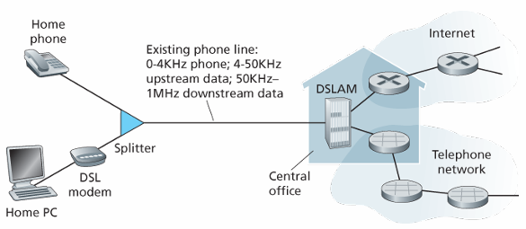
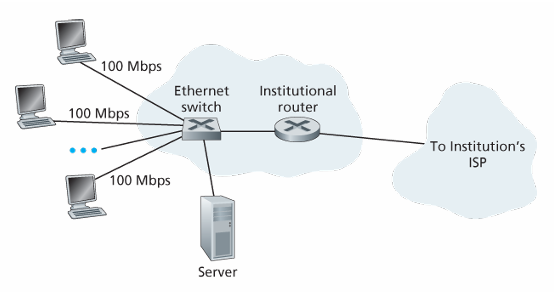
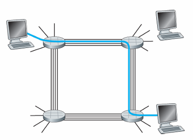
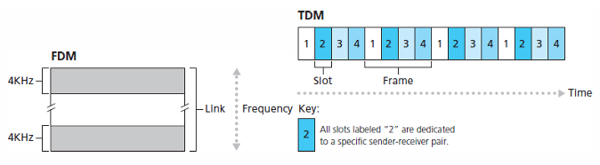
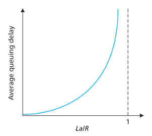
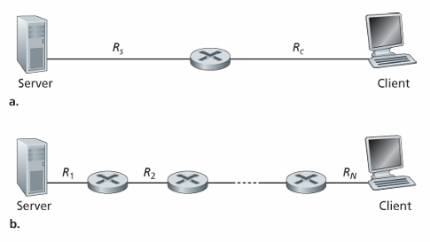

# 计算机网络和因特网

## 什么是因特网
考虑两个方面：
- 构成因特网的基本硬件和软件组件
- 为分布式应用提供服务的联网基础设施

### 具体构成描述
所有联网设备称为**主机**或**端系统**，它们通过**通信链路**和**分组交换机**连接到一起。
不同的链路具有不同的**传输速率**，以比特/秒（bit/s，或bps）度量。主机向其他主机发送分段的数据，每段加上首部字节形成信息包，称为**分组**。

在分组传输的过程中， 分组交换机负责把分组从入通信链路转发到出通信链路。最常见的分组交换机是**路由器**和**链路层交换机**。一个分组从起点到终点所经历的一系列通信链路和分组交换机称为**路径**。

端系统通过**因特网服务提供商ISP**接入因特网。每个ISP本身就是一个有多台分组交换机和多段通信链路的网络。

端系统、分组交换机和其他因特网部件都要运行一系列**协议**来控制信息的接受和发送。其中**传输控制协议TCP**和**网际协议IP**是因特网最重要的两个协议。

为了统一每个人对于协议的认识，**因特网标准**由因特网工程任务组IETF制定。IETF的标准文档称为**请求评论RFC**。

### 服务描述
涉及多个相互交换数据的主机的应用程序称为**分布式应用程序**。

与因特网相连的端系统提供了一个**套接字接口**，规定了程序和另一个端系统上的程序交付数据的方式。

### 什么是协议
协议定义了在两个或多个通信实体之间交换的报文格式和顺序，以及报文发送和/或接收一条报文或其他事件所采取的动作。

## 网络边缘
主机被划分为**客户**和**服务器**。很多服务器都属于大型**数据中心**。

### 接入网
**边缘路由器**指端系统到任何其他远程端系统路径上的第一台路由器。**接入网**指的是将端系统物理连接到其边缘路由器的网络。有几种常见的接入网。

#### 家庭接入：DSL、电缆、FTTH、拨号和卫星
宽带住宅接入有两种最流行的类型：**数字用户线DSL**和电缆。

其中DSL服务通常从本地电话公司获得，它相当于用户的ISP。用户的调制解调器使用现有的电话线（双绞铜线）和位于电话公司本地中心局的数字用户线接入设备（DSLAM）交换数据。家庭电话线同时承载数据和传统的电话信号，分别使用不同的频率编码：
- 高速下行信道，位于50kHz到1MHz之间
- 中速上行信道，位于4kHz到50kHz之间
- 普通的双向电话信道，位于0到4kHz之间

DSL标准定义了多个传输速率，包括12Mbps的下行速率和1.8Mbps的上行速率，以及55Mbps的下行速率和15Mbps的上行速率。由于上下行速率不同， 故被称为不对称的接入。一般来说DSL是为了短距离接入而设计的，如果住宅不是位于本地中心局的5到10公里内，必须采用其他形式的因特网接入。

**电缆因特网接入**则利用了有限电视公司现有的有线电视基础设施。光缆从电缆头端分别接到各个地区枢纽，然后从此引出传统的同轴电缆到达各家各户，每个地区枢纽通常支持500~5000个家庭。因为这样的系统混合使用光缆和同轴电缆，所以被称为混合光纤同轴HFC系统。

它需要特殊的电缆调制解调器，一般是一个外部设备，通过以太网端口连接到家庭PC。在电缆头端，电缆调制解调器端接系统CMTS则与DSL的DSLAM类似，把光缆上的模拟信号转换回数字信号。电缆调制解调器把HFC网络划分为上行和下行两个信道，下行信道的速率通常更高。DOCSIS 2.0标准定义了42.8Mbps的下行速率和30.7Mbps的上行速率。

电缆因特网接入的特征是共享广播媒体，因为所有用户共享一条链路，需要一个分布式多路访问协议来协调传输和避免碰撞。

以上两种方式在美国占有率很高，但有一种更高速的新兴技术逐渐称为主流，**光纤到户FTTH**，它直接从本地中心局连接一条光线到家庭。

光纤的分布有几种方案。最简单的是每户有一根到中心局的光纤。更常见的是，中心局引出的一根光纤末端分出多条光纤分别连接位置相近的多个家庭，这种分配有两种光纤分布体系结构：有源光纤网络AON、无源光纤网络PON。其中AON本质上就是交换以太网。

简要讨论PON，它用于Verizon的FIOS服务中。每个家庭有一个光纤网络端接器ONT，它由光纤连接到邻近的光纤分配器，分配器把多根连接到家庭的光纤集结到一根光纤连接到中心局的光纤线路端接器OLT。OLT实现光信号到电信号的转换，然后经过本地电话公司的路由器连接到因特网。在家庭中，用户将家庭路由器与ONT相连并通过该路由器接入因特网。所有从OLT发送到分配器的分组在分配器上复制。

FTTH可以提供每秒千兆比特的速率，但大多ISP提供不同速率和价格的服务。美国在2011年的平均下行速率只有20Mbps，实际上与13Mbps的电缆接入网相当。

还有其他两种接入网技术。在无法提供以上三种技术的地区，可以使用卫星链路提供超过1Mbps的速率，StarBand和HughesNet是两家卫星接入提供商。还有使用传统电话线的拨号接入，它与DSL基于同样的模式，但是速率只有56kbps。

#### 企业（家庭）接入：以太网和WiFi
许多公司和大学等环境，使用局域网LAN将端系统连接到边缘路由器。有许多的局域网技术，最流行的还是以太网。端系统使用双绞铜线和以太网交换机相连，然后再与更大的因特网相连。使用以太网接入，用户通常以100Mbps或1Gbps的速率接入以太网交换机，对于服务器可能具有1Gbps或10Gbps的速率。

然而，越来越多人使用无线方式接入因特网。在无线LAN环境中，无线用户从一个接入点发送或接收分组
，该接入点与企业网连接（可能使用了有线以太网），企业网再与有限因特网连接。IEEE 802.11技术的无线LAN接入，称为WiFi，提供高达100Mbps的共享传输速率。

#### 广域无线接入：3G和LTE
使用与蜂窝移动电话相同的无线基础设施，通过蜂窝网提供商运营的基站来发送和接收分组，与WiFi不同，用户可以距离基站达数万米。电信公司在第三代（3G）无线技术中进行了大量投资，它为分组交换广域无线因特网接入提供了超过1Mbps的速率。长期演进LTE技术来源于3G技术，能够取得超过10Mbps的速率，甚至达到几十Mbps的下行速率。

### 物理媒体
发送接收信息，需要通过一种**物理媒体**来传播电磁波或光脉冲，它可以具有多种形状和形式，包括双绞铜线、同轴电缆、多模光纤缆、陆地无线电频谱和卫星无线电频谱。物理媒体分为两种类型：**导引型媒体**和**非导引媒体**。对于导引型媒体，电波沿着固体媒体前行，如光缆、双绞铜线和同轴电缆。对于非导引媒体，电波在空气或外太空中传播，如无线局域网或数字卫星频道。

物理链路（铜线、光缆等）的实际成本比其他网络成本低很多。因此许多建筑商通常一次性安装好双绞线、光缆和同轴电缆，即使当下不需要。

#### 双绞铜线
它是最便宜并且最常用的导引型传输媒体，一直用于电话网，从电话机到本地电话交换机的连线基本是双绞铜线。它由两根绝缘的铜线组成，每根1mm粗，以规则的螺旋状排列着，两根线绞合起来减少邻近双绞线的电气干扰，通常许多双绞线捆扎到一起形成一根电缆，并在双绞线外覆盖一层保护层。**无屏蔽双绞线**常用于建筑内的计算机网络中，即LAN中。

目前LAN中双绞线速率从10Mbps到10Gbps，传输速率取决于线的粗细和两端的距离。6a类的双绞线已经能达到10Gbps的速率，距离长达100米。双绞线已经是高速LAN联网的主导性解决方案。它也用于住宅因特网接入，如拨号调制解调器使用双绞线达到56kbps的速率，DSL通过双绞线达到数十Mbps的速率。

#### 同轴电缆
它也由两个铜导体组成，但是它们是同心的而不是并行的。借助这样的结构以及特殊的绝缘体和保护层，它可以达到较高的数据传输速率。他在电缆电视系统中相当普遍。同轴电缆能被用作导引型**共享媒体**，许多端系统能够直接与该电缆相连，每个端系统都能接收其他端系统发送的内容。

#### 光纤
它是一种细而柔软、能够导引光脉冲的媒体，每个脉冲表示一个比特。一根光纤能够支持极高的比特速率，高达数十甚至数百Gbps。它们不受电磁干扰，长达100km的光缆信号衰减极低，并且很难窃听。这使得它称为长途导引型传输媒体，尤其是跨海链路。许多长途电话网络全面使用光纤，并且许多因特网主干也使用光纤。虽然，光设备（发射器、接收器、交换机）的成本很高，阻碍了它在短途传输的应用，如LAN或家庭接入网。

光载波OC标准链路速率的范围从51.8Mbps到39.8Gbps。这些标准称为OC-n，其中链路速率等于n*51.8Mbps。目前正在使用的的标准包括OC-1、OC-3、OC-12、OC-24、OC-48、OC-96、OC-192和OC-768。

#### 陆地无线电信道
无线电信道承载电磁频谱中的信号。它不用安装物理线路，可以穿透墙壁、提供与移动用户的连接以及长距离承载信号的能力。它极大地依赖于传播环境和信号传输的距离。环境上的考虑取决于路径损耗和遮挡衰落、多径衰落以及干扰。

它一般分为三类：
- 运行在很短距离，1m或2m
- 运行在局域，跨越几十到几百米
- 运行在广域，跨越数万米

#### 卫星无线电信道
一颗通信卫星连接地球上的两个或多个微波发射器/接收器，它们被称为地面站。卫星在一个频段上接收传输，使用一个转发器再生信号，并在另一个频段上发射信号。常常使用两种卫星：**同步卫星**和**近地轨道LEO卫星**。

同步卫星位于地面上方36000公里，故传输时延达到了280ms。它们通常用于无法使用DSL或电缆因特网的地区。

近地轨道卫星非常接近地球，并且多个卫星彼此可以通信。目前有许多低轨道通信系统在研制中，未来也许能用于因特网接入。

## 网络核心

### 分组交换
在网络应用中，端系统彼此交换**报文**。为了发送一个报文，源端系统把它划分为较小的数据块，称为**分组**。分组依次通过链路和**分组交换机**传送。

#### 存储转发运输
多数分组交换机在链路的输入端使用**存储转发运输**机制，指交换机直到接收完整个分组才开始转发，这样的机制加大了端到端时延。考虑传输L比特的分组，链路传输速率为R比特/秒，忽略中间信号传输的时间，如果不进行存储直接转发，则时延为L/R秒。如果进行存储转发，则每经过一个路由器就需要等待L/R秒，有
$$
d_{端到端}=N\frac{L}{R}
$$
其中N是路径上链路的数量。

#### 排队时延和分组丢失
每台分组交换机有多条链路与之相连，每条链路都有一个**输出缓存**或叫**输出队列**。如果有一个分组需要发往一条链路，但此时链路正在传输其他的分组，则它就在输出缓存中等待，此时它需要承受**排队时延**。如果输出缓存已满，新到达的分组就会被丢弃，这种现象称为**分组丢失（丢包）**。

#### 转发表和路由选择协议
路由器得到了分组以后需要转发它，它用IP查询**转发表**来决定把分组转发到哪条链路。为了设置转发表，需要使用**路由选择协议**。

#### 电路交换
通过网络链路和交换机移动数据有两种基本方法：**电路交换**和**分组交换**。

电路交换网络中，两个主机要通信时先建立**端到端连接**，然后它们独占分配给它们的链路。

而分组交换网络则只是把分组发送进网络，不会预留任何链路资源，资源不足时它则需要等待。因特网对于分组的传输不做任何保证。

#### 电路交换网络中的复用
链路中的电路是通过**频分服用FDM**或**时分复用TDM**来实现的。

对于FDM，跨越链路的所有连接共享链路的频谱，每条连接专用其中的一个频段。在电话网络中，频段的宽度一般为4kHz，这称为**带宽**。调频无线电台也使用FDM来共享88MHz到108MHz的频谱。

对于TDM，时间被划分为固定长度的帧，每个帧又被划分为固定数量的时隙，每个连接在每个帧中可以独占一个时隙。

电路交换因为在**静默期**也会占用资源，即连接的两端不传输数据时其他连接也不能使用这些资源，所以它的资源利用率较低。并且创建端到端电路和预留端到端带宽是复杂的，需要复杂的信令软件以及协调沿端到端路径的所有交换机。

#### 分组交换和电路交换的对比
分组交换不适用于实时服务，因为端到端时延是可变且不可预测的。虽然如此，它提供了比电路交换更好的带宽共享，并且更简单、更有效、成本更低。虽然两种交换方式都是广泛使用的，但分组交换有更大的优势，许多电路交换电话网都在朝着分组交换网络转变，比如硬件成本高昂的海外电话线路。

### 网络的网络

**存在点PoP**没有在图上画出，它存在于网络结构的所有层次，是供应商网络的一个或多个路由器，客户ISP可以通过它们与供应商ISP相连。要与提供商PoP连接的客户网络，可以从第三方电信提供商租用高速链路将它的路由器之一直接连接到该PoP中的一台路由器。

ISP可以选择**多宿**，即从多个供应商ISP处获得服务，这样可以实现更好的容错性。

因为低层的ISP需要向高层ISP支付费用，低层ISP之间很可能实现**对等**，直接连线交换数据而不经过高层ISP来节约费用。此时它们互相不收费，称为无结算。

为了更好地实现对象，有第三方公司创建**因特网交换点IXP**，多个ISP一同在这里对等。它通常位于一个有自己交换机的独立建筑物中。

还有一些**内容提供商网络**。如谷歌的网络，它们只处理经过谷歌服务器的流量，与它直接与低层ISP连接或者在IXP处与它们连接实现对等来节约费用。然而有的网络只能通过一层ISP，因此谷歌也需要与一层ISP直接相连，为这些流量支付相应的费用。

## 分组交换网中的时延、丢包和吞吐量

### 分组交换网中的时延概述
主要有**节点处理时延**、**排队时延**、**传输时延**和**传播时延**。这些时延累加起来是**节点总时延**。

#### 时延的类型
- 处理时延：检查分组首部、决定将该分组导向何处所需要的时间，还有一些其他因素。通常在微秒或更低级别。
- 排队时延：分组在链路上等待传输的时间。实际的排队时延可以是毫秒到微秒级别。
- 传输时延：把分组推向链路所需要的时间。通常在毫秒到微秒级别。
- 传播时延：信号在链路上传播的时间。在广域网中，为毫秒级别。

$$
d_{总时延}=d_{处理}+d_{排队}+d_{传输}+d_{传播}
$$

### 排队时延和丢包
对于一个输出队列，令 $a$ 为分组到达队列的平均速率，每个分组都是 $L$ 比特， $R$ 为链路传输速率。则定义**流量强度**为 $\frac{La}{R}$ 。当流量强度大于1，队列长度趋于无限增加，排队时延趋于无穷大。当流量强度不大于1，那么如果分组周期性到达，则每个分组到达时队列都为空，没有排队时延；如果是突发到达，那么第一个分组没有排队时延，第二个分组排队时延为 $L/R$ ，第三个分组排队时延为 $2L/R$ ，以此类推，第 $n$ 个分组排队时延为 $(n-1)L/R$ 。实际上分组的到达往往是随机的，但是有平均排队时延与流量强度的一般统计关系：

#### 丢包
实际情况中，由于输出队列的容量是有限的，排队时延并不会趋于无穷大，而是路由器会**丢弃**后续到达的分组，即分组发生**丢失**。

### 端到端时延
假设源主机和目的主机之间有 $N-1$ 台路由器，并且网络无拥塞（认为没有排队时延），每台路由器和源主机的处理实验为 $d_{处理}$ ，路由器和源主机的输出速率是 $R$ bps，每条链路的传播时延为 $d_{传播}$ ，发送长度为 $L$ 的分组的端到端时延为
$$
d_{端到端}=N(d_{处理}+d_{传播}+\frac{L}{R})
$$

#### Traceroute
用户指定一个目的主机，源主机的程序朝着目的地发送多个特殊的分组，它们向目的地传送的过程中经过一系列的路由器，这些路由器接收到特殊的分组时回传一个短报文，包含路由器的名字和地址。

实际上，源主机发送编号从1到N的分组，路径上的第n个路由器接收到编号为n的分组时，它会回传一个报文。Traceroute会重复这个过程三遍。具体的流程定义在RFC 1393中。

#### 端系统、应用程序和其他时延
希望向共享媒体（如WiFi）传输分组的端系统而可能有意延迟它的传输，把这作为它和其他端系统共享媒体的协议的一部分。

还有媒体分组化时延，出现在IP语音（VoIP）0的应用中，发送方在向因特网传递分组之前必须首先用编码的数字化语音填充一个分组，这个过程的时间称为分组化实验，它可能会比较大，可能影响VoIP的质量。

### 计算机网络中的吞吐量
考虑从主机A到主机B通过网络传输一个大文件。任意时刻的**瞬时吞吐量**指主机B接受该文件的速率（以bps计）。如果文件由 $F$ 比特组成，主机B接收到所有 $F$ 比特用去了 $T$ 秒，那么**平均吞吐量**为 $F/T$ bps。

像图中的线性路径，它的吞吐量取决于其中吞吐量最小的一条链路，它被称为**瓶颈链路**。

像图中a那样的服务器和客户端交互情况，往往中间经过的互联网核心配置了高速链路，很少出现拥塞，因此瓶颈往往出现在客户端和服务器的接入链路上。而像图中b那样的情况，则需要看中间链路的速率，如果它的速率很高，那么瓶颈还是在接入链路上；如果它的速率不够高，则瓶颈在中间链路上。

## 协议层次及其服务模型

### 分层的体系结构

#### 协议分层
互联网协议的设计采用**分层**的方式来组织协议以及实现协议的软硬件。其中每一层向它的上一层提供**服务**，即所谓一层的**服务模型**。

分层具有概念化和结构化的优点，然而它的潜在缺点是高层可能冗余底层的功能并且某层可能用到其他层才出现的信息。

所有协议被称为**协议栈**，总共有五层：物理层、链路层、网络层、运输层和应用层。

##### 应用层
包含网络应用程序和它们的应用层协议。它包含HTTP、SMTP、FTP等协议。应用层协议分布在多个端系统上，两个端系统上的应用程序根据协议交换信息分组，应用层的信息分组叫做**报文**。

##### 运输层
运输层在应用程序端点之间传送应用层报文。有两种主要的运输层协议：TCP和UDP。TCP提供了面向连接的服务，包括确保传递和流量控制。它把长报文划分为短报文并提供拥塞控制机制。UDP提供无连接服务，没有可靠性、流量控制、拥塞控制。运输层分组称为**报文段**。

##### 网络层
网络层负责传送称为**数据报**的网络层分组。运输层协议向网络层协议提交报文段和目的地址。常见的网络层协议有网际协议IP，所有具有网络层的组件都必须运行IP。还有路由选择协议等其他协议。一般称网络层为IP层，因为IP将因特网连接在了一起。

##### 链路层
网络层需要传输数据报，必须依赖于链路层的服务。链路层提供的服务取决于应用于该链路的特定链路层协议，一个数据报可能经过多种链路层协议传输。链路层分组称为**帧**。

##### 物理层
链路层负责把一个帧传送到下一个节点，而物理层负责把帧的逐个比特传送到下一个节点。它与链路使用的实际传输媒体高度相关，如以太网有许多物理层协议：关于双绞铜线的、关于同轴电缆的、关于光纤的等。

#### OSI模型
因特网的五层协议栈不是唯一的协议栈。20世纪70年代后期，国际标准化组织ISO提出开放系统互连OSI模型，是一个七层模型。因为它在网络教育中的早期影响，仍以某种方式存留在一些教科书和培训课程中。

OSI七层模型分别是：应用层、表示层、会话层、运输层、网络层、链路层和物理层。其中五层和因特网协议栈名字类似，实际也提供类似的功能。其中多出了表示层和会话层。表示层作用是使通信的应用程序能够解释交换数据的含义，包括数据压缩、数据加密、数据描述。会话层提供了数据交换的定界和同步功能。

在因特网协议中，缺失的两个层的功能，如果真的被需要，就交给应用程序开发者来处理。

### 封装
因特网协议栈很重要的概念是**封装**。**应用层报文**被传送给运输层。运输层收到报文以后附上运输层首部信息构成**运输层报文段**，此时它封装了应用层报文。同样，网络层给运输层报文段附加网络层首部信息生成了网络层数据报。链路层给网络层数据报附加链路层首部信息生成了链路层帧。物理层给链路层帧附加物理层首部信息生成了物理层比特流。

在每一层，一个分组具有两种类型的字段：**首部字段**和**数据字段**。

## 面对攻击的网络

### 坏家伙能够经因特网将有害程序放入你的计算机中
可能从因特网接收到具有恶意的东西，可以统称为**恶意软件**。受害的主机构成的网络称为**僵尸网络**。大多数的恶意软件是**自我复制**的，其中**病毒**是一种需要某种形式的用户交互来感染用户设备的恶意软件，而**蠕虫**则是一种不需要明显用户交互就能感染用户设备的恶意软件。

### 坏家伙能够攻击服务器和网络基础设施
一种常见的安全性威胁是**拒绝服务攻击DoS**，大多数的DoS属于以下三种类型之一：
- 弱点攻击：向目标主机上运行的易受攻击的应用程序或操作系统发送特殊报文。
- 带宽洪泛：向目标主机发送大量的报文，使得服务器的接入链路拥塞。
- 连接洪泛：与目标主机建立大量的半开或全开的TCP连接，使得服务器无法接受新的连接。

如果服务器的接入速率非常大，那么单一的攻击源可能无法产生足够大的流量来攻击服务器，而且可能被路由器拦截。因此攻击者可能使用**分布式拒绝服务攻击DDoS**，它使用了大量的攻击源同时向目标主机发送流量。

### 坏家伙能够嗅探分组
记录每个流经的分组副本的被动接收机被称为**分组嗅探器**。电缆接入技术也广播分组，容易受到嗅探攻击。因为分组嗅探器被动接受分组而不发送分组，很难检测到它们的存在，只能通过密码学手段来防范。

### 坏家伙能够伪装成你信任的人
很容易就能生成具有任意源地址、分组内容和目的地址的分组，把带有虚假的源地址的分组注入因特网称为**IP欺骗**。为了避免这样的问题，需要使用端点鉴别技术。
