# 计算机网络和因特网

## 什么是因特网
考虑两个方面：
- 构成因特网的基本硬件和软件组件
- 为分布式应用提供服务的联网基础设施

### 具体构成描述
所有联网设备称为**主机**或**端系统**，它们通过**通信链路**和**分组交换机**连接到一起。
不同的链路具有不同的**传输速率**，以比特/秒（bit/s，或bps）度量。主机向其他主机发送分段的数据，每段加上首部字节形成信息包，称为**分组**。

在分组传输的过程中， 分组交换机负责把分组从入通信链路转发到出通信链路。最常见的分组交换机是**路由器**和**链路层交换机**。一个分组从起点到终点所经历的一系列通信链路和分组交换机称为**路径**。

端系统通过**因特网服务提供商ISP**接入因特网。每个ISP本身就是一个有多台分组交换机和多段通信链路的网络。

端系统、分组交换机和其他因特网部件都要运行一系列**协议**来控制信息的接受和发送。其中**传输控制协议TCP**和**网际协议IP**是因特网最重要的两个协议。

为了统一每个人对于协议的认识，**因特网标准**由因特网工程任务组IETF制定。IETF的标准文档称为**请求评论RFC**。

### 服务描述
涉及多个相互交换数据的主机的应用程序称为**分布式应用程序**。

与因特网相连的端系统提供了一个**套接字接口**，规定了程序和另一个端系统上的程序交付数据的方式。

### 什么是协议
协议定义了在两个或多个通信实体之间交换的报文格式和顺序，以及报文发送和/或接收一条报文或其他事件所采取的动作。

## 网络边缘
主机被划分为**客户**和**服务器**。很多服务器都属于大型**数据中心**。

### 接入网
**边缘路由器**指端系统到任何其他远程端系统路径上的第一台路由器。**接入网**指的是将端系统物理连接到其边缘路由器的网络。有几种常见的接入网。

#### 家庭接入：DSL、电缆、FTTH、拨号和卫星
宽带住宅接入有两种最流行的类型：**数字用户线DSL**和电缆。

其中DSL服务通常从本地电话公司获得，它相当于用户的ISP。用户的调制解调器使用现有的电话线（双绞铜线）和位于电话公司本地中心局的数字用户线接入设备（DSLAM）交换数据。家庭电话线同时承载数据和传统的电话信号，分别使用不同的频率编码：
- 高速下行信道，位于50kHz到1MHz之间
- 中速上行信道，位于4kHz到50kHz之间
- 普通的双向电话信道，位于0到4kHz之间

DSL标准定义了多个传输速率，包括12Mbps的下行速率和1.8Mbps的上行速率，以及55Mbps的下行速率和15Mbps的上行速率。由于上下行速率不同， 故被称为不对称的接入。一般来说DSL是为了短距离接入而设计的，如果住宅不是位于本地中心局的5到10公里内，必须采用其他形式的因特网接入。

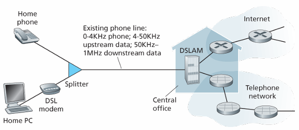

**电缆因特网接入**则利用了有限电视公司现有的有线电视基础设施。光缆从电缆头端分别接到各个地区枢纽，然后从此引出传统的同轴电缆到达各家各户，每个地区枢纽通常支持500~5000个家庭。因为这样的系统混合使用光缆和同轴电缆，所以被称为混合光纤同轴HFC系统。

它需要特殊的电缆调制解调器，一般是一个外部设备，通过以太网端口连接到家庭PC。在电缆头端，电缆调制解调器端接系统CMTS则与DSL的DSLAM类似，把光缆上的模拟信号转换回数字信号。电缆调制解调器把HFC网络划分为上行和下行两个信道，下行信道的速率通常更高。DOCSIS 2.0标准定义了42.8Mbps的下行速率和30.7Mbps的上行速率。

电缆因特网接入的特征是共享广播媒体，因为所有用户共享一条链路，需要一个分布式多路访问协议来协调传输和避免碰撞。

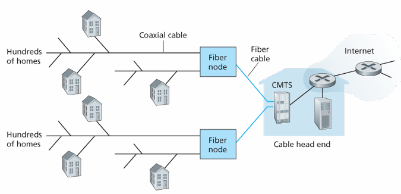

以上两种方式在美国占有率很高，但有一种更高速的新兴技术逐渐称为主流，**光纤到户FTTH**，它直接从本地中心局连接一条光线到家庭。

光纤的分布有几种方案。最简单的是每户有一根到中心局的光纤。更常见的是，中心局引出的一根光纤末端分出多条光纤分别连接位置相近的多个家庭，这种分配有两种光纤分布体系结构：有源光纤网络AON、无源光纤网络PON。其中AON本质上就是交换以太网。

简要讨论PON，它用于Verizon的FIOS服务中。每个家庭有一个光纤网络端接器ONT，它由光纤连接到邻近的光纤分配器，分配器把多根连接到家庭的光纤集结到一根光纤连接到中心局的光纤线路端接器OLT。OLT实现光信号到电信号的转换，然后经过本地电话公司的路由器连接到因特网。在家庭中，用户将家庭路由器与ONT相连并通过该路由器接入因特网。所有从OLT发送到分配器的分组在分配器上复制。

FTTH可以提供每秒千兆比特的速率，但大多ISP提供不同速率和价格的服务。美国在2011年的平均下行速率只有20Mbps，实际上与13Mbps的电缆接入网相当。

还有其他两种接入网技术。在无法提供以上三种技术的地区，可以使用卫星链路提供超过1Mbps的速率，StarBand和HughesNet是两家卫星接入提供商。还有使用传统电话线的拨号接入，它与DSL基于同样的模式，但是速率只有56kbps。

#### 企业（家庭）接入：以太网和WiFi
许多公司和大学等环境，使用局域网LAN将端系统连接到边缘路由器。有许多的局域网技术，最流行的还是以太网。端系统使用双绞铜线和以太网交换机相连，然后再与更大的因特网相连。使用以太网接入，用户通常以100Mbps或1Gbps的速率接入以太网交换机，对于服务器可能具有1Gbps或10Gbps的速率。

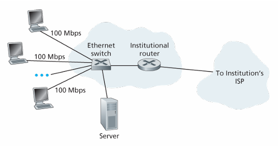

然而，越来越多人使用无线方式接入因特网。在无线LAN环境中，无线用户从一个接入点发送或接收分组
，该接入点与企业网连接（可能使用了有线以太网），企业网再与有限因特网连接。IEEE 802.11技术的无线LAN接入，称为WiFi，提供高达100Mbps的共享传输速率。

#### 广域无线接入：3G和LTE
使用与蜂窝移动电话相同的无线基础设施，通过蜂窝网提供商运营的基站来发送和接收分组，与WiFi不同，用户可以距离基站达数万米。电信公司在第三代（3G）无线技术中进行了大量投资，它为分组交换广域无线因特网接入提供了超过1Mbps的速率。长期演进LTE技术来源于3G技术，能够取得超过10Mbps的速率，甚至达到几十Mbps的下行速率。

### 物理媒体
发送接收信息，需要通过一种**物理媒体**来传播电磁波或光脉冲，它可以具有多种形状和形式，包括双绞铜线、同轴电缆、多模光纤缆、陆地无线电频谱和卫星无线电频谱。物理媒体分为两种类型：**导引型媒体**和**非导引媒体**。对于导引型媒体，电波沿着固体媒体前行，如光缆、双绞铜线和同轴电缆。对于非导引媒体，电波在空气或外太空中传播，如无线局域网或数字卫星频道。

物理链路（铜线、光缆等）的实际成本比其他网络成本低很多。因此许多建筑商通常一次性安装好双绞线、光缆和同轴电缆，即使当下不需要。

#### 双绞铜线
它是最便宜并且最常用的导引型传输媒体，一直用于电话网，从电话机到本地电话交换机的连线基本是双绞铜线。它由两根绝缘的铜线组成，每根1mm粗，以规则的螺旋状排列着，两根线绞合起来减少邻近双绞线的电气干扰，通常许多双绞线捆扎到一起形成一根电缆，并在双绞线外覆盖一层保护层。**无屏蔽双绞线**常用于建筑内的计算机网络中，即LAN中。

目前LAN中双绞线速率从10Mbps到10Gbps，传输速率取决于线的粗细和两端的距离。6a类的双绞线已经能达到10Gbps的速率，距离长达100米。双绞线已经是高速LAN联网的主导性解决方案。它也用于住宅因特网接入，如拨号调制解调器使用双绞线达到56kbps的速率，DSL通过双绞线达到数十Mbps的速率。

#### 同轴电缆
它也由两个铜导体组成，但是它们是同心的而不是并行的。借助这样的结构以及特殊的绝缘体和保护层，它可以达到较高的数据传输速率。他在电缆电视系统中相当普遍。同轴电缆能被用作导引型**共享媒体**，许多端系统能够直接与该电缆相连，每个端系统都能接收其他端系统发送的内容。

#### 光纤
它是一种细而柔软、能够导引光脉冲的媒体，每个脉冲表示一个比特。一根光纤能够支持极高的比特速率，高达数十甚至数百Gbps。它们不受电磁干扰，长达100km的光缆信号衰减极低，并且很难窃听。这使得它称为长途导引型传输媒体，尤其是跨海链路。许多长途电话网络全面使用光纤，并且许多因特网主干也使用光纤。虽然，光设备（发射器、接收器、交换机）的成本很高，阻碍了它在短途传输的应用，如LAN或家庭接入网。

光载波OC标准链路速率的范围从51.8Mbps到39.8Gbps。这些标准称为OC-n，其中链路速率等于n*51.8Mbps。目前正在使用的的标准包括OC-1、OC-3、OC-12、OC-24、OC-48、OC-96、OC-192和OC-768。

#### 陆地无线电信道
无线电信道承载电磁频谱中的信号。它不用安装物理线路，可以穿透墙壁、提供与移动用户的连接以及长距离承载信号的能力。它极大地依赖于传播环境和信号传输的距离。环境上的考虑取决于路径损耗和遮挡衰落、多径衰落以及干扰。

它一般分为三类：
- 运行在很短距离，1m或2m
- 运行在局域，跨越几十到几百米
- 运行在广域，跨越数万米

#### 卫星无线电信道
一颗通信卫星连接地球上的两个或多个微波发射器/接收器，它们被称为地面站。卫星在一个频段上接收传输，使用一个转发器再生信号，并在另一个频段上发射信号。常常使用两种卫星：**同步卫星**和**近地轨道LEO卫星**。

同步卫星位于地面上方36000公里，故传输时延达到了280ms。它们通常用于无法使用DSL或电缆因特网的地区。

近地轨道卫星非常接近地球，并且多个卫星彼此可以通信。目前有许多低轨道通信系统在研制中，未来也许能用于因特网接入。

## 网络核心

### 分组交换
在网络应用中，端系统彼此交换**报文**。为了发送一个报文，源端系统把它划分为较小的数据块，称为**分组**。分组依次通过链路和**分组交换机**传送。

#### 存储转发运输
多数分组交换机在链路的输入端使用**存储转发运输**机制，指交换机直到接收完整个分组才开始转发，这样的机制加大了端到端时延。考虑传输L比特的分组，链路传输速率为R比特/秒，忽略中间信号传输的时间，如果不进行存储直接转发，则时延为L/R秒。如果进行存储转发，则每经过一个路由器就需要等待L/R秒，有
$$
d_{端到端}=N\frac{L}{R}
$$
其中N是路径上链路的数量。

#### 排队时延和分组丢失
每台分组交换机有多条链路与之相连，每条链路都有一个**输出缓存**或叫**输出队列**。如果有一个分组需要发往一条链路，但此时链路正在传输其他的分组，则它就在输出缓存中等待，此时它需要承受**排队时延**。如果输出缓存已满，新到达的分组就会被丢弃，这种现象称为**分组丢失（丢包）**。

#### 转发表和路由选择协议
路由器得到了分组以后需要转发它，它用IP查询**转发表**来决定把分组转发到哪条链路。为了设置转发表，需要使用**路由选择协议**。

#### 电路交换
通过网络链路和交换机移动数据有两种基本方法：**电路交换**和**分组交换**。

电路交换网络中，两个主机要通信时先建立**端到端连接**，然后它们独占分配给它们的链路。


而分组交换网络则只是把分组发送进网络，不会预留任何链路资源，资源不足时它则需要等待。因特网对于分组的传输不做任何保证。

#### 电路交换网络中的复用
链路中的电路是通过**频分服用FDM**或**时分复用TDM**来实现的。

对于FDM，跨越链路的所有连接共享链路的频谱，每条连接专用其中的一个频段。在电话网络中，频段的宽度一般为4kHz，这称为**带宽**。调频无线电台也使用FDM来共享88MHz到108MHz的频谱。

对于TDM，时间被划分为固定长度的帧，每个帧又被划分为固定数量的时隙，每个连接在每个帧中可以独占一个时隙。

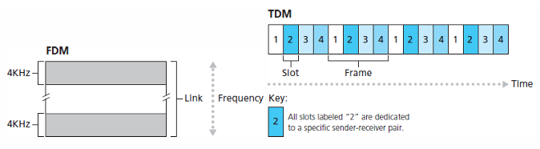

电路交换因为在**静默期**也会占用资源，即连接的两端不传输数据时其他连接也不能使用这些资源，所以它的资源利用率较低。并且创建端到端电路和预留端到端带宽是复杂的，需要复杂的信令软件以及协调沿端到端路径的所有交换机。

#### 分组交换和电路交换的对比
分组交换不适用于实时服务，因为端到端时延是可变且不可预测的。虽然如此，它提供了比电路交换更好的带宽共享，并且更简单、更有效、成本更低。虽然两种交换方式都是广泛使用的，但分组交换有更大的优势，许多电路交换电话网都在朝着分组交换网络转变，比如硬件成本高昂的海外电话线路。

### 网络的网络
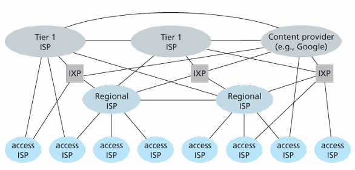

**存在点PoP**没有在图上画出，它存在于网络结构的所有层次，是供应商网络的一个或多个路由器，客户ISP可以通过它们与供应商ISP相连。要与提供商PoP连接的客户网络，可以从第三方电信提供商租用高速链路将它的路由器之一直接连接到该PoP中的一台路由器。

ISP可以选择**多宿**，即从多个供应商ISP处获得服务，这样可以实现更好的容错性。

因为低层的ISP需要向高层ISP支付费用，低层ISP之间很可能实现**对等**，直接连线交换数据而不经过高层ISP来节约费用。此时它们互相不收费，称为无结算。

为了更好地实现对象，有第三方公司创建**因特网交换点IXP**，多个ISP一同在这里对等。它通常位于一个有自己交换机的独立建筑物中。

还有一些**内容提供商网络**。如谷歌的网络，它们只处理经过谷歌服务器的流量，与它直接与低层ISP连接或者在IXP处与它们连接实现对等来节约费用。然而有的网络只能通过一层ISP，因此谷歌也需要与一层ISP直接相连，为这些流量支付相应的费用。

## 分组交换网中的时延、丢包和吞吐量

### 分组交换网中的时延概述
主要有**节点处理时延**、**排队时延**、**传输时延**和**传播时延**。这些时延累加起来是**节点总时延**。

#### 时延的类型
- 处理时延：检查分组首部、决定将该分组导向何处所需要的时间，还有一些其他因素。通常在微秒或更低级别。
- 排队时延：分组在链路上等待传输的时间。实际的排队时延可以是毫秒到微秒级别。
- 传输时延：把分组推向链路所需要的时间。通常在毫秒到微秒级别。
- 传播时延：信号在链路上传播的时间。在广域网中，为毫秒级别。

$$
d_{总时延}=d_{处理}+d_{排队}+d_{传输}+d_{传播}
$$

### 排队时延和丢包
对于一个输出队列，令 $a$ 为分组到达队列的平均速率，每个分组都是 $L$ 比特， $R$ 为链路传输速率。则定义**流量强度**为 $\frac{La}{R}$ 。当流量强度大于1，队列长度趋于无限增加，排队时延趋于无穷大。当流量强度不大于1，那么如果分组周期性到达，则每个分组到达时队列都为空，没有排队时延；如果是突发到达，那么第一个分组没有排队时延，第二个分组排队时延为 $L/R$ ，第三个分组排队时延为 $2L/R$ ，以此类推，第 $n$ 个分组排队时延为 $(n-1)L/R$ 。实际上分组的到达往往是随机的，但是有平均排队时延与流量强度的一般统计关系：

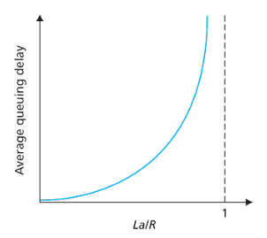

#### 丢包
实际情况中，由于输出队列的容量是有限的，排队时延并不会趋于无穷大，而是路由器会**丢弃**后续到达的分组，即分组发生**丢失**。

### 端到端时延
假设源主机和目的主机之间有 $N-1$ 台路由器，并且网络无拥塞（认为没有排队时延），每台路由器和源主机的处理实验为 $d_{处理}$ ，路由器和源主机的输出速率是 $R$ bps，每条链路的传播时延为 $d_{传播}$ ，发送长度为 $L$ 的分组的端到端时延为
$$
d_{端到端}=N(d_{处理}+d_{传播}+\frac{L}{R})
$$

#### Traceroute
用户指定一个目的主机，源主机的程序朝着目的地发送多个特殊的分组，它们向目的地传送的过程中经过一系列的路由器，这些路由器接收到特殊的分组时回传一个短报文，包含路由器的名字和地址。

实际上，源主机发送编号从1到N的分组，路径上的第n个路由器接收到编号为n的分组时，它会回传一个报文。Traceroute会重复这个过程三遍。具体的流程定义在RFC 1393中。

#### 端系统、应用程序和其他时延
希望向共享媒体（如WiFi）传输分组的端系统而可能有意延迟它的传输，把这作为它和其他端系统共享媒体的协议的一部分。

还有媒体分组化时延，出现在IP语音（VoIP）0的应用中，发送方在向因特网传递分组之前必须首先用编码的数字化语音填充一个分组，这个过程的时间称为分组化实验，它可能会比较大，可能影响VoIP的质量。

### 计算机网络中的吞吐量
考虑从主机A到主机B通过网络传输一个大文件。任意时刻的**瞬时吞吐量**指主机B接受该文件的速率（以bps计）。如果文件由 $F$ 比特组成，主机B接收到所有 $F$ 比特用去了 $T$ 秒，那么**平均吞吐量**为 $F/T$ bps。

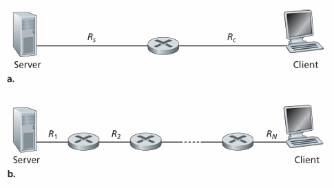

像图中的线性路径，它的吞吐量取决于其中吞吐量最小的一条链路，它被称为**瓶颈链路**。

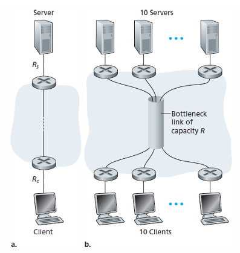

像图中a那样的服务器和客户端交互情况，往往中间经过的互联网核心配置了高速链路，很少出现拥塞，因此瓶颈往往出现在客户端和服务器的接入链路上。而像图中b那样的情况，则需要看中间链路的速率，如果它的速率很高，那么瓶颈还是在接入链路上；如果它的速率不够高，则瓶颈在中间链路上。

## 协议层次及其服务模型

### 分层的体系结构

#### 协议分层
互联网协议的设计采用**分层**的方式来组织协议以及实现协议的软硬件。其中每一层向它的上一层提供**服务**，即所谓一层的**服务模型**。

分层具有概念化和结构化的优点，然而它的潜在缺点是高层可能冗余底层的功能并且某层可能用到其他层才出现的信息。

所有协议被称为**协议栈**，总共有五层：物理层、链路层、网络层、运输层和应用层。

##### 应用层
包含网络应用程序和它们的应用层协议。它包含HTTP、SMTP、FTP等协议。应用层协议分布在多个端系统上，两个端系统上的应用程序根据协议交换信息分组，应用层的信息分组叫做**报文**。

##### 运输层
运输层在应用程序端点之间传送应用层报文。有两种主要的运输层协议：TCP和UDP。TCP提供了面向连接的服务，包括确保传递和流量控制。它把长报文划分为短报文并提供拥塞控制机制。UDP提供无连接服务，没有可靠性、流量控制、拥塞控制。运输层分组称为**报文段**。

##### 网络层
网络层负责传送称为**数据报**的网络层分组。运输层协议向网络层协议提交报文段和目的地址。常见的网络层协议有网际协议IP，所有具有网络层的组件都必须运行IP。还有路由选择协议等其他协议。一般称网络层为IP层，因为IP将因特网连接在了一起。

##### 链路层
网络层需要传输数据报，必须依赖于链路层的服务。链路层提供的服务取决于应用于该链路的特定链路层协议，一个数据报可能经过多种链路层协议传输。链路层分组称为**帧**。

##### 物理层
链路层负责把一个帧传送到下一个节点，而物理层负责把帧的逐个比特传送到下一个节点。它与链路使用的实际传输媒体高度相关，如以太网有许多物理层协议：关于双绞铜线的、关于同轴电缆的、关于光纤的等。

#### OSI模型
因特网的五层协议栈不是唯一的协议栈。20世纪70年代后期，国际标准化组织ISO提出开放系统互连OSI模型，是一个七层模型。因为它在网络教育中的早期影响，仍以某种方式存留在一些教科书和培训课程中。

OSI七层模型分别是：应用层、表示层、会话层、运输层、网络层、链路层和物理层。其中五层和因特网协议栈名字类似，实际也提供类似的功能。其中多出了表示层和会话层。表示层作用是使通信的应用程序能够解释交换数据的含义，包括数据压缩、数据加密、数据描述。会话层提供了数据交换的定界和同步功能。

在因特网协议中，缺失的两个层的功能，如果真的被需要，就交给应用程序开发者来处理。

### 封装
因特网协议栈很重要的概念是**封装**。**应用层报文**被传送给运输层。运输层收到报文以后附上运输层首部信息构成**运输层报文段**，此时它封装了应用层报文。同样，网络层给运输层报文段附加网络层首部信息生成了网络层数据报。链路层给网络层数据报附加链路层首部信息生成了链路层帧。物理层给链路层帧附加物理层首部信息生成了物理层比特流。

在每一层，一个分组具有两种类型的字段：**首部字段**和**数据字段**。

## 面对攻击的网络

### 坏家伙能够经因特网将有害程序放入你的计算机中
可能从因特网接收到具有恶意的东西，可以统称为**恶意软件**。受害的主机构成的网络称为**僵尸网络**。大多数的恶意软件是**自我复制**的，其中**病毒**是一种需要某种形式的用户交互来感染用户设备的恶意软件，而**蠕虫**则是一种不需要明显用户交互就能感染用户设备的恶意软件。

### 坏家伙能够攻击服务器和网络基础设施
一种常见的安全性威胁是**拒绝服务攻击DoS**，大多数的DoS属于以下三种类型之一：
- 弱点攻击：向目标主机上运行的易受攻击的应用程序或操作系统发送特殊报文。
- 带宽洪泛：向目标主机发送大量的报文，使得服务器的接入链路拥塞。
- 连接洪泛：与目标主机建立大量的半开或全开的TCP连接，使得服务器无法接受新的连接。

如果服务器的接入速率非常大，那么单一的攻击源可能无法产生足够大的流量来攻击服务器，而且可能被路由器拦截。因此攻击者可能使用**分布式拒绝服务攻击DDoS**，它使用了大量的攻击源同时向目标主机发送流量。

### 坏家伙能够嗅探分组
记录每个流经的分组副本的被动接收机被称为**分组嗅探器**。电缆接入技术也广播分组，容易受到嗅探攻击。因为分组嗅探器被动接受分组而不发送分组，很难检测到它们的存在，只能通过密码学手段来防范。

### 坏家伙能够伪装成你信任的人
很容易就能生成具有任意源地址、分组内容和目的地址的分组，把带有虚假的源地址的分组注入因特网称为**IP欺骗**。为了避免这样的问题，需要使用端点鉴别技术。

<br><br>

# 应用层

## 应用层协议原理

### 网络应用体系结构
在开发者的角度看，网络体系结构是固定的，并为应用程序提供了特定的服务集合。**应用程序体系结构**由应用程序研发者设计，规定了如何在各种端系统上组织该应用程序。现代网络应用程序所使用的两种主流体系结构为：**客户-服务器体系结构**和**对等（P2P）体系结构**。

在客户-服务器体系结构中，有一个总是打开的主机称为服务器，服务其他称为客户的主机。客户之间不直接通信。服务器具有固定的众知地址。服务器的性能需要很强大，故常常会使用配备大量主机的**数据中心**。

在P2P体系结构中，主机与主机直接通信，它们被称为对等方。适用于流量密集型应用。它最大的特点是**自扩展性**。即每个主机要享受服务就需要提供服务。然而P2P由于高度非集中结构，面临安全性、性能和可靠性的挑战。

### 进程通信
用操作系统的术语来说，进行通信的实际上是**进程**而不是程序。两个主机上的进程通过交换报文进行通信。

#### 客户和服务器进程
在一对进程之间的通信会话场景中，发起通信的进程被表示为**客户**，而等待联系的进程被表示为**服务器**。在Web中，作为服务器的进程总是Web服务器；在P2P中，谁请求对方发送文件，谁就是客户，对方就是服务器。

#### 进程与计算机网络之间的接口
进程通过一个称为**套接字**的软件接口向网络发送报文和从网络接收报文，它也被称为应用程序与网络之间的**应用程序编程接口API**。应用程序开发者对于运输层的控制仅限于：选择运输层协议；设定几个运输层参数。

#### 进程寻址
为了定位到对方进程，需要提供一个地址，包含两种信息：主机地址和进程标识符。其中主机由**IP地址**标识，进程由**端口号**标识。

### 可供应用程序使用的运输服务
为了选择一个合适的运输层协议，一般需要考虑这些方面：可靠数据传输、吞吐量、定时和安全性。

#### 可靠数据传输
如果一个协议确保应用程序发送的数据正确、完全地交付给应用程序的另一端，就认为它提供了**可靠数据传输**。如果一个运输层协议不提供可靠数据传输，它们常常被**容忍丢失的应用**所接受。

#### 吞吐量
有的运输层协议确保能以某种特定的速率提供可用吞吐量。像因特网电话应用程序以32kbps的速率进行编码，如果协议不能提供足够的吞吐量，那么传输的信息基本是没有意义的。这样具有吞吐量要求程序被称为**带宽敏感的应用**。其他的应用称为**弹性应用**。

#### 定时
运输层协议可以提供定时保证，即发送出去的数据在规定时间内交付。

#### 安全性
运输层协议可以提供机密性、数据完整性和断点鉴别。

### 因特网提供的运输服务

#### TCP服务
TCP的特点为：
- 面向连接的服务：在交换数据之前，TCP让客户和服务器交换控制信息，这被称为握手阶段。握手以后**TCP连接**建立完成，它是全双工的，即双方进程能同时进行报文收发。当结束报文发送时，需要解除该连接。
- 可靠数据传送服务：通信进程能够无差错、按适当顺序交付所有发送的数据。过程中不会出现字节的丢失和冗余。
- 拥塞控制：一般来说这对应用程序没直接的好处，在网络出现拥塞时，TCP限制发送速率，以缓解网络拥塞。

TCP没有加密机制，有安全性的问题。故有加强版的TCP存在，称为**安全套接字层SSL**。它除了实现传统TCP的功能以外，还可以实现加密、数据完整性和端点鉴别。它并不是一种独立的协议，而是一种运行在TCP之上的协议，强化是在应用层实现的。如果应用程序需要使用SSL，需要在客户端和服务器端包含SSL的相关代码，它有自己的API。当数据传送给SSL以后，它进行加密处理，然后把加密的数据传递给TCP；在对侧，则SSL把从TCP得到的数据进行解密。

#### UDP服务
它是一种只提供最小服务的轻量级运输协议。它并不建立连接，也不提供可靠数据传送，没有拥塞控制。

#### 因特网传输协议所不提供的服务
TCP和UDP都不提供定时保证和吞吐量保证。大多数应用程序使用特殊的设计来对抗这种服务的缺乏。

### 应用层协议
**应用层协议**定义了运行在不同端系统上的应用程序进程如何相互传递报文，包括：
- 报文的类型：比如请求报文、响应报文
- 各种报文类型的语法：报文中各个字段以及如何描述它们
- 字段的语义：字段信息的含义
- 进程何时及如何发送或响应报文

公共域的应用层协议由RFC文档定义。其他的协议是专有的。

## Web和HTTP
Web提供按需操作，用户可以选择自己感兴趣的内容。人们把信息放在Web上非常简单，人们可以借助超链接和搜索引擎来找到信息。网页中包含着各种图片和视频，也可以让用户很方便地与服务器交互。

### HTTP概况
Web使用的应用层协议是**超文本传输协议HTTP**。它由两个程序实现：一个客户程序和一个服务器程序。它们运行在不同的主机上并通过HTTP报文会话。

**Web页面**由**对象**组成。对象只是一个文件，如HTML文件、JPEG图形等等，可以通过URL地址寻址。多数Web页面含有一个**HTML基本文件**和几个引用对象。**Web服务器**实现了HTTP的客户端。**Web服务器**实现了HTTP的服务器端。

HTTP使用TCP作为它的运输层协议。

HTTP是一个**无状态协议**，即服务器不保留关于客户的任何信息，每次响应请求都像是第一次一样。

### 非持续连接和持续链接
如果客户和服务器的所有请求/响应对都是通过同一个TCP连接来传输的，称为**持续连接**。如果每个请求/响应对都使用新的TCP连接，称为**非持续连接**。

实际上HTTP可以使用两种连接方式，默认使用持续连接。

#### 采用非持续连接的HTTP
这样的方式下，浏览器可以同时打开多个TCP连接来并行地获取Web对象，从而缩短响应时间。令 $RTT$ 为**往返时间**，即一个短分组从客户到服务器然后返回客户花费的时间。每个HTTP请求实际上需要两个RTT加文件传输需要的时间，一个RTT用于建立连接，一个RTT用于请求和响应。

#### 采用持续连接的HTTP
非持续连接为每个请求对象建立一个连接，这需要分配TCP缓冲区和维护TCP变量，给服务器造成负担。另外，每个对象都需要两个RTT的交付时延。

在HTTP 1.1的持续连接中，一个Web页面和后续的对象传输都可以在同一个TCP连接中完成，甚至可以把同一服务器的多个页面放在同一个TCP连接中。当连接长时间未使用的时候，服务器关闭该连接。在HTTP/2中，允许相同连接中多个请求和回答交错，并增加了优化HTTP报文请求和回答的机制。

### HTTP报文格式
HTTP报文有两种：请求报文和响应报文。

#### HTTP请求报文
如下：
```http
GET /somedir/page.html HTTP/1.1
Host: www.someschool.edu
Connection: close
User-agent: Mozilla/5.0
Accept-language: fr
```
每行由一个回车和换行符结束，最后一行再附加一个回车换行符。第一行叫做**请求行**，后面的行叫做**首部行**。

请求行包含三个字段：方法字段、URL字段和HTTP版本字段。方法字段可以取不同的值，如GET、POST、HEAD等，大多HTTP请求使用GET。URL字段带有请求对象的标识。版本字段表示浏览器实现的是HTTP/1.1。

Host字段指明对象所在的主机，然而实际上TCP连接已经建立好，这个字段是提供给Web代理高速缓存的。Connection字段告诉服务器是否使用持续连接。User-agent字段告诉服务器客户浏览器的类型，服务器可以根据这个信息来优化。Accept-language字段告诉服务器客户希望得到的语言版本。

HTTP的请求报文通用格式如下：

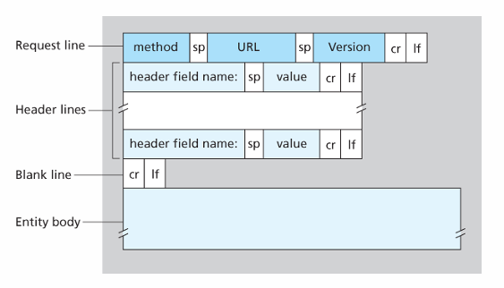

使用GET时实体行为空，POST会用到实体行，它常用于提交表单。用POST的时候也可以请求一个Web页面，但内容则依赖于用户提交的表单内容。也可以使用GET提交表单，把它以参数的方式放在URL后面。

HEAD方法类似GET方法，但是服务器只发送HTTP报文进行相应，不返回请求对象，常用于调试跟踪。

PUT方法常与Web发行工具联合使用，允许用户上传对象到指定的Web服务器上指定的路径。也被需要向服务器发送数据的应用程序使用。DELETE方法允许用户删除Web服务器上的对象。

#### HTTP响应报文
如下：
```http
HTTP/1.1 200 OK
Connection: close
Date: Tue, 18 Feb 2014 15:58:00 GMT
Server: Apache/2.2.3 (CentOS)
Last-Modified: Tue, 18 Feb 2014 15:28:00 GMT
Content-Length: 6821
Content-Type: text/html

(data data data data data ...)
```
它有三个部分，一个初始**状态行**，六个**首部行**，一个**实体行**。状态行有三个字段：协议版本字段、状态码和相应状态信息。实体行包含了请求的对象。

Connection字段告诉客户端是否使用持续连接。Date字段告诉客户端报文生成的时间。Server字段告诉客户端服务器的类型。Last-Modified字段告诉客户端对象最后一次修改的时间。Content-Length字段告诉客户端对象的长度。Content-Type字段告诉客户端对象的类型。

常见的状态码有：
- 200 OK：请求成功，对象在实体体中
- 301 Moved Permanently：请求的对象已经被永久转移，新的URL在Location首部行返回
- 400 Bad Request：请求报文不能被服务器理解
- 404 Not Found：请求的对象在服务器上找不到
- 505 HTTP Version Not Supported：服务器不支持请求的HTTP版本

### 用户与服务器的交互：cookie
HTTP是一个无状态协议，但有时一个Web希望识别它的用户，可以使用cookie。

cookie有四个组件：
- 在HTTP相应报文中的一个cookie首部行
- 在HTTP请求报文中的一个cookie首部行
- 在用户主机中保留有一个cookie文件，由浏览器管理
- Web服务器的一个后端数据库

服务器在响应报文中给出Set-cookie首部行返回cookie，后续的用户请求报文中用Cookie首部行返回相同的cookie。

### Web缓存
**Web缓存器**也叫**代理服务器**，有自己的磁盘存储空间，保存了最近请求过的对象的副本。用户可以配置浏览器使得所有的HTTP请求首先指向Web浏览器。

当用户请求一个对象时，代理服务器先检查自己是否有这个对象，如果没有它就从Web服务器处获取该对象并存储在磁盘空间上，然后再把该对象传送给用户。

Web缓存器通常由ISP购买并安装。它可以减少客户请求的响应时间；如果把它放在机构网络内，还可以减少接入链路的负载。

**内容分发网络CDN**正是使用类似的技术来把大量的网络流量本地化。

### 条件GET方法
虽然可以缓存Web对象，但它可能会过期。需要使用HTTP的**条件GET**方法来检查对象是否是最新的：请求报文使用GET方法并且包含一个If-modified-since并提供一个时间。

服务器接受到请求报文后检查文件是否发生修改，如果有则正常发回对象；如果没有则返回一个空实体行的响应报文，状态码为304 Not Modified。

## 因特网中的电子邮件
电子邮件有三个主要组件：**用户代理**、**邮件服务器**和**简单邮件传输协议SMTP**。用户代理相当于电子邮件的客户端应用程序，用户写好邮件以后代理把它发送给邮件服务器，邮件进入邮件服务器的外出报文队列，对方的用户代理可以从队列中取出邮件。

邮件服务器是电子邮件体系结构的核心。每个接收方在某个邮件服务器上有一个**邮箱**，管理和维护着发送给自己的报文。一般来说，邮件由发送方的用户代理发出，传输到发送方的邮件服务器，然后传输到接收方的邮件服务器，进入接收方的邮箱。如果发送方的邮件服务器不能把邮件传送到接收方的邮件服务器，那么它会把邮件放在一个**报文队列**中，通常每30分钟重新发送一次，如果几天后仍未成功则服务器删除该报文并邮件通知发送方。

SMTP是邮件的主要应用层协议，它使用TCP，具有两个部分：在发送方邮件服务器的客户端和接收方邮件服务器的服务器端。

### SMTP
邮件报文体只能使用7比特的ASCII码，因此发送邮件之前需要把多媒体数据编码为ASCII码并在接到邮件以后解码。SMTP并不使用中间邮件服务器，邮件总是直接从发送方邮件服务器传送到接收方邮件服务器，而不在中间的某个服务器存留。

传送邮件时，SMTP在25号端口上建立一个到对方邮件服务器的TCP连接。连接建立以后会执行一些应用层的握手，这时客户指示发送方的邮件地址和接收方的邮件地址。握手完成后客户发送报文，由于SMTP使用的是持续连接，如果客户还有其他的报文要发送，它在当前的TCP连接上继续发送，否则它指示TCP关闭连接。

例如，以下S开头的是服务器发送的行，C开头的是客户端发送的行：
```
S: 220 hamburger.edu
C: HELO crepes.fr
S: 250 Hello crepes.fr, pleased to meet you
C: MAIL FROM: <alice@crepes.fr>
S: 250 alice@crepes.fr ... Sender ok
C: RCPT TO: <bob@hamburger.edu>
S: 250 bob@hamburger.edu ... Recipient ok
C: DATA
S: 354 Enter mail, end with "." on a line by itself
C: Do you like ketchup?
C: How about pickles?
C: .
S: 250 Message accepted for delivery
C: QUIT
S: 221 hamburger.edu closing connection
```
其中用户发送的单个句点的行，表示邮件结束。

### 与HTTP的对比
两个协议很像，但有一些重要的区别：
- HTTP是一个**拉协议**，连接是从希望接受文件的一方发起的；SMTP是一个**推协议**，连接是从发送方发起的。
- SMTP要求使用ASCII码，而HTTP可以发送二进制数据
- 如果文档既包含文本又包含图片，HTTP可以把每个对象分别发送，SMTP则把所有对象放在一个报文中

### 邮件报文格式
电子邮件格式分为首部行和报文体。其中首部行必须包含From和To两行，可选Subject和其他的首部行。在首部行以后跟一个空白行，然后就是ASCII格式的报文体。

### 邮件访问协议
早期，用户通过登录到服务器主机来访问自己的邮箱。现在，可以通过用户代理，以一种客户-服务器体系结构来访问邮箱。

接收方可以直接接受邮件而不使用收件服务器，问题在于接收方常常是个人电脑，无法持续在线。发送方也可以直接使用SMTP把邮件发送到接收方的邮件服务器，而不必先推送到自己的邮件服务器，但当接收方的邮件服务器不可用时，个人的电脑很难持续尝试发送邮件，所以交给邮件服务器来处理是更好的选择。

但这样的体系结构仍有一个问题，SMTP是一个推协议，当用户代理需要获取邮件时，它无法使用SMTP从邮件服务器得到该邮件。因此需要一个邮件访问协议，主流的有：**第三版的邮局协议POP3**和**因特网邮件访问协议IMAP**或直接使用HTTP。

#### POP3
一个极为简单的邮件访问协议，同时功能也相当有限。用户代理打开一个到邮件服务器110端口的TCP连接，然后经过三个阶段：
1. 特许：用户代理发送明文形式的用户名和口令，使用指令 `user <username>` 和 `pass <password>`
1. 事务处理：用户代理取回报文，同时用户代理还能对报文做删除标记、取消删除标记等操作，也可以获得报文的统计信息
1. 更新：客户发出quit指令表示结束POP3会话以后，服务器删除被标记为删除的报文

服务器会对用户代理发送的内容做出响应，+OK表示成功，可能还会跟上一些数据；-ERR表示前面的命令出现了某些错误。

用户代理可以配置为“下载并删除”或者“下载并保留”。使用下载并删除方式，用户代理发出list、retr和dele命令，这样的话用户没有办法在多个设备上查看邮件。

#### IMAP
如果用户希望在邮件服务器上形成一个邮件的层次文件夹，POP3并不能做到，因为它没有提供任何创建远程文件夹等的接口。为了解决这个问题和其他一些问题，IMAP出现了，它比POP3功能更强，但也复杂得多。

IMAP服务器把每个报文与一个文件夹联系起来。当报文第一次到达服务器时，它与收件人的INBOX关联起来，收件人可以把它移动到其他文件夹中。IMAP提供了创建文件夹和移动文件到其他文件夹的接口，还提供了在文件夹中查询邮件、使用特定条件匹配邮件的接口。与POP3不同，IMAP维护了会话的用户状态信息，如文件夹的名字以及哪些报文和哪些文件夹相关联。

IMAP还有一个重要特性，它允许用户代理获取报文某些部分，如可以只读取一个报文的首部，或是多部分MIME报文的一部分。如果带宽较低的时候，可以用这样的方式选择性地下载需要的报文。

### 基于Web的电子邮件
使用浏览器来访问邮件服务器，用户代理和邮件服务器就使用HTTP通信。不过，邮件服务器之间传送邮件仍然使用的是SMTP。

## DNS：因特网的目录服务
为了标识因特网上的主机，一种方式是使用**主机名**，然而它并不能提供主机的位置信息。因此实际上标识一个主机会用到**IP地址**。

### DNS提供的服务
**域名系统DNS**负责把主机名映射到IP地址。它是一个由分层的**DNS服务器**实现的分布式数据库，一个使得主机能够查询分布式数据库的应用层协议。DNS服务器通常是运行BIND软件的UNIX服务器。它使用UDP协议，端口号为53。

除了主机名到IP地址的转换，DNS还提供一些其他的服务：
- **主机别名**：如果一个主机有着复杂的主机名，它也可以有主机别名。复杂的那个主机名称为**规范主机名**，可以使用DNS通过主机别名查询到规范主机名和IP地址。
- **邮件服务器别名**：邮件服务器的主机名可能会很复杂，电子邮件应用程序可以调用DNS对提供的主机名别名进行解析。MX记录允许公司的邮件服务器和Web服务器使用相同的主机名。
- **负载分配**：一个规范主机名可以和多个IP地址相联系，DNS服务器可以轮流返回这些IP地址，使得负载在这些服务器之间均衡地分配。这同样也可以用于邮件服务器，相同的邮件服务器别名可以用于多个邮件服务器。

### DNS工作机理概述
用户主机上有DNS客户端，它接收到DNS查询请求后，通过端口53使用UDP协议向网络中发送一个DNS查询报文，经过若干毫秒到若干秒的时延以后，收到一个回答报文，然后它把结果传递给请求的程序。

最简单的DNS设计方式是在整个因特网上使用一个DNS服务器，但这样的设计有许多问题：
- **单点故障**：如果这个服务器出现故障，整个因特网都会瘫痪
- **通信容量**：它必须具有处理整个因特网的DNS查询的能力
- **远距离的集中式数据库**：如果只有单个服务器，那么距离远的地方的查询会有很大的时延
- **维护**：它需要一个非常庞大的数据库，还需要频繁地更新

#### 分布式、层次数据库
DNS是分层设计的，有三种类型的DNS服务器：
- **根服务器**：有400多个根服务器遍布全世界，它们由13个组织管理，提供TLD服务器的IP地址
- **顶级域TLD服务器**：对于每个顶级域都有TLD服务器，支持TLD的网络基础设施可能是庞大复杂的，TLD服务器提供了权威服务器的IP地址
- **权威服务器**：在因特网上具有公共可访问主机的每个组织机构必须提供公共可访问的DNS记录，这些记录把主机名映射到IP地址，权威DNS服务器保存这些记录。一个组织机构可以自己实现权威DNS服务器，也可以付费把DNS记录存储在某些服务提供商的服务器上。

还有**本地DNS服务器**，起着代理的作用，也缓存查询到的结果。每个ISP都有一台本地DNS服务器，与该ISP的网络相连的主机使用它们的本地DNS服务器，通常它邻近用户主机。

当本地DNS服务器缓存中不存在待查询的主机名时，它会代为查询这个主机名，过程中需要访问多级DNS服务器，此时有两种查询方式：**递归查询**和**迭代查询**。

递归查询中每个服务器只询问下一个服务器，并把后续的查询工作都委托给该服务器，它只等待该服务器返回需要的结果。

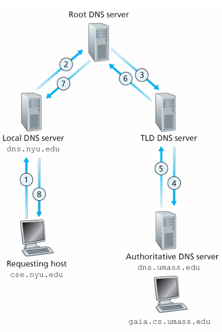

迭代查询中，本地DNS服务器依次从每级服务器得到下一级服务器的地址，然后继续询问下一级服务器，直到得到最终的结果。

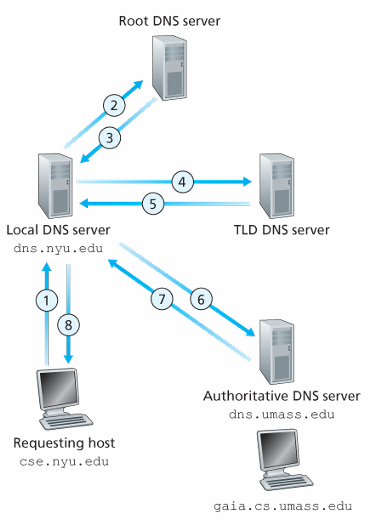

#### DNS缓存
当本地DNS服务器完成一次查询时，它会把结果保存一段时间才丢弃，这样下次遇到这样的查询请求就可以直接返回结果。本地DNS服务器常常缓存TLD服务器的IP地址，故大多数的查询请求实际上绕过了根服务器。

### DNS记录和报文
DNS服务器中存储了**资源记录**，提供了主机名到IP地址的映射，每个DNS回答报文包含了一条或多条资源记录。资源记录是一个四元组 `(Name, Value, Type, TTL)` 。TTL是记录的生存时间，当超过了生存时间，记录就被从缓存中删除。Name和Value则取决于Type的值，当Type等于：
- A：Name是主机名，Value是主机名对应的IP地址
- NS：Name是一个域，Value是知道如何获得域中权威DNS服务器的主机名
- CNAME：Value是别名为Name的主机的规范主机名
- MX：Value是别名为Name的主机的规范主机名。

例如查询主机名gaia.cs.umass.edu，对于edu的TLD服务器，包含一条记录指出应该去哪里寻找下级DNS：
```
(umass.edu, dns.umass.edu, NS)
```
同时还需要一条记录指出该主机的IP地址：
```
(dns.umass.edu, 128.119.40.111, A)
```

#### DNS报文
DNS报文有两种：查询报文和回答报文，它们具有相同的格式：

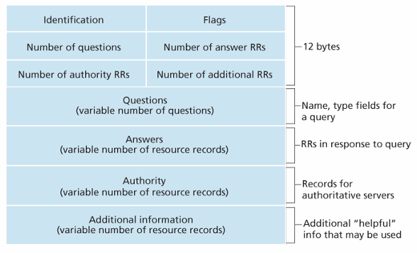

- 首部区域：占前12个字节
    - 标识符：一个16比特的数，它会被复制到回答报文中，便于用户匹配请求和回答
    - 标志：有多个标志位
        - 查询/回答：0是查询报文，1是回答报文
        - 权威的：1表示回答报文是来自对应的权威DNS服务器
        - 希望递归：1表示希望服务器执行递归查询
        - 递归可用：1表示服务器支持递归查询
    - 问题数、回答RR数、授权RR数、附加RR数：顾名思义
- 问题区域：包含正在进行的查询信息
    - 名字：查询的主机名
    - 类型：关于该主机名，正在查询的问题类型
- 回答区域：包含查询到的资源记录，一个报文可以包含多条资源记录，对应主机名的多个IP地址
- 权威区域：包含其他权威服务器的记录
- 附加区域：其他有帮助的记录，如查询邮件服务器时，回答区域包含MX记录给出了邮件服务器的规范主机名，附加区域包含一条A记录给出了邮件服务器的IP地址

通过**nslookup程序**可以很容易地发送一条DNS查询报文。

#### 在DNS数据库中插入记录
如果希望有自己的域名，需要借助**注册登记机构**的帮助，它验证该域名的唯一性，然后把该域名注入DNS数据库并收取少量费用。在这个过程中，需要提交自己的域名和IP地址。以往DNS服务器的更新都是静态配置的，后来DNS协议中添加了一个更新选项，可以通过DNS报文动态添加或删除记录。

## P2P文件分发
P2P不是客户-服务器体系结构，而是对等方之间直接通信。

### P2P体系结构的扩展性
**分发时间**是所有 $N$ 个对等方得到该文件的副本需要的时间，接下来分析两种体系结构的分发时间：

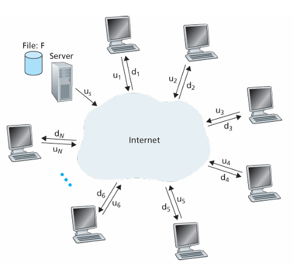

如图，假设 $u_s$ 表示服务器的上传速率，$u_i$ 表示第 $i$ 对等方接入链路的上传速率，$d_i$ 表示第 $i$ 对等方接入链路的下载速率，$F$ 表示文件的大小，$N$表示需要接收文件的对等方数量。假设互联网核心的带宽足够大，则瓶颈都在接入链路上。

先考虑客户-服务器体系结构，服务器必须单独地给每个对等方发送文件，它发送文件至少需要时间 $\frac{NF}{u_s}$ 。另外每个对等方都需要下载文件，令 $d_{min}$ 表示其中最小的下载速率，那么该对等方下载文件至少需要时间 $\frac{F}{d_{min}}$ 。因此分发时间至少为 $max(\frac{NF}{u_s}, \frac{F}{d_{min}})$ 。

再考虑P2P体系结构。在一开始只有服务器具有文件，它发送该文件至少需要时间 $\frac{F}{u_s}$ 。对等方下载的时间同上，为 $\frac{F}{d_{min}}$ 。最终系统的总上传能力是 $u_s + \sum_{i=1}^N u_i$ ，系统必须以不超过它的速率上传 $N$ 个文件副本，因此分发时间至少为 $\frac{NF}{u_s + \sum_{i=1}^N u_i}$ 。综上，P2P体系结构的分发时间至少为 $max(\frac{F}{u_s}, \frac{F}{d_{min}}, \frac{NF}{u_s + \sum_{i=1}^N u_i})$ 。

实际上两者的分发时间随着 $N$ 的增长趋势如图：

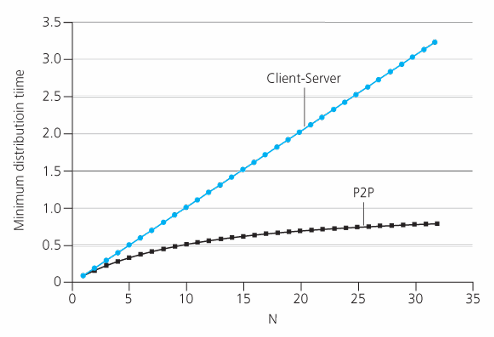

#### BitTorrent
一种用于文件分发的流行P2P协议，参加某个文件分发的所有对等方集合称为一个洪流，它们彼此下载等长度的文件块，典型长度为256KB。当一个对等方进入洪流时，它没有块，但它会逐步积累块，当它下载块的时候也为其他对等方上传块。直到它拥有了整个文件以后，它可以离开洪流，或者继续留在其中为其他对等方上传文件。对等方也可以在拥有了部分文件时离开洪流，后面再加入进来。

它是一个相当复杂的协议。每个洪流具有一个基础设施节点，称为追踪器，当对等方加入洪流时就向追踪器注册自己且周期性告知其自己仍在洪流中。这样子追踪器就能追踪对等方。

当新的对等方加入时，追踪器随机发送给它洪流的一个子集的IP地址，它尝试与这些对等方建立连接。一旦它和某个对等方建立连接，它们成为邻近对等方。它周期性地询问邻近对等方们拥有的块，然后它可以选择自己没有的块发出请求，它会使用**最稀缺优先**的策略，即选择其中副本最少的块。

它每过10秒就会测量它的邻居给它传送数据的速度，并确定4个最快的邻居（**疏通**）与它们对换数据。同时每过30秒它随机选择一个邻居向其发送块，如果它发送得足够快，它就会称为对方的疏通。则对方也会向它发送块，如果对方的速度也足够快，那么就可以成为它新的疏通。这样的机制使得对等方不断寻找新的交换伴侣，逐渐找到最好的交换伴侣。

还有一种P2P应用，分布式散列表DHT。它是一种简单的数据库，分布在一个P2P系统的多个对等方上。

## 视频流和内容分发网

### 因特网视频
视频最突出的特征是它的高比特率，因此它的最大要求是平均端到端吞吐量，它至少需要与视频的比特率一样大。

### HTTP流和DASH
在HTTP流中，视频作为服务器中的一个普通的文件，具有一个特定的URL，用户通过HTTP GET请求这个视频。在客户端，获得的字节被储存在客户应用缓存中，当字节数量超过了预先设定的门槛，客户应用就会开始播放视频。视频应用周期性地从缓存中抓取帧，解压缩并在屏幕上显现。然而传统的HTTP流有严重的缺陷：所有客户接收到相同编码的视频，但客户的带宽大小不同。因此，**经HTTP的动态适应性流DASH**出现了。

在DASH中，视频被编码成几个不同的版本，分别具有不同的比特率，客户可以动态地请求来自不同版本且长度为几秒的视频段数据块。带宽高时选择高比特率的块，带宽低时选择低比特率的块。

使用DASH以后，每个视频版本具有一个单独的URL，并且服务器端有一个**告示文件**，为每个版本提供了URL及其比特率。客户首先请求告示文件来查看各版本，然而使用HTTP GET，指定一个URL和字节范围，一次选择一块。在下载块的同时，客户也运行一个速率测量算法来决定下次请求的版本。

### 内容分发网
对于因特网视频公司，建立单一的大规模数据中心，令其存储所有的视频并直接向全世界的用户传输流失视频，是最简单的方案。然而这会有三个问题：
- 如果用户原理数据中心，服务器到客户的路径经过很长的链路，一旦其中一条链路带宽较低，就会限制整个端到端的吞吐量
- 流行的视频可能经相同的链路发送多次，浪费了网络带宽，因特网视频公司也需要缴纳更多的费用
- 单点故障

实际上几乎所有主要的视频流公司都使用**内容分发网CDN**，它管理分布在多个地理位置的服务器，在其中存储视频的副本，并把用户的请求定向到一个最适合的CDN位置。CDN可以是**专用CDN**，由内容提供商自己所有；也可以是**第三方CDN**，可以分发多个内容提供商的视频。

CDN通常采用两种不同的服务器安置原则：
- **深入**：通过在全球的接入ISP中部署服务器集群来深入接入网，通过靠近用户来减少用户到CDN之间的链路和路由器数量，从而减少时延并增加吞吐量。由于它的高度分布式设计，维护和管理集群是一种挑战。
- **邀请做客**：在少量的关键位置建造大集群来邀请ISP做客。通常它们被放在IXP。这个方案有着较低的维护和管理开销，但时延相对高并且吞吐量相对低。

CDN并不包含所有的视频副本，而是使用一种拉策略。当用户需要一个CDN没有的视频时，CDN从某种中心仓库或另一个集群检索这个视频，然后保存到本地并发送给用户。当存储器要满的时候，它删除一些不常用的视频。

#### CDN操作
当用户通过浏览器请求一个特定的视频时，CDN必须能够截获这个请求，从而确定此时最适合的CDN集群并把请求重定向到该集群的某台服务器。一般CDN利用DNS来截获和重定向请求，在访问到权威服务器时，它不返回一个IP地址，而是返回一个CDN域的主机名，此时DNS请求进入了专用DNS的基础设施。此后本地DNS服务器发出第二个DNS请求，专用DNS选择一个CDN集群返回，最终它被转发回用户主机。用户可以建立TCP连接，如果使用了DASH，服务器会先发送告示文件，然后用户使用HTTP GET请求视频内容。

#### 集群选择策略
部署CDN的核心是**集群选择策略**，它动态地把客户重定向到CDN中的某个服务器集群或数据中心。CDN一般采用专用的集群选择策略，但也有一些简单的策略。

比如**地理上最为邻近**策略，通过商用地理位置数据库，把本地DNS服务器的IP地址映射到地理位置，然后CDN选择最近的集群。大多数情况下它工作得很好，不过对于某些用户来说地理位置最近不意味着网络路径最短。另外，有些用户可能使用距离遥远的LDNS，则选择的集群是远离用户的。

这样的策略简单地忽略网络流量等因素，总是为用户选择相同的集群。为了考虑当前流量条件，CDN可以对集群和用户之间的时延和丢包性能做周期性的**实时测量**，如CDN可以周期性地对全世界LDNS发送探测分组，但很多LDNS不响应这样的探测。

### 学习案例：Netflix、YouTube和“看看”

#### Netflix
Netflix是一个在线电影和TV节目的服务提供商，它的视频分发有两个主要的组件：亚马逊云和自己专用的CDN基础设施。它的Web网站完全运行在亚马逊云上，除此之外亚马逊云提供如下关键功能：
- 内容摄取：Netflix从制片厂接受电影的母带，然后把它们上传到亚马逊云
- 内容处理：亚马逊云为每部电影生成许多不同格式和比特率的版本，适用于多种设备并允许使用DASH
- 向CDN上传版本：电影的所有版本生成完毕以后，亚马逊云向CDN上传这些版本

Netflix在IXP和许多ISP中安装了服务器机架，其中每台服务器具有几个10Gbps以太网端口和超过100TB的存储。IXP中安装有数十台服务器并包含整个Netflix流式视频库，本地IXp可能只有一台服务器并包含最流行的视频。Netflix不使用拉高速缓存的方式，而是在非高峰时段把视频推送给CDN服务器，对于容量不能保存整个库的位置则推送最流行的视频。

当用户选择一个电影播放时，亚马逊云中的Netflix软件首先确定拥有该电影的CDN服务器，然后它决定最好的服务器。如果用户正在使用一个有Netflix机架的ISP，并且其中有该电影的拷贝，那么通常这个机架中某台服务器会被选择。否则，选择邻近的IXP的一台服务器。然后它发送服务器的IP地址和资源配置文件，客户可以使用专用版本的DASH和CDN服务器交互。Netflix使用大约长4秒的块。

#### YouTube
YouTube使用谷歌的专用CDN来分发视频，在几百个不同的IXP和ISP位置安装了服务器集群。与Netflix不同，谷歌使用拉高速缓存和DNS重定向技术。大部分时间，谷歌的集群选择策略把客户定向到RTT最低的集群，但偶尔为了平衡负载也会把客户定向到更远的集群。

YouTube使用HTTP流，使少量的不同版本为一个视频可用，有不同的比特率和质量等级。它不使用DASH，要求用户自行选择视频版本。当用户提前结束视频时，如果整个视频已经被下载，会有带宽的浪费，故YouTube使用HTTP字节范围来限制传输的数据流。

当视频通过HTTP上传到YouTube以后，谷歌数据中心会把它转换成多个版本。

#### 看看
迅雷的看看通过P2P交付视频。类似于BitTorrent，对等方加入的时候也联系追踪器来了解其他的对等方。然而不同的是，它选择即将播放的块来保证连续播放。

看看后期向CDN-P2P混合体系转变，CDN被用于视频播放的启动阶段，它们发送视频的开头部分。然后用户等待对等方传输，如果P2P流量充分，用户将不再使用CDN传输；否则，用户会重新启动CDN连接并回到混合模式。这样可以保证短启动时延并充分节约CDN成本。

<br><br>

# 运输层

## 概述和运输层服务
运输层协议为运行在不同主机上的应用进程之间提供了**逻辑通信**功能，使得在应用程序看来两个主机好像直接相连一样。在发送端，运输层把应用层报文转换成运输层分组，称为运输层**报文段**，它可能会把应用层报文划分为较小的块并每块附加运输层首部。最后报文段被传递给网络层，然后网络层封装它为网络层分组并向下发送。在接收端则是相反的过程。

### 运输层和网络层的关系
网络层负责信息的传输工作，而运输层负责整理来自应用层的数据并转发给网络层，或是把从网络层接收到的数据分发给适当的应用层进程。可以把运输层看做家庭的管家，负责收集家庭成员的信件并投递给邮局或把邮箱中取出的信件分发给家庭成员；网络层则是邮局，负责把信件送到指定的地址。

运输层能提供的服务是受制于网络层的。如果网络层不提供时延或带宽保证，那么运输层也不能做到。不过，有些服务即使底层协议不能提供，运输层也可以提供，如可靠数据传输等。

### 因特网运输层概述
有两种截然不同的运输层协议：
- **用户数据包协议UDP**：提供一种不可靠、无连接的服务
- **传输控制协议TCP**：提供一种可靠的、面向连接的服务

运输层分组称为报文段（因特网文献把TCP分组称为报文段，而把UDP分组称为数据报，同时它们也把网络层分组称为数据报）。

网络层有网际协议IP，它的服务模型是**尽力而为交付服务**，它不保证交付、按序交付、数据的完整性。因此，IP被称为**不可靠服务**。每台主机至少有一个IP地址。

IP负责两个端系统之间的数据报交互，而运输层协议则负责把端系统之间的交互扩展到进程之间的交付，这被称为**运输层的多路复用**与**多路分解**。运输层协议还可以提供差错检查，这是最基础的两种运输层服务，也是UDP唯二提供的服务。

除此之外，TCP还提供了几种附加服务，如：
- **可靠数据传输**：通过使用流量控制、序号、确认和定时器，TCP确保正确地、按序地将数据从发送进程交付给接收进程。这使得IP提供的不可靠服务转换为可靠服务。
- **拥塞控制**：这是提供给整个因特网的服务，它防止任何一条TCP连接用过多流量来淹没两台主机间的链路和交换设备。它力求为每个通过一条拥塞网络链路的连接平等地共享网络链路带宽，这是通过调节发送端的发送速率来实现的。

## 多路复用与多路分解
一个进程有一个或多个**套接字**，它是进程和网络间交换数据的门户。运输层实际上没有直接把数据交付给套接字，而是交付给套接字，因为主机上可能有很多个套接字，所以套接字会有一个唯一标识符，它的格式取决于它是UDP套接字还是TCP套接字。

在接收端，为了让运输层能够将报文定向到正确的套接字，运输层报文段会有几个专门的字段，运输层检查这些字段来找到接受套接字然后交付数据，这个过程叫**多路分解**。

在发送端，运输层从不同套接字收集数据块并为它们附加首部信息然后传递给网络层，这个过程叫**多路复用**。

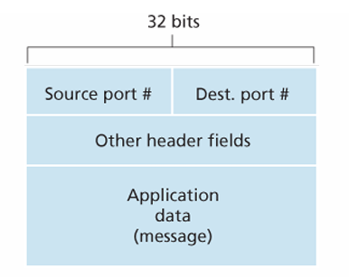

上图是UDP的报文段结构，其中有两个字段用来帮助多路复用和分解：**源端口号字段**和**目的端口号字段**。端口号是一个16比特的数，0~1023为**周知端口号**保留给周知的应用层协议使用。

#### 无连接的多路复用与多路分解
创建一个UDP套接字时，可以让运输层自动分配一个处于1024到65535的端口号，或者自行指定一个端口号进行绑定。

一个目的套接字是通过目的IP地址和目的端口号标识的。而源端口号和源IP地址则是当对方想要发送应答时提供给它所用。

#### 面向连接的多路复用和多路分解
TCP的一个套接字则是由（源IP地址，源端口号，目的IP地址，目的端口号）的四元组来标识的。如果两个到达的报文段拥有相同的目的IP地址、目的端口号，但是有不同的源IP地址、源端口号，它们将被定向到两个不同的套接字，除非TCP报文段携带了初始创建连接的请求。

#### Web服务器与TCP
服务器往往在一个周知端口上等待新连接，因此基本所有用户的目的IP地址和目的端口号都相同，无论是建立连接的报文段还是后续的HTTP报文段，此时服务器端则可以使用四元组来区分报文应该定向到哪个套接字。

## 无连接运输：UDP
使用UDP几乎相当于直接和IP打交道，因为它除了复用/分解以及少量的差错检测以外，几乎不做其他的工作。由于它发送数据前并不进行握手，所以被称为无连接的。

虽然UDP提供很简陋的服务，但它依然有很多时候比TCP更合适：
- 更细致地控制发送的数据以及发送时间：当把数据传递给UDP的时候，它就把它打包成UDP报文段并立即传递给网络层；而TCP由于拥塞控制机制，它可能限制数据的发送速率，并且当报文丢失时它会一直重传而不管什么时候对方会受到。某些应用对于交付时延有要求，则不适合使用TCP。
- 无需连接建立：对于像DNS这样的服务，TCP三次握手建立连接的时延是非常致命的。而HTTP使用TCP，因为网页不太容许差错的出现。然而Chrome浏览器中使用基于UDP的QUIC应用层协议来加强传输的可靠性。
- 无连接状态：TCP需要维护连接状态，包括发送、接受缓存，拥塞控制参数以及序号与确认号等。因此如果服务器基于UDP，往往能够支持更多的用户。
- 分组首部开销小：UDP的首部只有8字节，而TCP的首部有20字节，更加节约带宽。

### UDP报文段结构
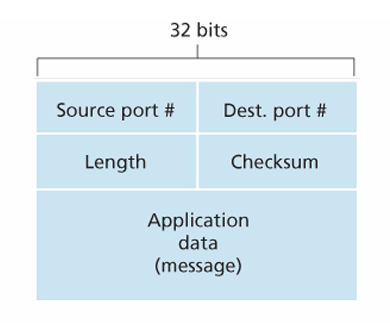

如图，UDP首部只有4个字段，每个字段2字节。源端口号和目的端口号如前所述，长度字段指出整个报文段的字节数，检验和字段用于检查整个UDP报文段是否出现了差错。

### UDP检验和
UDP的检验和对于整个UDP报文段进行16比特求和，然后把得到的结果取反码就算出了检验和（注意，如果最高位加和有进位，那么在结果的最低位再加1，称为回卷）

UDP之所以提供检验和，是因为即使许多链路层协议都提供了差错检验，也不能保证路径上所有链路都进行差错检验，如果其中某条链路出错，那么整个结果也会出现错误。另外，即使链路都没有问题，路由器的内存也可能出现比特翻转等问题。这是**端到端原则**的体现，表示某种功能必须基于端到端实现：“与在较高级别的功能的代价相比，在较低级别上设置的功能可能是冗余的或几乎没有价值的。

尽管UDP提供了校验和，但当真的出错时，它没有什么办法恢复错误。某些实现是简单地丢弃该报文段，某些实现则把它交给应用并给出警告。

## 可靠数据传输原理
可靠数据传输为上层实体提供的服务可以抽象为：数据通过一条可靠的信道进行传输，数据比特不会受到损坏或丢失，所有数据按发送顺序交付。这也正好是TCP的服务模型。

实现这样的服务模型需要的是**可靠数据传输协议**。

本节仅考虑**单向数据传输**的情况，可靠的**双向数据传输**理论上讲不会更加困难。

### 构造可靠数据传输协议
接下来逐步构建一个完美、可靠的数据传输协议。

#### 经完全可靠信道的可靠数据传输：rdt1.0
先考虑最简单的情况，即信道是完全可靠的。此时称协议是rdt1.0，它是比较简单的，发送方和接受方的**有限状态机**如下图（横线上方是引起状态转移的条件，横线下方是状态转移时采取的操作）：

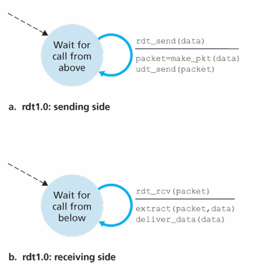

因为信道是可靠的，发送方发送完数据以后就不需要再过问任何事情，可以继续等待下一个数据，所以只需一个状态即可；接收方也不用担心数据是有错误的，所以接收完数据上传到上层以后就可以继续等待新的数据。（这里假定了接收方的接收速率足够大，它不需要请求发送方减速等）

#### 经具有比特差错信道的可靠数据传输：rdt2.0
实际上底层信道经常会发生比特差错，但我们仍假定信道是不丢失分组的。在生活中，如果清晰的接受并理解了对方的话，可以口头表示自己已经接受，这相当于是**肯定确认**；反之，可以请求对方重复一遍，这相当于**否定确认**。

通过这样的方式，发送方就可以知道哪些数据被正确接受，哪些需要进行重传。基于这样的重传机制的可靠数据传输协议称为**自动重传请求ARQ协议**。

ARQ还需要另外三种协议功能来处理存在比特差错的情况：
- 差错检测：为了知道是否数据有问题，需要附带一些额外的比特来帮助判断
- 接收方反馈：为了让发送方知道数据是否被正确接受，只能通过接收方发送反馈信息给发送方
- 重传：当接收方收到了错误的分组时，发送方重传分组

这个协议称为rdt2.0，它的有限状态机如下图：

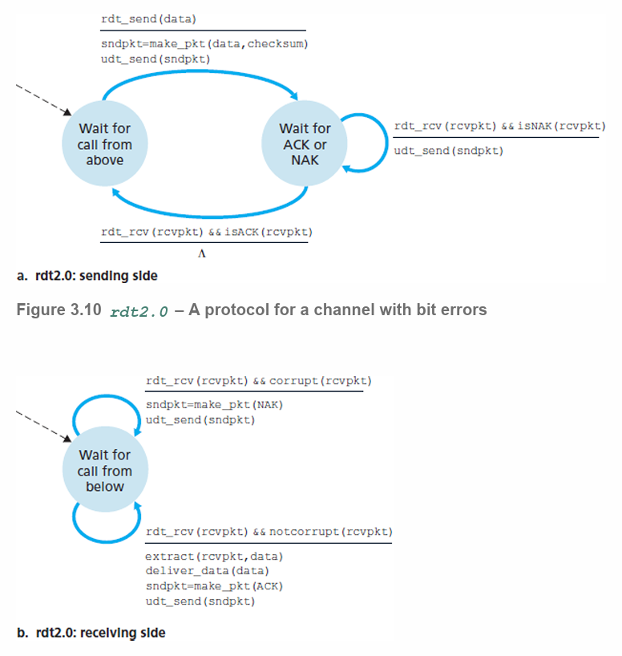

发送方得到数据以后发送它，然后等待接收方的肯定确认或否定确认，如果收到了否定确认则重传数据并再次等待确认，直到收到肯定确认为止。然后它继续等待下一个数据。

接收方从下层接收到数据以后，检查数据是否损坏，如果损坏就发送否定确认；如果没有损坏，则发送肯定确认，并且提取出数据交付给上层。完成以后，它继续等下下层传递数据给它。

这个协议中，发送方发送数据以后就只能停下来等待确认，期间不能发送新的数据，这被称为**停等**协议。这会影响数据传输的效率。

除此之外，它实际上是一个错误的协议，因为确认分组也是可能出错的。如何检测和恢复确认分组的错误呢？考虑处理确认分组受损的三种方法：
- 如果接收方发出了确认，但是发送方没能正确接受该分组，可以引入一种新的分组令发送方可以询问接收方刚刚发送了什么，从而让发送方重传接受分组。然而如果这个询问分组也损坏了，那么接收方则无法知道该分组是新发送的数据，还是发送方没有理解刚才的分组。
- 增加足够的检验和比特，是发送方不仅可以检测差错还可以回复差错，这可以直接解决问题。
- 当发送方收到损坏的确认分组时，它就重传数据，然而这样会向信道引入**冗余分组**，导致无法知道收到的分组是新的还是重传的。

解决这个问题的一个简单方法是在数据分组中添加一个新字段，让发送方对数据分组编号，将数据分组的**序号**放在该字段中。接收方检查序号就知道是否是新的数据。对于rdt2.0这样的停等协议，只需要一个比特来区分是否是重传即可，每次传输新的数据把该位取反。这样的协议称为rdt2.1，当接收方收到损坏的分组它就发送否定确认，否则它就发送肯定确认，有限状态机图如下：

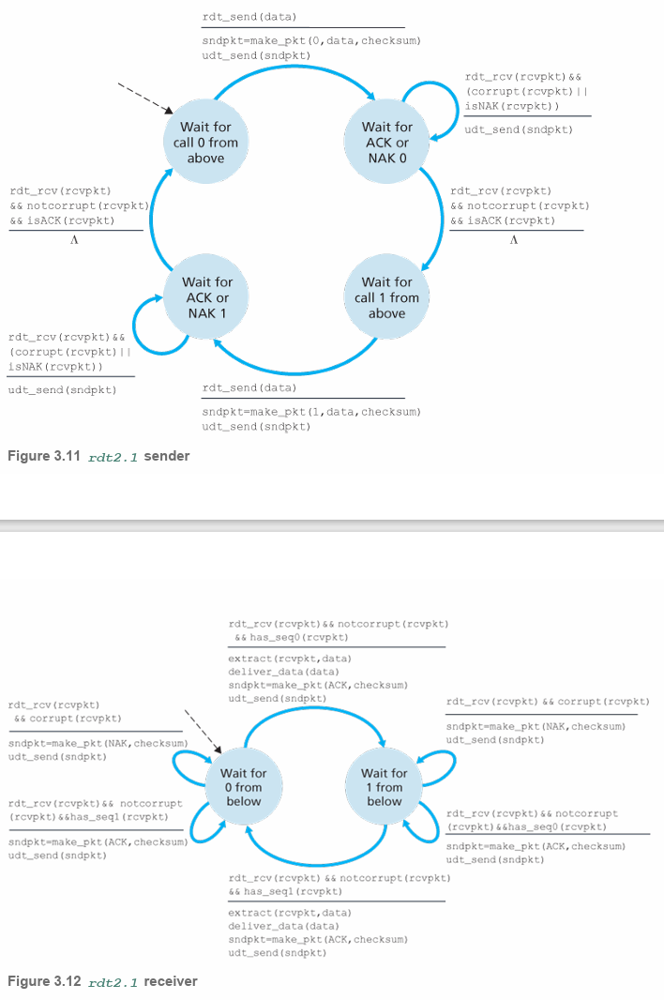

rdt2.1使用否定确认NAK的方式来通知发送方分组损坏。当肯定确认ACK附带需要确认的分组的序号时，发送对前一个分组的肯定确认也能实现相同的含义，因此只使用ACK进行确认。这样得到了rdt2.2，它的有限状态机如下：

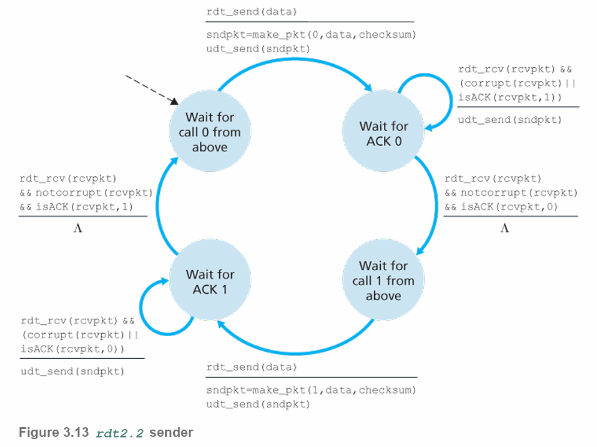
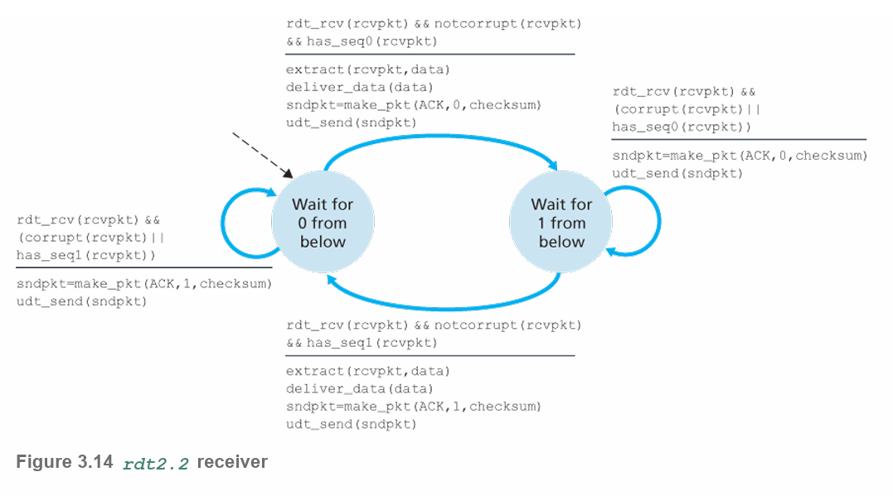

#### 经具有比特差错的丢包信道的可靠数据传输：rdt3.0
底层信道除了发生比特差错以外，还有可能发生丢包。rdt2.2的机制已经可以对丢包进行处理，然而检测丢包还需要另外的机制。

可以让发送方来检测和处理丢包。它发送数据以后，等待一个足够长的时间，如果没有收到接收方的确认，它就认为分组已经丢失，然后重传分组。当然可能分组实际没有丢失，只是传输的时间太长，则这样的重传机制引入了**冗余数据分组**，不过在rdt2.2中的序号机制使得它不会带来错误。

为了实现基于时间的重传机制，需要一个**倒计数定时器**，经过一定的时间以后，可以中断发送方。为此，发送方需要做到：每次发送分组就启动一个定时器、响应定时器中断、终止定时器。这样的协议称为rdt3.0，发送方的有限状态机如下（接收方同rdt2.2）：

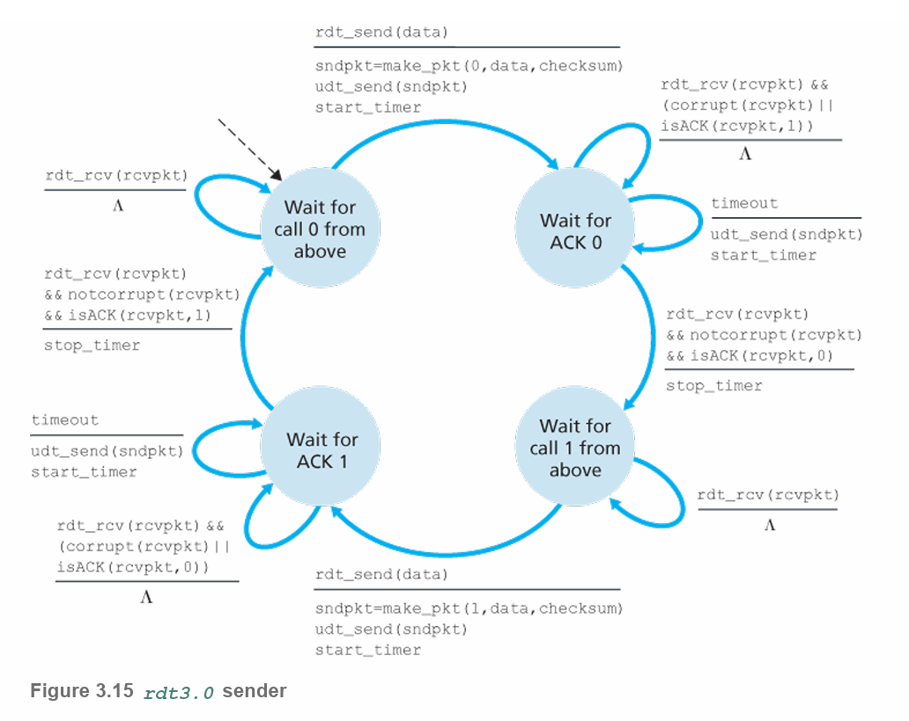

rdt30的方案可以有效处理分组丢失问题，下图中多种情况它都工作良好：

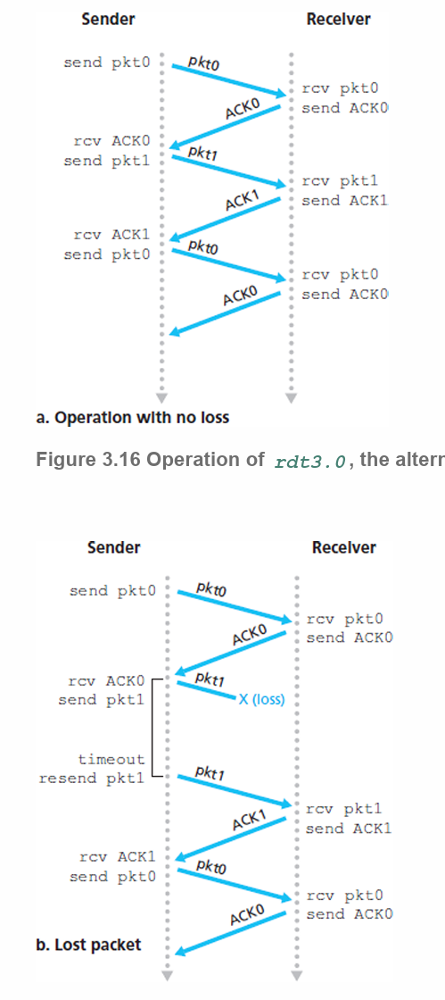
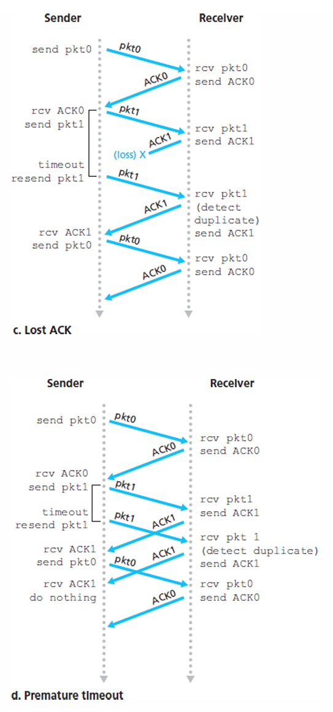

由于分组序号在0和1之间交替，它被称为**比特交替协议**。

### 流水线可靠数据传输协议
rdt3.0的性能并不让人满意，因为它是个停等协议。尤其是远距离传输分组的时候，用于等待的时间变得尤其长。

如果不以停等方式运行，而是允许发送多个分组不等待确认，那么分组就好像被填充到一条流水线中，这种技术被称为**流水线**。引入流水线技术会对可靠数据传输协议带来如下影响：
- 必须增加序号范围来保证每个分组有一个唯一的序号
- 发送方和接收方需要缓存多个分组
- 序号范围和缓冲要求取决于协议如何处理丢失、损坏和时延过大的分组，有两种基本方法：**回退N步GBN**和**选择重传SR**

### 回退N步
在**回退N步协议**中，发送方最多可以有N个未确认的分组。


参考上图。定义基序号base为最早的未确认分组的序号，下一个序号nextseqnum为最小的未使用序号，则所有的序号可以分为四类，在图中从左到右依次为：已发送并确认、已发送但未确认、未被使用、当前不可使用。其中不可使用的序号是因为受到了窗口长度的限制，只有base向前推进以后才进入窗口范围。

随着协议的运行，窗口会向前滑动，N常被称为**窗口长度**，GBN常被称为**滑动窗口协议**。

下图是仅使用ACK的GBN协议的有限状态机：

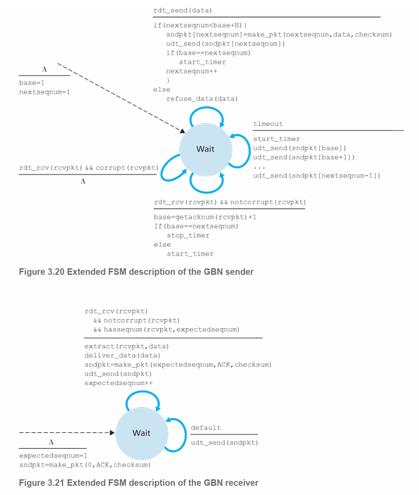

发送方需要处理三种事件：
- 上层调用：它需要检查发送窗口是否已满，如果没满则产生一个分组并发送；如果满了就把数据返回给上层，隐含地表示窗口已满。实际实现中，发送方可能在窗口满时缓存数据以后再发送，或者使用同步机制让上层等待到窗口有空间为止。
- 收到一个ACK：GBN使用**累计确认**的方式，接收到对序号n的确认就表示对方已经收到了n和n之前的所有分组。
- 超时事件：GBN也使用定时器超时机制，当定时器超时的时候，发送方重传所有未确认的分组；当收到一个ACK时，重启定时器；当所有分组都被确认时，关闭定时器。

接收方做的事情很简单，假设它已经接收了小于n的全部分组，此时等待的序号是n。如果它接收到的分组是n，那么它就把分组交付给上层并发送一个对n的ACK；如果接收到的分组不是n，那么它丢弃这个分组并发送一个对n-1的ACK。

丢弃所有失序分组是可行的，因为n丢失的情况下，接收方不确认n+1，则等到超时发送方会重传所有的分组，此时n和n+1都一并被重传。不过这样的话，如果后续n+1的重传出现了问题，那么还需要继续重传n+1，有些不合理。

流程示例如图：
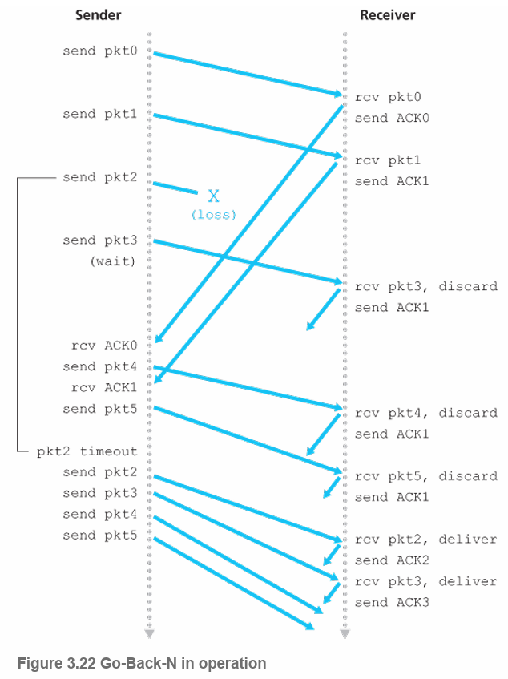

### 选择重传
GBN丢弃失序分组是有问题的，尤其当信道差错率大的时候，大量的分组被反复重传。**选择重传协议**则正是希望避免重传不必要的分组，这要求接收方逐个确认分组。

参考SR的序号范围图：

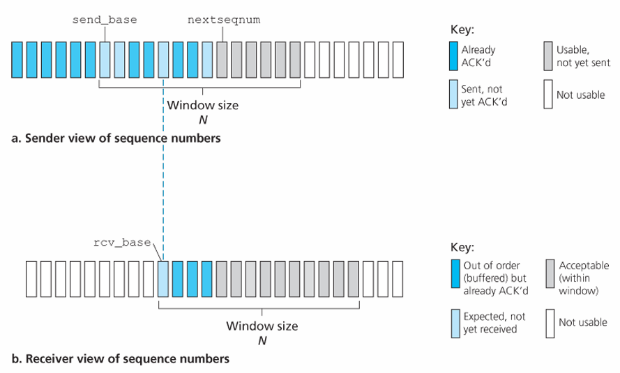

可以看到，当接收方接收到一个正确的分组时，它就确认这个分组而不在意其是否是按序的。失序分组会被缓存到所有应该在它之前的分组都被接受，然后批量把它和它之前的分组交付给上层。

具体来说，发送方需要处理三种事件：
- 从上层收到数据：和GBN相同，当窗口未满时它分送数据，否则它采取缓存等特别措施
- 超时：因为超时时只希望重传特定分组，所以每个分组都需要有自己的定时器
- 收到ACK：如果确认的分组在窗口内，则标记该分组为已接收；如果确认的是send_base，那么移动窗口起点至第一个未确认分组处

接收方需要处理三种事件：
- 接收窗口内分组：序号在窗口内的分组被正确接收，发送一个ACK回复。如果这个分组没接收过，那么缓存它。如果序号是rcv_base，那么把从它开始的所有连续分组交付给上层
- 接收窗口前一个窗口范围的分组：正确接收分组并发送ACK，即使以前已经确认过（考虑发送方窗口内的N个分组全被接收方接受了，但接收方发送的ACK都丢失，此时发送方重传的分组对于接收方来说满足这个范围，并且接收方收不到新的分组，无法再把窗口往前推动）
- 接收到其他分组：忽略（很可能是传输太久的旧分组）

窗口的长度不应该超过序号范围的一半，否则接收方无法分辨是新的分组还是重传的分组。（考虑序号范围3，窗口长度2，发送方发了1、2，接收方都接到了，此时接收方范围为3、1，当再接收到1时，它不知道发送方在重传还是发送新的分组）

## 面向连接的运输：TCP

### TCP连接
TCP被称为是**面向连接的**，这是因为在数据传输前两个进程必须握手（发送一些预备报文段）来建立确保数据传输的参数。

TCP提供**全双工服务**，这意味着两个进程可以同时发送和接收数据。TCP连接是**点对点**的，这意味着它只能连接两个进程，不能实现多播。

TCP连接的建立需要三个报文段来完成，因此被称为**三次握手**。

建立起TCP连接以后，进程就可以发送数据了。当数据交给套接字以后，它就由TCP进行控制了，TCP会把它引导到连接的**发送缓存**中，这是三次握手中设置的缓存之一。然后TCP会时不时从发送缓存里取出一块数据并传递到网络层。

TCP可以从缓存中取出并放入报文段中的数据数量受限于**最大报文段长度MSS**（虽然名字是这样，实际上指的是报文段中应用层报文的长度），通常根据本地主机能发送的最大链路层帧长度**最大传输单元MTU**来设置，需要保证应用层报文加上通常40字节的TCP/IP首部适合放入单个链路层帧中。以太网和PPP链路层协议都有1500字节的MTU，故MSS的典型值为1460字节。

TCP给每块数据配上一个TCP首部，形成**TCP报文段**，然后下传给网络层，网络层把它们封装在网络层IP数据报中，然后发往网络。

TCP接收到一个报文段时，放入TCP连接的**接收缓存**中，连接的两端各有自己的发送缓存和接收缓存。

综上，TCP的基本组成如下：
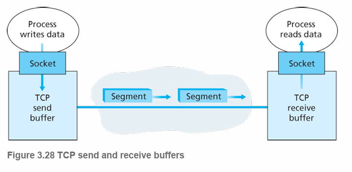

### TCP报文段结构
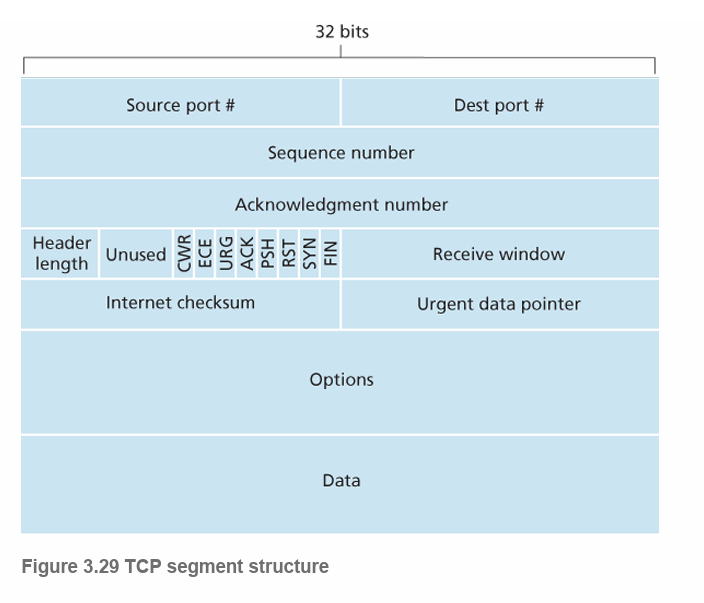

TCP的首部一般是20字节。首先是**源端口号**和**目的端口号**，用于多路分解/复用。另外，同UDP一样，TCP也包含**检验和字段**。除此之外，还有如下字段：
- **序号字段**和**确认号字段**：用于实现可靠数据传输
- **接收窗口字段**：用于流量控制，表示接收方愿意接收的字节数量
- **首部长度字段**：4比特。由于选项字段的存在，TCP首部的长度是可变的，这个字段指出首部的长度。如果不含选项字段，那么首部长度是20字节。
- **选项字段**： 用于通信双方协商MSS，或在高速网络环境下用作窗口调节因子，还有一个时间戳选项。
- **标志字段**：6比特。
    - **ACK**：确认
    - **RST**、**SYN**、**FIN**：用于连接的建立和拆除
    - **CWR**、**ECE**：明确拥塞通告中使用
    - **PSH**：接收方应立即将数据交付给上层
    - **URG**：报文段里存在紧急数据

#### 序号和确认号
TCP把数据视作无结构的、有序的字节流，序号是用来标识字节而不是报文段的，**一个报文段的序号**是数据首字节的序号。

每个发送的TCP报文段都会填充确认号，表示接收方期望接收的下一个字节的序号，TCP使用**累积确认**，当发送方填入确认号n的时候，表示序号小于n的字节它已经全部接收到。

这和之前的SR协议有所不同，在于对失序分组的处理。然而TCP RFC并没有做出任何规则，而是让实现TCP的编程人员去处理。有两种基本的选择：立即丢弃失序报文段；接收方保留失序的字节，等待失序的字节来填充该间隔。显然后一种比较节省网络资源，是实践中采用的方法。

TCP连接时，双方可以随意选择自己的初始序号，如果新连接恰好使用了某个刚断开旧连接的端口号，这有助于避免旧连接的报文段在新连接建立后到达而被误认为是新连接的报文段。

#### Telnet：序列号和确认号的一个学习案例
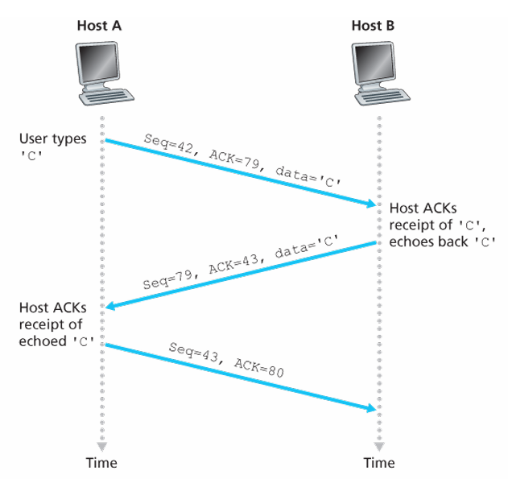

注意，最后一个报文段只是为了向B确认自己已经收到数据，故数据字段为空，并且ACK 80。虽然没有数据，但还是带上了序号，因为序号字段是TCP协议的要求。

### 往返时间的估计与超时
TCP也使用超时/重传机制来处理丢包。然而不同于前面的理想协议，TCP必须考虑超时实际设置成多久。

#### 估计往返时间
显然超时时间应该关乎往返时间RTT。大多数TCP实现不会为所有发送的分组都测量样本RTT，在某一时刻，它只会测量一个已经发送但仍未确认的分组的RTT，当收到对他的确认时，就得到一个新的样本RTT。然后，它可以再去测量下一个发出的分组的RTT。

随着网络环境的变化，SampleRTT的值会发生改变，TCP使用一个均值来估计典型的RTT：
$$
EstimatedRTT = (1 - \alpha) \cdot EstimatedRTT + \alpha \cdot SampleRTT
$$
其中RFC给出的推荐是 $\alpha = 0.125$ 。

随着新样本RTT的加入，前面的样本的权重就会下降，这使得它可以更好反映网络的当前情况。统计学上这被称为**指数加权移动平均EWMA**。

除了用于估算RTT，样本RTT的变化也有一定的价值，如RFC定义了RTT偏差，用于估算样本RTT偏离估计RTT的程度：
$$
DevRTT = (1 - \beta) \cdot DevRTT + \beta \cdot |SampleRTT - EstimatedRTT|
$$
如果偏离程度很大，那么DevRTT就会很大。推荐 $\beta = 0.25$ 。

#### 设置和管理重传超时间隔
超时间隔应该大于EstimatedRTT，但也不能大太多。并且网络波动大时，超过EstimatedRTT的幅度也应该大一些，从而提供更高的容错性。实际上TCP使用的公式是：
$$
TimeoutInterval = EstimatedRTT + 4 \cdot DevRTT
$$
推荐的初始TimeoutInterval是1s。出现超时的时候，TimeoutInterval会加倍来避免过早超时。然而只要更新了EstimatedRTT，就会用上述公式重新计算TimeoutInterval。

### 可靠数据传输
TCP在IP不可靠的尽力而为服务上提供了**可靠数据传输服务**，确保进程从接收缓存中读出的数据是无损坏、无间隙、非冗余和按序的数据流。

之前的协议中，把每个报文段和一个定时器相关联，这在概念上是最简单的，然而实际实现上需要为定时器管理付出很大的开销。因此RFC推荐只使用单一的重传计时器，即使发送了多个报文段。

概括地看，TCP的发送方做的事情如下：
```cpp
int NextSeqNum = InitialSeqNumber;
int SendBase = InitialSeqNumber;

while (true) {
    switch (event) {
        case GET_DATA_FROM_APP:
            make_pkt(data, NextSeqNum);
            if (!timer.running()) {
                timer.start();
            }
            NextSeqNum = NextSeqNum + data.length;
            break;
        case TIMER_TIMEOUT:
            retransmit(min_seq_segment());
            timer.start();
            break;
        case ACK_RECEIVED:
            if (ack_num > SendBase) {
                Sendbase = ack_num;
                if (SendBase == NextSeqNum) {
                    timer.stop();
                } else {
                    timer.start();
                }
            }
            break;
    }
}
```

#### 一些有趣的情况
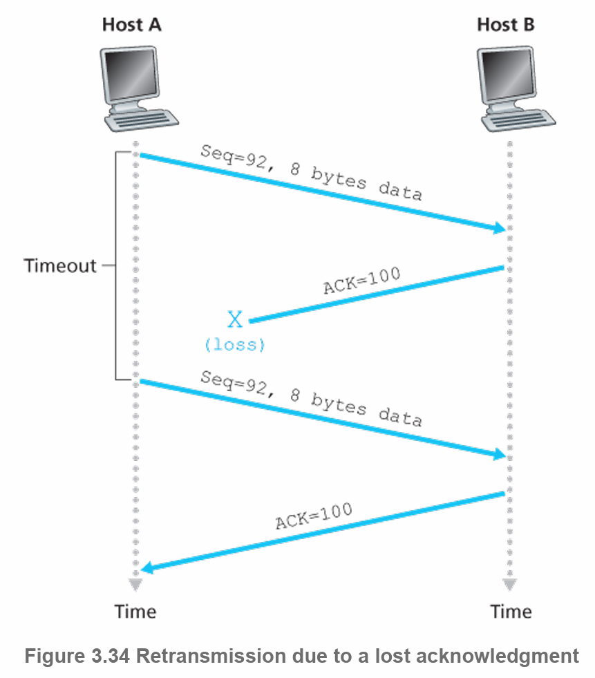

A给B发送了分组，B收到了并发送ACK，但是ACK丢失。超时以后A进行重传，B再次收到该分组，但B查看序号发现是之间已经接收的分组，因此它发送ACK并丢弃这个分组。


A在短时间内先后发送了2个报文段，它们按需到达了B，B接收它们并都发送了ACK。然而两个ACK的传输比较慢，因此A的计时器在ACK到达前就已经超时，A重传先发出的那个分组，并重启了计时器。然后两个ACK到达，A收到并停止计时。B收到重传的分组，发送ACK并丢弃报文段，A收到ACK。有趣的是，A只重传了第一个分组而没有重传第二个分组。

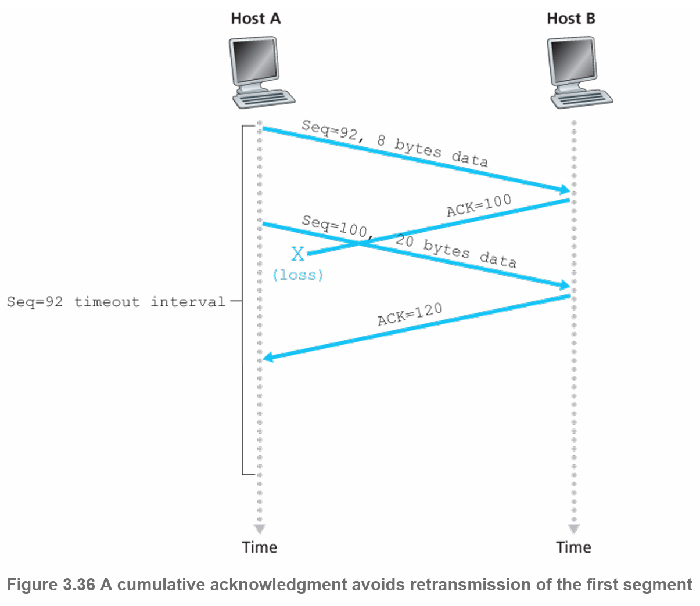

A先后发送了两个分组，B先后收到它们，并分别发送了ACK。然而第一个ACK丢失，但是在超时前第二个ACK到达，A收到了ACK后由于累计确认，不再需要等待第一个分组的确认，因此不会重传第一个分组。

#### 超时间隔加倍
以下是大多数TCP实现中所做的修改。

每次TCP重传时会把超级间隔翻倍，而不是固定地使用EstimatedRTT。因此，频繁超时时，超时间隔成指数型增长。然而只要上层传递了新的数据或者收到了一个ACK，超时间隔就重置为EstimatedRTT。

这相当于是提供了一个有限的拥塞控制，避免网络拥塞时反复重传分组加剧拥塞情况。

#### 快速重传
如果仅有超时重传，往往需要很长的时间才重传报文段，增加了端到端时延。其实发送方可以根据**冗余ACK**来在某些情况下提前猜测是否发生了丢包。所谓冗余ACK是指发送方收到的对某个报文段的非第一次的ACK。

当发送方接收到冗余ACK的时候，可能是由于后面的一个报文段丢失了，也可能是报文段失序到达。如果它对一个报文段接收到3个冗余ACK，则TCP认为后面那个报文段很可能已经丢失，它对这个报文段进行**快速重传**。

加入快速重传以后，前面伪代码中接收ACK的部分需要修改如下：
```cpp
case ACK_RECEIVED:
    if (ack_num > SendBase) {
        Sendbase = ack_num;
        if (SendBase == NextSeqNum) {
            timer.stop();
        } else {
            timer.start();
        }
    } else if (ack_num == SendBase) {
        dupACKcount++;
        if (dupACKcount == 3) {
            retransmit(SendBase);
            dupACKcount = 0;
        }
    }
    break;
```

#### 是回退N步还是选择重传
TCP确认是累积式的，这很像GBN协议。但与之不同的是，许多TCP接收方会缓存失序分组，并且TCP只会在超时时重传序号最小的一个分组。

对TCP的一种修改意见是**选择确认**，允许TCP接收方有选择地确认失序报文段，而不是累积确认。当把这样的机制与选择重传结合，TCP就很像SR协议。

### 流量控制
TCP连接的每一侧都有接收缓存，TCP把接收到的正确、按序的字节放入接收缓存。接收方的应用程序可以随时从其中读取，然而如果读取太慢，接收缓存会被填满，这就需要**流量控制服务**来防止。

流量控制是一个速度匹配服务，保证发送速率与接受速率匹配。遏制发送速率的还有**拥塞控制**，两者的行为很像，但出于不同的目的。为了简化说明，假设TCP直接丢弃失序报文段。

TCP让发送方维护一个**接收窗口**，它指明接收方还有多少缓存空间可用。因为TCP是全双工的，两侧都会有一个接收窗口。

考虑A向B发送一个大文件，B为连接分配了一个接收缓存，B上的进程时不时从其中读取数据，定义如下变量：
- $RcvBuffer$ ：接收缓存的大小
- $LastByteRead$ ：从缓存读出的最后一个字节的序号
- $LastByteRcvd$ ：缓存中最后一个字节的序号

由于TCP不允许缓存溢出，必须满足：
$$
LastByteRcvd - LastByteRead \leq RcvBuffer
$$
接收窗口用 $rwnd$ 表示，根据可用空间来设置：
$$
rwnd = RcvBuffer - (LastByteRcvd - LastByteRead)
$$

B会把 $rwnd$ 放进A的报文段接受窗口字段，通知A它的缓存还有多少空间。

A需要维护好两个变量， $LastByteSent$ 和 $LastByteAcked$ ，名字是自解释的。他们的差值就是A发送但未被确认的数据量，把这个值控制在 $rwnd$ 以内就可以了，即：
$$
LastByteSent - LastByteAcked \leq rwnd
$$

然而会有一个问题，如果B的接收缓存满了，则A无法再向它发送数据，同时它也无法知道B的接收缓存是否腾出了空间。为此，TCP规范要求，接收窗口为0时，A继续发送只有一个字节数据的报文段，B需要确认它们并附上自己的接收窗口，直到传回的接收窗口不为0时A就可以继续发送信息。

相比较之下，UDP并不提供流量控制。典型UDP实现会给套接字分配一个有限大小的缓存，然后把接收到的报文段放在缓存中，如果缓存空间不足了，到达的报文段会丢失。

### TCP连接管理
建立一个TCP连接需要三步：
1. 发起方首先向服务器发送一个特殊的报文段，不含应用层数据，但SYN标志位被置为1，并且附带自己选取的初始序号（通常随机选取）
1. 对方接收到以后为TCP分配缓存和变量，并向发起方返回一个允许连接的报文段，也不含应用层数据。它的SYN标志为被置为1，同时也附带自己选取的初始序号。它还会把发起方的初始序号加1作为确认号。它被称为**SYNACK报文段**。
1. 收到SYNACK以后发起方也分配缓存和变量，然后发送一个报文段对SYNACK进行确认，它的SYN标志为被置为0，它可以携带要传输的数据。

完成了以后就可以正常使用该TCP连接了，这被称为**3次握手**。

终止TCP连接需要四步：
1. 终止方发出一个特殊的TCP报文段，设置FIN标志位
1. 对方确认该报文段
1. 然后服务器发送自己终止报文段，设置FIN标志位
1. 终止方确认该报文段

此时，TCP的所有资源都被释放，连接已经终止，这被称为**4次挥手**。

在TCP连接的生命周期内，每台主机中的TCP协议在各种**TCP状态**之间变迁，客户端会经历的状态如图：

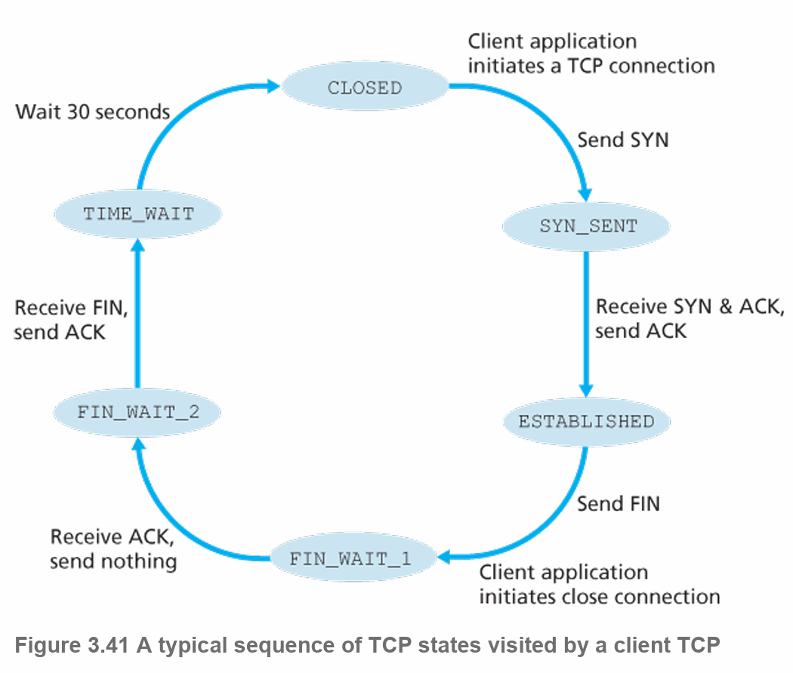

服务端会经历的状态如图：

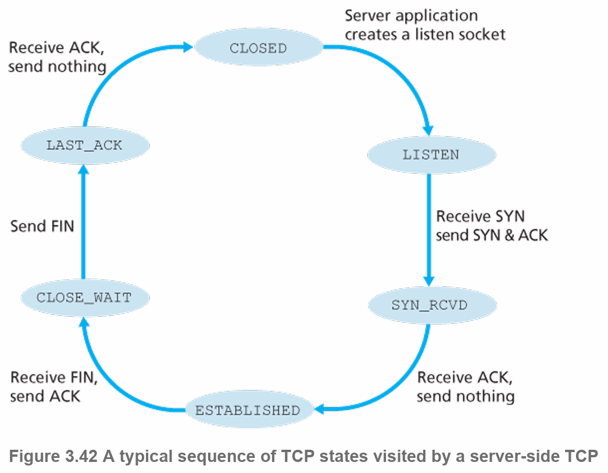

如果接受到一条SYN报文，但针对的端口当前不接受连接，则发送一个车特殊报文段，设置RST标志位。对于UDP来说，如果接收到一个分组和端口不匹配，则回送一个特殊的ICMP分组。

nmap是借助TCP连接机制进行端口扫描的，它对端口发送一个特殊的TCP SYN报文段，有三种可能：
- 接到SYNACK，表示端口开放
- 收到RST，表示端口关闭，但是能够访问到主机
- 没收到回应，可能被防火墙阻挡


#### SYN洪泛攻击
因为TCP连接建立时，服务器先分配资源以后发送SYNACK，如果客户恶意不回复ACK，则服务器在比较长的时间后才会回收资源。如果大量创建这样的连接，则服务器资源耗尽无法处理正常的请求。

针对这种攻击的防御方式为**SYN cookie**，已经部署在大多数主流操作系统中，它如下工作：
- 当服务器收到SYN时，它不生成一个半开连接，而是计算一个特殊的数字，它是通过一个复杂的散列函数使用双方的IP地址和端口号加上服务器的密钥生成的。这被称为cookie，服务器发送以cookie为初始序列号的SYNACK分组。**重要的是，服务器不会记忆cookie和其他信息。**
- 如果用户返回了ACK，它应该确认cookie+1，服务器按照相同的方式再次计算cookie，并与ACK中的确认号减一比较，如果相等则建立全开连接
- 如果用户不返回ACK，服务器就不会为它分配资源，则无法对其进行SYN洪泛攻击


## 拥塞控制原理

### 拥塞原因与代价

#### 情况1：两个发送方和一台具有无穷大缓存的路由器
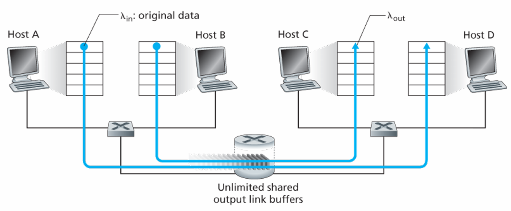

这种情况下路由器不丢包，两个连接的吞吐量随着A和B的发送速率增加而增加，但是到达链路带宽一半时，就不再增长。虽然似乎按照链路带宽的一半发送数据很好，但实际上报文传输时延激增，当发送速率刚好为链路带宽一半时，报文传输时延趋于无穷大。

#### 情况2：两个发送方和一台具有有限缓存的路由器
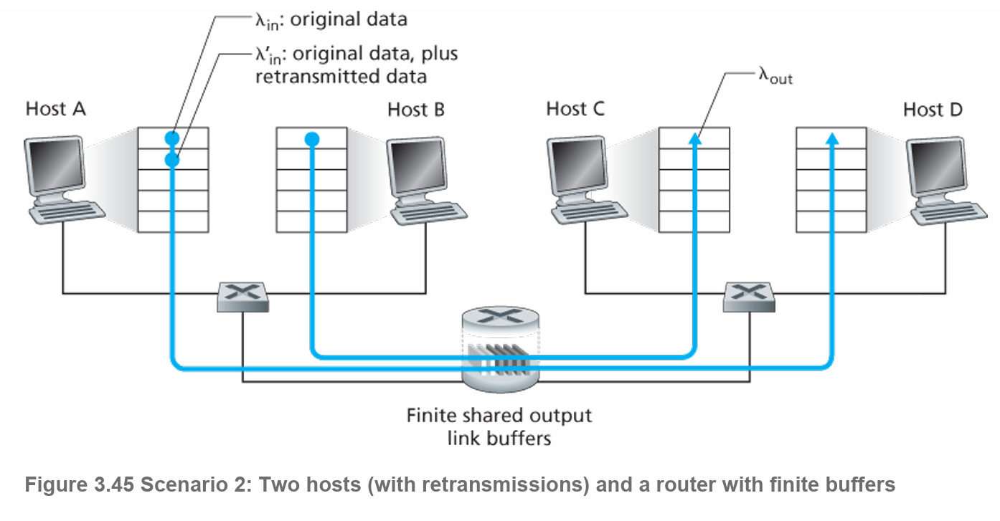

发送数据的速率为 $\lambda _{in}$ 。发送数据（包含重传）的速率为 $\lambda '_{out}$ ，称为**供给载荷**。

这种情况下性能强烈依赖于重传的方式。

如果A能知道路由器缓存是否空闲来发送分组，可以不发生丢包，则性能比较理想。然而这并不实际。


发送方可以仅在确定分组丢失时才重传，例如设置一个足够大的超时时长，如果发生了超时就认为分组丢失。这种情况下，实际的传输效率会因为网络拥塞导致丢包而下降。情况可能如下（不知道为什么是R/3）：

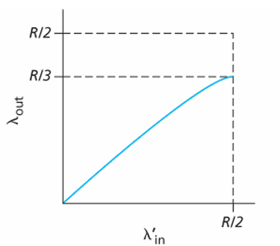

或者发送方也可以不用设置那么大的超时时长，而是在发生超时的时候就提前重传，这样虽然可以提高报文段的到达效率，但冗余分组却消耗了网络带宽。假定平均每个分组被重传两次时，情况如下：

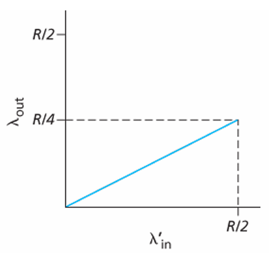

#### 情况3：4个发送方和具有有限缓存的多台路由器及多跳路径
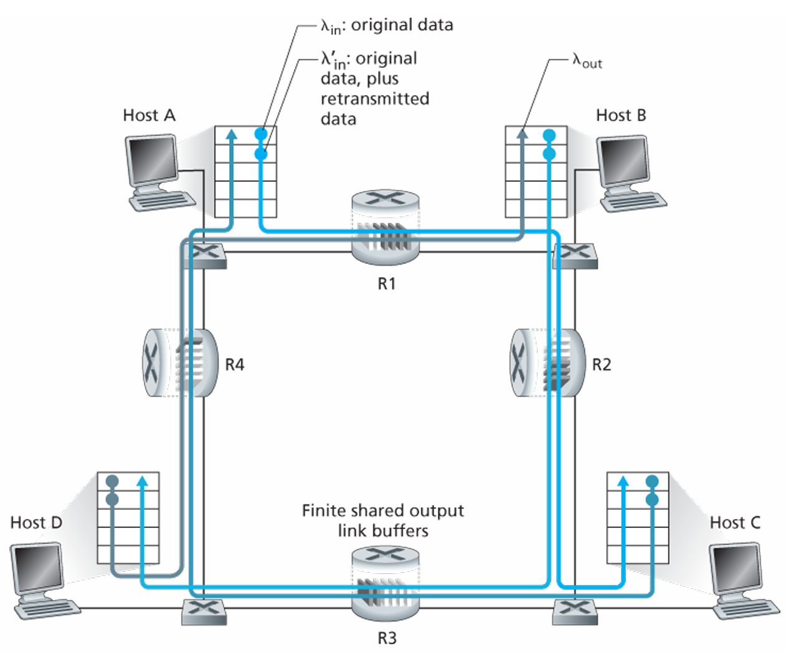

如图，每个连接都经过两跳路径，都使用超时/重传机制。每个主机都具有相同的 $\lambda _{in}$ ，每个路由器的转发速率都为 $R$ 。

A-C连接和D-B连接共享路由器R1，并与B-D连接共享路由器R2。如果 $\lambda _{in}$ 足够小，一般不容易发生溢出，吞吐量接近供给载荷。此时如果提高 $\lambda _{in}$ ，吞吐量也跟着提高。

如果 $\lambda _{in}$ 很大，考虑路由器R2。到达R2的A-C流量由于R1的限制最多是 $R$ ，而B-D则没有这个限制，那么A-C在竞争R2流量中就会非常弱势。这样R1为了转发A-C的分组做的努力就毫无意义。

如果路径很长的话，当某个路由器拥塞时，许多前面的路由器的转发都被浪费掉了。

性能走向如图：

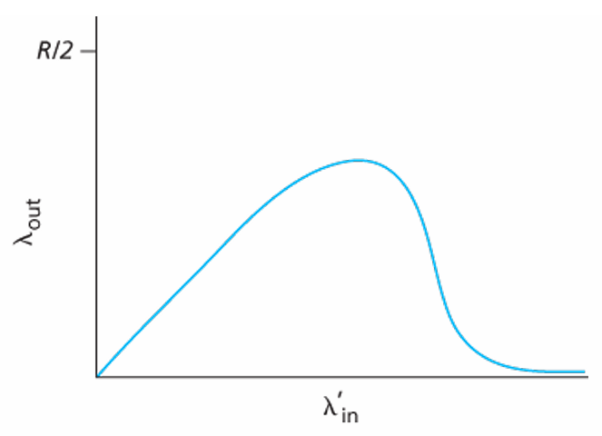

### 拥塞控制方法
实践中主要有两种拥塞控制方法，可以根据网络层是否为运输层拥塞控制提供了显式帮助来区分：
- 端到端拥塞控制：网络层不提供显式的帮助，端系统只能通过对网络行为（如分组丢失与时延）来推断网络的拥塞状态。这正是TCP的情况，它通过分组的丢失来推断网络发生拥塞，此时它减小发送窗口。
- 网络辅助的拥塞控制：路由器可以向发送方提供网络拥塞状态的显式反馈信息，要么简单地用一个比特来指示链路中的拥塞情况，要么提供更复杂的反馈，如ATM**可用比特率**拥塞控制中路由器发送输出链路上能支持的最大主机发送速率。

网络辅助控制中，路由器给主机发送反馈有两种方式，要么直接反馈信息，把**拥塞分组**发往发送方；要么路由器在分组中标记某个字段，后续由接收方反馈给发送方，这样的通知需要一个RTT。

## TCP拥塞控制
TCP发送方在感知到网络拥塞的时候，就限制自己的发送速率。因此实现拥塞控制的关键是：发送方如何感知拥塞，发送方如何限制速率，发送方用什么样的算法来调整速率。

首先是限制速率，TCP维护了一个名为**拥塞窗口**的变量，用 $cwnd$ 表示。则对于前面接收窗口的限制公式，需要更新为：
$$
LastByteSent - LastByteAcked \leq \min(cwnd, rwnd)
$$
为了简化说明，假设接收缓存足够大，则发送速率只需要受到拥塞窗口的限制。

然后是感知拥塞。TCP在发生超时或者接受3个冗余ACK的时候认为发生了丢包，那么发送方认为出现了拥塞。而如果收到了正常的确认，TCP认为是网络没有发生拥塞的证明，它会增大拥塞窗口。正常确认到达的速率越快，拥塞窗口增长得越快。因为TCP使用确认来增大拥塞窗口，所以它被称为**自计时**的。

最后是调节发送速率的算法，TCP希望在没有拥塞的情况下尽可能快地发送数据。它使用如下的指导性原则：
- 丢包表示拥塞，应该减小发送速率
- 确认分组表示网络能正常交付分组，应该增加发送速率
- 带宽探测，TCP先增加速率直到拥塞，然后减小速率以后再缓慢增加速率，这样可以找到网络的带宽上限

接下来是完整的**TCP拥塞控制算法**，主要包含慢启动、拥塞避免和快速恢复三个部分，其中快速恢复是推荐实现的，但不是必须的。

#### 慢启动
当TCP连接开始时，把cwnd置为一个MSS，则初始发送速率只有 MSS/RTT ，这是一个很小的速率。TCP希望能尽快加大速率，因此在**慢启动**状态下，每个报文段首次被确认就把cwnd加上一个MSS。发送方发出一个报文段并被确认后增长到2个MSS，然后发出2个报文段并被确认后增长到4个MSS，可见发送速率成指数形式增长。

这样的增长不会一直持续下去：
- 发生超时时，发送方把“慢启动阈值”ssthresh设置为当前cwnd的一半，并将cwnd置为1后重新开始慢启动过程。
- 当cwnd等于ssthresh时，发送方结束慢启动并进入拥塞避免模式。
- 接收到3个冗余ACK时，TCP执行快速重传后，设置ssthresh为cwnd的一般并设置cwnd为ssthresh加上3个MSS（来自冗余ACK）进入快速恢复模式。

#### 拥塞避免
cwnd的值大约是上次遇到拥塞时值的一半，很可能离拥塞并不遥远，故TCP选择把cwnd按更加保守的方案增加。

每个RTT都把cwnd增加一个MSS。这有几种方式来完成，一种通用的方法是每接收到一个确认，就把cwnd增加MSS/cwnd个MSS。

这种线性增长也不会一直进行下去：
- 出现超时时，行为和慢启动一样
- 接收到3个冗余ACK时，行为和慢启动一样

由于发生3个冗余ACK时，实际丢包的可能性较小，故TCP的行为没有超时那么剧烈。

#### 快速恢复
对于因此快速恢复状态的缺失报文段，每收到一个冗余ACK，cwnd增加一个MSS。最后，当收到它的一个ACK时，TCP降低cwnd以后进入拥塞避免状态。如果出现超时，快速恢复也执行相同的动作，然后进入慢启动状态。

早期的TCP Tahoe没有快速恢复，总是直接进入慢启动状态。较新的TCP Reno则实现了快速恢复。

下图给出了TCP拥塞控制的状态转移图：
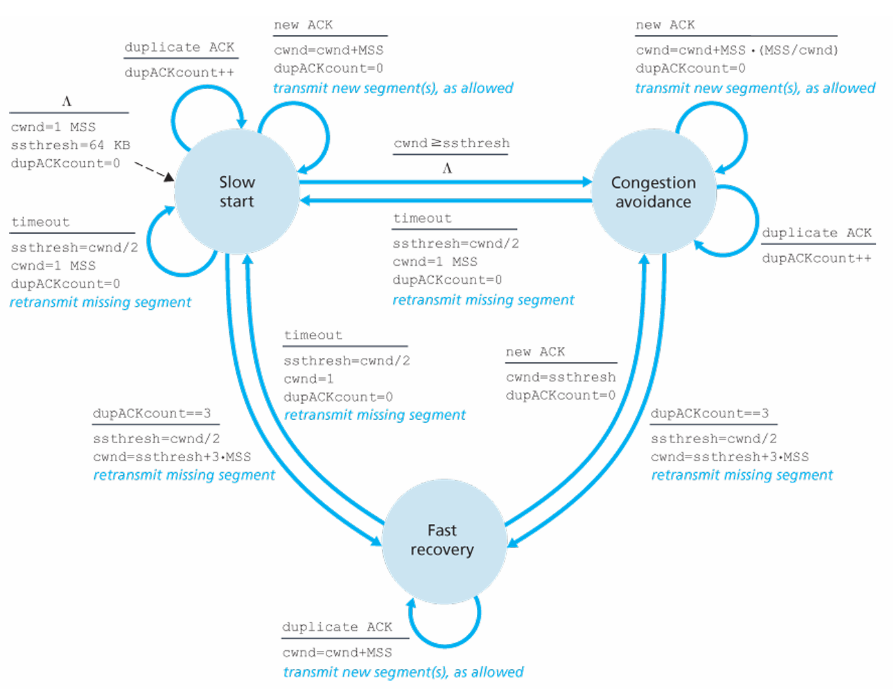

#### TCP拥塞控制：回顾
忽略最初的慢启动阶段，一个长期存活的TCP连接可能在拥塞避免和快速恢复之间来回切换，则它的拥塞窗口曲线可能如下：

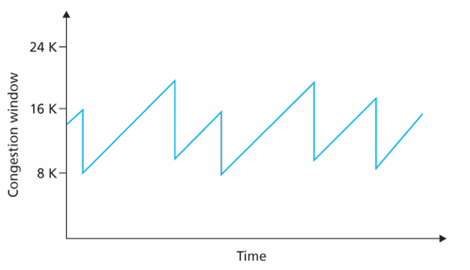

TCP拥塞控制常被称为**加性增乘性减AIMD**的拥塞控制方式。

#### 对TCP吞吐量的宏观描述
忽略超时引起的慢启动阶段，因为这个阶段往往非常短。在丢包发生时，假设cwnd为W，则TCP的发送速率在 $\frac{W}{2RTT}$ 到 $\frac{W}{RTT}$ 之间变化，故有平均吞吐量为 $\frac{0.75W}{RTT}$ 。

#### 经高带宽路径的TCP
在TCP的拥塞控制算法下，可以推导出TCP连接的吞吐量公式，如下：
$$
\text{吞吐量} = \frac{1.22MSS}{RTT \sqrt{L}}
$$
其中 $L$ 是丢包率。

当MSS为1500字节，RTT为100ms，丢包率需要低至 $2 \times 10 ^{-10}$ 才能实现10Gbps的吞吐量。这是非常苛刻的条件，因此许多人员也试图为高速环境设计新版TCP。

### 公平性
如果多个TCP连接共享一个链路传输一个大文件，链路上没有UDP传输，它们能够得到接近相等的带宽，则称拥塞控制机制是公平的。

TCP的AIMD算法是公平的，解释如下图：
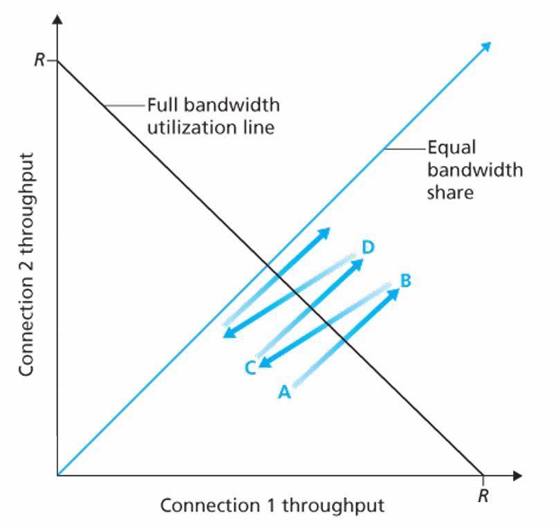

考虑两台主机共用一条链路。假设从A点出发，则此时没有达到全带宽利用，不会丢包，从而两者都线性增加带宽。到达B点以后发现丢包，两者速度都降低一半至C点，这时更加接近公平线了。然后重复以上的过程，最终两者都会收敛到公平线。

然而这个模型建立在相同RTT的前提下，实际上具有较小RTT的连接可以更快地释放拥塞窗口从而获得更多的带宽。

#### 公平性和UDP
UDP不受拥塞控制算法的限制，在瓶颈链路上很可能压制TCP连接。

#### 公平性和并行TCP连接
虽然多个连接可以平等共享带宽，但一个应用可以创建多个TCP连接来传输数据从而占领链路的大量带宽。

### 明确拥塞通告：网络辅助拥塞控制
IP和TCP的扩展方案已经提出并已经实现和部署，它允许网络明确向TCP发送方和接收方发出拥塞信号。这被称为**明确拥塞通告ECN**。

网络层层面，IP数据报首部的服务类型字段有两个比特用于ECN。路由器可以设置ECN比特，接收方收到以后在TCP ACK报文段中设置ECN Echo比特发送给发送方。发送方接收到以后减半拥塞窗口，然后在下一个报文段中设置CWR比特。

<br><br>

# 网络层：数据平面
由于网络层过于复杂，把它拆分成**数据平面**和**控制平面**两个部分来学习。

## 网络层概述
数据平面的主要作用是从其输入链路向其输出链路转发数据报；控制平面的主要作用是协调这些本地的路由器转发动作，使得数据报沿着源和目的主机之间的路由器路径最终到达目的主机。

### 转发和路由选择：数据平面和控制平面
网络层的作用是把分组从一台主机移动到另一台主机，这需要两种重要的功能：
- 转发：当分组从输入链路到达时，路由器把它移动到合适的输出链路。这是数据平面实现的唯一功能。
- 路由选择：决定让分组流向接收方经过的路径。计算路径的算法被称为**路由选择算法**，它是控制平面的主要功能。

每台路由器有一个关键元素，叫做**转发表**，路由器在其中通过分组的某些字段来查找输出链路。

### 网络服务模型
网络服务模型定义了分组在发送与接收端系统之间的端到端运输特性。网络层可能提供如下的服务：
- 确保交付
- 具有时延上界的确保交付
- 有序分组交付
- 最小带宽保证
- 安全性

因特网的网络层只提供**尽力而为服务**，它什么也不保证，尽管如此，它仍然在实践中已经被证明足够好。

## 路由器工作原理
考虑网络层的**转发**功能。路由器的通用体系结构如下图：


其中包含了4个组件：
- 输入端口：完成入物理链路的物理层功能、与入物理链路远端的链路层交互来完成链路层功能、查找转发表选择输出端口并进入交换结构
- 交换结构：把输入端口连接到输出端口，是路由器的内部网络
- 输出端口：存储从交换结构接收的分组，执行必要的链路层和物理层功能在输出链路上传输这些分组。
- 路由选择处理器：执行控制平面功能。在传统路由器中，它执行路由选择算法，维护路由选择表与关联链路状态信息，并为路由器计算转发表。在SDN路由器中，它负责与远程控制器通信，接收远程控制器计算的转发表项，在路由器的输入端口安装这些表项。

其中输入端口、输出端口和交换结构几乎总是使用硬件实现，因为软件实现的速度太慢。

而路由器的控制功能通常以毫秒或秒的时间尺度运行，因此可以使用软件实现。

在分组进行转发结构之前，路由器需要一些信息来对分组进行处理：
- 基于目的地转发：分组指示自己的目的地，路由器查询转发表来决定输出端口
- 通用转发：除了目的地，路由器还能根据其他因素来决定输出端口。

### 输入端口处理和基于目的地转发
输入处理的视图如下：

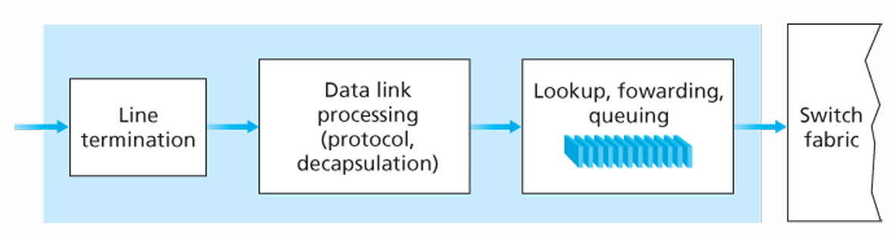

其中，线路端接和链路层处理实现了物理层和链路层功能。

查找功能是非常重要的，路由器使用转发表寻找输出端口，表由路由选择处理器计算和更新，或者接收SDN控制器的指令。转发表经过独立总线复制到线路卡，转发决策正是通过转发表副本在输入端口上进行的。

转发表使用目的地址的**前缀**进行匹配，如果一个地址可以匹配多个表项，那么使用**最长前缀匹配规则**。由于达到吉比特速率对转发的速率要求非常高，这个工作必须通过硬件来完成，而且需要有比简单线性搜索更快的算法支持。内存访问时间也是重要的，通常使用DRAM或更快的SRAM，或是**三态内容可寻址存储器TCAM**可以在基本常数时间内完成查找。

确定输出端口以后分组就进入交换结构，如果交换结构被占用，分组可能需要排队。

实际上还需要做一些其他的工作：
- 进行物理层和链路层处理
- 检查分组的版本号、检验和以及寿命字段，重写后两个字段
- 更新用于网络管理的计数器

### 交换
交换有以下三种方式：
- 经内存交换：早期的路由器是传统计算机结构，当分组到达的时候通过中断通知路由选择处理器，然后该分组被复制到处理器内存中，处理器提取目的地址并找到输出端口，并把分组复制到其缓存中。转发速度主要受到访存的限制。
    
- 经总线交换：分组从输入端口经过一条共享总线直接传送到输出端，不需经过路由选择处理器。一般输入端口为分组计划一个交换机内部标签（首部）来指示本地输出端口，每个输出端口都能看到这个分组，但只有对应标签的输出端口会接收它并去除标签。总线一次只能传送一个分组，则交换速率受到总线速率的限制。
    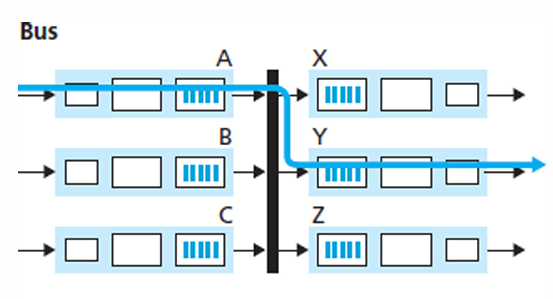
- 经互联网络交换：为了克服总线的弊端，可以使用更复杂的互联网络。纵横式交换机使用2N条总线组成互联网络，连接N个输入端口和N个输出端口。每条垂直总线都和每条水平总线相交，交点可以通过交换结构控制器打开和闭合。通过打开一些交点，可以实现多个分组并行传输而不会互相影响，此时它们使用的总线没有实际相交。称纵横式交换机是**非阻塞的**，当分组的目的端口没有在接受其他分组时，这个分组就不会被阻塞。
    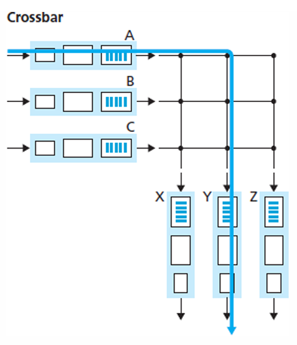
- 还有一些更复杂的交换方式，如多级交换元素等等。

### 输出队列处理
它取出放在输出端口缓存中的分组，把它们发送到输出链路上。这需要选择和取出排队的分组，执行需要的链路层和物理层功能。

### 何处出现排队

#### 输入排队
如果交换结构不足够快，那么输入端口处将出现排队。考虑纵横式交换结构，如果两个输入端口需要转发到同一个输出端口，那么其中一个将会被阻塞，并且如果其中有后续的报文在排队，即使它们不需要转发到同一个输出端口，也会被阻塞。这被称为**线路前部阻塞**。

有研究指出，如果输入链路上分组到达速率达到容量的58%，由于线路前部阻塞，输入队列的长度将无限制增大（出现大量丢包）。

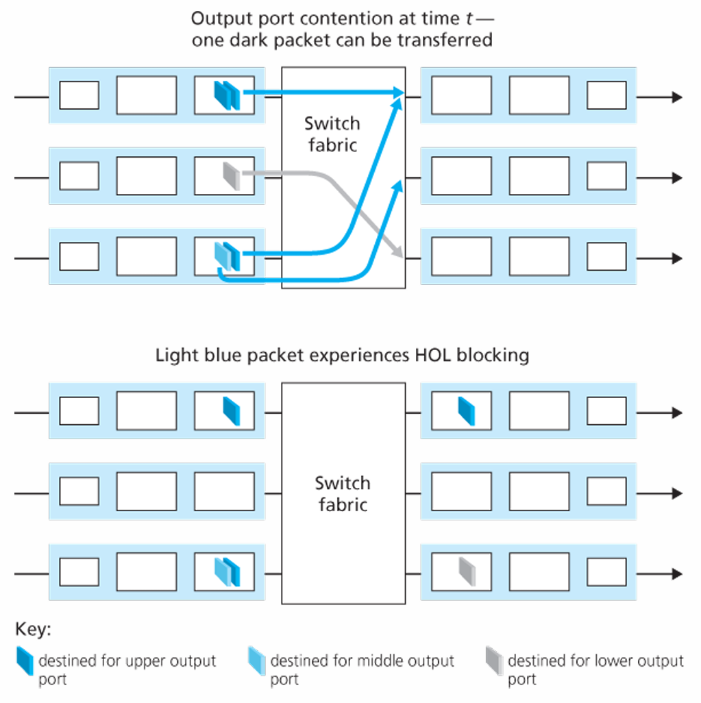

#### 输出排队
考虑N个分组到达不同的输入端口，并且需要转发到同一个输出端口，设交换结构速率比链路速率快N倍，那么输出端口发出一个分组的时候就会有N个分组被转发过来，这些分组就会排队。

如果没有用于排队的内存不足，就需要做出决定：
- **弃尾**：丢弃到达的分组
- 删除一些排队的分组

有时候可能会在队列满之前就丢弃一些分组，从而向发送方传递拥塞信号。有许多的分组丢弃和标记策略，它们统称为**主动队列管理AQM**算法。其中应用最广泛的是**随机早期检测RED**算法。

输出端口会使用**分组调度**算法来从输出队列中选择分组进行发送。

路由器的缓存需要多少是个自然的问题。假设缓存数量是 $B$ ，链路容量是 $C$ ，则有经验公式：
$$
B = RTT \times C
$$
然而这是基于较少TCP连接的假设，后来又有研究表明，如果有大量TCP连接，数量为 $N$ ，那么上述公式应该改为：
$$
B = \frac{RTT \times C}{\sqrt{N}}
$$

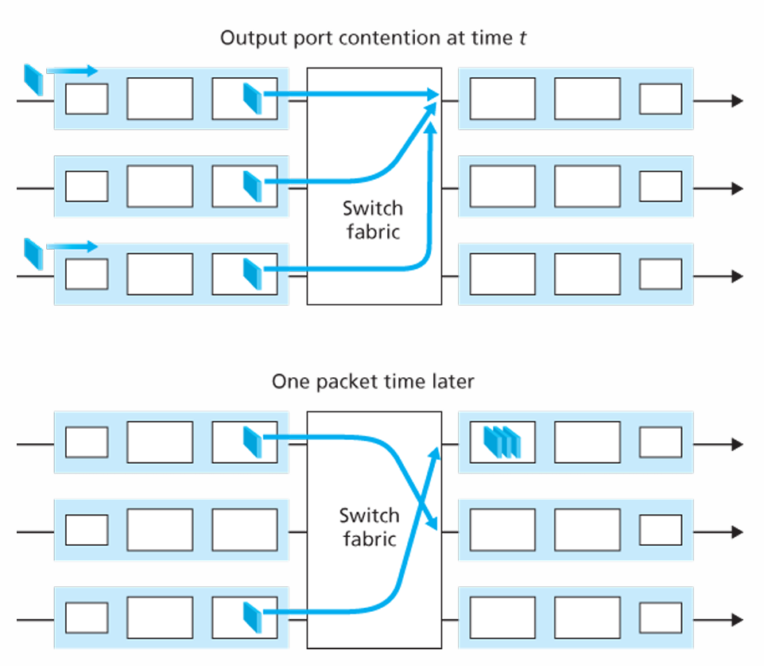

### 分组调度

#### 先进先出
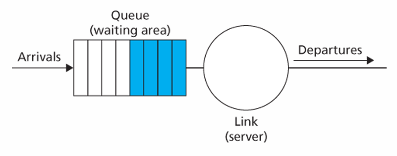

#### 优先权排队
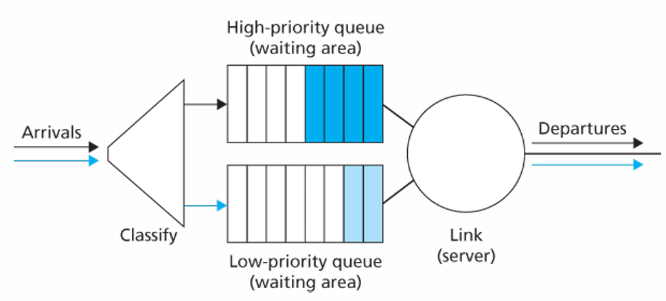

可以有多个具有不同优先级的队列，算法优先传输高优先级队列中的分组，队列中的分组选择常常使用FIFO。

#### 循环和加权公平排队
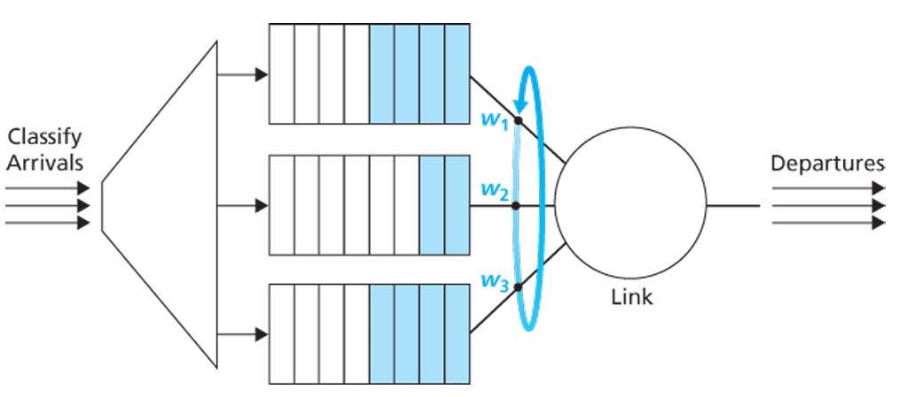

在**循环排队规则**下，算法轮流从每个队列中取出一个分组进行传输，如果某个队列为空，即刻检查下一个队列，这称为**保持工作排队**规则。

一种通用的循环排队规则被广泛使用，称为**加权公平排队WFQ**。和一般的循环排队不同，WFQ为每个队列分配一个权重 $w_i$ ，然后尽量保证它能占有转发能力的 $\frac{w_i}{\sum w_j}$ 。

## 网际协议：IPv4、寻址、IPv6及其他

### IPv4数据报格式
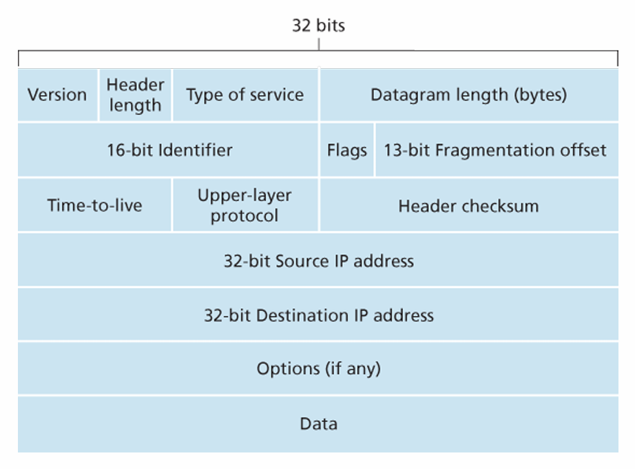

其中关键字段为：
- 版本：表示IP协议是IPv4还是IPv6
- 首部长度：IPv4可以包含一些可变数量的选项，该字段表示首部长度，不包含选项的数据报首部长度为20字节
- 服务类型：用于区分不同种类的数据报，如要求低时延或高可靠性等
- 数据报长度：包括首部和数据的总长度
- 标识、标志和片偏移：用于IP分片和重组
- 寿命：用来防止数据报在网络中无限循环，每经过一台路由器该字段减一，当它为0时，数据报被丢弃
- 协议：表示应该交给哪个运输层协议处理，比如6表示TCP，17表示UDP
- 首部校验和：用于检查IP首部是否出错，以2字节为单位计算校验和，然后把反码放在该字段，如果校验错误则丢弃数据报。由于TTL字段会改变，每个路由器都需要重新计算检验和。
- 源和目的IP地址
- 选项：实际上很少使用，但因此必须引入首部长度字段，并且也给路由器带来了额外的负担。IPv6取消了选项字段。
- 数据

### IPv4数据报分片
由于数据报传送的过程中可能经过不同的链路，链路的**最大传送单元MTU**可能不同，因此如果数据报长度超出了某个链路的MTU，就需要对数据报进行分片，每个小数据报都称为**片**。

片在分片以后必须进行组装，IPv4的设计者认为在路由器中完成这样的工作会非常复杂并且会降低路由器的性能，因此把这个工作交给了主机。

因此，主机收到IP数据报以后必须检查标识、标志和片偏移字段来组装完整的数据报。其中标识字段用来指示小数据报属于哪个大数据报，一般主机发送数据报时，每个数据报都递增；标志字段用来指示数据报的结尾，最后一个小数据报的标志字段为0，其他的为1；片偏移字段用来指示小数据报在大数据报中的位置。

### IPv4编址
主机和链路之间的边界叫做**接口**，一个主机或路由器可能有多个接口，一个IP地址与一个接口相关联。

IP地址长32比特，通常使用**点分十进制记法**，所有的接口都需要有唯一的IP地址（除了使用NAT）。

分开主机和路由器的每个接口，产生几个隔离的网络岛，使用接口端接这些隔离的网络的端点，这些隔离的网络每一个都是一个**子网**。

IP的编址方法为子网分配如223.1.1.0/24的地址，其中/24记法称为**子网掩码**，指示最左侧的24位定义了子网地址。子网中的所有接口都具有223.1.1的前24位，但是最后8位可以不同。

因特网的地址分配策略称为**无类别域间路由选择CIDR**，它把子网寻址的概念一般化了，地址具有a.b.c.d/x的格式。其中x构成了子网部分，经常被称为地址的**前缀**，一个组织常被分配一块连续的地址，则具有相同的前缀。剩余的32-x位则用于区分子网内部的设备。

在CIDR采用前，子网位数只能是8、16、24，这是一种称为**分类编址**的编址方案，三个位数的网络分别称为A、B、C类网络。然而这样的编制方案地址单元太僵化，不够自如。

有一个特殊的IP地址255.255.255.255，被称为**广播地址**，当主机发送一个带有此目的地址的数据报，它会被传遍整个子网。有时路由器也会向其他子网转发这个报文，但通常不会这样。

#### 地址分配实践原则
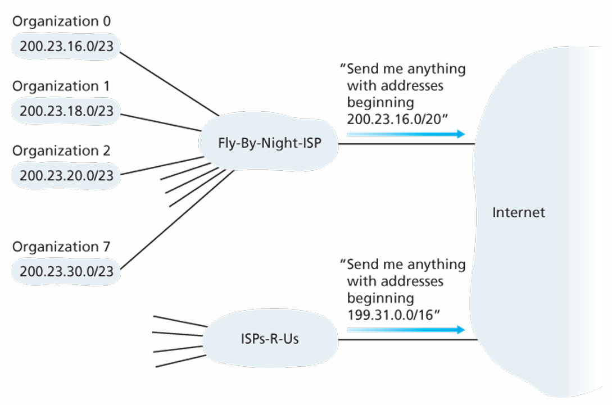

一个ISP可以把自己拥有的地址分配给其他的组织，并只需对外通报自己具有大块的地址块，外界不需要了解ISP怎么分配它的地址。如上图，这是自然的情况。这被称为**地址聚合**，或**路由聚合**，或**路由摘要**。

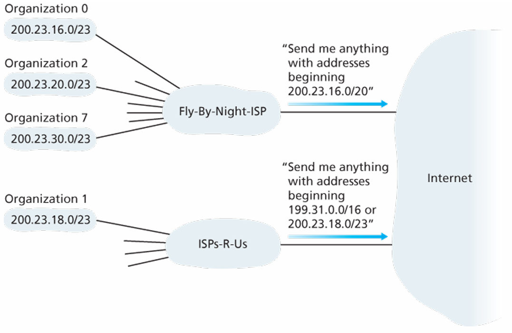

某个组织可能想要从一个ISP迁移到另一个ISP之中，一个直接的想法是它重新编址内部的所有接口地址来使用新的ISP的地址，但这样比较麻烦。更典型的方案是，保持组织的IP地址，同时让原来的ISP通告的地址也不变，但新的ISP同时通告该组织使用的地址。然而当一个分组同时可以匹配两个地址的时候，进行最长前缀匹配，所以最后它会传输到新的ISP。

#### 获取一块地址
一个组织为了获取一块IP地址，可能会联系ISP，然后ISP从自己拥有的地址块中分配一块给这个组织。

不过，ISP也需要从某处获取它的地址块，这需要通过全球性的权威机构来获得。因特网名字和编号分配机构ICANN负责管理全球的IP地址空间，它向区域性的因特网注册机构分配地址块，它们一起形成了ICANN的地址支持组织，分别处理区域内的地址分配/管理。

#### 获取主机地址：动态主机配置协议
组织获得了一块地址以后，就可以为组织内的主机和路由器分配地址了。系统管理员通常手工配置路由器中的IP地址。主机地址则更多地使用**动态主机配置协议DHCP**来完成，它允许主机自动获取一个相同的IP地址。网络管理员可以配置DHCP让某主机每次都能拿到同一个IP地址，或者每次都分配一个**临时的IP地址**。

DHCP还可以为主机提供其他的信息，如子网掩码、第一跳路由器地址（默认网关）和本地DNS服务器的地址。

DHCP可以方便地把一个主机连接进一个网络，常被称为**即插即用协议**或**零配置协议**。

DHCP是一个客户-服务器协议，考虑子网中有一台DHCP服务器（如果没有可能需要DHCP中继代理，它通常是一台路由器，知道DHCP服务器的地址）。新到达的主机需要完成四个步骤：
1. DHCP服务器发现：主机需要找到DHCP服务器，这通过**DHCP发现报文**完成，它是通过UDP向端口67发送的报文，目的地址使用255.255.255.255，源地址使用0.0.0.0（因为它还没有自己的IP地址）。
1. DHCP服务器提供：DHCP服务器收到发现报文以后，用**DHCP提供报文**回复，它同样进行广播。报文中包含：发现报文的事务ID、向主机推荐的IP地址、子网掩码、**IP地址租用期**。
1. DHCP请求：子网中可能有多个DHCP服务器，从而主机可能收到几个提供报文，它可以选择其中一个用**DHCP请求报文**响应，回送配置的参数。
1. DHCP确认：服务器用**DHCP ACK报文**回复，证实主机要求的参数。

由于DHCP具有租用期，它还提供了一个机制来续租IP地址。

DHCP在移动性方面有较大的缺陷，因为每到一个新的子网主机就得到一个新的IP地址，这样原先的TCP连接就不能维持。

### 网络地址转换
**网络地址转换NAT**使得子网的IP地址管理更加灵活。

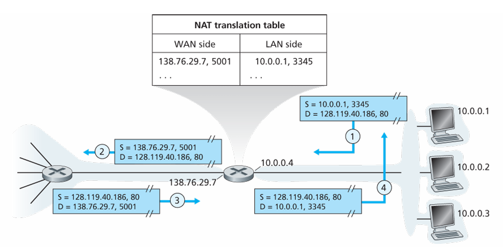

图中NAT是能路由器面向内部网络的一侧使用的地址格式都为10.0.0.0/24，这个地址块从属于地址空间10.0.0.0/8，是一个保留的地址空间，用于**专用网络**或**具有专用地址的地域**。然而每个NAT子网中的主机都可以使用这样的地址，显然因特网分组不能使用这样的地址，此时就需要NAT进行中间的转换。

从外界来看，NAT路由器更像一个只有单一IP地址的设备，在图中它具有因特网IP地址138.76.29.7。NAT路由器从ISP的DHCP服务器获取这个IP地址，并且它也运行一个DHCP服务器，为内部网络的主机分配IP地址。

NAT路由器维护一张**NAT转换表**，用来把某个端口号关联到内部的某个主机和端口号。如图，当内部用户10.0.0.1通过端口3345发送一个报文到外界，NAT路由器分配端口5001给它并记录在转换表中，同时它修改报文的源IP地址为自己的IP地址、源端口号为5001，然后发送到外界。接收到外界的回复时，通过转换表逆向寻找到对应的主机和端口号，重写好报文的目的IP地址和端口号，然后发送到内部网络。

NAT也有一些问题，比如它无法让内部主机作为连接的接受方，因为内部主机不主动向外发起连接就没有建立起转换表条目。这需要使用**NAT穿越**和**通用即插即用UPnP**等技术。

NAT已经成为互联网的一个重要组件，称为**中间盒**。中间盒运行在网络层并具有与传统路由器不同的功能，它提供NAT、流量的负载均衡、流量防火墙等功能。

### IPv6
IPv4的地址位数不足，地址空间已经用尽，因此有了IPv6。

#### IPv6数据报格式
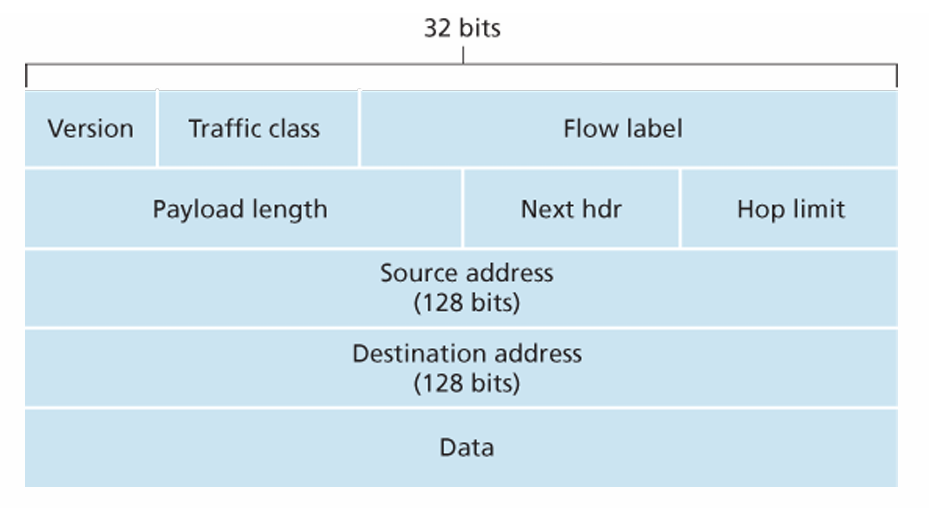

IPv6的数据报格式相比于IPv4有一些改变：
- 扩大的地址容量
- 简化高效的40字节首部：去除了选项字段
- 流标签：IPv6有一个**流**的概念，给不同的流分配不同的标签可以为它们提供不同的服务

IPv6的字段介绍：
- 版本：4比特，表示IP协议是IPv4还是IPv6
- 流量类型：8比特，类似于IPv4的服务类型字段
- 流标签：20比特，标识一条数据报的流，可以对流中某些数据报给出优先权，或者对来自某些应用的数据报给出优先权
- 有效载荷长度：表示数据部分的长度
- 下一个首部：标识上层使用的协议
- 跳限制：类似于寿命字段
- 源和目的地址
- 数据

IPv4中一些字段没有出现在IPv6中：
- 分片/重新组装：IPv6取消了分片，如果分组太大不能传输，路由器简单地丢弃它，然后回送一个“分组太大”的ICMP报文
- 首部检验和：由于链路层和TCP都提供了检验和，在IP层的检验或许有些多余，并且它很耗时
- 选项：实际上选项字段并没有消失，它可能出现在由“下一个首部”指出的位置上。TCP和UDP可以是下一个首部，选项字段也可以是下一个首部。

#### 从IPv4到IPv6的迁移
广泛采用的方法是**建隧道**。考虑两个节点希望使用IPv6进行交互而中间的链路支持IPv4，此时把两台IPv6路由器中间的IPv4路由器的集合称为**隧道**。隧道两端的IPv6路由器可以把自己的IPv6数据报封装在一个IPv4数据报中，数据报到达对面以后从中取出IPv6数据报。

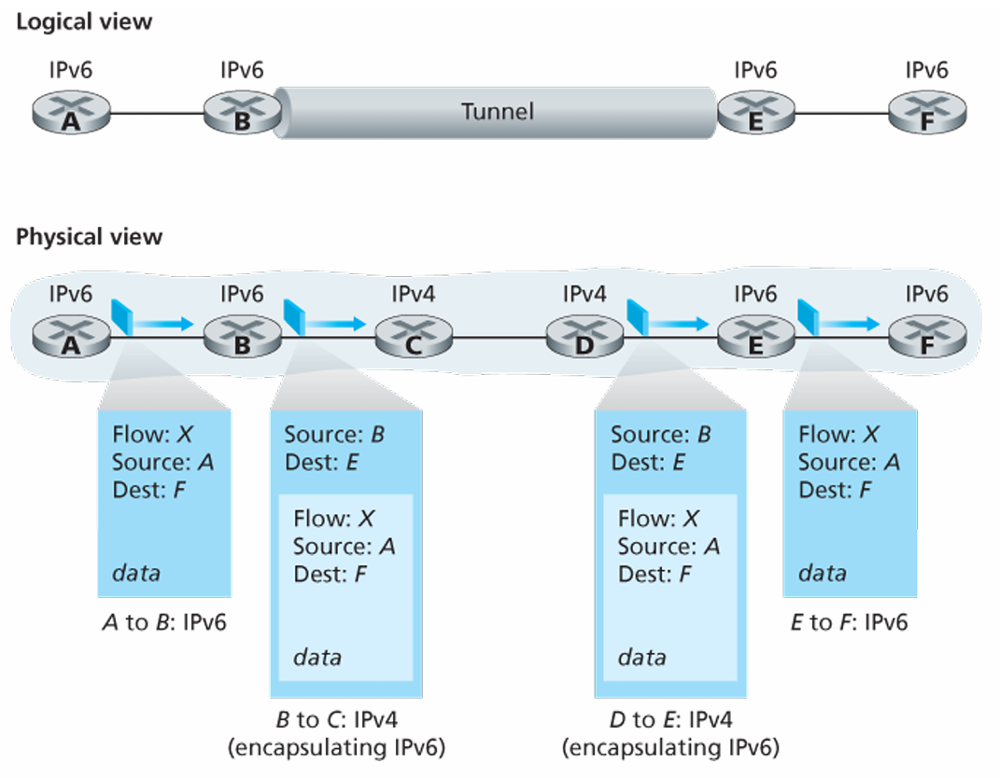

## 通用转发和SDN
一般的基于目的地转发过程为，查找匹配目的IP地址，把分组发送到对应的输出端口。这样的过程通常称为“匹配加动作”。

实际上可以有更通用的匹配加动作范式，它对整个协议栈中的多个字段进行匹配，并可以把分组转发到一个或多个输出端口、实现负载均衡、重写首部值、阻挡/丢弃分组等等。这就是通用转发，实现的设备称为分组交换机。

接下来考虑标准OpenFlow 1.0的通用转发模型。

匹配假动作转发表在OpenFlow中称为**流表**，表项包括：
- 首部字段值的集合：用于进行匹配，如果使用硬件实现，TCAM可以很快地完成匹配
- 计数器集合：统计与某个表项匹配的分组数量，以及自该表项上次更新以来的时间
- 所采取的动作集合：匹配成功时执行的动作

### 匹配
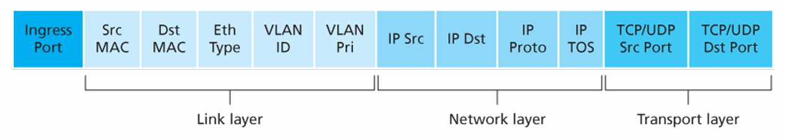

OpenFlow 1.0可以对三层协议字段进行匹配，同时入端口号也可以进行匹配。后来OpenFlow规范已经可以匹配41个字段。

流表项也可以使用通配符，比如128.119.*.*的IP地址。

并不是协议中所有的字段都可以匹配，这取决于匹配它的成本和价值。

### 动作
每个流表项都可以有零或多个动作。最重要的动作有：
- 转发：把分组发送到特定输出端口，或者广播到多个端口
- 丢弃：没有动作的流表项表示丢弃分组
- 修改字段：上图中除IP字段的其他协议字段可以被修改

# 网络层：控制平面

## 概述
路由器根据转发表和流表来转发分组，考虑如何计算、维护和安装这些表项，这是控制平面的工作。前面提到，这有两种方法：
- 每路由器控制：每个路由器有一个路由选择组件，与其他路由选择组件通信，计算转发表和流表
- 逻辑集中式控制：由逻辑集中式控制器计算并分发转发表供每台路由器使用。每台路由器中有一个控制代理CA以配置和管理转发表，具有最少的功能，一般主要负责与控制器通信并执行控制器的指令。

所谓逻辑集中式，其实可能出于容错等原因，使用多个服务器来实现。SDN使用了逻辑集中式控制，并且近年来越来越流行。

## 路由选择算法
**路由选择算法**目的是从发送方到接收方的过程中确定一条通过路由器网络的好的路径，通常，这意味着最低的开销。这相当于图论中的带权图的最短路径问题。

一种分类最短路径算法的依据是集中式或者分布式：
- **集中式路由选择算法**：用完整的、全局性的网络知识计算出从源到目的地之间的最低开销路径。
- **分散式路由选择算法**：路由器以迭代、分布式的方式计算出最短最低开销路径。

还有按动态性分类：
- **静态路由选择算法**：路由随时间的变化非常缓慢，常常是人工配置的
- **动态路由选择算法**：随着网络流量或拓扑发生变化而改变路由选择路径

或是按对负载的敏感程度分类：
- **负载敏感算法**：链路开销动态地反映出底层链路的拥塞水平，如果链路拥塞，则算法趋向于绕开这个链路
- **负载迟钝算法**：当今因特网路由算法都是这类，因为链路开销和链路拥塞之间的关系是不明确的

### 链路状态路由选择算法
**链路状态LS**算法中，所有的网络拓扑结构和链路开销都是已知的。在实践中，这通常通过**链路状态广播**来实现。

一个典型的LS算法是Dijkstra算法，是一种迭代算法，经过k次迭代后得到前往k个目的节点的最短路径。记 `D(v)` 为当前迭代轮次中源到目的节点的 `v` 的最低开销， `p(v)` 为源到 `v` 当前最短路径上 `v` 的前一个节点， `N'` 为当前已经确定最短路径的节点集合， `N` 为所有节点的集合。

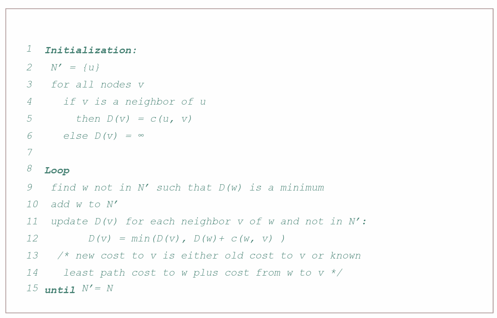

这个算法在最坏情况下的时间复杂度是 $O(n^2)$ ，但是在实际中，可以使用**优先级队列**来实现，时间复杂度为 $O((n + m)\log n)$ ，其中 `m` 是边的数量。

考虑一个问题，如果把链路的负载情况当做链路的开销，并且每个路由器都计算LS算法，那么可能会出现如下的振荡问题：

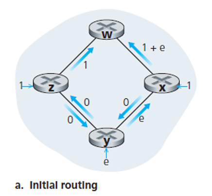

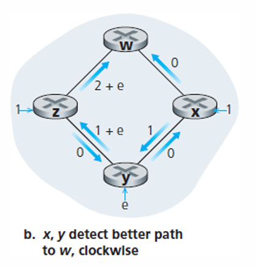

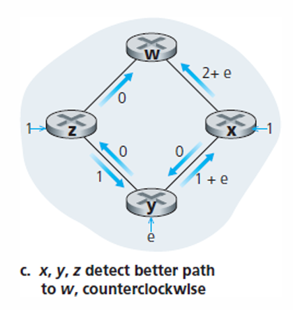

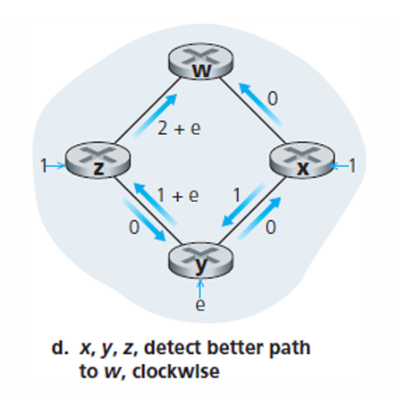

为了解决这样的问题，最简单的方式就是不考虑链路的负载，然而路由选择的一个目标就是避开拥塞路径，因此这样的做法是不合适的。另一种方式就是，让路由器运行LS的时机错开来。这看起来可行，然而有研究证明路由器可以实现“自同步”并最终以同样的时机执行LS算法，避免自同步的一种方法是让每台路由器发送链路通告的时间随机化。

### 距离向量路由选择算法
**距离向量DV**算法是一种迭代的、异步的和分布式的算法。相比于使用全局信息的LS算法，DV算法从一个或多个直接相连的邻居获取信息，执行计算并把结果发送给邻居。它重复这样的步骤直到收敛。邻居之间不需要同步执行算法。

为了取得最短路径，可以使用Bellman-Ford算法，核心是此方程：
$$
d_x(y) = \min_v \{c(x, v) + d_v(y)\}
$$
其中 $d_x(y)$ 表示从 `x` 到 `y` 的最低开销， `c(x, v)` 表示从 `x` 直接到 `v` 的开销。

为了运用这个算法，每个节点 `x` 需要维护一些信息：
- 对于每个邻居 `v` ，直接相连的开销 `c(x, v)`
- 距离向量， $D_x = [d_x(y) \mid y \in N]$
- 每个邻居的距离向量

因此，每个节点都会不时向邻居发送自己的距离向量副本。当一个节点接收到一个距离向量副本，它保存下来，使用它更新自己的距离向量，如果发生了改变则也发送自己的距离向量副本给邻居。只要所有的节点持续以异步方式交换距离向量，最终所有的节点都会收敛到最短路径。

然而路由器并不关心最短距离，它只想知道最低开销的下一跳路由器。因此，DV算法在更新距离的时候也维护了下一跳路由器的信息。

一般来说，若干次的距离向量交换以后算法达到收敛，进入静止状态，直到某一条链路的开销发生改变。

#### 距离向量算法：链路开销改变与链路故障
当某条链路开销发生改变时，某个节点会留意到它，并且可能更新自己的距离向量并通知它的邻居。但是这样并不总是能正常工作，考虑以下的情况：


原来， $D_y(x)=4$ ， $D_y(z)=1$ ， $D_z(x)=5$ ，然后更新边xy开销为60。此时节点y会注意到，然后尝试更新自己的距离向量：
$$
D_y(x) = \min_v \{c(y, v) + D_v(x)\} = \min\{60 + 5, 5 + 1\} = 6
$$
它认为自己可以通过z到达x实现6的开销，然而它不知道z到x的最低开销需要经过y，因此计算出了错误的结果。此时分组到达y或者z以后，它们就会把分组相互转发，形成一个无穷的环路，这被称为**路由选择环路**。

不过y会向z更新自己的距离向量，从而z发现自己到达x的距离变成了7，然后又通知y，y更新自己到x的距离为8。一直重复下去，直到这个距离超过了z直接到达x的距离，这实际上需要经过44次的迭代。这显然代价已经非常大了。

因为如果链路开销增大得非常厉害，完成收敛需要相当久，这样的问题有时称为无穷计数问题。

#### 距离向量算法：增加毒性逆转
毒性逆转的思想非常简单，如果z通过y到达x，那么它告诉y自己到达x的开销是无穷大来避免y逆向通过z到达x，这样就不会形成环路。

它没有完全解决无穷计数问题，涉及3个或以上节点形成的环路时，依然会有问题。

#### LS与DV路由选择算法的比较
- 报文复杂性：LS算法每个节点都需要知道完整的网络信息，这需要发送大量的报文，当一条链路改变时也需要通知所有的节点。DV算法每次迭代仅在邻居之间交换信息。
- 收敛速度：LS算法是一个要求 $O(|N||E|)$ 个报文的 $O(|N|^2)$ 的算法。DV算法收敛较慢，且会出现路由选择环路和无穷计数问题。
- 健壮性：LS算法中路由器可以向连接的链路广播错误的开销，节点也可以损坏或丢弃LS广播分组，但由于LS节点值计算自己的转发表，因此这样的影响不会非常大；DV算法中，一个节点可以向任意目的节点通告错误的最低开销路径，这样的错误通过迭代传播到整个网络，可能导致大量分组错误地涌向一些节点。

两个算法都在因特网中有一定的应用。

## 因特网中自治系统内部的路由选择：OSPF
前面的内容把因特网所有路由器看做一个整体，认为它们做同样的计算工作。实际上这样的模型有些简单化：
- 规模：随着路由器数量的增加，路由选择信息的通信、计算、存储的开销会变得非常高。DV算法的收敛速度也会变得非常慢。
- 管理自治：每个ISP都会按照自己的意愿运行和管理网络，同时希望有某种方法来和外部网络交互。

这两个问题通过**自治系统AS**来解决。每个AS由一组通常处在相同管理控制下的路由器组成。通常ISP中的路由器和互联它们的链路形成一个AS，还有些ISP会把网络分成多个AS。自治系统具有全局唯一的AS号，这由ICANN区域注册机构分配。

同一个AS中往往运行相同的路由选择算法，称该算法为**自治系统内部路由选择协议**。

#### 开放最短路优先OSPF
OSPF路由选择以及关系密切的IS-IS协议都被广泛用于AS内部路由选择。OSPF的O指的是开放，表示它是公共可用的，相比之下Cisco的EIGRP专有了20年左右。

OSPF是一个链路状态协议，使用洪泛链路状态信息和Dijkstra算法来计算最短路径。管理员可以配置所有链路权值为1来选择最少跳数的路径，也可以配置链路权值为链路容量的倒数来绕开低带宽的链路，OSPF并不强制一种权值的选择。

当一条链路状态发生变化时，路由器向AS内所有路由器广播路由选择信息；即使链路状态不发生变化也要周期性广播。OSPF通告使用OSPF报文，它直接使用IP来承载，协议号是89。这使得OSPF必须自己实现可靠报文传输、链路状态广播等功能。OSPF还需要通过向邻居发送HELLO报文来检查链路运行状态，并允许路由器获得邻居的网络范围链路状态的数据库。

OSPF有以下有优点：
- 安全：OSPF有鉴权，只有受信路由器才能加入OSPF交换。默认状态下鉴权不开启，可以配置两种鉴权方式：
    - 明文的简单口令
    - 路由器之间共享密钥，给信息附上密钥以后使用MD5计算散列值。同时使用序号避免重放攻击。
- 多条相同开销的路径：如果多条路径的开销相同，OSPF可以把流量分配到这些路径上
- 对单播与多播路由选择的综合支持：多播版本MOSPF提供多播路由选择的支持，它使用现有的OSPF链路数据库，并提供了一种新型的链路状态通告。
- 支持在单个AS中的层次结构：单个AS中可以配置多个区域，它们都运行自己的OSPF的LS算法，其中的路由器向区域内广播链路状态。在区域边界有路由器负责为流出区域的分组提供路由选择。会有一个区域配置成主干区域，它为其他区域之间的流量提供路由选择。主干区域会包含所有的区域边界路由器，还可能包含一些非边界路由器。区域间的分组先经过自己区域的边界路由器进入主干区域，然后到达目的区域的边界路由器，最后到达目的地。

## ISP之间的路由选择：BGP
OSPF是AS内部的路由选择协议，因此使用的路由选择协议可以完全由AS内部的管理员决定。然而跨越AS的分组则会用到**自治系统间路由选择协议**。因特网中的所有AS运行相同的AS间路由选择协议，这个协议是**边界网关协议BGP**。

BGP是因特网中除了IP之外最重要的协议，它把许多个ISP黏合起来。

### BGP的作用
BGP不把分组路由到一个特定的地址，而是路由到CIDR化的前缀，如138.16.68/22。它为每台路由器提供了完成以下任务的方式：
- 从邻居AS获取前缀的可达性信息：一个子网可以向因特网通告自己的存在，BGP保证因特网中的所有AS都知道这个子网的存在。
- 确定到达某个前缀的最佳路径：如果有多条路径可选，路由器本地运行一个BGP路由选择过程来挑选路径。

### 通告BGP路由消息
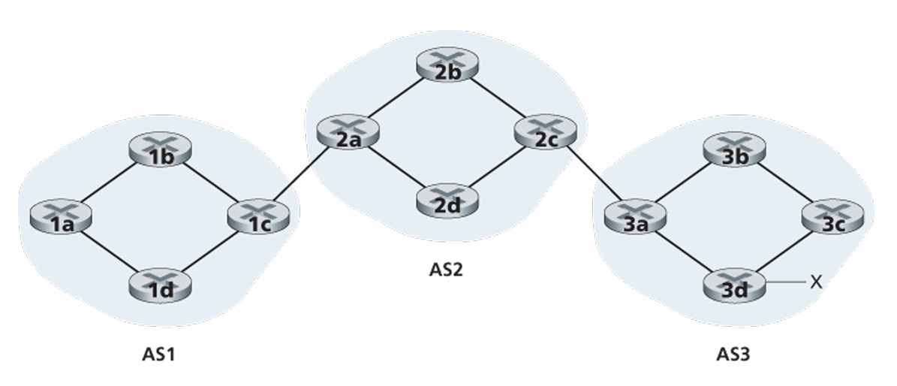

对于每个AS，里面的路由器要么是**网关路由器**，要么是**内部路由器**。其中网关路由器位于AS边缘，直接连接到其他AS中的路由器。

考虑AS3要向AS2发送一个BGP报文，通告x存在于AS3中，把这个报文表示为“AS3 x”；然后AS2向AS1发送一个报文，通告可以通过AS2进入AS3然后到达x，这个报文表示为“AS2 AS3 x”。因此每个系统不仅知道x在哪，还知道怎么到达x。

上述的描述表达了大意，然而并不是AS在发送报文，而是路由器。在BGP中，每对路由器通过端口179上的半永久TCP连接交换BGP报文。每条直接连接和上面传送的报文称为**BGP连接**，跨越两个AS的BGP连接称为**外部BGP连接eBGP**，在同一个AS内的BGP连接称为**内部BGP连接iBGP**。

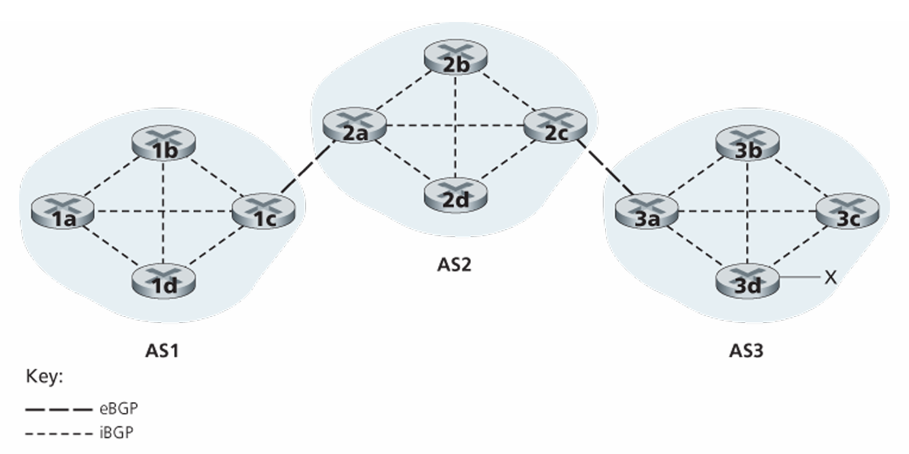

重新观察前述的过程。3a向2c发送一个eBGP报文“AS3 x”，2c广播iBGP报文“AS3 x”，2a向1a发送eBGP报文“AS2 AS3 x”，1a广播iBGP报文“AS2 AS3 x”。

实际可能出现多条可行路径：

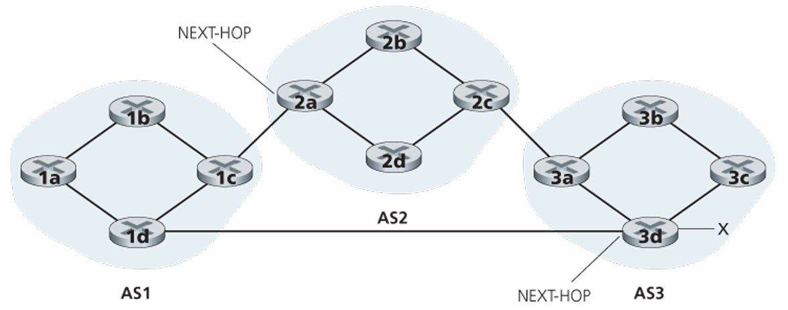

### 确定最好的路由
当有多条可选路径时，就需要找出最好的路径。

首先引入几个术语。在路由器通过BGP连接通告前缀时，可以包含**BGP属性**，前缀及其属性称为**路由**。两个重要的属性是AS-PATH和NEXT-HOP。AS-PATH包含通告已经经过的AS的列表，它还能用来避免通告环路（当在AS-PATH中发现自己，就拒绝通告）。NEXT-HOP是路径上下一个边界路由器接口的IP地址，如上图中下方的路径就为3d左侧接口的IP地址。

#### 热土豆路由选择
这是最简单的路由选择算法。如果有多条路径，检查到每条路径的NEXT-HOP的开销，选择最低开销的路径。这个算法称为**热土豆路由选择**，因为它试图以最快的方式把分组交出去，就像交出一个烫手的热土豆一样。

#### 路由器选择算法
实践中BGP使用的是一个更复杂的算法。如果只有一条路径可达，则该算法选择它。如果有多条路径可达，算法顺序应用如下规则消除一些路径，直到只剩下一条路径：
1. 路径被指派一个**本地偏好**值作为属性之一，可能由路由器设置或从其他路由器得到，这个值取决于管理员的策略。较高的本地偏好值意味着较好的路径。
1. 使用距离向量算法，计算出最短AS-PATH的路径，选择经过最少AS的路径。
1. 使用热土豆路由选择算法，选择NEXT-HOP最近的路径。
1. 使用BGP标识符

### IP任播
BGP除了用于AS间路由选择协议以外，还常用于IP任播服务，通常用于DNS中。

考虑以下情况：
- 在许多分散的不同地理位置，替换不同服务器上的相同内容。
- 让每个用户从最靠近的服务器访问内容

这很像CDN的机制，同时DNS也可以这样处理。BGP提供了一个容易而自然的机制来实现它。

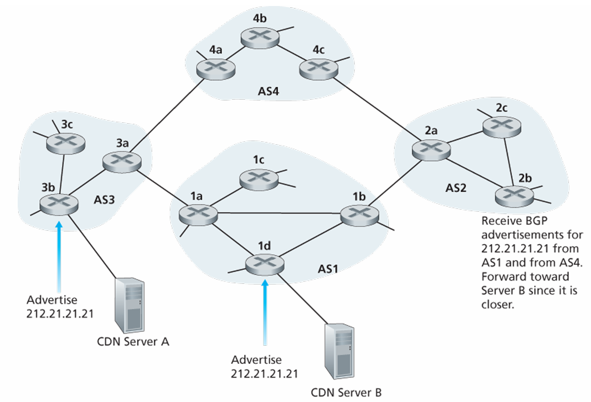

在IP任播配置阶段，CDN公司为多台服务器指派相同的IP地址，并使用标准的BGP从这些服务器的每台通告该IP地址。如果某个BGP路由器收到对这个IP地址的多个不同通告，它认为这是对同一个位置的多个路径选择。配置路由选择表时，路由器本地地使用BGP路由选择算法来选择最好的路径。

虽然如此，CDN通常不使用IP任播，因为这可能导致相同TCP连接的不同分组被发往不同的位置。但DNS却可以使用它来分配根DNS服务器。

### 路由选择策略
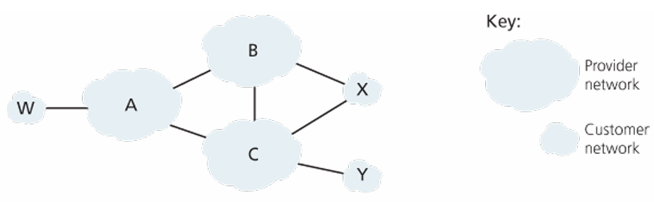

WXY是接入ISP，ABC是主干ISP，其中X是**多宿接入ISP**。期望进入接入ISP的分组就是发送给其中某个主机的分组，离开接入ISP的分组就是从其中某个主机发出的分组。像X这样的AS怎么避免转发B和C之间的分组呢？

实际上是通过BGP通告实现的，即使X知道有路径可以到达其他的AS，它也不向主干通告这些路径，则主干就不会把分组转发给X。

接下来是主干网络。考虑分组需要进入接入ISP，W。A知道怎么到达W，所以它通告给B，B也可以向X进行通告。然而B是否会向C通告呢？它可能会认为自己不应该承担C到达W的流量，因此不会通告给C。实际上没有官方标准强制主干ISP如何选择。

商业运行的ISP都遵循的一个经验法则是：任何穿越某ISP主干网的流量，其源或目的必须位于该ISP的客户网络中。各个对等协定通常由ISP双方进行协商，一般对外保密。

## SDN控制平面
SDN体系结构有4个关键特征：
- 基于流的转发：转发使用流表，可以对整个协议栈中的多个字段进行匹配。SDN控制平面的工作是计算、管理和安装流表。
- 数据平面与控制平面分离：数据平面有网络交换机组成，它们快速而简单地执行流表规则。控制平面由服务器已经相应的软件组成。
- 网络控制功能：位于数据平面交换机外部，它们通过在控制平面的服务器上运行的软件来实现。
- 可编程的网络：通过运行相应的软件，网络的行为是可编程的。

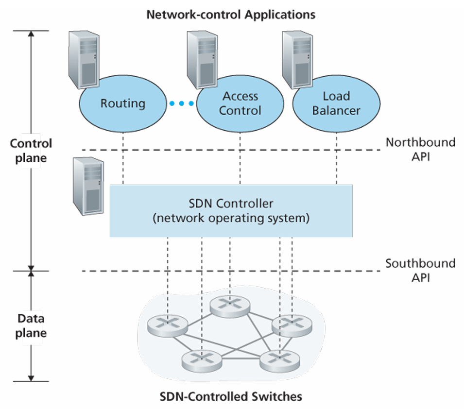

### SDN控制平面：SDN控制器和SDN网络控制应用程序
SDN控制平面可以大体分为两个部分：SDN控制器和SDN网络控制应用程序。首先来看SDN控制器。

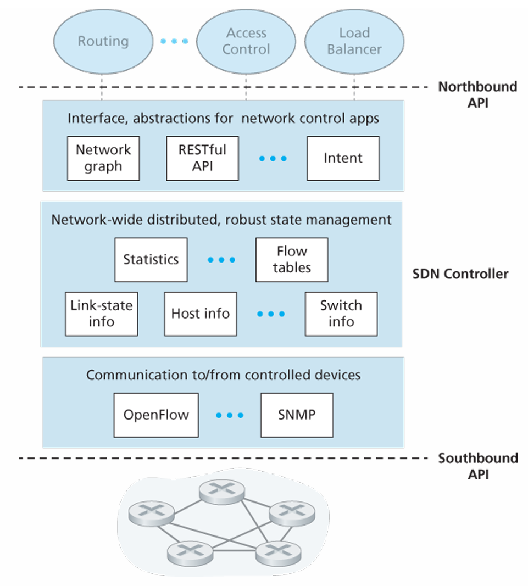

SDN控制器的功能可以划分为三个层次：
- 通信层：SDN控制器和受控网络设备之间的通信。为了控制远程设备或从远程设备获取信息，需要一个协议来交换信息。它是SDN控制器的最底层接口，被称为南向接口。
- 网络范围状态管理层：SDN控制平面做出控制决定需要使用到主机、链路、交换机和其他SDN控制设备的状态信息，SDN控制器维护这些信息还有流表的拷贝。
- 对于网络控制应用程序层的接口：这些接口称为北向接口，允许应用在状态管理层之间读写网络状态和流表。应用程序可以注册状态改变的回调，从而收到通知。

SDN控制器是逻辑上集中的，但往往会分布式实现来保证容错、高可用等特性。

### OpenFlow协议
OpenFlow协议运行在TCP纸上，使用6653端口为默认端口。从控制器到受控交换机的重要报文有：
- 配置：允许控制器查询并设置交换机的配置参数
- 修改状态：由控制器所使用，增加/删除或修改交换机流表中的表项，并且设置交换机端口特性
- 读状态：用于从交换机的流表和端口收集统计数据和计数器值
- 发送分组：用于在受控交换机的特定端口发送一个特定报文

从交换机到控制器的重要报文有：
- 流删除：通知控制器已删除一个流表项
- 端口状态：通知控制器端口状态的改变
- 分组入：当一个分组不能匹配流表项时，交换机发送分组入报文和待处理分组给控制器

### 数据平面和控制平面交互的例子
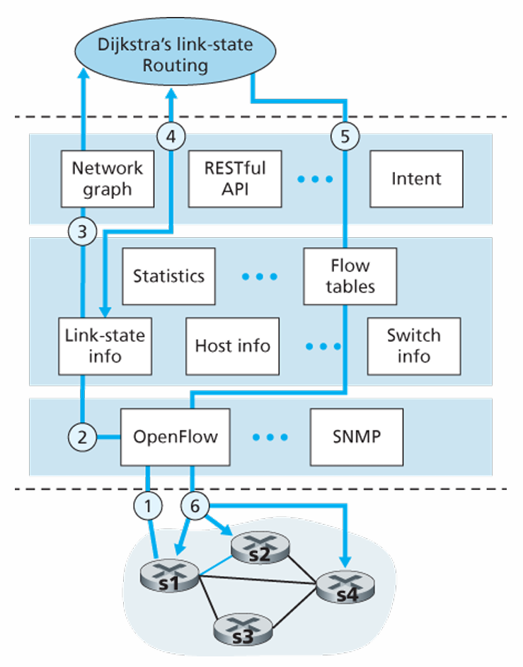

1. 交换机s1和s2之间发生了链路故障，s1向控制器发送一个端口状态报文
1. SDN控制器收到以后通知链路状态管理层，它更新链路状态库
1. Dijkstra算法程序注册了通知，因此它收到通知
1. 链路状态路由选择应用程序与链路状态管理层交互来得到最新的链路状态，并且计算出新的最短路径
1. 链路状态路由选择程序跟流表管理器交互，流表管理器决定更新的流表
1. 流表管理器使用OpenFlow协议更新受到影响的s1、s2、s4的流表项

## ICMP：因特网控制报文协议
ICMP协议被主机和路由器用来沟通网络层信息，最典型的用途是差错报告。

ICMP通常被认为是IP协议的一部分，不过实际上它是作为IP数据报的有效载荷的，类似于TCP和UDP，并且对应的ICMP分组被提取出来以后也是交给ICMP协议来处理。

ICMP报文有一个类型字段和一个编码字段，还包含引起ICMP报文的IP数据报的首部与前8个字节的数据便于识别。

Ping程序就是使用ICMP报文，类型8编码0，是一个回显请求，对方接收到以后发送类型0编码0的回显应答。大多数操作系统直接支持ping程序，而不是实现成一个普通进程。

源抑制报文是ICMP最初为拥塞控制而设计的，然而TCP有自己的拥塞控制机制，因此源抑制报文的使用并不多。

ICMP报文类型和编码如下：
| ICMP类型 | 编码 | 描述 |
| --- | --- | --- |
| 0 | 0 | 回显应答 |
| 3 | 0 | 目的网络不可达 |
| 3 | 1 | 目的主机不可达 |
| 3 | 2 | 目的协议不可达 |
| 3 | 3 | 目的端口不可达 |
| 3 | 6 | 目的网络未知 |
| 3 | 7 | 目的主机未知 |
| 4 | 0 | 源抑制 |
| 8 | 0 | 回显请求 |
| 9 | 0 | 路由器通告 |
| 10 | 0 | 路由器发现 |
| 11 | 0 | TTL过期 |
| 12 | 0 | IP首部损坏 |

TraceRoute发送一系列的具有不可达端口号的UDP分组，每个分组的TTL字段递增，这样就可以得到一系列TTL过期的ICMP报文。当某个分组抵达目的地时，返回的报文是端口不可达的ICMP报文，这样就知道不用再发送分组了。

ICMP有专门的IPv6版本。

## 网络管理和SNMP
网络管理包括了硬件、软件和人类元素的设置、综合和协调，以监视、测试、轮询、配置、分析、评价和控制网络及网元资源，用合理的成本满足实时性、运行性能和服务质量的要求。

### 网络管理框架
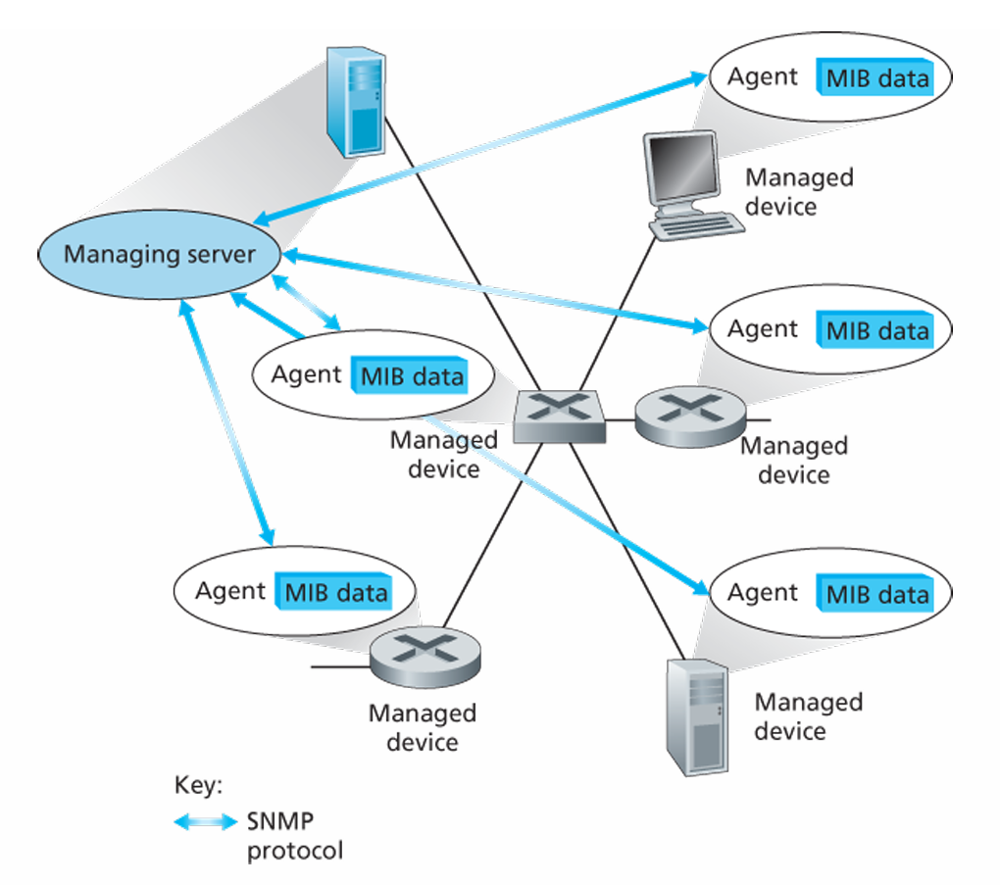

- **管理服务器**：一个应用程序，运行在网络运营中心NOC的集中式网络管理工作站上。它执行网络管理活动，控制网络管理信息的收集、处理、分析和显示。网络管理员在这里工作。
- **被管设备**：可以是一台主机、路由器、交换机、中间盒、调制解调器或其他联网的设备。一个被管设备中有几个**被管对象**，是被管设备中硬件和用于硬件和软件组件的配置参数。
- **管理信息库MIB**：被管设备中被管对象的关联信息收集在其中，它们可供管理服务器使用。
- **网络管理代理**：运行在被管设备中的一个进程，与管理服务器通信，执行管理服务器的命令。
- **网络管理协议**：管理服务器和网络管理代理之间的通信协议。

### 简单网络管理协议
**简单网络管理协议SNMP**版本2是一个应用层协议，用于在管理服务器和网络管理代理之间交换管理信息。

SNMP最常使用请求响应模式，其中SNMP管理服务器向SNMP代理发送一个请求，SNMP代理执行相应的操作以后返回一个响应。

SNMP也常用于代理向管理服务器发送一种非请求报文，称为**陷阱报文**。它用于通知管理服务器发生了异常情况并导致MIB对象值的改变。

SNMPv2定义了7种类型的报文，它们一般称为协议数据单元PDU：
| PDU类型 | 发送方 - 接收方 | 描述 |
| --- | --- | --- |
| GetRequest | 管理 - 代理 | 请求一个或多个MIB对象的值 |
| GetNextRequest | 管理 - 代理 | 取得列表或表格中的下一个MIB对象的值 |
| GetBulkRequest | 管理 - 代理 | 以大数据块的方式取得值，如大表中的值 |
| InformRequest | 管理 - 管理 | 向不能访问的远程管理实体通知MIB值 |
| SetRequest | 管理 - 代理 | 设置一个或多个MIB对象的值 |
| Response | 代理 - 管理、管理 - 代理 | 对其他PDU的响应 |
| Trap | 代理 - 管理 | 代理向管理通知异常事件 |

SNMP PDU的格式如下：
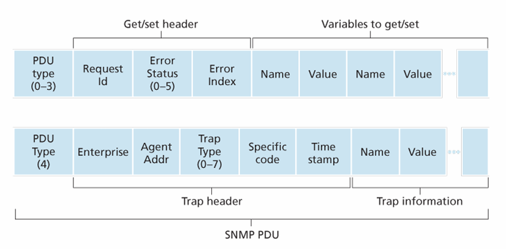

SNMP通常使用UDP进行传输，然而它是不可靠协议，使得SNMP响应可能丢失。管理服务器维护PDU的请求编号，响应需要包含相同的编号，这样管理服务器就可以识别出响应对应的请求，基于此SNMP有超时重传机制。然而这样的行为不是标准强制的。

SNMPv3在SNMPv2的基础上增强了安全性，它提供了认证和加密机制。

<br><br>

# 链路层和局域网

## 链路层概述
下面把任何运行链路层协议的设备称为**节点**，把连接相邻节点和通信信道称为**链路**。传输节点把数据报封装成**链路层帧**，然后把帧发送到链路上。

### 链路层提供的服务
链路层协议都是将数据报通过单一通信链路从一个节点移动到相邻节点，然而提供的服务细节可能不同，它可能提供的服务有：
- 成帧：数据报发送之前会被添加上若干首部字段形成链路层帧
- 链路接入：**媒体访问控制MAC**协议规定了帧在链路上传输的规则。当链路上只有一个发送方和一个接收方时，MAC协议是简单的。然而当链路上有多个发送方和接收方时，MAC协议就变得复杂了。
- 可靠交付：链路层通过确认和重传来提供可靠运输服务，常用于无线链路。然而对于有限链路这样的差错率低的链路，这样的机制可能带来不必要的开销，因此它们使用的链路层协议可能不提供可靠交付。
- 差错检测和纠正：链路层的传输可能遇到信号衰减和电磁噪声，则信号可能会被错误识别，通常使用硬件进行差错检查，有些还能进行纠正。

### 链路层在何处实现
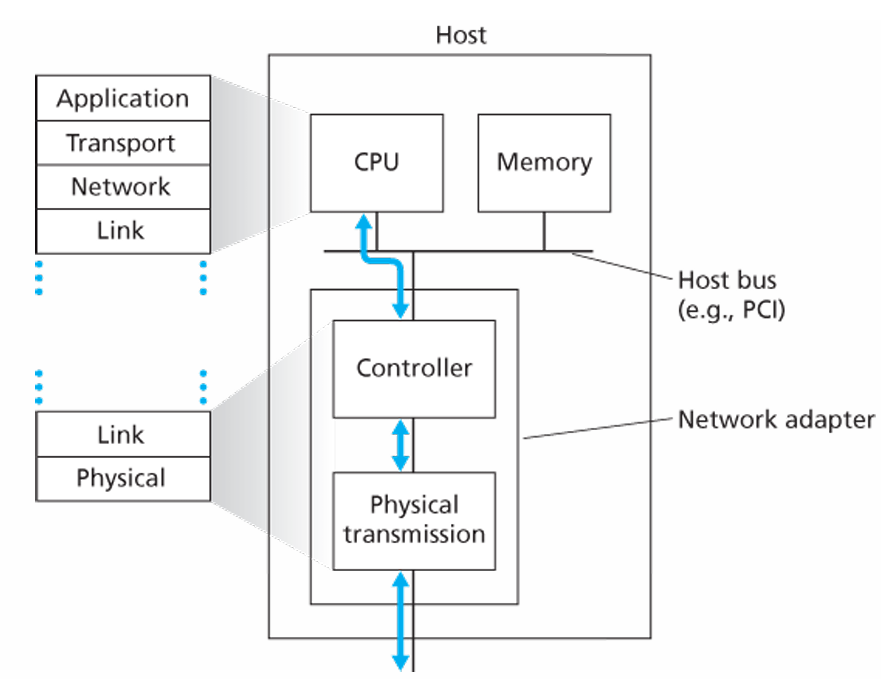

上图是一个主机的体系结构图，其中链路层的主体部分在**网络适配器**中实现，它有时也称为**网络接口卡**。其中的核心是链路层控制器，通常是一个实现了许多链路层服务的专用芯片。因此大多数的链路层功能是由专门的硬件实现的。

图中可以看出，有少量的链路层是在软件中实现的，如组装链路层寻址信息和激活硬件、响应控制器中断、处理差错条件、上传数据报给网络层。

综上，链路层是软件和硬件交接的地方。

## 差错检测和纠正技术
链路层提供**比特级差错检测和纠正**。

在发送端，使用**差错检测和纠正比特EDC**来增强数据D，它同时作用于数据报和链路层首部。接收端接收到D'和EDC'，由于链路上发生的差错，D'和EDC'都可能和一开始发送的不同。关键在于接收方需要知道自己收到的D'是否和D相同。

虽然使用了差错检验比特，也可能有一些**未检出比特差错**，此时它向网络层交付一个受损的数据报。差错检验方案需要尽可能降低这样的概率。

### 奇偶检验
最简单的方案就是使用单个**奇偶检验位**。以奇校验为例，选择该位使得原数据加上该位以后总共有奇数个1位。当遇到奇数个比特位的差错时它可以检测，然而当遇到偶数个比特位的差错时它不能检测。

如果每一位是否发生差错是独立的，那么同时有两位发生差错的概率是很小的。然而实际上差错常常是同时发生的，研究表明，大量差错的情况下奇偶检验能检验出差错的概率只有50%左右。

一般些的方案是**二位奇偶校验**，把原数据构成二位矩阵，为每行和每列都添加一个奇偶校验位。它可以精确检验出单个比特的差错，并且纠正它。当一个分组出现两个比特差错它也能检测，但不能纠正，因为无法确定是哪两个比特出错。

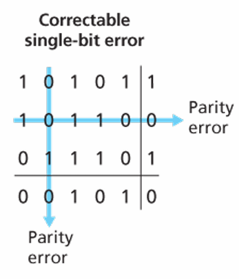

这样在接收方检测和纠正差错的能力被称为**前向纠错FEC**，这样的方案避免了从发送方处获取额外信息所需要的时延，对于长时延链路来说是非常重要的。

### 检验和方法
检验和方法把原数据划分成等长的整数。最简单的方法就是直接把它们加起来得到检验和，**因特网检验和**就是把数据划分成16位的整数并求和的反码作为检验和。TCP和UDP对整个报文段计算因特网检验和。如XTP等协议则分别对首部和数据计算检验和。

相比于其他的检验，检验和占据的空间不大，TCP和UDP均只有16比特的检验和。然而相比于CRC，检验和的检验能力较弱。然而CRC的计算开销更大，故不宜使用软件实现，只能在链路层通过专门的硬件实现。

### 循环冗余检测
广泛使用的差错检验技术基于**循环冗余检测编码CRC**，它也称为**多项式编码**。

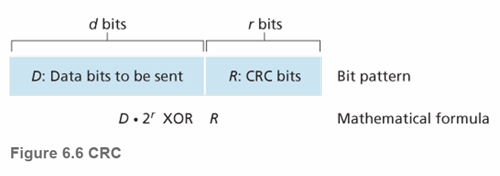

原数据 $d$ 比特，发送方和接收方需要协商一个 $r+1$ 比特的模式，称为**生成多项式**，令它为 $G$ 。要求 $G$ 的最高位为 $1$ 。

如图，对于原数据D，发送方要选择 $r$ 个附加比特组成R，附加它到D后面得到长度 $d+r$ 的比特模式，使得它能够被 $G$ 用模2算术整除。接收方接收到以后进行这样的除法，如果余数不为0，它知道发生了差错。

所谓模2算术，在加法中不进位，在减法中不借位，实际上等价于异或运算。根据前述要求，计算出的R需要满足：
$$
D \cdot 2^r \oplus R = n \cdot G
$$
两侧同时异或R，得到：
$$
D \cdot 2^r = n \cdot G \oplus R
$$
因此如果用 $D \cdot 2^r$ 作为被除数， $G$ 作为除数，得到的余数就可以作为R。

G通常由国际标准定义，已经有8、12、16、32位的G。CRC-32的32比特生成多项式被多种链路级IEEE协议采用。

每个CRC标准可以检测小于 $r + 1$ 比特的差错。除此之外，当差错长度超过了 $r + 1$ 比特时，CRC以 $1 - \frac{1}{2^r}$ 的概率检测出差错。每个CRC标准都能检测任何奇数个比特的差错。

## 多路访问链路和协议
有两种类型的网络链路：
- **点对点链路**：由链路两端的单个发送方和接收方组成
- **广播链路**：让多个发送方和接收方连接到相同的、单一的、共享的广播信道上

然而在广播链路中如何协调多个节点对同一个信道的访问呢，这就是**多路访问问题**。其中谁在何时获得发送的权利，是由**多路访问协议**来控制的。

由于所有的节点都能传输帧，可能出现它们同时在共享信道传输的情况，称这些帧在接收方处**碰撞**，此时多个帧的信号纠缠在一起，接受节点无法有效接收任何一个帧。显然多路访问协议的核心问题是处理好碰撞。

对于一个速率Rbps的广播信道，多路访问协议应该具有如下特性：
- 仅有一个节点传输时，它能获得全部Rbps的带宽
- 有多个节点传输时，它们的具有平分最大带宽的平均传输速率
- 协议是分散的，不需要一个主节点来协调，从而避免单点故障
- 协议是简单的，便于实现

### 信道划分协议
主要使用FDM和TDM的信道多路复用技术。


其中TDM把时间划分为**时间帧**，进一步地把每个时间帧划分为N个**时隙**，每个时隙被分配给一个节点使用，通常时隙长度应该选择得足够大来传输一个链路层帧。TDM消除了碰撞并且非常公平，然而一个节点只能分到时间帧中的一个时隙，当只有它需要传输时，它也不能获得完全的带宽，这是很大的浪费。同时一个节点总是需要传输一段时间以后停下来等待下一轮的时隙。

FDM把信道划分为不同的频段，分给不同的节点。显然FDM和TDM的优点和缺点都很相似。

还有一种名为**码分多址CDMA**的协议。它通过为每个节点分配一种不同的编码，多种编码可以交织发送而不会互相干扰，从而让多个节点同时在链路上传输数据。它已经被广泛用于民用领域。

### 随机接入协议
节点总是尝试以最大速率发送数据，如果发生了碰撞，各个节点都以某种方式反复重发数据，直到该链路层帧无碰撞传输。为了避免持续的碰撞，每次碰撞以后节点等待一个随机的时延。

#### 时隙ALOHA
这是最简单的随机接入协议之一。首先做出假设：
- 所有帧长度L比特
- 链路带宽Rbps
- 时间被划分为L/R秒的时隙，则一个时隙可以传输一帧
- 节点只在时隙起点开始帧的传输
- 节点是同步的，它们都知道时隙的起点
- 如果发生了碰撞，在时隙结束之前，节点能检测到碰撞

设p为一个概率，在每个节点看来：
- 如果获得一个新帧要发送，在下一个时隙的起点尝试发送
- 如果没有碰撞就顺利发送
- 如果碰撞，在时隙结束之前检测到，在后续的每个时隙中以概率p重传这个帧

相比于之前的协议，时隙ALOHA允许节点在独占信道时获得全部的带宽，而且它是分散式的协议，不过它需要有某种机制来同步时隙起点。

显然只有一个节点时时隙ALOHA工作良好。考虑多个节点时的效率，所有有碰撞的时隙全部的带宽都会被浪费；仅有一个节点在传输的时隙中带宽才能被利用，这样的时隙称为**成功时隙**。把时隙多路访问协议的**效率**定义为长期运行中成功时隙的比例。如果每个节点在碰撞后直接重传，那么效率为0；时隙ALOHA用概率的方式加大了这样的效率，接下来考虑效率到底是多少。

对模型稍作修改，认为N个节点中每个节点在每个时隙都有概率p传输一帧，那么成功时隙的概率是 $Np(1-p)^{N-1}$ ，求得 $p^*$ 令这个概率取得极大值，然后该式取值为 $e^{-1}$ ，则时隙ALOHA在最优情况下只有37%的时间能成功传输时隙，其他的带宽都被浪费掉，显然效果不是很良好。

#### ALOHA
ALOHA取消了时隙，从而不需要时隙起点的同步机制。当节点有一个帧需要发送时，它立即尝试传输。如果发生了碰撞，立即以概率p重传，如果决定不重传，那么它等待一个帧传输时间并重复这个过程。

考虑ALOHA的效率。认为某个节点在任何时间都有概率p传输一个帧，并且传输一个帧需要时间单位1。如果节点在 $t_0$ 开始传输一个帧，那么成功传输的前提是 $[t_0-1, t_0]$ 和 $[t_0, t_0 + 1]$ 的时间中都不能有其他的节点尝试传输一个帧。两者的概率都为 $(1-p)^{N-1}$ ，从而某个节点成功传输的概率为 $p(1-p)^{2(N-1)}$ 。

按照和时隙ALOHA同样的方式求得效率的极大值，结果刚好是 ${(2e)}^{-1}$ ，只有时隙ALOHA的一半，这就是取消时隙的代价。

#### 载波侦听多路访问CSMA
显然两种ALOHA协议中，节点并不关心其他节点的行为，导致大量的碰撞发生。在人类日常的交谈之中有两种重要的行为规则：
- 说话之前先听，如果其他人说话则自己不应该说话。在网络上这被称为**载波侦听**，节点持续监听信道直到一小段时间内没有其他节点传输才发送自己的信息。
- 如果自己和其他人同时开始说话，停止说话。在网络上这被称为**碰撞检测**，节点传输时也持续监听信道，如果发现其他节点的信号则停止传输，等待一段随机时间再尝试重新传输。

这样的规则被引入了**载波侦听多路访问CSMA**和**具有碰撞检测的CSMA（CSMA/CD）**协议族中。

虽然CSMA在传输之前监听信道，但是可能出现A开始传输，但是信号一段时间后才传输到B处；在此之前B已经监听一段时间发现没有其他信号，认为信道空闲于是也开始传输。显然信号从A传输到B需要的**信道传播时延**对于CSMA的性能是非常重要的。

#### 具有碰撞检测的载波侦听多路访问CSMA/CD
在CSMA中没有碰撞检测，当发生碰撞时，节点只是完整地传输它的帧，占用带宽的同时没有任何的实际效果。而CSMA/CD检测到碰撞，就立即停止传输，这可以改善协议的性能。

当停止传输以后，节点等待一个随机时间量。如果可供选择的区间小，而碰撞节点的数量大，那么再次碰撞的概率会很大；如果可供选择的区间大，但碰撞的节点数少，则节点可能凭空等待很长的时间而链路却是空闲的。

为此，使用**二进制指数后退**算法来处理这个问题。假如某个帧的传输已经经过了 $n$ 次碰撞，它从整数集合 $\{0, 1, 2, 3, ..., 2^{n - 1}\}$ 中随机选择一个值 $K$ ，则碰撞次数越多 $K$ 的期望就越大。设512比特进入链路的时间为 $T$ ，则它等待 $KT$ 时间。 $n$ 的上限取10。

一个有趣的地方是，新来的帧不考虑之前已经发生的碰撞，所以很可能获得一个较短的等待时间，从而先于之前的帧被发送出去。

#### CSMA/CD效率
把**CSMA/CD效率**定义为长期运行中帧在信道无碰撞传输的时间比例。设 $d_{prop}$ 表示信号在任意两个节点之间传输的最大时间， $d_trans$ 表示传输一个最大长度的以太网帧的时间，给出效率的近似式如下：
$$
\frac{1}{1+5\frac{d_{prop}}{d_{trans}}}
$$
如果 $d_{prop}$ 趋于0，那么效率趋于1。

### 轮流协议
前面的ALOHA和CSMA协议实现了当只有一个发送方时能够分到全部的带宽，然而对于多个发送方平分带宽却无所作为。这就需要用到**轮流协议**。

有多种轮流协议，其中两种比较重要的是：
- **轮询协议**：要求有一个节点作为主节点，它循环地**轮询**每个节点。如主节点通知节点1它能发送n1个帧，节点1可能会发送一些帧。或者它用完了额度，或者它持续一段时间没有发送新的帧，则主节点认为它发送完了，然后轮询下一个节点。这样的协议消除了碰撞，使得效率高了很多。缺点是轮询时延，只有一个活跃节点时，主节点也会轮询所有节点再回到该节点；更严重的问题是单点故障。
- **令牌传递协议**：没有主节点，节点之间按某种固定次序交换一个称为**令牌**的特殊帧来协调发送权。当一个节点收到令牌，它发送所有帧，没有帧要发送时就把令牌传递给下一个节点。令牌传递是分散的而且效率很高。缺点是某个节点的故障会导致整个网络的故障，例如某个节点无法传递令牌出去，就需要有某种机制把令牌带回到网络中来。

### DOCSIS：用于电缆因特网接入的链路层协议
一个电缆接入网通常在电缆网头端将数千电缆调制解调器与一个**电缆调制解调器端接系统CMTS**连接，**数据经电缆服务接口规范DOCSIS**定义了电缆数据网络体系结构机器协议。

DOCSIS利用FDM把下行和上行网络段划分为多个频率信道。每个下行信道宽6MHz，大约具有40Mbps的吞吐量；每个上行宽6.4MHz，大约具有30Mbps的吞吐量。每个上行和下行信道均为广播信道。然而虽然下行信道是广播的，但是实际上只有CMTS在发送数据，并没有多路访问的问题。上行信道则不同，需要考虑多路访问问题。

每条上行信道被划分为时间间隔，类似于TDM，每个时间间隔包含一个微时隙序列，电缆调制解调器可以在这些微时隙中发送数据。电缆调制解调器能够在哪个时隙发送数据是由CMTS显式许可的，它在下行信道上发送称为MAP报文的控制报文，从而明确给电缆调制解调器分配时隙。

然而有个问题，CMTS并不知道哪个电缆调制解调器有数据要发送。为此，上行信道上分配了一个特殊的微时隙，在其中电缆调制解调器以随机接入方式向CMTS发送微时隙请求帧，电缆调制解调器并不监听信道，它在下一个MAP报文中如果没找到对自己请求的响应，就认为出现了碰撞，并使用二进制指数后退算法重传。如果上行信道流量很少，电缆调制解调器可能在这个特殊的微时隙中发送自己的数据，从而避免等待微时隙的分配。

## 交换局域网
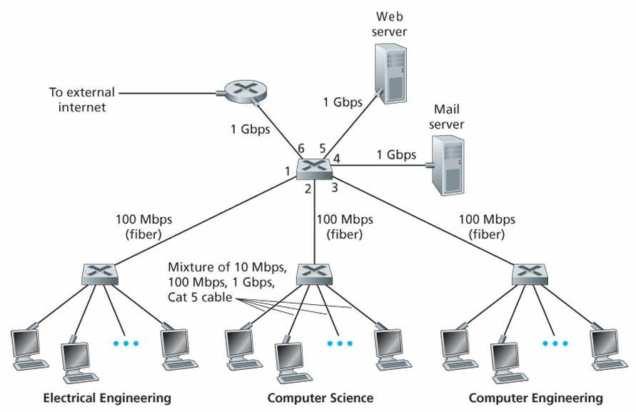

如图，某机构的三个部门在同一个交换局域网中，还有两台服务器以及四台交换机和一个路由器。由于交换机运行在链路层，它们只交换链路层帧，局域网内部分组的转发也就不能使用IP地址，而只能使用链路层地址。

### 链路层寻址和ARP

#### MAC地址
实际上，每个网络适配器（网络接口）具有一个链路层地址，因此一个主机或路由器可以有多个链路层地址。特别的是，交换机本身并不具有链路层地址，它只是透明地在链路上转发链路层帧。

链路层地址有多种不同的称呼：**LAN地址**、**物理地址**、**MAC地址**，其中最常用的是MAC地址。MAC地址长48比特，一般采用16进制表示法，每个字节用两个十六进制数字表示，中间用横杠分隔。虽然硬件上MAC地址被设计为永久的，但其实用软件改变一个适配器的MAC地址是可以的，不过后续讨论假设MAC地址是固定的。

MAC地址独一无二的，地址空间由IEEE管理，当公司要生产适配器时，只需支付象征性的费用从IEEE获得 $2^24$ 大小的连续地址空间。

不像IP地址具有子网掩码般的层次结构，一个设备不管在哪里都具有一样的MAC地址。相比之下，IP地址更像一个人的家庭地址，而MAC地址更像一个人的身份证号。

适配器要发送一个帧时，它把目的适配器的MAC地址放在首部，然后发送到链路上。适配器可以接收链路上的所有帧，然而只有其中的MAC地址和自己相同的帧才会被解包并交给网络层。有一个特殊的MAC地址会被所有适配器接纳，称为**广播地址**，它的值是FF-FF-FF-FF-FF-FF。

#### 地址解析协议
把IP地址转换成MAC地址使用的协议是**地址解析协议ARP**。每个主机和路由器在内存中有一个**ARP表**，记录了它所知的IP地址和MAC地址的映射关系，每个条目有一个超时时间，超过这个时间删除该条目。

首先考虑同个局域网中的情况。主机A要向主机B发送一个分组，它查询自己的ARP表以后没有找到相关条目，于是它需要向其他的主机询问。它构造一个名为**ARP分组**的特殊分组，包含发送方和接收方的IP地址，还有发送方的MAC地址。这个分组封装在链路层帧中，使用的MAC地址是广播地址，子网中的所有主机都会接收到这个分组并上传到ARP模块。如果某个主机知道结果就会回送一个响应ARP分组，使用的MAC地址是最初主机的MAC地址，最初的主机收到以后就会更新自己的ARP表。

ARP表是用上述方式自动配置的，也就是说是即插即用的。

ARP协议因为封装在链路层帧中，从体系结构上来说是一个网络层协议。然而它包含了链路层地址，所以它可以看做是链路层协议；同时它包含了IP地址，所以它也可以看做是网络层协议。因此，最好把ARP看成跨越了网络层和链路层的协议。

#### 发送数据到子网以外
如果子网1中的主机A要发送数据到子网2中的主机B，它或许可以使用ARP取得主机B的MAC地址，然而即使如此，它也不能使用主机B的MAC地址来发送数据，因为子网中所有主机包括网关都不会响应这个MAC地址，这个分组就会丢失。

实际上，主机A会使用网关的MAC地址，这样分组被上传到它的网络层并确定转发路径，它又会使用下一个路由器的MAC地址，如此往复直到来到主机B的网关，然后该路由器使用B的MAC地址发送数据。其中这些MAC地址都通过ARP协议获得。

### 以太网
以太网是最流行的有限局域网技术。一方面它出现得早，为人们所熟悉；其他的如令牌环、FDDI和ATM等技术比以太网更加复杂且昂贵；其他技术的优势是速率更高，然而以太网的标准不断迭代，提供了速率越来越高的版本。

最初的以太网使用同轴电缆总线来互联节点，这意味着它是一种广播局域网，使用具有二进制指数后退的CSMA/CD协议。

后来许多机构使用一种基于集线器的星型拓扑结构取代了之前的结构，主机和集线器直接使用双绞铜线相连。**集线器**是一种物理层设备，它从一个接口收到一个比特以后，放大它的信号并广播到所有其他接口上。因此这样的拓扑结构形成的局域网也是广播的。如果两个接口同时收到了帧，则发生碰撞。

21世纪以后以太网还是使用星型拓扑结构，但是把集线器换成了**交换机**，交换机是无碰撞的，而且可以存储转发分组，它运行在第二层。

#### 以太网帧结构


以上是以太网帧结构。

考虑在同一个以太网中，主机A向主机B发送一个IP数据报，设主机A的MAC地址是AA-AA-AA-AA-AA-AA，主机B的MAC地址是BB-BB-BB-BB-BB-BB。在这样的情况下来考察以太网帧中的各个字段：
- 数据字段：承载IP数据报，以太网的MTU是1500字节，如果IP数据报超过这个大小，它会被分片。数据字段最少需要有46字节，如果小于这个大小则需要填充，这样在接收方填充部分也会被传递至网络层，需要使用IP首部中的长度字段来移除填充部分。
- 目的地址：目的适配器的MAC地址
- 源地址：发送适配器的MAC地址
- 类型字段：除了IP数据报，以太网还可以复用其他协议的数据，如ARP协议，类型字段指明了把数据交给哪个协议处理。
- CRC：循环冗余检测，用于检查帧是否正确传输
- 前同步码：以太网帧以8个字节的前同步码开始，前七个字节都是10101010，最后一个字节是10101011。前7个字节用于唤醒接收适配器，并且同步它和发送适配器的时钟。

以太网技术提供无连接服务，适配器发送数据之前不经过握手过程。它也提供不可靠服务，当数据不能通过CRC校验的时候，它只是丢弃这个帧。

#### 以太网技术
以太网实际上有多种不同的技术，如10BASE-T、10BASE-2、100BASE-T、1000BASE-LX和10GBASE-T等。其中最前面的数字表示带宽，10表示10Mbps，10G表示10Gbps；BASE指基带以太网，即该媒体只承载以太网流量；最后的部分表示物理媒体，如T表示双绞铜线。

最初的以太网被预设为使用同轴电缆，包括10Base-2和10Base-5，它们基本被限制在500米长度之内。使用**转发器**可以达到更远的距离，它是一种物理层设备，负责放大来自接收端的信号并转发到发送端。同轴电缆是广播媒体，以太网使用CSMA/CD协议来协调传输。

后来以太网被标准化为100Mbps，并且保留了最初的以太网MAC协议和帧格式，新的标准主要使用铜线和光纤。使用双绞铜线的以太网距离限制在100米，使用光纤的以太网距离限制在数千米。

后来又有了吉比特以太网，如40Gbps以太网，它可以和大量现有的以太网设备完全兼容，其标准为IEEE 802.3z。它完成以下工作：
- 使用标准以太网帧格式，兼容10BASE-T和100BASE-T技术
- 允许点对点链路以及共享广播信道，点对点链路使用交换机，共享广播信道使用集线器
- 共享广播信道使用CSMA/CD协议，为了保证效率需要限制节点的最大距离
- 对于点对点信道，允许40Gbps的全双工传输

最初吉比特以太网使用光纤，后来可以工作在5种UTP线缆上。

早期的以太网使用总线拓扑或基于集线器的星型拓扑，是一种广播链路，且不得不面对碰撞问题。然而现代的以太网使用交换机，并且它是全双工的，因此主机和交换机可以同时向对方发送数据而不会有碰撞，因此现在的以太网已经不再需要MAC协议了。

### 链路层交换机
交换机接收入链路层帧并把它们转发到出链路。交换机对于子网中的主机和路由器是**透明的**，它们不知道交换机的存在。为了避免交换机转发的速度超过链路的速度，交换机有输出缓存。

#### 交换机转发和过滤
**过滤**是指决定一个帧被转发还是丢弃。**转发**是指决定一个帧应该被发送到哪个输出接口，并且实际发送它。这两个功能都借助**交换机表**来实现。交换机表包含局域网上某些主机和路由器，但不是全部，表项包含：
- MAC地址
- 通向该地址的输出接口
- 表项形成的时间

当一个帧到达交换机，它检查目的MAC地址并尝试匹配表项，可能有几种情况：
- 没有对应表项，向除了输入接口的所有接口转发
- 表项存在，但是对应的接口是输入接口，丢弃
- 表项存在，对应的接口不是输入接口，转发到对应接口

#### 自学习
交换机表是**自学习**的，无需管理员手工配置，过程如下：
1. 交换机表初始为空
1. 如果交换机表收到一个入帧，它记录一个表项：
    - 源MAC地址
    - 输入接口
    - 当前时间
1. 经过一段时间（老化期），交换机没有再收到来自该地址的帧，它删除这个表项

因此交换机是**即插即用设备**，无需做任何的额外工作。

#### 链路层交换机的性质
相比于总线拓扑和基于集线器的星型拓扑，交换机有许多优点：
- 消除碰撞
- 异质的链路。即交换机允许不同的接口连接不同材质和速率的链路
- 管理方便。如果某个主机异常并持续发送以太网帧，交换机可以检测到并屏蔽这个主机；当发生电缆故障时，只影响一些主机；交换机还可以统计一些信息

#### 交换机和路由器比较
它们都是存储转发分组交换机，但是一个工作在链路层，一个工作在网络层。

交换机的优点是即插即用，并且转发速率相对较高。缺点是为了避免广播循环，网络结构必须是无环的；同时网络过于庞大时，主机的ARP表也会很庞大，带来流量和处理的开销。并且交换机一般不防范广播风暴，如果一个主机恶意发送大量的广播帧，交换机会转发这些帧，从而影响整个网络。

路由器的优点是，它通过IP地址层次结构转发，从而不会有循环的问题（除非路由表出现错误，但也有TTL字段来防止循环），因此路由器可以使用更复杂的拓扑结构。同时路由器可以对广播风暴使用防火墙进行防护。而路由器的缺点是它需要一定的配置，并且处理时间相对长。

### 虚拟局域网


如图中的结构，按照等级层次结构来使用交换机，这样的模型在理想中可以很好的工作，然而实际中会有一些问题：
- 缺乏流量隔离：由于交换机向所有接口转发广播帧，因此一个广播帧会跨越整个局域网的所有部分，一方面会浪费网络带宽，另一方面可能有些部门内部的信息不希望传播到其他部门
- 交换机的无效使用：如果小组的数量很多，并且每个小组只有几个成员，那么使用大量的交换机是非常奢侈的。然而使用单台的话也无法流量隔离
- 管理用户：如果一个人在部门间移动，那么总是需要改变物理布线

实际上这些问题可以通过支持**虚拟局域网VLAN**的交换机来处理。它允许在一个单一物理局域网中定义多个VLAN，每个VLAN中的主机可以彼此通信，好像它们通过一个交换机相连一样。

在基于端口的VLAN中，交换机的接口被网络管理员划分成组，每个组就是一个VLAN，其中的接口构成一个广播域。当一个主机发送一个广播帧时，只有在同一个VLAN中的主机才会收到这个帧。网络管理员通过交换机管理软件来配置交换机，修改交换机维护的端口到VLAN的映射表。

如果两个VLAN需要彼此通信，一种方法是利用一个外部路由器，分别连接到两个VLAN，然后经由它来转发流量。很多交换机厂商提供了一台VLAN交换机加一台路由器组合的设备，从而简化了这样的配置。

更麻烦的情况是，如果两个建筑中分别都有同一个部门的成员，它们连接到了两台不同的交换机，则需要某种方式把它们互联起来。简单的方案如下图，两个交换机分别分配一个端口互联，这样两个VLAN就可以互相通信了。然而这样的方案几乎不具备扩展性，交换机和部门数量多了就需要大量的接口来连接。

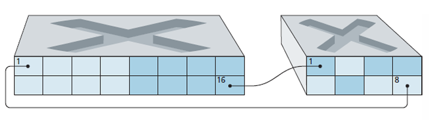

更好的方案是**VLAN干线连接**，如下图。每台交换机把一个端口配置为干线端口，用于互联其他交换机，所有VLAN的分组都通过该端口传输。

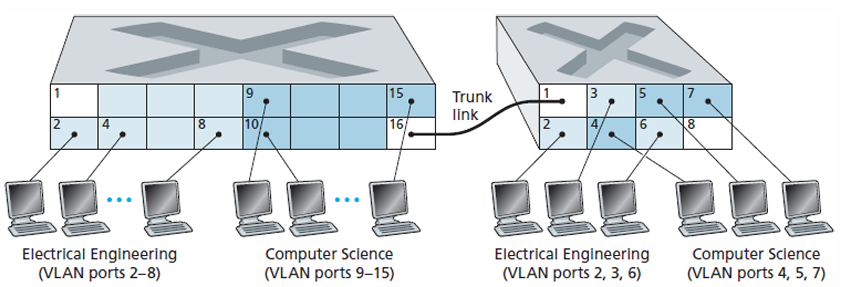

为了让交换机在干线上收到一个帧时知道它属于哪个VLAN，IEEE定义了一种扩展以太网帧格式802.1Q。它在标准以太网帧中插入了4字节的**VLAN标签**，帧进入干线前被加入标签，对侧交换机收到以后移除标签。标签有一个2字节的**标签协议标识符**（固定十六进制值81-00）、一个2字节的标签控制信息（包含12位的VLAN标识符字段和3位的比特优先权字段）。

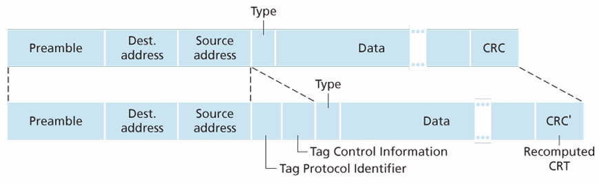

以上是基于端口的VLAN。实际上，还有基于MAC的VLAN，网络管理员指定每个VLAN的MAC地址集合；或是基于网络层协议和其他的准则定义的VLAN。

## 链路虚拟化：网络作为链路层
介绍多协议标签交换MPLS网络，它是一种分组交换的虚电路网络，有自己的分组格式和转发行为。从因特网的角度来看，认为它像电话网和交换以太网一样，作为一种链路层技术为IP设备提供支持。

### 多协议标签交换
**多协议标签交换MPLS**一直在演化来改善IP路由器的转发速度。它采用来自虚电路网络领域的一个关键概念：固定长度标签。它的目标是：对于基于固定长度标签和虚电路的技术，在不放弃基于IP地址转发的基础设施的情况下，在可能时通过选择性地表示数据报并允许路由器基于固定长度的标签（而不是IP地址）来转发数据报，从而增强其功能。

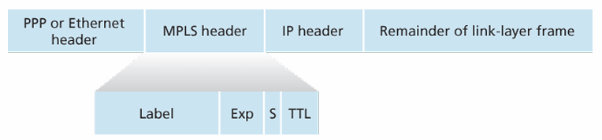

上图为MPLS使能的路由器传输的一个链路层帧格式，在链路层和网络层首部中间多出了一个MPLS首部。其中的字段为：
- 标签
- 预留的3比特实验字段
- 1比特S字段，用于指示一系列“成栈”的MPLS首部的结束
- 寿命字段

显然这样的帧只能在两个都支持MPLS的路由器之间传输，这样的路由器被称为**标签交换路由器**，普通路由器无法处理MPLS首部。标签交换路由器在转发表中查找MPLS标签并转发帧，从而避免了最长前缀匹配等开销。路由器需要有某种方式知道邻居是否支持MPLS，某个标签又应该如何转发。

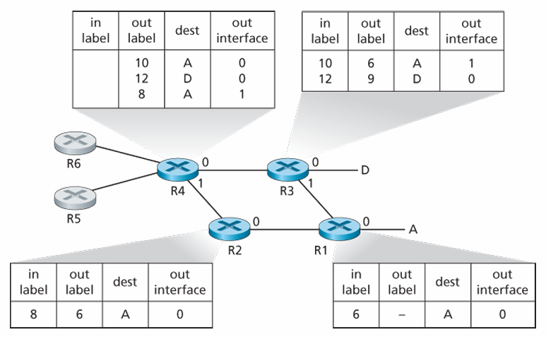

如图中的例子，R1到R4支持MPLS，而R5和R6则不支持。
1. R1向R2、R3通告它能够到达A，并且希望把具有入标签6的分组转发至A。
1. R3向R4通告它能到达A和D，并会把具有入标签12的分组转发至D，同时附带出标签9；它也会把具有入标签10的分组转发至A，同时附带出标签6。
1. R2向R4通告它能到达A，并会把具有入标签8的分组转发至A，同时附带出标签6。
1. 此时R4知道自己可以从两条路径到达A，并知道应该使用的出标签。

MPLS用于提升交换速度并不是它最大的优点，而是它提供的流量管理能力。如R4可以通过两条路径到达A，根据IP协议的话就会选择计算出的最短路径，而MPLS却可以同时利用多条路径。这是使用MPLS的一种简单形式的**流量工程**，网络运行者能超越普通的IP路由选择，迫使某些流量沿着一条路径朝着某给定的目的地引导，同时其他流量沿着另一条路径。

MPLS还能做其他的事情，如链路故障时把流量转移到备用链路。或者可以用它实现**虚拟专用网VPN**，ISP使用MPLS使能网络把各种用户连接在一起。

## 数据中心网络
大型公司往往使用了大量的数据中心，每个数据中心有自己的**数据中心网络**，用于内部主机的互联并与其他的数据中心互联。

数据中心的主机负责提供内容、存储邮件和文档，或执行大规模分布式运算，这些主机称为**刀片**。主机被叠放在机架上，每个机架有20-40个刀片，顶上还有一个**机架顶部交换机TOR**，它与这些刀片相连的同时也与其他交换机相连。每个主机有一个数据中心内部的IP地址。

数据中心网络承载两种流量：外部客户和内部主机之间的流量、内部主机之间的流量。为了处理前者，数据中心网络包含一台或多台**边界路由器**，它们连接到外部网络，数据中心网络在内部把所有主机互联并连接到边界路由器。

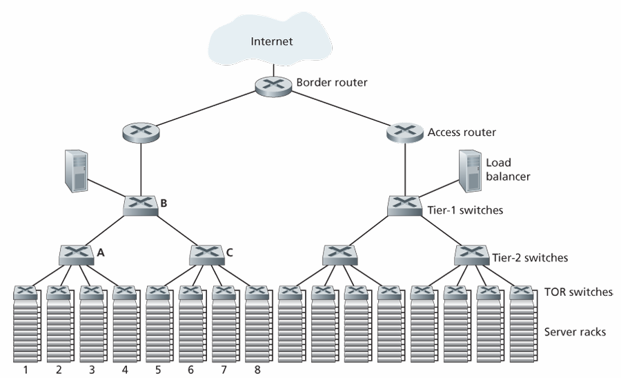

**数据中心网络设计**是比较复杂的一个领域，它专注于机架彼此连接以及和边界路由器的连接。

#### 负载均衡
来自外部的请求首先被定向到一个**负载均衡器**，它向主机分发请求，以主机的负载作为函数来实现负载均衡。一个大型的数据中心通常有多个负载均衡器，每台服务于一组云应用。它基于分组的目的端口号和目的IP地址做决策，通常被称为**第四层交换机**。当主机处理完请求以后，向负载均衡器发出响应并由其转发给客户。负载均衡器往往同时提供类似NAT的IP地址转换，有利于隐藏内部主机的IP地址。

#### 等级体系结构
大型的数据中心可能有数万甚至数十万台主机，使用简单的网络结构是不可能的。如上图所示，这种情况通常会使用**路由器和交换机等级结构**。其中所有的链路都使用以太网作为链路层协议，混合使用铜缆和光纤。

虽然这样的层次结构解决了扩展性的问题，但随着主机的增多，单条链路上的并发流量也会增多，从而使得某些交换机成为了主机到主机传输的瓶颈。一种解决方案是使用更高速率的交换机和路由器，然而它们的成本很高。

#### 数据中心网络的发展趋势
为了克服传统等级设计的缺陷，一种新的方案是**全连接拓扑**。

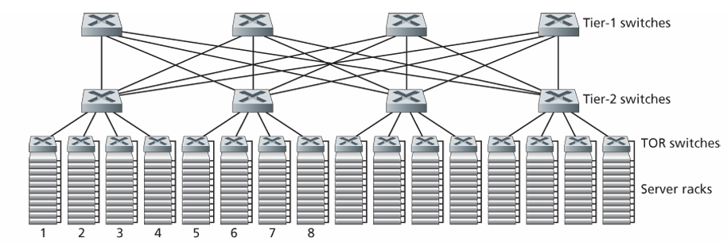

这样的结构使得两个主机之间的通信有n条路径可选，从而可以把流量均匀分布到所有的路径上。

还有一种发展趋势是基于船运集装箱的**模块化数据中心MDC**，MDC在一个标准的12米船运集装箱中构建一个迷你数据中心并把它送往数据中心的位置，每个集装箱中有数千台主机，堆放在数十台机架上。在数据中心中，多个集装箱彼此互联，也与因特网连接。当它出现故障时，往往难以维修，所以被设计为随着时间推移性能下降，最终到达一定程度时被替换。集装箱内部的网络可以通过廉价的吉比特交换机构成全连接网络。然而互联集装箱的核心网络则需要更好的方案。

另一种趋势是，大型云提供商倾向于大量自行定制各种部件，例如网络适配器、交换机路由器、TOR、软件和网络协议。
